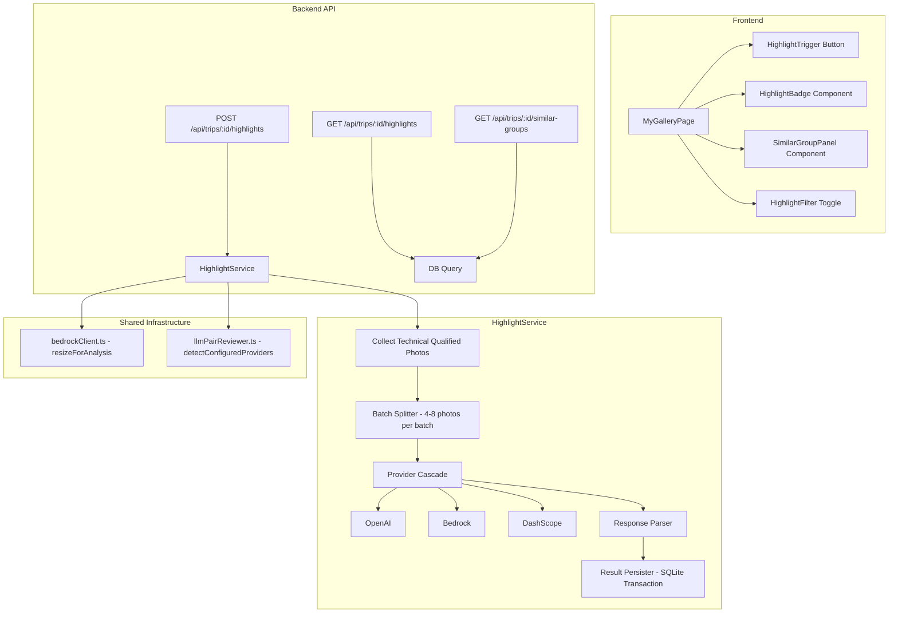

# Design Document: AI Photo Highlights

## Overview

AI Photo Highlights 为旅行相册提供智能精华挑选和相似照片分组功能。系统将技术合格照片（通过模糊检测和重复检测后的照片）分批发送给视觉大模型，由 AI 从构图美感、独特瞬间、故事性和多样性四个维度评选约 30-40% 的精华照片，同时识别相似照片组并推荐每组中的最佳照片。

该功能复用现有的 `bedrockClient.ts` 多模型回退基础设施和 `llmPairReviewer.ts` 的 Provider 级联模式，新增 `HighlightService` 作为核心编排层，通过 REST API 暴露触发和查询接口，前端在 MyGalleryPage 中集成精华标记和相似组展示。

## Architecture



## Components and Interfaces

### 1. HighlightService (`server/src/services/highlightService.ts`)

核心编排服务，负责批量评审的完整生命周期。

```typescript
export interface HighlightEvaluation {
  tripId: string;
  totalPhotos: number;
  highlightCount: number;
  similarGroupCount: number;
  batchesProcessed: number;
  batchesFailed: number;
  usedProvider?: string;
}

export interface HighlightPhoto {
  photoId: string;
  tripId: string;
  isHighlight: boolean;
  reason: string;        // max 100 chars
  evaluatedAt: string;
}

export interface SimilarGroup {
  groupId: string;
  tripId: string;
  memberPhotoIds: string[];
  bestPhotoId: string;
  evaluatedAt: string;
}

export interface BatchResult {
  highlights: Array<{ photoId: string; reason: string }>;
  similarGroups: Array<{ memberIds: string[]; bestId: string }>;
}

export interface HighlightServiceOptions {
  onProgress?: (batchIndex: number, totalBatches: number) => void;
}

export async function runHighlightEvaluation(
  tripId: string,
  options?: HighlightServiceOptions
): Promise<HighlightEvaluation>;

export function getHighlightsForTrip(tripId: string): HighlightPhoto[];
export function getSimilarGroupsForTrip(tripId: string): SimilarGroup[];
```

### 2. Batch Highlight Prompt

The prompt sent to the Vision LLM for each batch of 4-8 photos:

```typescript
const HIGHLIGHT_BATCH_PROMPT = `You are a professional travel photography curator. Evaluate these photos as a batch.

Your tasks:
1. SELECT HIGHLIGHTS: Choose the best photos (approximately 30-40% of the batch) based on:
   - Composition aesthetics (rule of thirds, leading lines, framing)
   - Unique moments (candid expressions, rare wildlife behavior, dramatic lighting)
   - Storytelling value (captures the essence of the travel experience)
   - Diversity (prefer variety in subjects and scenes over similar shots)

2. IDENTIFY SIMILAR GROUPS: Find photos that are visually similar (same scene, same angle, burst shots, minor variations). For each group, recommend the single best photo.

Return ONLY a JSON object in this exact format:
{
  "highlights": [
    {"index": 0, "reason": "Stunning golden hour composition with leading lines"},
    {"index": 2, "reason": "Rare candid moment capturing genuine emotion"}
  ],
  "similar_groups": [
    {"indices": [1, 3, 4], "best_index": 3}
  ]
}

Rules:
- "index" refers to the 0-based position of the photo in this batch
- "reason" must be concise (max 100 characters) explaining why the photo is a highlight
- A photo can be both a highlight AND part of a similar group
- If no similar groups exist, return an empty array for "similar_groups"
- Select approximately 30-40% of photos as highlights`;
```

### 3. Provider Cascade Integration

Reuses `detectConfiguredProviders()` from `llmPairReviewer.ts` and `resizeForAnalysis()` from `bedrockClient.ts`:

```typescript
import { detectConfiguredProviders, ProviderConfig } from './llmPairReviewer';
import { resizeForAnalysis, extractJSON } from './bedrockClient';

async function evaluateBatch(
  photos: Array<{ id: string; filePath: string }>,
  providerChain: ProviderConfig[],
): Promise<BatchResult | null> {
  // Resize all photos to 768x768 for token efficiency
  const images = await Promise.all(
    photos.map(async (p) => ({
      base64: await resizeForAnalysis(p.filePath),
      mediaType: 'image/jpeg' as const,
    }))
  );

  // Try each provider in cascade
  for (const provider of providerChain) {
    try {
      const response = await provider.client.invokeModel({
        images,
        prompt: HIGHLIGHT_BATCH_PROMPT,
        maxTokens: 2048,
      });
      const parsed = extractJSON<RawBatchResponse>(response);
      return mapToResult(parsed, photos);
    } catch (err) {
      console.error(`[HighlightService] Provider '${provider.type}' failed:`, err);
      continue;
    }
  }
  return null; // All providers failed
}
```

### 4. Batching Strategy

```typescript
function createBatches(
  photos: Array<{ id: string; filePath: string }>,
  batchSize: number = 6,  // default 6, range 4-8
): Array<Array<{ id: string; filePath: string }>> {
  const batches: Array<Array<{ id: string; filePath: string }>> = [];
  for (let i = 0; i < photos.length; i += batchSize) {
    batches.push(photos.slice(i, i + batchSize));
  }
  // If last batch has fewer than 4 photos, merge with previous
  if (batches.length > 1 && batches[batches.length - 1].length < 4) {
    const last = batches.pop()!;
    batches[batches.length - 1].push(...last);
  }
  return batches;
}
```

### 5. API Routes (`server/src/routes/highlights.ts`)

```typescript
import { Router } from 'express';
import { authMiddleware, requireAuth } from '../middleware/auth';

const router = Router();

// POST /api/trips/:id/highlights — Trigger AI highlight evaluation
router.post('/:id/highlights', authMiddleware, requireAuth, async (req, res) => {
  // 1. Verify trip exists and user has access
  // 2. Check no active evaluation in progress (409 if running)
  // 3. Run highlight evaluation
  // 4. Return HighlightEvaluation summary
});

// GET /api/trips/:id/highlights — Get highlight results
router.get('/:id/highlights', authMiddleware, requireAuth, async (req, res) => {
  // Return all highlight photos for the trip
});

// GET /api/trips/:id/similar-groups — Get similar group results
router.get('/:id/similar-groups', authMiddleware, requireAuth, async (req, res) => {
  // Return all similar groups for the trip
});

export default router;
```

### 6. Frontend Components

**HighlightBadge** — Star icon overlay on thumbnail:
```typescript
interface HighlightBadgeProps {
  reason: string;  // shown on hover tooltip
}
```

**HighlightFilter** — Toggle in category tab bar:
```typescript
// Adds a "精华" filter option alongside existing category tabs
type FilterMode = CategoryTab | 'highlights' | 'similar-groups';
```

**SimilarGroupPanel** — Modal showing group members with best recommendation:
```typescript
interface SimilarGroupPanelProps {
  group: SimilarGroup;
  photos: Array<{ id: string; thumbnailUrl: string }>;
  onClose: () => void;
}
```

## Data Models

### New Tables

```sql
-- Stores per-photo highlight evaluation results
CREATE TABLE IF NOT EXISTS highlight_results (
  id TEXT PRIMARY KEY,
  trip_id TEXT NOT NULL,
  photo_id TEXT NOT NULL,
  is_highlight INTEGER NOT NULL DEFAULT 0,
  reason TEXT,                    -- max 100 chars, null if not highlight
  batch_index INTEGER NOT NULL,   -- which batch this photo was in
  evaluated_at TEXT NOT NULL,
  FOREIGN KEY (trip_id) REFERENCES trips(id) ON DELETE CASCADE,
  FOREIGN KEY (photo_id) REFERENCES media_items(id) ON DELETE CASCADE
);

CREATE INDEX IF NOT EXISTS idx_highlight_results_trip ON highlight_results(trip_id);
CREATE INDEX IF NOT EXISTS idx_highlight_results_photo ON highlight_results(photo_id);
CREATE UNIQUE INDEX IF NOT EXISTS idx_highlight_results_trip_photo ON highlight_results(trip_id, photo_id);

-- Stores similar photo groups
CREATE TABLE IF NOT EXISTS similar_groups (
  id TEXT PRIMARY KEY,
  trip_id TEXT NOT NULL,
  best_photo_id TEXT NOT NULL,
  evaluated_at TEXT NOT NULL,
  FOREIGN KEY (trip_id) REFERENCES trips(id) ON DELETE CASCADE,
  FOREIGN KEY (best_photo_id) REFERENCES media_items(id) ON DELETE CASCADE
);

CREATE INDEX IF NOT EXISTS idx_similar_groups_trip ON similar_groups(trip_id);

-- Stores group membership (many-to-many)
CREATE TABLE IF NOT EXISTS similar_group_members (
  id TEXT PRIMARY KEY,
  group_id TEXT NOT NULL,
  photo_id TEXT NOT NULL,
  FOREIGN KEY (group_id) REFERENCES similar_groups(id) ON DELETE CASCADE,
  FOREIGN KEY (photo_id) REFERENCES media_items(id) ON DELETE CASCADE
);

CREATE INDEX IF NOT EXISTS idx_similar_group_members_group ON similar_group_members(group_id);
CREATE UNIQUE INDEX IF NOT EXISTS idx_similar_group_members_group_photo ON similar_group_members(group_id, photo_id);

-- Tracks evaluation jobs to prevent concurrent runs
CREATE TABLE IF NOT EXISTS highlight_jobs (
  id TEXT PRIMARY KEY,
  trip_id TEXT NOT NULL,
  status TEXT NOT NULL DEFAULT 'running' CHECK(status IN ('running', 'completed', 'failed')),
  total_batches INTEGER NOT NULL DEFAULT 0,
  processed_batches INTEGER NOT NULL DEFAULT 0,
  failed_batches INTEGER NOT NULL DEFAULT 0,
  error_message TEXT,
  created_at TEXT NOT NULL,
  finished_at TEXT,
  FOREIGN KEY (trip_id) REFERENCES trips(id) ON DELETE CASCADE
);

CREATE UNIQUE INDEX IF NOT EXISTS idx_highlight_jobs_active ON highlight_jobs(trip_id) WHERE status = 'running';
```

### Data Flow

1. **Trigger**: POST request creates a `highlight_jobs` record with status `running`
2. **Batch Processing**: For each batch, results are accumulated in memory
3. **Persist**: After all batches complete, a single transaction:
   - Deletes existing `highlight_results` and `similar_groups` for the trip
   - Inserts new `highlight_results` rows
   - Inserts new `similar_groups` and `similar_group_members` rows
   - Updates `highlight_jobs` status to `completed`
4. **Query**: GET endpoints join `highlight_results` with `media_items` for display

## Correctness Properties

*A property is a characteristic or behavior that should hold true across all valid executions of a system—essentially, a formal statement about what the system should do. Properties serve as the bridge between human-readable specifications and machine-verifiable correctness guarantees.*

### Property 1: Batching preserves all photos with valid batch sizes

*For any* list of technical-qualified photos (length >= 1), after running `createBatches()`, every batch SHALL have between 4 and 8 photos (inclusive), and the union of all batch members SHALL equal the original photo list with no duplicates or omissions.

**Validates: Requirements 1.1**

### Property 2: Response parsing round-trip

*For any* valid `BatchResult` JSON object, when serialized to a string (optionally wrapped in markdown code blocks or surrounded by preamble text), `extractJSON()` SHALL parse it back to an equivalent object with the same highlights and similar_groups data.

**Validates: Requirements 1.3**

### Property 3: Highlight persistence round-trip

*For any* set of highlight results (photo IDs, trip ID, is_highlight flags, reason texts, timestamps), after persisting to the database and querying back by trip ID, the returned records SHALL contain exactly the same photo IDs, is_highlight values, and reason texts as the input.

**Validates: Requirements 2.3, 5.2**

### Property 4: Reason field length invariant

*For any* highlight reason string, the persisted reason SHALL have length <= 100 characters. If the input reason exceeds 100 characters, it SHALL be truncated to exactly 100 characters.

**Validates: Requirements 2.4**

### Property 5: Similar group best-photo membership invariant

*For any* similar group result, the `bestPhotoId` SHALL always be a member of that group's `memberPhotoIds` array.

**Validates: Requirements 3.2**

### Property 6: Similar group persistence round-trip

*For any* set of similar groups (group IDs, trip ID, member photo IDs, best photo IDs, timestamps), after persisting to the database and querying back by trip ID, the returned groups SHALL contain exactly the same member lists and best photo IDs as the input.

**Validates: Requirements 3.3, 5.3**

### Property 7: Atomic replacement on re-evaluation

*For any* trip with existing highlight results, when a new evaluation is triggered and completes, the database SHALL contain ONLY the new evaluation's results — no records from the previous evaluation SHALL remain.

**Validates: Requirements 5.1, 5.4**

### Property 8: Highlight filter shows only highlighted photos

*For any* gallery photo list containing a mix of highlighted and non-highlighted photos, applying the highlight filter SHALL return a subset where every photo has `is_highlight === true`, and no highlighted photo from the original list is missing.

**Validates: Requirements 7.2**

### Property 9: Similar group filter shows only grouped photos

*For any* gallery photo list where some photos belong to similar groups and others do not, applying the similar-group filter SHALL return only photos that have a non-null `similar_group_id`, and no grouped photo from the original list is missing.

**Validates: Requirements 7.5**

## Error Handling

### Provider Failures

| Scenario | Behavior |
|----------|----------|
| Single provider timeout/error | Cascade to next provider in chain |
| All providers fail for a batch | Mark batch as failed, log error, continue with remaining batches |
| All providers fail for all batches | Mark job as failed, return error to client |
| Invalid JSON response from LLM | Retry batch once with same provider, then cascade |

### Database Errors

| Scenario | Behavior |
|----------|----------|
| Transaction failure during persist | Roll back entire transaction, mark job as failed |
| Constraint violation (deleted photo) | Skip the offending record, log warning, persist remaining |
| Concurrent evaluation attempt | Return 409 Conflict via unique index on `highlight_jobs(trip_id) WHERE status = 'running'` |

### Image Processing Errors

| Scenario | Behavior |
|----------|----------|
| Photo file not found on disk | Skip photo, reduce batch size, log warning |
| `resizeForAnalysis()` fails | Skip photo, log error, continue with remaining photos in batch |
| Batch becomes empty after skips | Mark batch as failed, continue with next batch |

### API Error Responses

| Status | Code | Condition |
|--------|------|-----------|
| 404 | NOT_FOUND | Trip does not exist |
| 403 | FORBIDDEN | User does not own the trip |
| 409 | ALREADY_RUNNING | Evaluation already in progress for this trip |
| 500 | EVALUATION_FAILED | All batches failed |

## Testing Strategy

### Unit Tests (Example-Based)

- **Prompt content**: Verify HIGHLIGHT_BATCH_PROMPT contains required evaluation dimensions
- **Provider cascade**: Mock providers, verify fallback behavior on failure
- **Retry logic**: Mock invalid response then valid response, verify single retry
- **Concurrent trigger**: Create running job, verify 409 on second trigger
- **Authorization**: Verify 403 for non-owner access
- **Frontend components**: Render tests for HighlightBadge, SimilarGroupPanel, filter toggles

### Property-Based Tests (fast-check)

Library: **fast-check** (already available in the project's test ecosystem via vitest)

Configuration: Minimum 100 iterations per property test.

Each property test references its design document property:

- **Feature: ai-photo-highlights, Property 1**: Generate random photo arrays (1-200 items), verify batching invariants
- **Feature: ai-photo-highlights, Property 2**: Generate random BatchResult objects, serialize with random wrapping, verify parse round-trip
- **Feature: ai-photo-highlights, Property 3**: Generate random highlight records, persist to in-memory SQLite, query back, verify equality
- **Feature: ai-photo-highlights, Property 4**: Generate random strings (0-500 chars), verify reason truncation to 100
- **Feature: ai-photo-highlights, Property 5**: Generate random similar groups, verify bestId ∈ memberIds
- **Feature: ai-photo-highlights, Property 6**: Generate random similar groups, persist to in-memory SQLite, query back, verify equality
- **Feature: ai-photo-highlights, Property 7**: Generate two sets of results for same trip, persist sequentially, verify only latest exists
- **Feature: ai-photo-highlights, Property 8**: Generate random photo lists with mixed highlight status, apply filter, verify correctness
- **Feature: ai-photo-highlights, Property 9**: Generate random photo lists with mixed group membership, apply filter, verify correctness

### Integration Tests

- **Full pipeline**: Trigger evaluation with mocked LLM, verify end-to-end from API call to database persistence
- **SSE progress**: Verify progress events are emitted during batch processing
- **Gallery API**: Verify GET endpoints return correct data after evaluation completes

