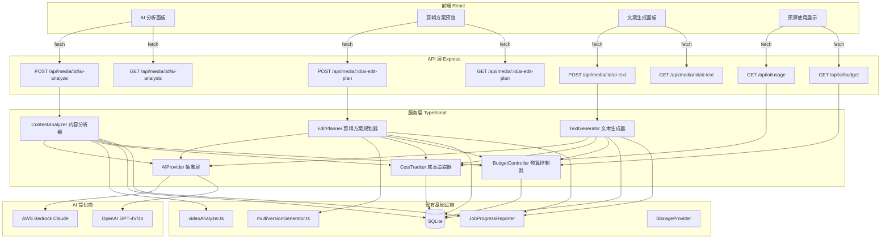
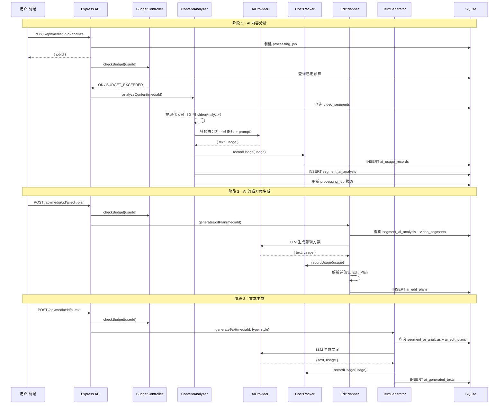

# 设计文档：AI 智能剪辑

## 概述

本功能在现有视频处理管线（`videoAnalyzer.ts`、`multiVersionGenerator.ts`、`bedrockClient.ts`）基础上，引入 AI 大模型能力实现视频内容的深度语义理解与智能剪辑方案生成。

核心设计思路：

1. **AI Provider 抽象层**：在现有 `bedrockClient.ts` 基础上扩展，定义统一的 `AIProvider` 接口，支持文本生成和多模态分析两种能力，通过配置切换 Bedrock Claude / OpenAI GPT-4V 提供商
2. **内容分析器**：复用 `videoAnalyzer.ts` 的帧提取能力，将代表帧发送给 AI 进行语义分析，生成场景描述、情感标签和叙事价值评分
3. **剪辑方案规划器**：将内容分析结果 + 现有质量评分作为上下文，由 LLM 生成结构化剪辑方案（片段选择、过渡方式、节奏建议）
4. **文本生成器**：基于内容分析和剪辑方案，生成视频标题、片段字幕和旁白文案
5. **成本追踪与预算控制**：记录每次 AI 调用的 token 用量和费用，支持按用户设置预算上限

所有 AI 操作通过异步任务队列执行（复用现有 `processing_jobs` + `JobProgressReporter` 模式），确保不阻塞主线程。

## 架构



### 数据流图



### 设计决策

| 决策 | 选择 | 理由 |
|------|------|------|
| AI Provider 架构 | 扩展现有 `bedrockClient.ts`，新增统一接口 | 复用已有 Bedrock/OpenAI 实现，减少重复代码 |
| 异步执行模式 | 复用 `processing_jobs` + `JobProgressReporter` | 与现有管线一致，前端已有进度查询机制 |
| 批量分析策略 | 多帧合并为单次 AI 调用 | 减少 API 请求次数，降低延迟和成本 |
| 缓存策略 | 分析结果持久化到 DB，按 media_id + segment_index 去重 | 避免重复分析，支持增量更新 |
| 预算控制粒度 | 按用户每月 + 可选按旅行 | 平衡灵活性和实现复杂度 |
| 降级策略 | AI 失败时回退到现有质量评分策略 | 确保基础功能不受 AI 可用性影响 |
| 成本计算 | 基于配置文件单价 × token 数 | 简单可靠，支持多模型定价 |

## 组件与接口

### 1. AIProvider 统一接口

```typescript
// server/src/services/ai/aiProvider.ts

/** AI 调用的统一请求参数 */
export interface AIRequest {
  prompt: string;
  images?: Array<{ base64: string; mediaType: string }>;
  maxTokens?: number;
  temperature?: number;
}

/** AI 调用的统一响应格式 */
export interface AIResponse {
  text: string;
  usage: {
    inputTokens: number;
    outputTokens: number;
  };
}

/** AI Provider 统一接口 */
export interface AIProvider {
  /** 提供商名称标识 */
  readonly name: string;
  /** 当前使用的模型名称 */
  readonly model: string;
  /** 文本生成（纯文本 prompt） */
  textCompletion(request: AIRequest): Promise<AIResponse>;
  /** 多模态分析（图片 + 文本 prompt） */
  visionAnalysis(request: AIRequest): Promise<AIResponse>;
}

/** 创建 AI Provider 实例（根据环境变量选择提供商） */
export function createAIProvider(): AIProvider;

/** 获取当前活跃的提供商名称 */
export function getActiveProviderName(): string;
```

### 2. BedrockProvider 实现

```typescript
// server/src/services/ai/bedrockProvider.ts

export class BedrockProvider implements AIProvider {
  readonly name = 'bedrock';
  readonly model: string;

  constructor();

  textCompletion(request: AIRequest): Promise<AIResponse>;
  visionAnalysis(request: AIRequest): Promise<AIResponse>;
}
```

### 3. OpenAIProvider 实现

```typescript
// server/src/services/ai/openaiProvider.ts

export class OpenAIProvider implements AIProvider {
  readonly name = 'openai';
  readonly model: string;

  constructor();

  textCompletion(request: AIRequest): Promise<AIResponse>;
  visionAnalysis(request: AIRequest): Promise<AIResponse>;
}
```

### 4. ContentAnalyzer 内容分析器

```typescript
// server/src/services/ai/contentAnalyzer.ts

/** 预定义情感标签集 */
export type EmotionTag =
  | '欢乐' | '宁静' | '壮观' | '温馨' | '紧张'
  | '浪漫' | '神秘' | '活力' | '忧伤' | '震撼';

/** 单个片段的 AI 分析结果 */
export interface SegmentAIAnalysis {
  segmentIndex: number;
  sceneDescription: string;       // 不超过 100 字
  emotionTags: EmotionTag[];      // 1-3 个
  narrativeScore: number;         // 0-100 整数
}

/** 内容分析配置 */
export interface ContentAnalyzerOptions {
  /** 批量分析时每批最大片段数（默认 5） */
  batchSize?: number;
  /** 是否强制重新分析（忽略缓存） */
  forceReanalyze?: boolean;
}

/** 内容分析结果 */
export interface ContentAnalysisResult {
  mediaId: string;
  segments: SegmentAIAnalysis[];
  totalTokensUsed: { input: number; output: number };
  estimatedCost: number;
}

export class ContentAnalyzer {
  constructor(provider: AIProvider, costTracker: CostTracker);

  /** 分析视频所有片段的内容 */
  analyzeContent(
    mediaId: string,
    userId: string,
    tripId: string,
    options?: ContentAnalyzerOptions
  ): Promise<ContentAnalysisResult>;

  /** 检查是否已有缓存的分析结果 */
  hasCachedAnalysis(mediaId: string): boolean;

  /** 获取缓存的分析结果 */
  getCachedAnalysis(mediaId: string): SegmentAIAnalysis[] | null;
}
```

### 5. EditPlanner 剪辑方案规划器

```typescript
// server/src/services/ai/editPlanner.ts

/** 过渡方式 */
export type TransitionType = 'cut' | 'fade' | 'crossfade' | 'dissolve';

/** 节奏标注 */
export type PaceType = 'fast' | 'medium' | 'slow';

/** 剪辑方案中的单个片段 */
export interface EditPlanSegment {
  segmentIndex: number;
  reason: string;                  // 选择理由（一句话）
  transitionTo?: TransitionType;   // 到下一个片段的过渡方式
}

/** 完整剪辑方案 */
export interface EditPlan {
  mediaId: string;
  segments: EditPlanSegment[];
  pace: PaceType;
  totalDuration: number;
  narrativeSummary: string;        // 整体叙事概要
}

/** 剪辑方案生成结果 */
export interface EditPlanResult {
  editPlan: EditPlan;
  tokensUsed: { input: number; output: number };
  estimatedCost: number;
  fallbackUsed: boolean;           // 是否使用了降级策略
}

export class EditPlanner {
  constructor(provider: AIProvider, costTracker: CostTracker);

  /** 生成剪辑方案 */
  generateEditPlan(
    mediaId: string,
    userId: string,
    tripId: string,
    targetDuration?: number
  ): Promise<EditPlanResult>;

  /** 获取已保存的剪辑方案 */
  getEditPlan(mediaId: string): EditPlan | null;
}
```

### 6. TextGenerator 文本生成器

```typescript
// server/src/services/ai/textGenerator.ts

/** 文案类型 */
export type TextType = 'title' | 'subtitle' | 'narration';

/** 文案风格 */
export type TextStyle = 'travel_diary' | 'documentary' | 'social_media' | 'cinematic';

/** 生成的标题 */
export interface GeneratedTitles {
  titles: string[];               // 3 个候选标题，每个不超过 30 字符
}

/** 生成的字幕 */
export interface GeneratedSubtitles {
  subtitles: Array<{
    segmentIndex: number;
    text: string;                  // 不超过 20 字符
  }>;
}

/** 生成的旁白 */
export interface GeneratedNarration {
  narration: string;
  estimatedDurationSeconds: number; // 按朗读速度估算
}

/** 文本生成请求 */
export interface TextGenerationRequest {
  mediaId: string;
  userId: string;
  tripId: string;
  type: TextType;
  style?: TextStyle;
}

/** 文本生成结果 */
export interface TextGenerationResult {
  type: TextType;
  titles?: GeneratedTitles;
  subtitles?: GeneratedSubtitles;
  narration?: GeneratedNarration;
  tokensUsed: { input: number; output: number };
  estimatedCost: number;
}

export class TextGenerator {
  constructor(provider: AIProvider, costTracker: CostTracker);

  generateText(request: TextGenerationRequest): Promise<TextGenerationResult>;
}
```

### 7. CostTracker 成本追踪器

```typescript
// server/src/services/ai/costTracker.ts

/** AI 调用类型 */
export type AICallType = 'content_analysis' | 'edit_planning' | 'text_generation';

/** AI 使用记录 */
export interface AIUsageRecord {
  id: string;
  userId: string;
  tripId: string;
  mediaId?: string;
  provider: string;
  model: string;
  callType: AICallType;
  inputTokens: number;
  outputTokens: number;
  estimatedCost: number;         // 美元
  createdAt: string;
}

/** 费用统计 */
export interface UsageStats {
  totalCost: number;
  totalInputTokens: number;
  totalOutputTokens: number;
  callCount: number;
  byType: Record<AICallType, { cost: number; count: number }>;
}

/** 模型单价配置 */
export interface ModelPricing {
  provider: string;
  model: string;
  inputPricePerMToken: number;   // 每百万 token 价格（美元）
  outputPricePerMToken: number;
}

export class CostTracker {
  constructor();

  /** 记录一次 AI 调用 */
  recordUsage(record: Omit<AIUsageRecord, 'id' | 'estimatedCost' | 'createdAt'>): AIUsageRecord;

  /** 计算费用 */
  calculateCost(provider: string, model: string, inputTokens: number, outputTokens: number): number;

  /** 查询用户费用统计 */
  getUserStats(userId: string, startDate?: string, endDate?: string): UsageStats;

  /** 查询旅行费用统计 */
  getTripStats(tripId: string): UsageStats;

  /** 获取模型单价配置 */
  getPricing(): ModelPricing[];
}
```

### 8. BudgetController 预算控制器

```typescript
// server/src/services/ai/budgetController.ts

/** 预算配置 */
export interface BudgetConfig {
  userId: string;
  monthlyLimit: number;          // 美元
  customLimit?: number;          // 自定义限制（覆盖全局）
}

/** 预算检查结果 */
export interface BudgetCheckResult {
  allowed: boolean;
  currentUsage: number;
  limit: number;
  remainingBudget: number;
  warningLevel: 'none' | 'approaching' | 'exceeded';
  message?: string;
}

export class BudgetController {
  constructor(costTracker: CostTracker);

  /** 检查用户预算 */
  checkBudget(userId: string): BudgetCheckResult;

  /** 获取用户预算配置 */
  getBudgetConfig(userId: string): BudgetConfig;

  /** 设置用户自定义预算 */
  setUserBudget(userId: string, monthlyLimit: number): void;

  /** 重置用户已用预算 */
  resetUserBudget(userId: string): void;

  /** 获取全局默认预算限制 */
  getGlobalDefault(): number;

  /** 获取所有用户预算使用情况（管理员） */
  getAllUsersBudgetStatus(): Array<BudgetConfig & { currentUsage: number }>;
}
```

### 9. API 路由

```typescript
// server/src/routes/aiEditing.ts

import { Router } from 'express';

const router = Router();

// AI 内容分析
router.post('/api/media/:id/ai-analyze', authMiddleware, handler);
router.get('/api/media/:id/ai-analysis', authMiddleware, handler);

// AI 剪辑方案
router.post('/api/media/:id/ai-edit-plan', authMiddleware, handler);
router.get('/api/media/:id/ai-edit-plan', authMiddleware, handler);

// AI 文本生成
router.post('/api/media/:id/ai-text', authMiddleware, handler);
router.get('/api/media/:id/ai-text', authMiddleware, handler);

// 使用统计与预算
router.get('/api/ai/usage', authMiddleware, handler);
router.get('/api/ai/budget', authMiddleware, handler);

// 管理员端点
router.get('/api/admin/ai/usage', adminMiddleware, handler);
router.put('/api/admin/ai/budget/:userId', adminMiddleware, handler);
router.post('/api/admin/ai/budget/:userId/reset', adminMiddleware, handler);

export default router;
```

## 数据模型

### 新增表：segment_ai_analysis

```sql
CREATE TABLE IF NOT EXISTS segment_ai_analysis (
  id TEXT PRIMARY KEY,
  media_id TEXT NOT NULL,
  segment_index INTEGER NOT NULL,
  scene_description TEXT,
  emotion_tags TEXT,              -- JSON 数组，如 '["欢乐","壮观"]'
  narrative_score INTEGER,        -- 0-100
  provider TEXT NOT NULL,
  model TEXT NOT NULL,
  analyzed_at TEXT NOT NULL,
  created_at TEXT NOT NULL,
  FOREIGN KEY (media_id) REFERENCES media_items(id) ON DELETE CASCADE
);

CREATE UNIQUE INDEX IF NOT EXISTS idx_segment_ai_media_index
  ON segment_ai_analysis(media_id, segment_index);
CREATE INDEX IF NOT EXISTS idx_segment_ai_media
  ON segment_ai_analysis(media_id);
```

### 新增表：ai_edit_plans

```sql
CREATE TABLE IF NOT EXISTS ai_edit_plans (
  id TEXT PRIMARY KEY,
  media_id TEXT NOT NULL,
  plan_json TEXT NOT NULL,        -- 完整 EditPlan JSON
  pace TEXT,                      -- 'fast' | 'medium' | 'slow'
  total_duration REAL,
  segment_count INTEGER,
  provider TEXT NOT NULL,
  model TEXT NOT NULL,
  fallback_used INTEGER DEFAULT 0,
  created_at TEXT NOT NULL,
  FOREIGN KEY (media_id) REFERENCES media_items(id) ON DELETE CASCADE
);

CREATE INDEX IF NOT EXISTS idx_ai_edit_plans_media
  ON ai_edit_plans(media_id);
```

### 新增表：ai_generated_texts

```sql
CREATE TABLE IF NOT EXISTS ai_generated_texts (
  id TEXT PRIMARY KEY,
  media_id TEXT NOT NULL,
  text_type TEXT NOT NULL,        -- 'title' | 'subtitle' | 'narration'
  style TEXT,                     -- 'travel_diary' | 'documentary' | 'social_media' | 'cinematic'
  content_json TEXT NOT NULL,     -- GeneratedTitles / GeneratedSubtitles / GeneratedNarration JSON
  provider TEXT NOT NULL,
  model TEXT NOT NULL,
  created_at TEXT NOT NULL,
  FOREIGN KEY (media_id) REFERENCES media_items(id) ON DELETE CASCADE
);

CREATE INDEX IF NOT EXISTS idx_ai_generated_texts_media
  ON ai_generated_texts(media_id);
CREATE INDEX IF NOT EXISTS idx_ai_generated_texts_type
  ON ai_generated_texts(media_id, text_type);
```

### 新增表：ai_usage_records

```sql
CREATE TABLE IF NOT EXISTS ai_usage_records (
  id TEXT PRIMARY KEY,
  user_id TEXT NOT NULL,
  trip_id TEXT NOT NULL,
  media_id TEXT,
  provider TEXT NOT NULL,
  model TEXT NOT NULL,
  call_type TEXT NOT NULL,        -- 'content_analysis' | 'edit_planning' | 'text_generation'
  input_tokens INTEGER NOT NULL,
  output_tokens INTEGER NOT NULL,
  estimated_cost REAL NOT NULL,   -- 美元
  created_at TEXT NOT NULL,
  FOREIGN KEY (user_id) REFERENCES users(id),
  FOREIGN KEY (trip_id) REFERENCES trips(id)
);

CREATE INDEX IF NOT EXISTS idx_ai_usage_user ON ai_usage_records(user_id);
CREATE INDEX IF NOT EXISTS idx_ai_usage_trip ON ai_usage_records(trip_id);
CREATE INDEX IF NOT EXISTS idx_ai_usage_created ON ai_usage_records(created_at);
CREATE INDEX IF NOT EXISTS idx_ai_usage_type ON ai_usage_records(call_type);
```

### 新增表：ai_budget_configs

```sql
CREATE TABLE IF NOT EXISTS ai_budget_configs (
  id TEXT PRIMARY KEY,
  user_id TEXT NOT NULL UNIQUE,
  monthly_limit REAL NOT NULL,    -- 美元
  created_at TEXT NOT NULL,
  updated_at TEXT NOT NULL,
  FOREIGN KEY (user_id) REFERENCES users(id)
);

CREATE UNIQUE INDEX IF NOT EXISTS idx_ai_budget_user
  ON ai_budget_configs(user_id);
```

### 现有表关联

- `segment_ai_analysis.media_id` → `media_items.id`（ON DELETE CASCADE）
- `ai_edit_plans.media_id` → `media_items.id`（ON DELETE CASCADE）
- `ai_generated_texts.media_id` → `media_items.id`（ON DELETE CASCADE）
- `ai_usage_records.user_id` → `users.id`
- `ai_usage_records.trip_id` → `trips.id`
- `ai_budget_configs.user_id` → `users.id`

删除旅行时，通过 CASCADE 自动清理关联的 AI 数据。

## 正确性属性

*属性（Property）是在系统所有有效执行中都应成立的特征或行为——本质上是对系统应做什么的形式化陈述。属性是人类可读规格说明与机器可验证正确性保证之间的桥梁。*

### Property 1: 图片缩放保持尺寸约束与宽高比

*对于任意*宽度 w 和高度 h 的图片（w > 0, h > 0），经过 `resizeForProvider` 缩放后，输出图片的宽度和高度均不超过提供商的最大尺寸限制（如 768×768），且输出的宽高比与输入的宽高比之差不超过 1%。

**Validates: Requirements 1.9**

### Property 2: AI 分析结果格式不变量

*对于任意* AI 返回的原始文本，经过 `parseSegmentAnalysis` 解析后的 `SegmentAIAnalysis` 对象应满足：
- `sceneDescription` 长度不超过 100 个字符
- `emotionTags` 数组长度在 1-3 之间，且每个标签都属于预定义的 `EmotionTag` 集合
- `narrativeScore` 是 0-100 之间的整数（含边界）

**Validates: Requirements 2.2, 2.3, 2.4**

### Property 3: AI 数据存储 round-trip

*对于任意*有效的 `SegmentAIAnalysis` 或 `EditPlan` 对象，将其写入数据库后再读取，得到的对象应与原始对象在所有字段上相等。

**Validates: Requirements 2.7, 3.8**

### Property 4: EditPlan 结构完整性

*对于任意*经过验证的 `EditPlan` 对象，其 `segments` 数组中的每个元素都应包含有效的 `segmentIndex`（在源视频片段范围内）和非空的 `reason` 字符串，且 `pace` 字段属于 `['fast', 'medium', 'slow']` 之一。

**Validates: Requirements 3.2, 3.3**

### Property 5: EditPlan 时长约束

*对于任意*片段集合和目标时长 T（T > 0），`EditPlanner` 生成的方案中选中片段的累计时长不应超过 T。

**Validates: Requirements 3.4**

### Property 6: 无效 LLM 输出回退

*对于任意*不合法的 JSON 字符串或包含超出范围片段索引的 EditPlan，`validateAndFallback` 函数应返回基于 overallScore 降序排列的片段选择结果（回退策略），且 `fallbackUsed` 标记为 true。

**Validates: Requirements 3.7**

### Property 7: 生成文本长度约束

*对于任意*生成的文本内容：
- 标题长度不超过 30 个字符
- 字幕长度不超过 20 个字符
- 旁白按朗读速度（约 4 字/秒中文，150 词/分钟英文）估算的时长不超过视频总时长

**Validates: Requirements 4.2, 4.3, 4.5**

### Property 8: 费用计算正确性

*对于任意*正整数 inputTokens 和 outputTokens，以及正数 inputPricePerMToken 和 outputPricePerMToken，`calculateCost` 的返回值应等于 `(inputTokens * inputPricePerMToken + outputTokens * outputPricePerMToken) / 1_000_000`，精度误差不超过 0.000001 美元。

**Validates: Requirements 5.2**

### Property 9: 费用聚合查询正确性

*对于任意* AI 使用记录集合，按用户/旅行/时间范围/调用类型查询的累计费用应等于该筛选条件下所有记录 `estimatedCost` 字段之和。

**Validates: Requirements 5.3, 5.4**

### Property 10: 预算检查逻辑完整性

*对于任意*已用金额 usage（≥ 0）和预算限制 limit（> 0），`checkBudget` 应满足：
- 当 usage >= limit 时，`allowed` 为 false 且 `warningLevel` 为 'exceeded'
- 当 usage >= limit * 0.8 且 usage < limit 时，`allowed` 为 true 且 `warningLevel` 为 'approaching'
- 当 usage < limit * 0.8 时，`allowed` 为 true 且 `warningLevel` 为 'none'
- `remainingBudget` 始终等于 `max(0, limit - usage)`

**Validates: Requirements 6.3, 6.4, 6.5**

### Property 11: EditPlanner 片段选择策略

*对于任意*片段集合（每个片段有 overallScore 和可选的 narrativeScore），EditPlanner 的选择结果应满足：
- 当 AI 分析结果可用时，选中片段的加权分数（narrativeScore * 0.4 + overallScore * 0.6）的均值应 ≥ 未选中片段的加权分数均值
- 当 AI 分析结果不可用时，选中片段应按 overallScore 降序排列选择（回退策略）

**Validates: Requirements 3.5, 9.5, 9.6**

### Property 12: Token 数估算合理性

*对于任意*非空字符串 s，当 AI 提供商未返回 usage 信息时，`estimateTokens(s)` 的返回值应在 `len(s) / 6` 到 `len(s) / 2` 的范围内（覆盖中英文混合场景的合理估算区间）。

**Validates: Requirements 5.6**

## 错误处理

| 场景 | 错误类型 | 处理方式 | 用户影响 |
|------|---------|---------|---------|
| AI Provider 配置缺失（无 API 密钥） | 启动时配置错误 | 记录警告日志，AI 相关 API 返回 HTTP 503 + 说明信息 | AI 功能不可用，基础剪辑正常 |
| AI 调用超时（>30s） | 网络/服务超时 | 终止调用，标记失败，触发重试 | 单次分析延迟，自动重试 |
| AI 速率限制（429） | 提供商限流 | 指数退避重试（1s, 2s, 4s），最多 3 次 | 短暂延迟后恢复 |
| AI 调用全部重试失败 | 服务不可用 | 返回结构化错误对象，标记任务失败 | 提示用户稍后重试 |
| 预算超出 | 业务限制 | 拒绝 AI 调用，返回 BUDGET_EXCEEDED | 提示预算已用完 |
| LLM 返回格式不合法 | 解析错误 | 回退到基于质量评分的策略 | 仍能获得剪辑方案（非 AI 优化） |
| LLM 返回无效片段索引 | 数据校验失败 | 过滤无效索引，若全部无效则回退 | 同上 |
| 单个片段 AI 分析失败 | 部分失败 | 设置默认值（空描述、空标签、score=50），继续处理 | 该片段无 AI 增强，不影响整体 |
| 全部片段 AI 分析失败 | 完全失败 | 返回错误信息，系统回退到质量评分策略 | 同 LLM 格式不合法 |
| 数据库写入失败 | 存储错误 | 记录错误日志，返回错误信息 | 分析结果丢失，可重新触发 |
| 视频无片段数据（未分析） | 前置条件不满足 | 返回 HTTP 400 + 提示先执行视频分析 | 引导用户先分析视频 |
| 文本生成失败 | AI 服务错误 | 返回空结果，记录错误，不影响剪辑流程 | 无文案但视频剪辑正常 |
| 旁白时长超过视频时长 | 内容过长 | 截断旁白至视频时长限制内 | 旁白可能不完整 |

### 降级策略优先级

```
AI 完整功能 → AI 部分可用（部分片段有分析） → 纯质量评分策略 → 错误提示
```

每个降级层级都保证用户能获得可用的剪辑结果，只是智能程度递减。

## 测试策略

### 属性测试（Property-Based Testing）

使用 `fast-check` 库，每个属性测试最少运行 100 次迭代。

**测试文件**: `server/src/services/ai/aiSmartEditing.property.test.ts`

覆盖属性 1-12，重点关注：

| 属性 | 被测函数 | 生成器策略 |
|------|---------|-----------|
| P1 | `resizeForProvider` | 随机正整数宽高 (1-10000) |
| P2 | `parseSegmentAnalysis` | 随机字符串（含边界长度、特殊字符） |
| P3 | `saveAndLoadAnalysis` / `saveAndLoadEditPlan` | 随机 SegmentAIAnalysis / EditPlan 对象 |
| P4 | `validateEditPlan` | 随机 JSON 结构 + 有效/无效字段组合 |
| P5 | `EditPlanner.selectWithDurationLimit` | 随机片段集合 + 随机目标时长 |
| P6 | `validateAndFallback` | 随机无效 JSON + 随机超范围索引 |
| P7 | `truncateTitle` / `truncateSubtitle` / `estimateNarrationDuration` | 随机 Unicode 字符串 |
| P8 | `calculateCost` | 随机正整数 token 数 + 随机正数单价 |
| P9 | `getUserStats` / `getTripStats` | 随机 AIUsageRecord 集合 |
| P10 | `checkBudget` | 随机 usage (0-100) + 随机 limit (0.01-100) |
| P11 | `EditPlanner.selectSegments` | 随机片段集合（有/无 narrativeScore） |
| P12 | `estimateTokens` | 随机中英文混合字符串 |

每个测试标注对应属性：
```typescript
// Feature: ai-smart-editing, Property 8: 费用计算正确性
```

### 单元测试

**测试文件**: `server/src/services/ai/*.test.ts`

- **AIProvider**: mock HTTP 响应，验证重试逻辑、超时处理、错误格式化
- **ContentAnalyzer**: mock AIProvider，验证批量分析、缓存命中、默认值设置
- **EditPlanner**: mock AIProvider，验证 prompt 构建、方案解析、回退触发
- **TextGenerator**: mock AIProvider，验证各类型文案生成、风格参数传递
- **CostTracker**: 验证记录创建、费用计算、统计查询
- **BudgetController**: 验证预算检查、警告级别、重置操作

### 集成测试

**测试文件**: `server/src/routes/aiEditing.test.ts`

- 完整流程：创建视频 → 分析片段 → AI 内容分析 → 生成剪辑方案 → 生成文案
- API 路由：参数校验、认证检查、404/401/503 响应
- 异步任务：job 创建、状态查询、进度更新
- 级联删除：删除旅行后 AI 数据清理
- 预算控制：预算超出时 API 拒绝

### 前端组件测试

**测试文件**: `client/src/components/AI*.test.tsx`

- AI 分析面板：触发分析、进度展示、结果渲染
- 剪辑方案预览：方案展示、片段高亮
- 文案生成面板：类型选择、风格选择、结果展示
- 预算使用展示：进度条、警告提示

使用 vitest + React Testing Library。

