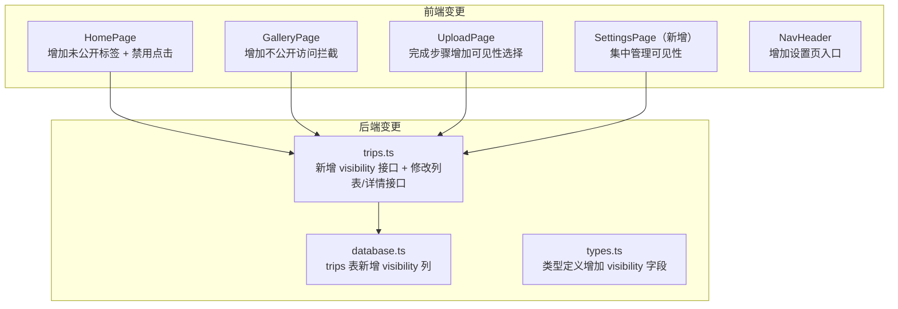
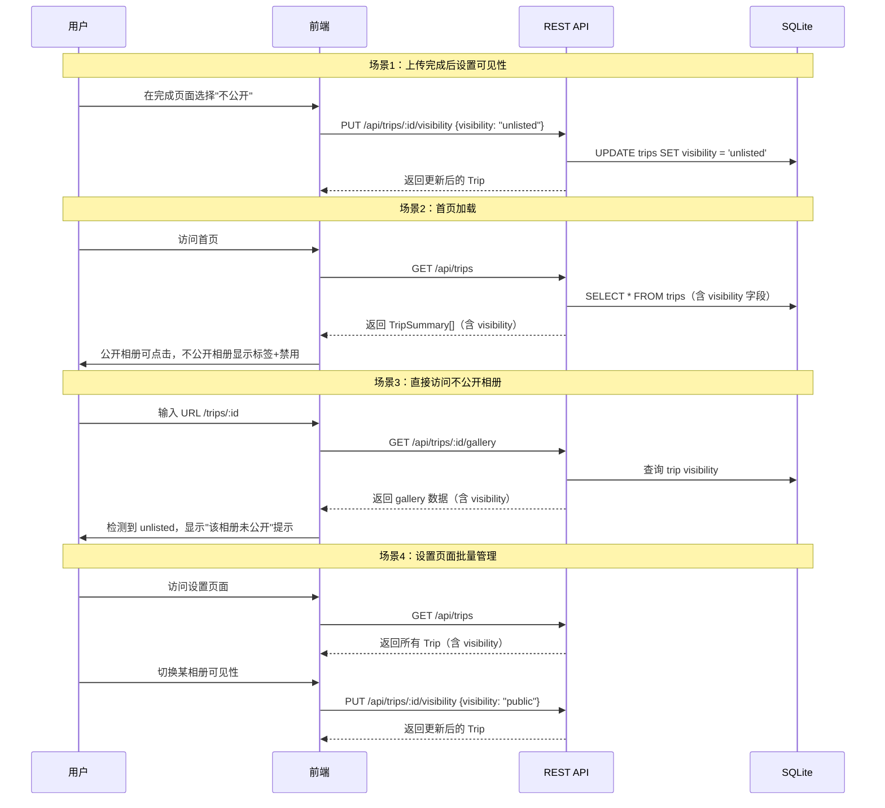

# 技术设计文档：相册可见性控制

## 概述

本功能为旅行相册网站增加公开/不公开状态管理能力。核心变更包括：

1. 在 `trips` 表中新增 `visibility` 字段（`public` / `unlisted`），默认值为 `public`
2. 后端新增 `PUT /api/trips/:id/visibility` 接口用于切换可见性状态
3. 首页对不公开相册显示"未公开"标签并禁用点击
4. Gallery 页面对不公开相册阻止内容展示
5. 上传流程完成页面增加可见性选择控件
6. 新增设置页面（Settings_Page）集中管理所有相册可见性

本功能不涉及用户认证，所有操作均在单用户场景下进行。可见性状态仅影响前端展示行为和 API 访问控制，不影响底层文件存储。

## 架构

### 变更范围



### 数据流



## 组件与接口

### 1. 后端变更

#### 1.1 新增 API 端点

| 方法 | 路径 | 说明 |
|------|------|------|
| PUT | `/api/trips/:id/visibility` | 更新 Trip 可见性状态 |

#### 1.2 修改现有端点

| 方法 | 路径 | 变更说明 |
|------|------|----------|
| POST | `/api/trips` | 创建时自动设置 `visibility = 'public'` |
| GET | `/api/trips` | 返回数据增加 `visibility` 字段 |
| GET | `/api/trips/:id` | 返回数据增加 `visibility` 字段 |
| GET | `/api/trips/:id/gallery` | 返回数据增加 trip 的 `visibility` 字段 |

#### 1.3 Visibility API 接口定义

```typescript
// PUT /api/trips/:id/visibility
// Request Body:
interface UpdateVisibilityRequest {
  visibility: 'public' | 'unlisted';
}

// Response: 更新后的 Trip 对象（含 visibility 字段）
// 错误响应：
// 404 - Trip 不存在: { error: { code: 'NOT_FOUND', message: '旅行不存在' } }
// 400 - 无效状态值: { error: { code: 'INVALID_VISIBILITY', message: '可见性状态无效，必须为 public 或 unlisted' } }
```

### 2. 前端变更

#### 2.1 HomePage 变更

- `TripSummary` 接口增加 `visibility: 'public' | 'unlisted'` 字段
- 不公开相册卡片显示"未公开"标签
- 不公开相册卡片禁用 `Link` 跳转（改为 `div`，移除链接行为）
- 视觉上降低不公开相册卡片的不透明度以区分状态

#### 2.2 GalleryPage 变更

- 从 gallery API 响应中读取 `trip.visibility` 字段
- 当 `visibility === 'unlisted'` 时，不渲染图片/视频内容，显示"该相册未公开"提示和返回首页链接

#### 2.3 UploadPage 变更

- 在 `step === 'done'` 阶段增加可见性选择控件（两个单选按钮：公开/不公开）
- 默认选中"公开"
- 用户选择后调用 `PUT /api/trips/:id/visibility` 更新状态
- 用户不做选择直接离开时保持默认公开状态

#### 2.4 SettingsPage（新增）

- 新增 `client/src/pages/SettingsPage.tsx`
- 路由：`/settings`
- 调用 `GET /api/trips` 获取所有旅行列表
- 以列表形式展示每个 Trip 的标题、创建时间和可见性状态
- 每个 Trip 提供一个开关按钮（toggle switch）切换可见性
- 切换时立即调用 API，成功后更新本地状态；失败时回滚并显示错误提示

#### 2.5 NavHeader 变更

- 在导航栏中增加"设置"链接，指向 `/settings`

### 3. 接口类型变更

```typescript
// server/src/types.ts 变更
export type TripVisibility = 'public' | 'unlisted';

export interface Trip {
  id: string;
  title: string;
  description?: string;
  coverImageId?: string;
  visibility: TripVisibility;  // 新增
  createdAt: string;
  updatedAt: string;
}

export interface TripSummary {
  id: string;
  title: string;
  descriptionExcerpt?: string;
  coverImageUrl: string;
  mediaCount: number;
  visibility: TripVisibility;  // 新增
  createdAt: string;
}
```

## 数据模型

### 数据库 Schema 变更

在 `trips` 表中新增 `visibility` 列：

```sql
ALTER TABLE trips ADD COLUMN visibility TEXT NOT NULL DEFAULT 'public';
```

在 `initTables` 函数中，`CREATE TABLE` 语句更新为：

```sql
CREATE TABLE IF NOT EXISTS trips (
  id TEXT PRIMARY KEY,
  title TEXT NOT NULL,
  description TEXT,
  cover_image_id TEXT,
  visibility TEXT NOT NULL DEFAULT 'public',
  created_at TEXT NOT NULL,
  updated_at TEXT NOT NULL
);
```

### 设计决策

1. **可见性值使用 `public` / `unlisted` 而非布尔值**：字符串枚举更具可读性，且未来可扩展为更多状态（如 `private`、`shared` 等）。

2. **不公开相册仍然返回给前端**：首页 API 返回所有相册（含不公开的），由前端控制展示行为。这样设置页面可以复用同一个列表接口，且用户能看到自己所有相册的状态。

3. **Gallery API 不拦截不公开相册**：后端仍然返回 gallery 数据（含 visibility 字段），由前端根据 visibility 决定是否展示内容。这是因为当前系统无用户认证，不存在"其他用户"的概念，拦截逻辑放在前端即可满足需求。

4. **使用 `ALTER TABLE` 迁移**：在 `initTables` 中检测并添加新列，确保已有数据库平滑升级。新列默认值为 `public`，已有相册自动变为公开状态。


## 正确性属性

*属性是一种在系统所有有效执行中都应成立的特征或行为——本质上是关于系统应该做什么的形式化陈述。属性是人类可读规范与机器可验证正确性保证之间的桥梁。*

### Property 1: 新建 Trip 默认可见性为公开

*For any* 有效的旅行创建请求（非空标题），创建后的 Trip 对象的 `visibility` 字段应始终为 `public`。

**Validates: Requirements 1.1**

### Property 2: 可见性更新的往返一致性

*For any* 已存在的 Trip 和任意有效的可见性值（`public` 或 `unlisted`），调用可见性更新 API 后重新查询该 Trip，返回的 `visibility` 字段应与设置的值完全一致。

**Validates: Requirements 2.2, 2.3, 4.1, 4.2**

### Property 3: 无效可见性值被拒绝

*For any* 字符串，若该字符串既不是 `public` 也不是 `unlisted`，则调用可见性更新 API 时应返回参数错误（400），且 Trip 的可见性状态不应发生变化。

**Validates: Requirements 1.2, 4.4**

### Property 4: 旅行列表包含所有 Trip

*For any* 一组 Trip（含公开和不公开的），`GET /api/trips` 返回的列表应包含所有 Trip，且每个条目包含 `visibility` 字段。

**Validates: Requirements 3.1**

### Property 5: 首页卡片行为由可见性决定

*For any* Trip，当其 `visibility` 为 `unlisted` 时，首页卡片应显示"未公开"标签且不可点击跳转；当其 `visibility` 为 `public` 时，首页卡片不应显示"未公开"标签且可点击进入 Gallery 页面。

**Validates: Requirements 3.2, 3.3, 3.4**

### Property 6: Gallery 页面阻止不公开相册内容展示

*For any* `visibility` 为 `unlisted` 的 Trip，Gallery 页面应显示"该相册未公开"提示信息，不渲染图片和视频内容。

**Validates: Requirements 3.5**

### Property 7: 设置页面展示所有 Trip 及必要信息

*For any* 一组 Trip，设置页面应以列表形式展示所有 Trip，每个条目包含旅行标题、创建时间、当前可见性状态和一个可见性切换控件。

**Validates: Requirements 5.1, 5.2**

## 错误处理

| 错误场景 | HTTP 状态码 | 错误码 | 处理策略 |
|----------|------------|--------|----------|
| 更新可见性时 Trip 不存在 | 404 | `NOT_FOUND` | 返回"旅行不存在"错误信息 |
| 可见性状态值无效 | 400 | `INVALID_VISIBILITY` | 返回"可见性状态无效，必须为 public 或 unlisted"错误信息 |
| 可见性更新 API 调用失败（网络错误） | - | - | 前端设置页面将切换控件回滚到更新前状态，显示错误提示 |
| 数据库迁移失败（添加 visibility 列） | - | - | 服务端启动时记录错误日志，使用 `IF NOT EXISTS` 确保幂等性 |

## 测试策略

### 测试框架

- 单元测试与属性测试：**Vitest** + **fast-check**
- 每个属性测试配置最少 100 次迭代
- 每个属性测试必须以注释引用设计文档中的对应属性

### 属性测试

1. **Feature: album-visibility, Property 1: 新建 Trip 默认可见性为公开**
   - 生成随机有效标题和可选描述，创建 Trip 后验证 `visibility === 'public'`

2. **Feature: album-visibility, Property 2: 可见性更新的往返一致性**
   - 生成随机 Trip 和随机有效可见性值（`public` | `unlisted`），更新后查询验证一致性

3. **Feature: album-visibility, Property 3: 无效可见性值被拒绝**
   - 生成随机非法字符串（排除 `public` 和 `unlisted`），调用更新 API 验证返回 400 且状态不变

4. **Feature: album-visibility, Property 4: 旅行列表包含所有 Trip**
   - 生成随机数量的 Trip（含随机可见性），查询列表验证数量和 visibility 字段完整性

5. **Feature: album-visibility, Property 5: 首页卡片行为由可见性决定**
   - 生成随机 TripSummary 数据（含随机 visibility），渲染 HomePage 验证卡片行为与 visibility 一致

6. **Feature: album-visibility, Property 6: Gallery 页面阻止不公开相册内容展示**
   - 生成随机 GalleryData（trip.visibility = 'unlisted'），渲染 GalleryPage 验证内容被阻止

7. **Feature: album-visibility, Property 7: 设置页面展示所有 Trip 及必要信息**
   - 生成随机 Trip 列表，渲染 SettingsPage 验证每个条目包含标题、创建时间、可见性状态和切换控件

### 单元测试

单元测试聚焦于具体示例、边界情况和集成点：

1. **后端 API 单元测试**
   - 测试 `PUT /api/trips/:id/visibility` 成功更新场景
   - 测试 Trip 不存在时返回 404（需求 4.3）
   - 测试创建 Trip 后数据库中 visibility 列值为 'public'
   - 测试 `GET /api/trips` 返回的 TripSummary 包含 visibility 字段

2. **UploadPage 单元测试**
   - 测试完成步骤渲染可见性选择控件（需求 2.1）
   - 测试选择"不公开"后调用 API 更新（需求 2.2）
   - 测试默认选中"公开"（需求 2.4）

3. **SettingsPage 单元测试**
   - 测试切换控件触发 API 调用（需求 5.3）
   - 测试 API 成功后 UI 状态更新（需求 5.4）
   - 测试 API 失败后切换控件回滚并显示错误（需求 5.5）
   - 测试导航栏包含设置页入口（需求 5.6）
