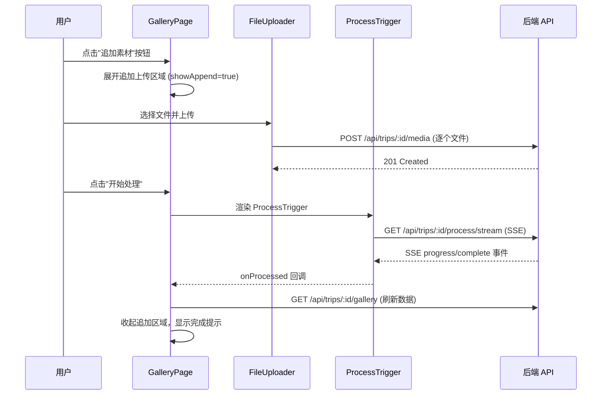
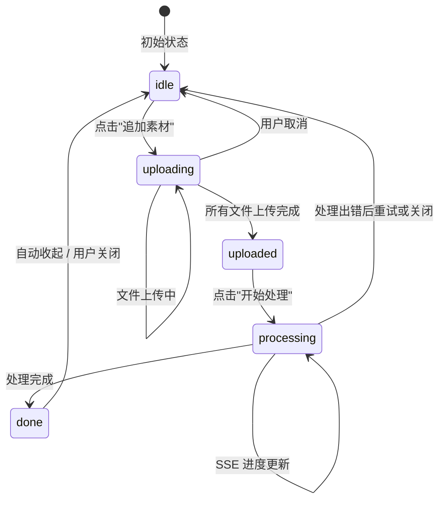

# 设计文档：追加素材（append-media）

## 概述

本功能在现有 GalleryPage 中增加追加上传入口，允许用户为已有旅行相册添加新素材。核心设计思路是最大程度复用现有组件和后端接口：

- 前端复用 `FileUploader` 和 `ProcessTrigger` 组件
- 后端完全复用现有的 `POST /api/trips/:id/media`（上传）和 `GET /api/trips/:id/process/stream`（SSE 处理）接口
- 现有处理流水线已经对 Trip 的全部素材重新执行去重、质量评分、缩略图生成和封面选择，天然支持追加场景

主要工作集中在前端 GalleryPage 的状态管理和 UI 交互上。

## 架构

### 整体流程



### 状态流转



## 组件和接口

### 前端组件

#### 1. GalleryPage（修改）

GalleryPage 新增追加上传的状态管理和 UI 区域：

- 新增状态：`appendMode: 'idle' | 'uploading' | 'uploaded' | 'processing' | 'done'`
- 新增状态：`showAppend: boolean`（控制追加区域的展开/收起）
- 在页面 header 区域添加"追加素材"按钮（仅公开相册可见）
- 展开区域内嵌 `FileUploader` 和 `ProcessTrigger` 组件
- 处理完成后调用 `fetchGallery()` 刷新数据并自动收起

```typescript
interface AppendState {
  appendMode: 'idle' | 'uploading' | 'uploaded' | 'processing' | 'done';
  showAppend: boolean;
}
```

#### 2. FileUploader（复用，无修改）

现有 `FileUploader` 组件接受 `tripId` prop，已支持：
- 多文件选择和格式校验
- 逐个上传到 `POST /api/trips/:id/media`
- 每个文件的进度和状态显示
- 失败重试

直接在 GalleryPage 的追加区域中渲染 `<FileUploader tripId={id} />`。

#### 3. ProcessTrigger（复用，无修改）

现有 `ProcessTrigger` 组件接受 `tripId` 和 `onProcessed` props，已支持：
- 通过 SSE 连接 `GET /api/trips/:id/process/stream`
- 实时显示处理进度（ProgressBar）
- 处理完成后回调 `onProcessed`

直接在 GalleryPage 的追加区域中渲染 `<ProcessTrigger tripId={id} onProcessed={handleProcessed} />`。

### 后端接口（全部复用，无修改）

| 接口 | 方法 | 说明 |
|------|------|------|
| `/api/trips/:id/media` | POST | 上传单个文件到 Trip，已有 |
| `/api/trips/:id/process/stream` | GET | SSE 流式处理（去重→质量→缩略图→封面），已有 |
| `/api/trips/:id/gallery` | GET | 获取 Gallery 数据，已有 |

后端处理流水线的关键特性：
- `deduplicate()` 对 Trip 的**全部**图片重新计算感知哈希并分组，天然包含新追加的素材
- `processTrip()` 对所有重复组重新评分选最佳
- `generateThumbnailsForTrip()` 为所有未生成缩略图的图片生成缩略图（已有缩略图的会被覆盖，但结果一致）
- `selectCoverImage()` 从全部图片中选质量最高的作为封面

## 数据模型

无需新增数据模型或数据库表。现有模型完全满足需求：

- `trips` 表：存储旅行信息
- `media_items` 表：存储每个上传文件的元数据，通过 `trip_id` 关联到旅行
- `duplicate_groups` 表：存储去重分组信息

追加上传的文件通过现有 `POST /api/trips/:id/media` 接口写入 `media_items` 表，与创建旅行时上传的文件使用完全相同的数据结构。

处理流水线重新执行时会：
1. 清除并重建 `duplicate_groups`（通过 `deduplicate()` 的 Union-Find 算法）
2. 更新 `media_items` 的 `perceptual_hash`、`quality_score`、`sharpness_score`、`duplicate_group_id`、`thumbnail_path`
3. 更新 `trips` 的 `cover_image_id`


## 正确性属性（Correctness Properties）

*属性（Property）是指在系统所有有效执行中都应保持为真的特征或行为——本质上是对系统应做什么的形式化陈述。属性是人类可读规格说明与机器可验证正确性保证之间的桥梁。*

### 属性 1：追加按钮的可见性与 Trip 可见性一致

*对于任意* Trip 可见性状态（public 或 unlisted），GalleryPage 中"追加素材"按钮的渲染状态应与 Trip 是否为 public 一致：public 时按钮可见，unlisted 时按钮不可见。

**验证需求：1.1, 1.3**

### 属性 2：不支持格式的文件被拒绝

*对于任意*文件，如果其 MIME 类型和扩展名均不在支持列表中（JPEG、PNG、WebP、HEIC、MP4、MOV、AVI、MKV），则 `isFormatSupported` 应返回 false，该文件不会被加入上传队列。

**验证需求：2.2**

### 属性 3：感知哈希去重分组正确性

*对于任意*一组图片，经过 `deduplicate()` 处理后，任意两张汉明距离 ≤ 阈值的图片应属于同一个重复组，任意两张汉明距离 > 阈值且不通过其他图片间接连接的图片应属于不同组。

**验证需求：4.1, 4.2, 4.3**

### 属性 4：重复组默认展示图为最高质量

*对于任意*重复组，经过 `selectBest()` 处理后，该组的 `default_image_id` 应指向组内质量评分（resolution → sharpness → fileSize）最高的图片。

**验证需求：4.4**

### 属性 5：处理后所有图片均有缩略图

*对于任意* Trip，经过 `generateThumbnailsForTrip()` 处理后，该 Trip 下所有 `media_type = 'image'` 的 media_items 都应有非空的 `thumbnail_path`。

**验证需求：5.1**

### 属性 6：封面图为全局最高质量

*对于任意* Trip，经过 `selectCoverImage()` 处理后，Trip 的 `cover_image_id` 应指向该 Trip 下质量评分最高的图片（如果存在图片的话）。

**验证需求：5.2**

### 属性 7：追加上传状态流转合法性

*对于任意*用户操作序列，GalleryPage 的追加上传状态应仅按以下合法路径流转：idle → uploading → uploaded → processing → done → idle。不允许跳过中间状态或逆向流转（取消操作除外，取消可从 uploading 回到 idle）。

**验证需求：6.1**

## 错误处理

### 前端错误处理

| 场景 | 处理方式 |
|------|----------|
| 文件格式不支持 | FileUploader 跳过文件，显示警告（已有逻辑） |
| 单个文件上传失败 | 显示错误信息和重试按钮（已有逻辑） |
| Trip 不存在（404） | 显示错误提示 |
| SSE 连接中断 | ProcessTrigger 显示"连接中断"并允许重试（已有逻辑） |
| 处理流水线错误 | ProcessTrigger 显示错误信息并允许重试（已有逻辑） |
| 用户取消上传 | 停止后续文件上传，已上传文件保留在服务器 |

### 后端错误处理

后端接口的错误处理已完善，无需修改：
- `POST /api/trips/:id/media`：404（Trip 不存在）、400（无文件/格式不支持）
- `GET /api/trips/:id/process/stream`：404（Trip 不存在）、SSE error 事件（处理失败）

## 测试策略

### 双重测试方法

本功能采用单元测试和属性测试相结合的方式：

- **单元测试**：验证具体示例、边界情况和错误条件
- **属性测试**：验证跨所有输入的通用属性

### 属性测试

使用 `fast-check` 作为属性测试库（项目已使用 vitest，fast-check 与之兼容良好）。

每个属性测试配置：
- 最少运行 100 次迭代
- 每个测试用注释标注对应的设计属性
- 标注格式：**Feature: append-media, Property {number}: {property_text}**
- 每个正确性属性由单个属性测试实现

#### 属性测试覆盖

| 属性 | 测试方式 |
|------|----------|
| 属性 1：追加按钮可见性 | 生成随机 visibility 状态，渲染 GalleryPage，断言按钮存在性 |
| 属性 2：格式拒绝 | 生成随机不支持的文件名/MIME，断言 `isFormatSupported` 返回 false |
| 属性 3：去重分组 | 生成随机哈希集合，运行 Union-Find 分组，断言汉明距离 ≤ 阈值的在同组 |
| 属性 4：默认展示图 | 生成随机质量评分的图片组，断言 selectBest 选出最高分 |
| 属性 5：缩略图完整性 | 集成测试：上传多张图片后处理，断言所有图片有 thumbnail_path |
| 属性 6：封面选择 | 生成随机质量评分的图片集，断言封面为最高分图片 |
| 属性 7：状态流转 | 生成随机合法操作序列，断言状态按预期流转 |

### 单元测试覆盖

| 测试场景 | 类型 |
|----------|------|
| 公开相册显示追加按钮 | 示例 |
| 不公开相册隐藏追加按钮 | 示例 |
| 点击追加按钮展开上传区域 | 示例 |
| 上传完成后显示处理按钮 | 示例 |
| 处理完成后刷新 Gallery 数据 | 示例 |
| 处理完成后收起追加区域 | 示例 |
| 取消操作保留已上传文件 | 边界 |
| 处理错误显示重试按钮 | 边界 |
