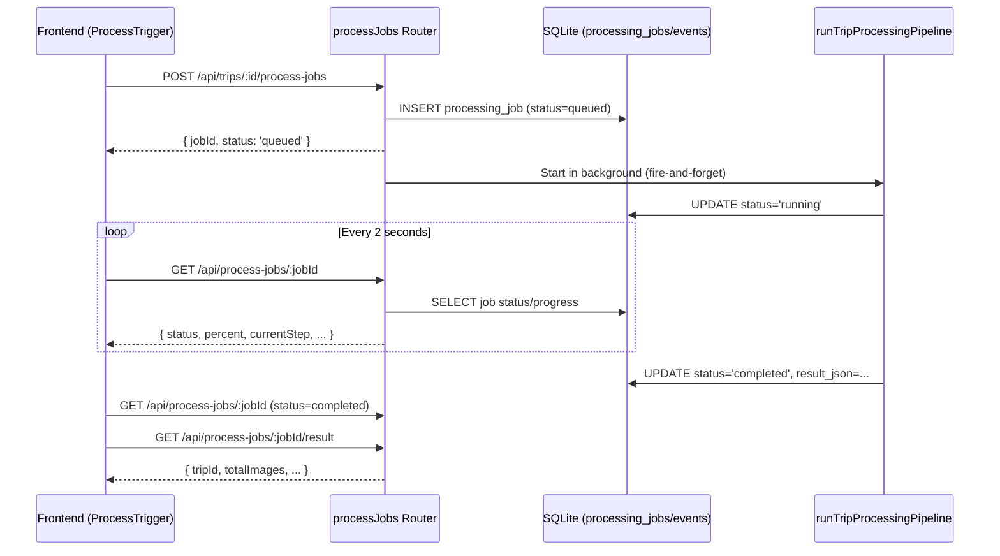
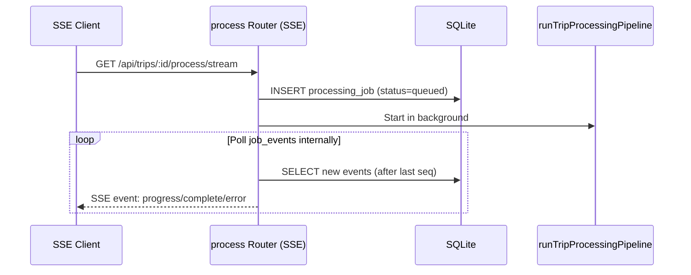

# Design Document: Async Processing

## Overview

The current image processing pipeline uses SSE (Server-Sent Events) for real-time progress streaming. For large trips (100+ images), processing takes 7-15 minutes and SSE connections frequently drop due to Nginx/browser timeouts. The backend completes successfully, but the frontend shows "处理失败" because the connection was lost.

This design converts the processing pipeline to an async job model:
1. Frontend POSTs to create a job → gets `jobId` immediately
2. Backend runs the pipeline in the background, writing progress to the database
3. Frontend polls for job status every 2 seconds
4. SSE endpoint is refactored to use the same job backend internally

The pipeline itself (blur, dedup, classify, optimize, etc.) remains unchanged. Only the progress reporting mechanism and frontend communication pattern change.

## Architecture



### SSE Unified Flow

The existing SSE endpoint (`GET /api/trips/:id/process/stream`) is refactored to create a job internally and stream events from the job_events table, rather than maintaining a separate execution chain.



## Components and Interfaces

### New Database Tables

Created in `server/src/database.ts` `initTables()`:

- `processing_jobs` — stores job state, progress, and results
- `processing_job_events` — stores granular event log per job
- `idx_processing_jobs_active_trip` — UNIQUE partial index on `processing_jobs(trip_id) WHERE status IN ('queued', 'running')` to enforce at most one active job per trip at the database level, preventing race conditions

### New Route: `server/src/routes/processJobs.ts`

Endpoints:
- `POST /api/trips/:id/process-jobs` — Create job, start pipeline in background
- `GET /api/process-jobs/:jobId` — Poll job status
- `GET /api/process-jobs/:jobId/events?after=N` — Fetch event log (incremental)
- `GET /api/process-jobs/:jobId/result` — Fetch final result JSON
- `GET /api/trips/:id/active-job` — Returns the latest queued/running job for the trip, or 404 if none

All endpoints require authentication. POST requires trip owner or admin. GET endpoints require that the authenticated user owns the trip associated with the job, or is admin.

### New Service: `server/src/services/jobProgressReporter.ts`

Replaces `ProgressReporter` (SSE-based) for the job context. Implements the same `PipelineProgressCallback` signature but writes to the database instead of an SSE response.

```typescript
interface JobProgressReporter {
  constructor(jobId: string);
  onStepBegin(step: string, totalSteps: number, stepIndex: number): void;
  onStepComplete(step: string, totalSteps: number, stepIndex: number): void;
  onItemProgress(processed: number, total: number): void;
  markCompleted(resultJson: string): void;
  markFailed(errorMessage: string): void;
}
```

Each method performs DB writes:
- `onStepBegin`: INSERT event + UPDATE job (current_step, percent, processed=0, total=0) — resets processed/total for the new step
- `onStepComplete`: UPDATE job (percent, processed, total)
- `onItemProgress`: UPDATE job (processed, total) — updates for the current step only
- `markCompleted`: UPDATE job (status='completed', result_json, finished_at)
- `markFailed`: UPDATE job (status='failed', error_message, finished_at) + INSERT error event

JobProgressReporter maintains a `nextSeq` counter starting at 1, incremented on each event insert. The seq value is never reset within a job.

### Modified: `server/src/routes/process.ts`

The SSE endpoint (`GET /:id/process/stream`) is refactored to:
1. Create a `processing_job` record
2. Start the pipeline with `jobProgressReporter`
3. Poll `processing_job_events` and stream them as SSE events
4. The POST endpoint (`/:id/process`) remains unchanged for backward compatibility

### Modified: `client/src/components/ProcessTrigger.tsx`

Replace `EventSource`-based approach with polling:
1. POST to `/api/trips/:id/process-jobs` → store `jobId`
   - If POST returns 409 ALREADY_PROCESSING, extract `existingJobId` from the error response and start polling that job instead of showing an error
2. `setInterval` every 2s → GET `/api/process-jobs/:jobId`
3. Update ProgressBar with `percent`, `currentStep`, `processed`, `total`
4. On `status === 'completed'` → fetch result, call `onProcessed`
5. On `status === 'failed'` → show error
6. Retry logic: up to 3 retries with exponential backoff (2s, 4s, 8s), then warning mode

On component mount: check for active job via `GET /api/trips/:id/active-job`. If found, resume polling with that jobId instead of showing "开始处理" button. This handles page refresh and navigation back to a trip with an active job.

### Startup Cleanup: `server/src/database.ts`

In `initTables()`, after creating tables, clean up zombie jobs:
- UPDATE all jobs with status 'running' or 'queued' → status 'failed', error_message '服务重启，任务中断', finished_at = now
- INSERT error events for each affected job

## Data Models

### processing_jobs Table

| Column | Type | Constraints | Description |
|--------|------|-------------|-------------|
| id | TEXT | PRIMARY KEY | UUID |
| trip_id | TEXT | NOT NULL, FK → trips.id | Associated trip |
| status | TEXT | NOT NULL DEFAULT 'queued' | queued / running / completed / failed |
| current_step | TEXT | | Current pipeline step name |
| percent | INTEGER | DEFAULT 0 | Overall progress 0-100 |
| processed | INTEGER | DEFAULT 0 | Items processed in current step |
| total | INTEGER | DEFAULT 0 | Total items in current step |
| error_message | TEXT | | Error description on failure |
| result_json | TEXT | | Serialized PipelineResult on completion |
| created_at | TEXT | NOT NULL | ISO timestamp |
| started_at | TEXT | | ISO timestamp when status → running |
| finished_at | TEXT | | ISO timestamp when status → completed/failed |

### processing_job_events Table

| Column | Type | Constraints | Description |
|--------|------|-------------|-------------|
| id | INTEGER | PRIMARY KEY AUTOINCREMENT | Auto-increment ID |
| job_id | TEXT | NOT NULL, FK → processing_jobs.id | Parent job |
| seq | INTEGER | NOT NULL | Monotonic sequence number per job |
| level | TEXT | NOT NULL DEFAULT 'info' | info / error |
| step | TEXT | | Pipeline step name |
| message | TEXT | NOT NULL | Human-readable description |
| processed | INTEGER | | Item count at time of event |
| total | INTEGER | | Total items at time of event |
| created_at | TEXT | NOT NULL | ISO timestamp |

### API Response Shapes

**POST /api/trips/:id/process-jobs** → `{ jobId: string, status: 'queued' }`

**POST /api/trips/:id/process-jobs (409)** →
```json
{
  "error": {
    "code": "ALREADY_PROCESSING",
    "message": "该旅行正在处理中",
    "existingJobId": "uuid"
  }
}
```

**GET /api/trips/:id/active-job** → `{ jobId: string, status: 'queued' | 'running' }` or 404 if no active job

**GET /api/process-jobs/:jobId** →
```json
{
  "id": "uuid",
  "tripId": "uuid",
  "status": "running",
  "currentStep": "dedup",
  "percent": 33,
  "processed": 5,
  "total": 20,
  "errorMessage": null,
  "createdAt": "2024-...",
  "startedAt": "2024-...",
  "finishedAt": null
}
```

**GET /api/process-jobs/:jobId/events?after=0** →
```json
{
  "events": [
    { "id": 1, "seq": 1, "level": "info", "step": "classify", "message": "开始分类", "processed": null, "total": null, "createdAt": "..." },
    { "id": 2, "seq": 2, "level": "info", "step": "classify", "message": "分类完成", "processed": 20, "total": 20, "createdAt": "..." }
  ]
}
```

**GET /api/process-jobs/:jobId/result** → Parsed `PipelineResult` object (same shape as current SSE complete event)


## Correctness Properties

*A property is a characteristic or behavior that should hold true across all valid executions of a system — essentially, a formal statement about what the system should do. Properties serve as the bridge between human-readable specifications and machine-verifiable correctness guarantees.*

### Property 1: Step-begin reporter inserts event and updates current_step

*For any* valid job and any pipeline step name, calling the reporter's step-begin method should insert a `processing_job_events` row with level 'info' and the step name, AND update the job's `current_step` to that step name.

**Validates: Requirements 3.1, 3.2**

### Property 2: Step-complete reporter updates percent correctly

*For any* step index S and total steps T (where 1 ≤ S ≤ T), calling the reporter's step-complete method should update the job's `percent` to `Math.round((S / T) * 100)`.

**Validates: Requirements 3.3**

### Property 3: Item-level progress updates processed and total

*For any* processed count P and total count N (where 0 ≤ P ≤ N), calling the reporter's item-progress method should set the job's `processed = P` and `total = N`.

**Validates: Requirements 3.6**

### Property 4: GET job returns all fields in camelCase

*For any* job with arbitrary field values stored in snake_case in the database, GET `/api/process-jobs/:jobId` should return all fields mapped to camelCase: id, tripId, status, currentStep, percent, processed, total, errorMessage, createdAt, startedAt, finishedAt.

**Validates: Requirements 4.1, 4.3**

### Property 5: Events ordered by seq ascending

*For any* set of events inserted for a job in arbitrary order, GET `/api/process-jobs/:jobId/events` should return them sorted by `seq` in ascending order.

**Validates: Requirements 5.1**

### Property 6: Events filtered by after parameter

*For any* integer N and any set of events for a job, GET `/api/process-jobs/:jobId/events?after=N` should return only events where `seq > N`.

**Validates: Requirements 5.2**

### Property 7: Result round-trip

*For any* valid `PipelineResult` object stored as JSON in `result_json`, GET `/api/process-jobs/:jobId/result` should return a parsed object equivalent to the original.

**Validates: Requirements 6.1**

### Property 8: Authorization rejects non-owner non-admin

*For any* authenticated user who is neither the trip owner nor an admin, all job endpoints (POST create, GET status, GET events, GET result) should return HTTP 403.

**Validates: Requirements 10.1, 10.2, 10.4**

## Error Handling

| Scenario | Behavior |
|----------|----------|
| Trip not found | 404 NOT_FOUND |
| Job not found | 404 NOT_FOUND |
| Already processing (queued/running job exists) | 409 ALREADY_PROCESSING with `existingJobId` in response |
| Result requested before completion | 409 JOB_NOT_COMPLETE |
| No auth token | 401 UNAUTHORIZED |
| Not owner and not admin | 403 FORBIDDEN |
| Pipeline fatal error | Job status → 'failed', error_message set, error event inserted |
| Server restart with running/queued jobs | Jobs marked 'failed' with '服务重启，任务中断', error events inserted |
| Frontend poll network error | Retry up to 3 times (2s, 4s, 8s backoff), then show '连接异常' warning, continue retrying every 10s |
| Frontend poll failures | Never show '处理失败' while retrying — backend job may still be running |

## Testing Strategy

### Unit Tests

- **jobProgressReporter**: Test each method (onStepBegin, onStepComplete, onItemProgress, markCompleted, markFailed) writes correct DB state
- **processJobs routes**: Test each endpoint with mocked DB for correct response shapes, error codes, and authorization
- **ProcessTrigger component**: Test polling lifecycle, retry logic, state transitions, and UI rendering
- **Zombie cleanup**: Test initTables cleanup logic marks stale jobs as failed

### Property-Based Tests

Using `fast-check` (already available in the project's test setup with vitest).

Each property test runs minimum 100 iterations and is tagged with:
`Feature: async-processing, Property {N}: {description}`

Properties to implement:
1. Step-begin reporter correctness (Property 1)
2. Step-complete percent calculation (Property 2)
3. Item-level progress updates (Property 3)
4. GET job camelCase field mapping (Property 4)
5. Event ordering by seq (Property 5)
6. Event filtering by after parameter (Property 6)
7. Result JSON round-trip (Property 7)
8. Authorization rejection for non-owner non-admin (Property 8)

### Integration Tests

- End-to-end: POST create job → poll until completed → fetch result
- SSE endpoint creates job and streams events from job_events
- Concurrent job rejection for same trip
- Startup zombie cleanup with real DB
