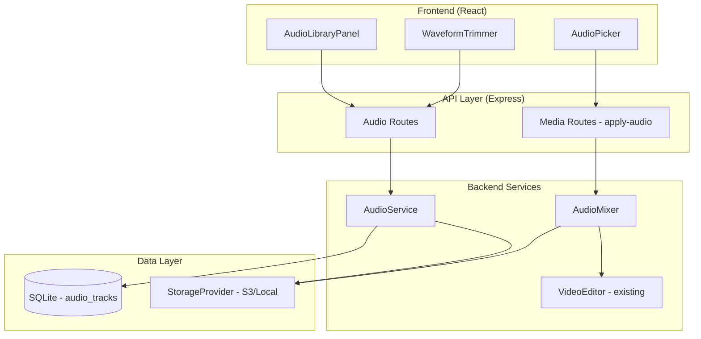
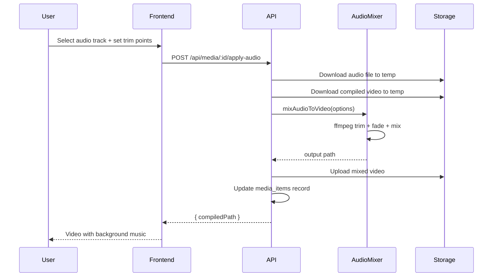

# Design Document: Audio Library

## Overview

为旅行相册项目添加音频库功能，允许用户管理背景音乐并将其应用到自动剪辑的视频中。当前自动剪辑生成的视频由多个2秒片段拼接而成，原始音频在片段切换时产生突兀的断裂感。本功能通过以下核心改动解决该问题：

1. **静音原始音频** — 修改现有 `concatenateSegments()` 默认静音原始音频
2. **音频库管理** — 新增 `audio_tracks` 数据表和 CRUD API
3. **音频混音** — 基于 ffmpeg 的 AudioMixer 服务，支持自动/手动裁剪和淡入淡出
4. **前端交互** — AudioLibraryPanel、AudioPicker、WaveformTrimmer 组件

**设计决策：后处理混音（Post-processing Mix）**

不修改现有的视频编译流程。在编译完成后，作为独立步骤将背景音乐混入。这样做的好处是：
- 现有编译逻辑不受影响，降低回归风险
- 用户可以反复更换音乐而无需重新编译视频片段
- 带音乐版本独立存储，可随时回退

## Architecture



### Request Flow: Apply Audio to Video



## Components and Interfaces

### 1. AudioService (`server/src/services/audioService.ts`)

Handles audio file lifecycle: upload, download from URL, metadata extraction, deletion, and waveform generation.

```typescript
interface AudioTrack {
  id: string;
  userId: string;
  title: string;
  filePath: string;
  format: 'mp3' | 'aac' | 'wav' | 'ogg';
  duration: number;       // seconds
  fileSize: number;       // bytes
  source: 'upload' | 'download';
  sourceUrl?: string;
  createdAt: string;
}

interface AudioMetadata {
  title: string;
  duration: number;
  format: string;
  fileSize: number;
}

interface ValidationResult {
  valid: boolean;
  error?: string;
}

// Public API
function validateAudioFile(buffer: Buffer, filename: string): ValidationResult;
async function extractAudioMetadata(filePath: string): Promise<AudioMetadata>;
async function saveAudioTrack(userId: string, file: Buffer, filename: string): Promise<AudioTrack>;
async function downloadAudioFromUrl(userId: string, url: string): Promise<AudioTrack>;
async function deleteAudioTrack(trackId: string, userId: string): Promise<void>;
async function generateWaveformData(trackId: string): Promise<number[]>;
async function listUserTracks(userId: string): Promise<AudioTrack[]>;
async function getTrackById(trackId: string): Promise<AudioTrack | null>;
```

**Validation Rules:**
- Supported formats: MP3 (`audio/mpeg`), AAC (`audio/aac`, `audio/mp4`), WAV (`audio/wav`), OGG (`audio/ogg`)
- Maximum file size: 50MB (52,428,800 bytes)
- Uses ffprobe to verify file is valid audio (not just MIME type check)

**Title Extraction Logic:**
- First attempts to read title from audio file metadata (ID3 tags, Vorbis comments)
- Falls back to filename without extension
- For URL downloads: extracts filename from URL path, strips query params

### 2. AudioMixer (`server/src/services/audioMixer.ts`)

Handles mixing background music into compiled videos using ffmpeg.

```typescript
interface AudioMixOptions {
  audioTrackPath: string;       // Local path to audio file
  videoPath: string;            // Local path to compiled video
  outputPath: string;           // Output path for mixed video
  videoDuration: number;        // Video duration in seconds
  trimStart?: number;           // Manual trim start (seconds)
  trimEnd?: number;             // Manual trim end (seconds)
  fadeInDuration?: number;      // Fade-in duration (default: 1s)
  fadeOutDuration?: number;     // Fade-out duration (default: 2s)
  originalAudioVolume?: number; // Original audio volume (0-0.2, default: 0)
}

interface TrimCalculation {
  start: number;
  end: number;
}

async function mixAudioToVideo(options: AudioMixOptions): Promise<string>;
function calculateTrimWindow(
  videoDuration: number,
  audioDuration: number,
  startPoint?: number,
  endPoint?: number
): TrimCalculation;
function buildFfmpegFilter(options: AudioMixOptions, audioDuration: number): string;
```

**Processing Modes:**

1. **Auto-trim** (trimStart/trimEnd are null):
   - Audio ≥ video duration → truncate at video end point
   - Audio < video duration → loop audio (`-stream_loop -1`) then truncate
   - Apply fade-in (1s) and fade-out (2s)

2. **Manual trim** (trimStart/trimEnd provided):
   - Extract [trimStart, trimEnd] segment
   - Duration is guaranteed to equal video duration (enforced by frontend + backend validation)
   - Apply fade-in (1s) and fade-out (2s)

**ffmpeg Filter Chain:**
```
[1:a]atrim={start}:{end},asetpts=PTS-STARTPTS,afade=t=in:d={fadeIn},afade=t=out:st={duration-fadeOut}:d={fadeOut}[bgm];
[0:a]volume={originalVolume}[orig];
[orig][bgm]amix=inputs=2:duration=first[aout]
```

### 3. API Routes (`server/src/routes/audio.ts`)

```typescript
// Audio Library CRUD
POST   /api/audio/upload        // multipart/form-data { file, title? }
POST   /api/audio/download      // { url: string, title?: string }
GET    /api/audio               // List user's audio tracks
GET    /api/audio/:id/stream    // Stream audio for preview playback
DELETE /api/audio/:id           // Delete audio track
POST   /api/audio/:id/waveform  // Generate/return waveform data

// Apply audio to video
POST   /api/media/:id/apply-audio    // { audioTrackId, trimStart?, trimEnd? }
DELETE /api/media/:id/applied-audio   // Remove background music
```

**Authentication:** All routes require authenticated user (existing auth middleware).

**Response Formats:**
```typescript
// POST /api/audio/upload, POST /api/audio/download
{ track: AudioTrack }

// GET /api/audio
{ tracks: AudioTrack[] }

// POST /api/audio/:id/waveform
{ waveform: number[] }  // ~200 normalized amplitude values (0-1)

// POST /api/media/:id/apply-audio
{ compiledPath: string }

// DELETE /api/media/:id/applied-audio
{ compiledPath: string }
```

### 4. VideoEditor Integration (`server/src/services/videoEditor.ts`)

Minimal modification to existing code:

```typescript
// In concatenateSegments() - add volume=0 to audio filter
const outputOptions = [
  '-c:v', 'libx264', '-preset', 'fast', '-crf', '23',
  '-af', 'volume=0',  // NEW: mute original audio by default
  '-c:a', 'aac', '-b:a', '128k',
  '-movflags', '+faststart',
  '-avoid_negative_ts', 'make_zero',
];
```

### 5. Frontend Components

#### AudioLibraryPanel (`client/src/components/AudioLibraryPanel.tsx`)

```typescript
interface AudioLibraryPanelProps {
  onSelect?: (track: AudioTrack) => void;
  selectable?: boolean;
}
```

- Displays user's audio track list (title, duration, format, date)
- Upload button (accepts .mp3, .aac, .wav, .ogg, max 50MB)
- URL download input with submit button
- Per-track actions: play/pause preview, delete
- Uses `<audio>` element for preview playback via stream endpoint

#### AudioPicker (`client/src/components/AudioPicker.tsx`)

```typescript
interface AudioPickerProps {
  mediaId: string;
  videoDuration: number;
  currentAudioTrackId?: string;
  onApply: (trackId: string, trimStart?: number, trimEnd?: number) => void;
  onRemove: () => void;
}
```

- Embedded in video detail view (MyGalleryPage)
- Shows currently applied audio (if any)
- Opens AudioLibraryPanel for selection
- "Apply" button triggers POST /api/media/:id/apply-audio
- "Remove" button triggers DELETE /api/media/:id/applied-audio

#### WaveformTrimmer (`client/src/components/WaveformTrimmer.tsx`)

```typescript
interface WaveformTrimmerProps {
  trackId: string;
  audioDuration: number;
  videoDuration: number;
  initialStart?: number;
  onChange: (start: number, end: number) => void;
}
```

- Fetches waveform data from POST /api/audio/:id/waveform
- Renders waveform using Canvas (200 amplitude bars)
- Draggable start marker; end marker auto-calculated (start + videoDuration)
- Highlighted region shows selected portion
- Constrained: start ≥ 0, end ≤ audioDuration

## Data Models

### New Table: `audio_tracks`

```sql
CREATE TABLE IF NOT EXISTS audio_tracks (
  id TEXT PRIMARY KEY,
  user_id TEXT NOT NULL,
  title TEXT NOT NULL,
  file_path TEXT NOT NULL,
  format TEXT NOT NULL CHECK(format IN ('mp3', 'aac', 'wav', 'ogg')),
  duration REAL NOT NULL CHECK(duration > 0),
  file_size INTEGER NOT NULL CHECK(file_size > 0 AND file_size <= 52428800),
  source TEXT NOT NULL DEFAULT 'upload' CHECK(source IN ('upload', 'download')),
  source_url TEXT,
  created_at TEXT NOT NULL,
  FOREIGN KEY (user_id) REFERENCES users(id)
);

CREATE INDEX IF NOT EXISTS idx_audio_tracks_user_id ON audio_tracks(user_id);
```

| Column | Type | Description |
|--------|------|-------------|
| id | TEXT (UUID) | Primary key |
| user_id | TEXT | Owner user ID (FK → users) |
| title | TEXT | Audio title (from metadata or filename) |
| file_path | TEXT | StorageProvider relative path: `audio/{user_id}/{id}.{ext}` |
| format | TEXT | File format: mp3, aac, wav, ogg |
| duration | REAL | Duration in seconds |
| file_size | INTEGER | File size in bytes |
| source | TEXT | Origin: 'upload' or 'download' |
| source_url | TEXT | Download source URL (null for uploads) |
| created_at | TEXT | ISO 8601 timestamp |

### Modified Table: `media_items` (new columns)

```sql
ALTER TABLE media_items ADD COLUMN audio_track_id TEXT REFERENCES audio_tracks(id);
ALTER TABLE media_items ADD COLUMN audio_trim_start REAL;
ALTER TABLE media_items ADD COLUMN audio_trim_end REAL;
```

| Column | Type | Description |
|--------|------|-------------|
| audio_track_id | TEXT | Associated background music (NULL = no music) |
| audio_trim_start | REAL | Manual trim start in seconds (NULL = auto-trim) |
| audio_trim_end | REAL | Manual trim end in seconds (NULL = auto-trim) |

### Storage Layout

```
audio/{user_id}/{track_id}.mp3    # Original audio files
{trip_id}/compiled/{media_id}_with_audio.mp4  # Mixed output videos
```

## Correctness Properties

*A property is a characteristic or behavior that should hold true across all valid executions of a system — essentially, a formal statement about what the system should do. Properties serve as the bridge between human-readable specifications and machine-verifiable correctness guarantees.*

### Property 1: Volume level constraint

*For any* original audio volume value provided by the user, the AudioMixer SHALL constrain it to the range [0, 0.2] and the resulting ffmpeg filter SHALL use exactly that value as the volume parameter.

**Validates: Requirements 1.2**

### Property 2: File size validation

*For any* audio file (uploaded or downloaded), if the file size exceeds 52,428,800 bytes (50MB) then the system SHALL reject it, and if the file size is within the limit then the system SHALL accept it (assuming valid format).

**Validates: Requirements 2.2, 3.4**

### Property 3: Invalid file rejection

*For any* buffer that is not a valid audio file in a supported format (MP3, AAC, WAV, OGG), the validateAudioFile function SHALL return `{ valid: false }` with a non-empty error message.

**Validates: Requirements 2.5**

### Property 4: Metadata extraction completeness

*For any* valid audio file, the extractAudioMetadata function SHALL return an object containing a non-empty title string, a positive duration number, and a recognized format string. For URL downloads, if metadata title is unavailable, the title SHALL be derived from the URL filename and be non-empty.

**Validates: Requirements 2.4, 3.5**

### Property 5: User track isolation

*For any* user, the listUserTracks function SHALL return only tracks where `user_id` matches the requesting user, and each returned track SHALL contain all required fields (id, title, duration, format, createdAt).

**Validates: Requirements 4.1, 4.2**

### Property 6: Auto-trim output duration matches video

*For any* audio track duration and video duration, when auto-trim is applied, the resulting audio segment duration SHALL equal the video duration (regardless of whether the audio is longer or shorter than the video).

**Validates: Requirements 6.1, 6.2, 6.3**

### Property 7: Fade effects always applied

*For any* trim operation (auto or manual), the ffmpeg filter chain SHALL include a fade-in of exactly 1 second at the start and a fade-out of exactly 2 seconds at the end of the trimmed audio.

**Validates: Requirements 6.4, 7.5**

### Property 8: Original file preservation

*For any* trim or mix operation, the original audio track file in StorageProvider SHALL remain unmodified (byte-for-byte identical before and after the operation).

**Validates: Requirements 6.5**

### Property 9: Manual trim window calculation and constraints

*For any* video duration, audio total duration, and user-specified start or end point: (a) setting start SHALL produce end = start + videoDuration, (b) setting end SHALL produce start = end - videoDuration, (c) the resulting start SHALL be ≥ 0, (d) the resulting end SHALL be ≤ audio total duration, and (e) end - start SHALL equal videoDuration.

**Validates: Requirements 7.1, 7.2, 7.3, 7.4**

## Error Handling

| Scenario | HTTP Status | Response | Recovery |
|----------|-------------|----------|----------|
| Upload non-audio file | 400 | `{ error: "Invalid audio format. Supported: MP3, AAC, WAV, OGG" }` | User retries with valid file |
| File exceeds 50MB | 413 | `{ error: "File size exceeds 50MB limit" }` | User uploads smaller file |
| URL download fails (network) | 400 | `{ error: "Download failed: {reason}" }` | User retries or checks URL |
| URL returns non-audio content | 400 | `{ error: "Downloaded content is not a supported audio format" }` | User provides correct URL |
| ffmpeg mix fails | 500 | `{ error: "Audio mixing failed" }` | Original compiled video preserved; user can retry |
| Audio track deleted but still referenced | — | Clear `audio_track_id` on media_item, fall back to muted | Automatic recovery |
| Trim start/end out of bounds | 400 | `{ error: "Trim range exceeds audio duration" }` | Frontend constrains input |
| Audio track not found | 404 | `{ error: "Audio track not found" }` | User selects different track |

**Error Recovery Principles:**
- ffmpeg failures never corrupt the original compiled video (output goes to temp file first, then replaces)
- Orphaned audio references are cleaned up lazily (on next access)
- All file operations use temp files + atomic rename pattern

## Testing Strategy

### Unit Tests

- **AudioService validation**: Test format detection, size limits, metadata extraction with mock ffprobe
- **AudioMixer filter building**: Test ffmpeg filter string generation for various duration combinations
- **Trim calculation**: Test `calculateTrimWindow()` with edge cases (audio = video, audio > video, audio < video, boundary values)
- **API route handlers**: Test request validation, auth checks, error responses with mocked services

### Property-Based Tests

Property-based testing is appropriate for this feature because the AudioMixer and trim calculation logic are pure functions with clear input/output behavior and a large input space (arbitrary durations, trim points, volume levels).

**Library:** [fast-check](https://github.com/dubzzz/fast-check) (TypeScript)

**Configuration:** Minimum 100 iterations per property test.

**Properties to implement:**
1. Volume constraint (Property 1) — Tag: `Feature: audio-library, Property 1: Volume level constraint`
2. File size validation (Property 2) — Tag: `Feature: audio-library, Property 2: File size validation`
3. Trim output duration (Property 6) — Tag: `Feature: audio-library, Property 6: Auto-trim output duration matches video`
4. Fade effects (Property 7) — Tag: `Feature: audio-library, Property 7: Fade effects always applied`
5. Manual trim calculation (Property 9) — Tag: `Feature: audio-library, Property 9: Manual trim window calculation and constraints`

### Integration Tests

- Upload flow: file → storage → database record
- Download flow: URL → fetch → validate → storage → database record
- Apply audio: select track → mix → update media_item → serve mixed video
- Delete track: remove file + record, verify orphan cleanup on referenced media

### E2E Tests

- Full workflow: upload audio → select for video → auto-trim → play result
- Manual trim: upload → set start point → verify waveform → apply → play result
