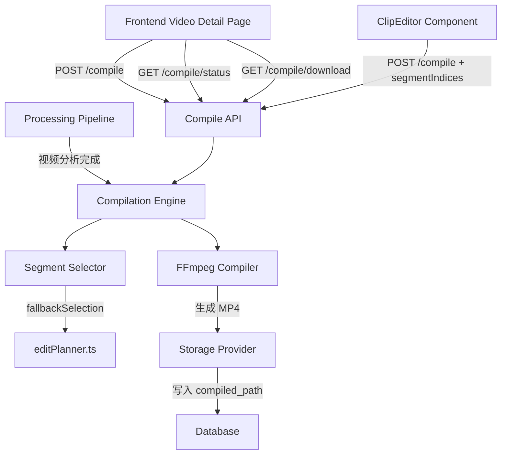
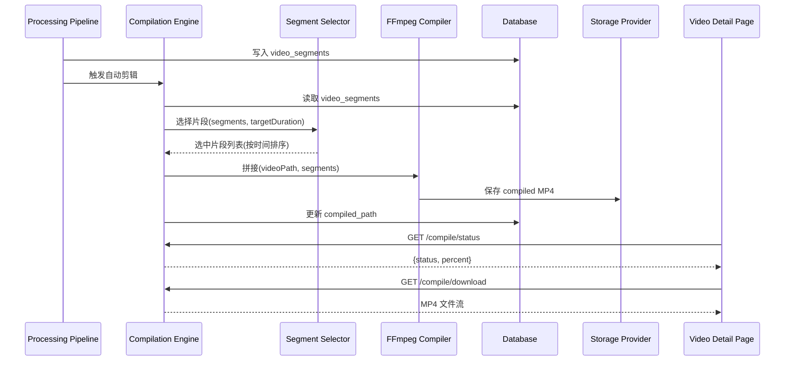
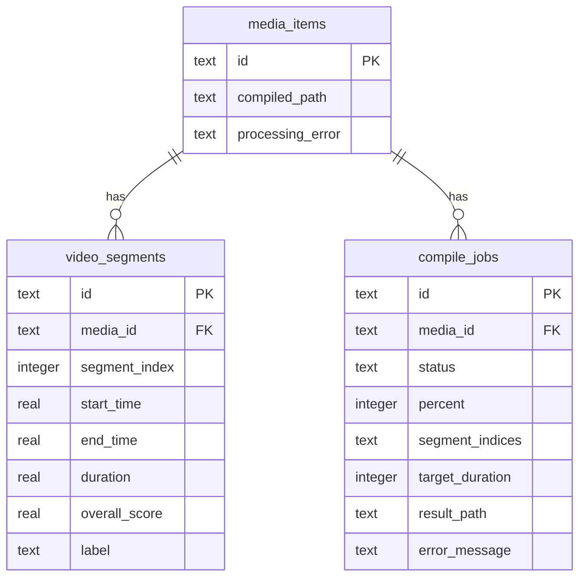

# 设计文档：自动视频剪辑 (Auto Video Compilation)

## 概述

本设计实现视频处理管线完成分片分析后，自动基于质量评分选择最佳片段并使用 FFmpeg 拼接生成精选视频摘要的功能。系统采用纯质量评分策略（`editPlanner.ts` 中的 `fallbackSelection`）进行片段选择，支持前端预览和手动调整后重新生成。

### 设计目标

1. **自动化**：视频分析完成后无需用户干预即可生成初步剪辑
2. **质量优先**：基于 overallScore 选择最佳片段，排除低质量内容
3. **可调整**：用户可手动选择片段并重新生成
4. **健壮性**：完善的错误处理、超时控制和资源清理机制
5. **兼容性**：输出标准 MP4/H.264/AAC 格式，适配所有设备

## 架构

### 系统架构图



### 数据流



## 组件与接口

### 1. CompilationEngine（编译引擎服务）

**文件路径**: `server/src/services/compilationEngine.ts`

```typescript
export interface CompileOptions {
  targetDuration?: number;       // 自定义目标时长 (10-600秒)
  segmentIndices?: number[];     // 用户指定的片段索引列表
  timeout?: number;              // 超时时间(毫秒)，默认 300000
}

export interface CompileResult {
  success: boolean;
  compiledPath: string | null;
  selectedSegments: number[];
  totalDuration: number;
  error?: string;
  warnings?: string[];           // 如：缺失片段的索引列表
}

export interface CompileJobStatus {
  jobId: string;
  mediaId: string;
  status: 'queued' | 'running' | 'completed' | 'failed';
  percent: number;
  error?: string;
  createdAt: string;
}

export class CompilationEngine {
  /**
   * 自动编译：基于质量评分自动选择片段并拼接
   */
  async autoCompile(mediaId: string, options?: CompileOptions): Promise<CompileResult>;

  /**
   * 手动编译：按用户指定的片段和顺序拼接
   */
  async manualCompile(mediaId: string, segmentIndices: number[], options?: CompileOptions): Promise<CompileResult>;

  /**
   * 获取编译任务状态
   */
  getJobStatus(mediaId: string): CompileJobStatus | null;
}
```

### 2. SegmentSelector（片段选择器）

**文件路径**: `server/src/services/segmentSelector.ts`

复用 `editPlanner.ts` 中的 `fallbackSelection` 函数，并增加以下逻辑：

```typescript
export interface SegmentCandidate {
  index: number;
  startTime: number;
  endTime: number;
  duration: number;
  overallScore: number;
  label: string;
}

export interface SelectionResult {
  selectedIndices: number[];
  totalDuration: number;
  skippedCount: number;
}

/**
 * 选择片段策略：
 * 1. 排除 severely_blurry/severely_shaky/severely_exposed 标签
 * 2. 排除 overallScore < 30 的片段
 * 3. 按 overallScore 降序排列
 * 4. 贪心累计选择直到达到 targetDuration
 * 5. 邻近片段优先（分差 ≤ 10 且时间间隔 ≤ 5s）
 * 6. 最终按 startTime 升序排列
 */
export function selectSegments(
  segments: SegmentCandidate[],
  targetDuration: number,
): SelectionResult;

/**
 * 计算目标时长：
 * - 原始时长 < 60s → null（不设上限）
 * - 60s ≤ 原始时长 ≤ 600s → 60s
 * - 原始时长 > 600s → 300s
 */
export function calculateTargetDuration(originalDuration: number): number | null;

/**
 * 验证 targetDuration 参数
 */
export function validateTargetDuration(value: unknown): { valid: boolean; error?: string };

/**
 * 验证 segmentIndices 参数
 */
export function validateSegmentIndices(
  indices: unknown,
  maxIndex: number,
): { valid: boolean; error?: string };
```

### 3. FFmpegCompiler（FFmpeg 拼接器）

**文件路径**: `server/src/services/ffmpegCompiler.ts`

```typescript
export interface CompilerOptions {
  memoryLimitMB?: number;        // 默认从 VIDEO_MEMORY_LIMIT_MB 读取
  timeoutMs?: number;            // 默认 300000 (300秒)
  maxResolution?: number;        // 默认 1080
}

export interface CompilerResult {
  outputPath: string | null;
  duration: number;
  error?: string;
  missingSegments?: number[];    // 缺失的片段索引
}

/**
 * 将多个视频片段拼接为单一 MP4 文件
 * - 输出格式: MP4/H.264/AAC
 * - 分辨率: 不超过 1080p，不放大
 * - 内存限制: VIDEO_MEMORY_LIMIT_MB 环境变量
 * - 超时: 300秒
 */
export async function compileSegments(
  videoPath: string,
  segments: Array<{ startTime: number; endTime: number; duration: number }>,
  outputDir: string,
  options?: CompilerOptions,
): Promise<CompilerResult>;
```

### 4. Compile API 路由

**文件路径**: `server/src/routes/compile.ts`

| 方法 | 路径 | 描述 |
|------|------|------|
| POST | `/api/media/:mediaId/compile` | 启动剪辑任务 |
| GET | `/api/media/:mediaId/compile/status` | 获取任务状态 |
| GET | `/api/media/:mediaId/compile/download` | 下载编译结果 |

### 5. 前端组件

**文件路径**: `client/src/components/CompilationPreview.tsx`

```typescript
export interface CompilationPreviewProps {
  mediaId: string;
  compiledPath: string | null;
  hasSegments: boolean;
  isProcessing: boolean;
}
```

该组件集成到视频详情页，根据状态展示不同 UI：
- 有 compiledPath → "剪辑预览"按钮
- 无 compiledPath + 有 segments → "生成剪辑"按钮
- 无 compiledPath + 无 segments → 不展示
- 正在处理 → 进度指示器

## 数据模型

### 数据库变更

#### media_items 表（已有 compiled_path 字段）

```sql
-- 已存在，无需新增
compiled_path TEXT  -- 编译后视频的存储路径
processing_error TEXT  -- 处理错误信息
```

#### 新增 compile_jobs 表

```sql
CREATE TABLE IF NOT EXISTS compile_jobs (
  id TEXT PRIMARY KEY,
  media_id TEXT NOT NULL,
  status TEXT NOT NULL DEFAULT 'queued',  -- queued, running, completed, failed
  percent INTEGER DEFAULT 0,
  segment_indices TEXT,                    -- JSON 数组: 选中的片段索引
  target_duration INTEGER,                 -- 目标时长(秒)
  result_path TEXT,                        -- 编译结果路径
  error_message TEXT,                      -- 错误信息(最大500字符)
  created_at TEXT NOT NULL,
  started_at TEXT,
  finished_at TEXT,
  FOREIGN KEY (media_id) REFERENCES media_items(id)
);

CREATE INDEX IF NOT EXISTS idx_compile_jobs_media ON compile_jobs(media_id);
CREATE UNIQUE INDEX IF NOT EXISTS idx_compile_jobs_active ON compile_jobs(media_id) WHERE status IN ('queued', 'running');
```

### 数据流转



## 正确性属性

*属性是在系统所有有效执行中都应成立的特征或行为——本质上是关于系统应该做什么的形式化陈述。属性是人类可读规范与机器可验证正确性保证之间的桥梁。*

### Property 1: 贪心评分选择与时长目标

*For any* 有效片段集合（overallScore ≥ 30 且非严重低质量标签）和目标时长 T，片段选择器应按 overallScore 降序贪心选择片段，直到累计时长 ≥ T；当可用片段总时长不足 T 时，应选择全部符合条件的片段。

**Validates: Requirements 1.2, 1.3, 6.3, 6.6, 3.2**

### Property 2: 严重低质量标签排除

*For any* 片段集合，选择结果中不应包含任何 label 为 "severely_blurry"、"severely_shaky" 或 "severely_exposed" 的片段。

**Validates: Requirements 1.5**

### Property 3: 低评分排除

*For any* 片段集合，选择结果中不应包含任何 overallScore < 30 的片段。

**Validates: Requirements 6.2**

### Property 4: 时间顺序输出

*For any* 选择结果，最终输出的片段列表应按 startTime 升序排列。

**Validates: Requirements 1.6, 6.4**

### Property 5: 短视频保留

*For any* 原始时长 < 60 秒的视频，若所有片段均未被标记为严重低质量，则不应生成 Compiled_Video（跳过编译）。

**Validates: Requirements 1.4, 3.3**

### Property 6: 目标时长参数验证

*For any* targetDuration 参数值，当且仅当该值为 [10, 600] 范围内的正整数时，系统应接受该参数；否则应返回参数错误。

**Validates: Requirements 3.5, 3.6, 7.5, 7.10**

### Property 7: 邻近片段优先

*For any* 两个候选片段，若其 overallScore 差值 ≤ 10 且 startTime 间隔 ≤ 5 秒，选择器应优先选择能形成连续区间的片段。

**Validates: Requirements 6.5**

### Property 8: 片段索引验证

*For any* segmentIndices 参数，系统应验证所有索引值在 [0, 片段总数-1] 范围内；空数组或包含无效索引时应返回参数错误。

**Validates: Requirements 7.4, 7.9**

### Property 9: 最大选择数量限制

*For any* 用户片段选择操作，选中片段数量不应超过 50 个。

**Validates: Requirements 5.3**

### Property 10: 错误信息截断

*For any* 编译失败产生的错误信息，写入 processing_error 字段的内容长度不应超过 500 字符。

**Validates: Requirements 8.3**

### Property 11: 输出时长约束

*For any* 自动编译结果，输出视频的总时长不应超过 Target_Duration 加上最后一个被选中片段的时长（即允许最后一个片段导致略微超出目标）。

**Validates: Requirements 3.7, 6.3**

## 错误处理

### 错误分类与处理策略

| 错误类型 | 触发条件 | 处理方式 |
|----------|----------|----------|
| 参数错误 | targetDuration 超范围、segmentIndices 无效 | 返回 HTTP 400 + 错误描述 |
| 资源不存在 | mediaId 不存在、无 segments 数据 | 返回 HTTP 404 |
| 并发冲突 | 已有活跃编译任务 | 返回 HTTP 409 |
| 无有效片段 | 所有片段被排除 | 设置 processing_error，不生成文件 |
| FFmpeg 错误 | 进程异常退出 | 终止进程、清理临时文件、记录错误 |
| FFmpeg 超时 | 超过 300 秒未完成 | 强制终止、清理、返回超时错误 |
| 片段文件缺失 | 部分源文件不可读 | 跳过缺失片段继续拼接（至少1个可用） |
| 全部文件缺失 | 所有源文件不可读 | 返回错误，不执行拼接 |
| 重新生成失败 | 手动编译时 FFmpeg 失败 | 保留原有 compiled_path 不变 |

### 资源清理机制

```typescript
// 确保临时文件在任何情况下都被清理
async function withTempDir<T>(
  prefix: string,
  fn: (tempDir: string) => Promise<T>,
): Promise<T> {
  const tempDir = fs.mkdtempSync(path.join(getTempDir(), prefix));
  try {
    return await fn(tempDir);
  } finally {
    try {
      fs.rmSync(tempDir, { recursive: true, force: true });
    } catch { /* ignore cleanup errors */ }
  }
}
```

### 错误信息截断

```typescript
function truncateError(message: string, maxLength: number = 500): string {
  if (message.length <= maxLength) return message;
  return message.slice(0, maxLength - 3) + '...';
}
```

## 测试策略

### 属性测试 (Property-Based Testing)

使用 `fast-check` 库进行属性测试，每个属性至少运行 100 次迭代。

**适用于属性测试的核心逻辑：**
- 片段选择算法（`selectSegments`）
- 参数验证函数（`validateTargetDuration`、`validateSegmentIndices`）
- 错误信息截断（`truncateError`）
- 目标时长计算（`calculateTargetDuration`）

**属性测试配置：**
- 库: `fast-check`
- 最小迭代次数: 100
- 标签格式: `Feature: auto-video-compilation, Property {number}: {property_text}`

### 单元测试

- 片段选择的具体场景（全部严重低质量、单个片段、恰好达到目标时长）
- FFmpeg 命令构建验证
- API 路由的请求/响应格式
- 前端组件的条件渲染逻辑

### 集成测试

- Pipeline 完成后自动触发编译的端到端流程
- FFmpeg 实际拼接（使用短测试视频）
- API 端到端调用（启动→轮询→下载）
- 重新生成时保留原文件的行为

### 测试文件结构

```
server/src/services/segmentSelector.test.ts        — 片段选择属性测试 + 单元测试
server/src/services/segmentSelector.property.test.ts — 纯属性测试
server/src/services/ffmpegCompiler.test.ts         — FFmpeg 编译器测试
server/src/services/compilationEngine.test.ts      — 编译引擎集成测试
server/src/routes/compile.test.ts                  — API 路由测试
client/src/components/CompilationPreview.test.tsx   — 前端组件测试
```
