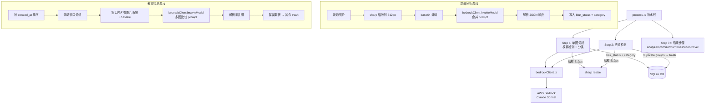

# 设计文档：Bedrock 图片分析

## 概述

本设计将当前基于传统算法（拉普拉斯方差模糊检测、pHash/dHash 去重、Rekognition 分类）的图片分析流水线替换为基于 AWS Bedrock Claude Sonnet 视觉模型的统一方案。核心思路是：

1. 新建 `bedrockClient.ts` 作为统一的 Bedrock API 封装层
2. 改造 `blurDetector.ts` 和 `imageClassifier.ts`，将模糊检测与分类合并为单次 Bedrock 调用
3. 改造 `dedupEngine.ts`，使用滑动窗口多图比较替代 pHash/dHash
4. 改造 `process.ts` 流水线，按新顺序集成各步骤

设计决策要点：
- 每张图片只调用一次 Bedrock（合并模糊+分类），降低成本和延迟
- 图片发送前缩放到 512px 长边，使用 sharp（项目已有依赖），控制 token 消耗
- 去重使用滑动窗口，每个窗口一次 Bedrock 调用，窗口内多图同时发送
- 所有 Bedrock 调用失败时 graceful fallback，不阻断流水线
- 使用 `@aws-sdk/client-bedrock-runtime`（需新增依赖），复用现有 AWS 凭证配置

## 架构



## 组件与接口

### 1. bedrockClient.ts（新建）

统一的 Bedrock API 封装，所有图片分析服务共享。

```typescript
// server/src/services/bedrockClient.ts

import {
  BedrockRuntimeClient,
  InvokeModelCommand,
} from '@aws-sdk/client-bedrock-runtime';

export interface BedrockInvokeOptions {
  images: Array<{ base64: string; mediaType: string }>;
  prompt: string;
  maxTokens?: number; // 默认 1024
}

export interface BedrockClient {
  invokeModel(options: BedrockInvokeOptions): Promise<string>;
}

export function createBedrockClient(): BedrockClient;
```

实现要点：
- 从 `AWS_ACCESS_KEY_ID`、`AWS_SECRET_ACCESS_KEY`、`S3_REGION || AWS_REGION` 读取凭证
- 模型 ID 使用 `anthropic.claude-sonnet-4-20250514`（可通过环境变量 `BEDROCK_MODEL_ID` 覆盖）
- 限流重试：捕获 `ThrottlingException`，指数退避（2^attempt 秒），最多 3 次
- `max_tokens` 默认 1024
- 支持单图和多图（`images` 数组），构建 Claude Messages API 的 `content` 数组

### 2. resizeForAnalysis 工具函数

在 `bedrockClient.ts` 中导出，或作为独立工具函数：

```typescript
export async function resizeForAnalysis(imagePath: string): Promise<string>;
```

- 使用 sharp 将图片缩放到长边 ≤ 512px，保持宽高比
- 输出 JPEG 格式，返回 base64 字符串
- 长边已 ≤ 512px 时不放大，直接编码
- 失败时抛出包含文件路径的异常

### 3. blurDetector.ts（改造）

保留 `detectBlurry(tripId)` 接口签名，内部改为调用合并分析。

改造后 `detectBlurry` 不再独立调用 Bedrock，而是由 `process.ts` 中的合并调用统一处理。`blurDetector.ts` 退化为纯数据库更新逻辑：

```typescript
export interface BlurResult {
  mediaId: string;
  blurStatus: 'clear' | 'blurry';
}

// 根据 Bedrock 返回的 blur_status 更新数据库
export function applyBlurResult(mediaId: string, blurStatus: 'clear' | 'blurry'): void;
```

### 4. imageClassifier.ts（改造）

保留 `ImageCategory` 类型，移除 Rekognition 依赖。改为接收 Bedrock 返回的分类结果：

```typescript
export type ImageCategory = 'people' | 'animal' | 'landscape' | 'other';

// 根据 Bedrock 返回的 category 更新数据库
export function applyClassifyResult(mediaId: string, category: ImageCategory): void;
```

### 5. dedupEngine.ts（改造）

保留 `deduplicate(tripId, options)` 接口签名，内部改为 Bedrock 滑动窗口比较：

```typescript
export interface SlidingWindowDedupOptions {
  windowSize?: number; // 默认 5，最大 10
}

export interface DedupResult {
  kept: string[];
  removed: string[];
  removedCount: number;
}

export async function deduplicate(
  tripId: string,
  options?: SlidingWindowDedupOptions
): Promise<DedupResult>;
```

实现要点：
- 按 `created_at` 升序查询 active 图片
- 滑动窗口大小默认 5，最大 10
- 每个窗口：所有图片缩放到 512px → base64 → 一次 Bedrock 调用
- Prompt 要求模型返回 `{ "duplicate_groups": [[0,2], [1,3]] }` 格式（索引数组）
- 每组保留 sharpness_score 最高的，其余 `status='trashed', trashed_reason='duplicate'`
- 解析失败或 API 失败：跳过该窗口，日志记录

### 6. process.ts 流水线改造

新的执行顺序：

```
Step 1: 单图分析（模糊+分类合并调用）
  - 遍历所有 active 图片
  - 每张：resizeForAnalysis → bedrockClient.invokeModel（合并 prompt）
  - 解析 JSON → applyBlurResult + applyClassifyResult
  - SSE 报告 'blurDetect' 步骤进度

Step 2: 去重检测
  - 调用 deduplicate(tripId, { windowSize })
  - SSE 报告 'dedup' 步骤进度

Step 3: analyze（图片特征分析，保持不变）
Step 4: optimize（图片优化，保持不变）
Step 5: thumbnail（缩略图生成，保持不变）
Step 6-7: video analysis/edit（保持不变）
Step 8: cover selection（保持不变）
```

注意：原来的 classify 步骤被合并到 Step 1，不再单独执行。SSE 步骤名保持兼容。

### 7. Prompt 设计

#### 单图分析 Prompt（模糊+分类合并）

```
Analyze this image and return a JSON object with exactly two fields:
1. "blur_status": "blurry" if the image is out of focus or has motion blur, "clear" otherwise. Note: dark or low-light images are NOT blurry unless they are actually out of focus.
2. "category": classify the main subject as one of: "people", "animal", "landscape", "other".
   - "people": humans are the main subject
   - "animal": animals are the main subject (including underwater marine life, even if divers are present)
   - "landscape": natural scenery, cityscapes, architecture with no prominent living subjects
   - "other": food, objects, abstract, etc.

Return ONLY a JSON object, no other text:
{"blur_status": "clear", "category": "landscape"}
```

#### 去重检测 Prompt

```
I'm showing you {N} images from a photo sequence. Identify which images are duplicate shots of the same scene (same location, same subject, just slightly different angle, timing, or framing).

Return a JSON object with a "duplicate_groups" field containing arrays of image indices (0-based) that are duplicates of each other. Only include groups with 2 or more images. Images that are unique should not appear in any group.

Return ONLY a JSON object, no other text:
{"duplicate_groups": [[0, 2], [3, 4, 5]]}

If no duplicates are found, return:
{"duplicate_groups": []}
```

## 数据模型

### 现有数据库字段（无需修改）

`media_items` 表已有所有需要的字段：

| 字段 | 类型 | 用途 |
|------|------|------|
| `blur_status` | TEXT | 'clear' / 'blurry' |
| `status` | TEXT | 'active' / 'trashed' / 'deleted' |
| `trashed_reason` | TEXT | 'blur' / 'duplicate' |
| `category` | TEXT | 'people' / 'animal' / 'landscape' / 'other' |
| `processing_error` | TEXT | 错误信息追加 |
| `sharpness_score` | REAL | 去重时用于选择最优图片 |
| `width` / `height` | INTEGER | 去重时用于分辨率比较 |

`media_tags` 表用于存储分类标签（`category:{分类名}`）。

### Bedrock API 响应格式

#### 单图分析响应

```typescript
interface SingleImageAnalysisResponse {
  blur_status: 'clear' | 'blurry';
  category: 'people' | 'animal' | 'landscape' | 'other';
}
```

#### 去重分析响应

```typescript
interface DedupAnalysisResponse {
  duplicate_groups: number[][]; // 每组为图片索引数组
}
```

### 环境变量（新增）

| 变量名 | 必需 | 默认值 | 说明 |
|--------|------|--------|------|
| `BEDROCK_MODEL_ID` | 否 | `anthropic.claude-sonnet-4-20250514` | Bedrock 模型 ID |
| `BEDROCK_MAX_TOKENS` | 否 | `1024` | 最大响应 token 数 |

复用现有变量：`AWS_ACCESS_KEY_ID`、`AWS_SECRET_ACCESS_KEY`、`S3_REGION`/`AWS_REGION`。


## 正确性属性（Correctness Properties）

*属性是在系统所有有效执行中都应成立的特征或行为——本质上是关于系统应该做什么的形式化陈述。属性是人类可读规范与机器可验证正确性保证之间的桥梁。*

### Property 1: 图片缩放输出有效性

*For any* 有效图片文件（任意宽高），`resizeForAnalysis` 的输出应满足：(a) 是有效的 base64 字符串，(b) 解码后是有效的 JPEG 图片，(c) 长边 ≤ 512 像素，(d) 宽高比与原图一致（误差 ≤ 1px 取整）。

**Validates: Requirements 2.1, 2.2, 2.3**

### Property 2: JSON 提取处理 markdown 代码块

*For any* 包含有效 JSON 的字符串（可能被 ` ```json ... ``` ` 或 ` ``` ... ``` ` 包裹，或无包裹），JSON 提取函数应正确解析出等价的 JSON 对象。

**Validates: Requirements 8.2**

### Property 3: 单图分析响应往返一致性

*For any* 有效的 `SingleImageAnalysisResponse`（blur_status ∈ {'clear','blurry'}，category ∈ {'people','animal','landscape','other'}），序列化为 JSON 字符串后再解析，应产生与原始对象等价的 blur_status 和 category 值。

**Validates: Requirements 5.3, 8.3, 8.5**

### Property 4: 去重响应解析正确性

*For any* 有效的去重 JSON 响应（包含 `duplicate_groups` 字段，值为索引数组的数组，索引范围在 [0, N-1]），解析函数应正确提取所有重复组，且每个组内的索引与原始响应一致。

**Validates: Requirements 6.4, 8.4**

### Property 5: 模糊状态决定正确的数据库状态转换

*For any* 媒体项和模糊检测结果，当 blur_status 为 'blurry' 时，该项的 status 应为 'trashed' 且 trashed_reason 应为 'blur'，同时 category 仍被记录；当 blur_status 为 'clear' 时，status 应保持 'active'。

**Validates: Requirements 3.3, 3.4, 5.4**

### Property 6: 分类结果写入 media_tags

*For any* 有效的分类结果（people/animal/landscape/other），`applyClassifyResult` 执行后，media_tags 表中应存在对应的 `category:{分类名}` 标签记录。

**Validates: Requirements 4.3**

### Property 7: 去重保留最优图片

*For any* 重复组（2+ 张图片，各有不同的 sharpness_score 和分辨率），去重后保留的图片应是 sharpness_score 最高的（sharpness 相近时取分辨率最高的），其余图片应被标记为 trashed。

**Validates: Requirements 6.5**

### Property 8: 限流重试行为

*For any* Bedrock API 调用序列，当遇到 ThrottlingException 时，客户端应重试最多 3 次，且每次重试间隔遵循指数退避（2^attempt 秒）。所有重试耗尽后应抛出包含原始错误信息的异常。

**Validates: Requirements 1.3, 1.4**

### Property 9: 滑动窗口构建正确性

*For any* 一组按 created_at 排序的图片和窗口大小参数 w，滑动窗口应：(a) 按时间顺序处理，(b) 实际窗口大小为 min(w, 10)（最大 10），(c) 默认窗口大小为 5，(d) 每个图片至少出现在一个窗口中。

**Validates: Requirements 6.1, 6.2**

### Property 10: 处理摘要计数一致性

*For any* 处理运行结果，`blurryDeletedCount` 应等于实际被标记为 `status='trashed', trashed_reason='blur'` 的图片数量，`dedupDeletedCount` 应等于实际被标记为 `status='trashed', trashed_reason='duplicate'` 的图片数量。

**Validates: Requirements 7.4**

## 错误处理

### 错误处理策略

| 场景 | 处理方式 | 影响范围 |
|------|----------|----------|
| Bedrock API 限流 | 指数退避重试 3 次 | 单次调用延迟 |
| Bedrock API 最终失败（单图分析） | blur_status='clear', category='other', 追加 processing_error | 单张图片 |
| Bedrock API 最终失败（去重窗口） | 跳过该窗口，日志记录 | 窗口内图片不做去重 |
| JSON 响应解析失败（单图） | blur_status='clear', category='other', 追加 processing_error | 单张图片 |
| JSON 响应解析失败（去重） | 跳过该窗口，日志记录 | 窗口内图片不做去重 |
| 图片缩放失败 | 跳过该图片，追加 processing_error | 单张图片 |
| 环境变量缺失 | 启动时抛出异常（AWS 凭证必需） | 整个服务 |

### 错误传播原则

1. 单张图片的失败不影响其他图片的处理
2. 单个去重窗口的失败不影响其他窗口
3. 所有错误追加到 `processing_error` 字段，带 `[bedrockBlur]`、`[bedrockClassify]`、`[bedrockDedup]` 前缀
4. 失败时默认值：blur_status='clear'（不误删）、category='other'（安全分类）

## 测试策略

### 属性测试（Property-Based Testing）

使用项目已有的 `fast-check` 库（见 server/package.json devDependencies）。

每个属性测试至少运行 100 次迭代。每个测试用注释标注对应的设计属性：

```typescript
// Feature: bedrock-image-analysis, Property 1: 图片缩放输出有效性
```

属性测试重点：
- Property 1: 生成随机宽高的图片 buffer，验证 resizeForAnalysis 输出
- Property 2: 生成随机 JSON 对象，随机包裹 markdown 代码块，验证提取
- Property 3: 生成随机 blur_status × category 组合，验证序列化往返
- Property 4: 生成随机索引数组，验证去重响应解析
- Property 5: 生成随机 blur_status，验证数据库状态转换
- Property 6: 生成随机 category，验证 tag 写入
- Property 7: 生成随机 sharpness/分辨率组合的图片组，验证保留最优
- Property 8: 模拟随机次数的限流错误，验证重试行为
- Property 9: 生成随机长度的图片列表和窗口大小，验证窗口构建
- Property 10: 模拟随机处理结果，验证摘要计数

### 单元测试

单元测试聚焦于具体示例和边界情况：

- bedrockClient: 请求构建格式正确、环境变量读取、max_tokens 设置
- resizeForAnalysis: 已小于 512px 的图片不放大、无效文件抛异常
- JSON 提取: 空字符串、无效 JSON、嵌套代码块
- 合并分析: 模型返回非 JSON 时的 fallback
- 去重: 空图片列表、单张图片、所有图片都不重复
- 流水线: SSE 事件顺序、处理失败时的跳过逻辑

### 测试配置

- 属性测试库: `fast-check`（已安装）
- 测试框架: `vitest`（已安装）
- 运行命令: `npm run test`（vitest --run）
- 每个属性测试最少 100 次迭代
- 每个属性测试必须用注释标注: `Feature: bedrock-image-analysis, Property {N}: {property_text}`
- 每个正确性属性由一个属性测试实现
