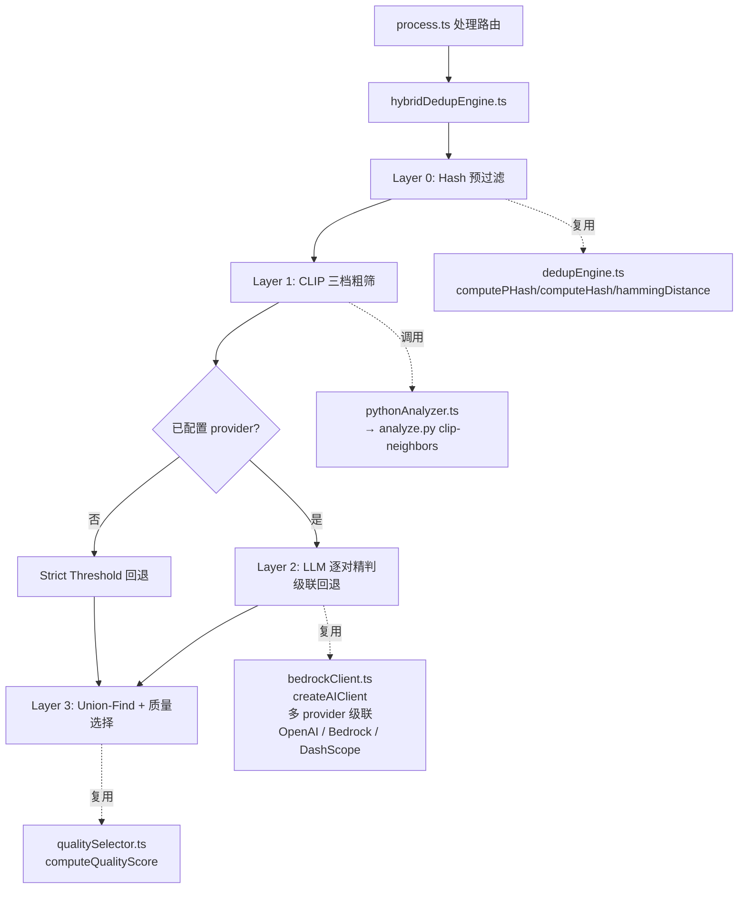
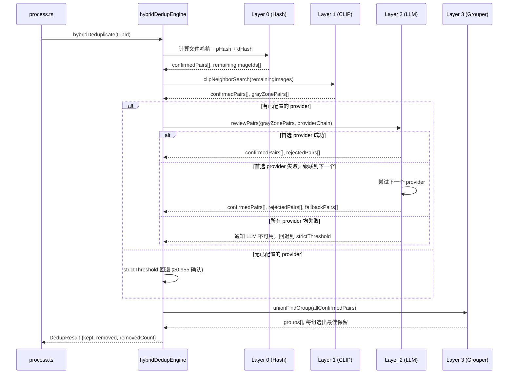
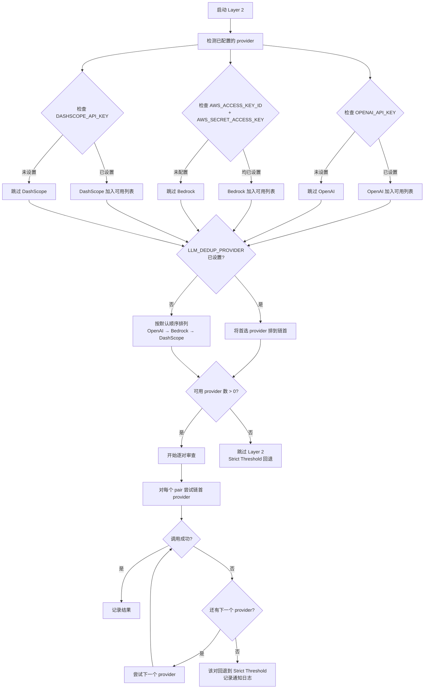

# 设计文档：四层混合去重流水线

## 概述

本设计实现一个四层递进式混合去重流水线，替代现有的单一去重引擎（`dedupEngine.ts` 或 `dedupEngine.bedrock.ts`）。四层流水线按成本从低到高依次执行：

1. **Layer 0 — Hash 预过滤**：文件哈希精确匹配 + pHash/dHash 极低汉明距离（≤4），零 AI 成本拦截明显重复
2. **Layer 1 — CLIP 三档粗筛**：Python 端提取 CLIP 嵌入向量，按三档阈值（≥0.94 确认、[0.90,0.94) 灰区、[0.85,0.90) 有条件灰区）输出候选对
3. **Layer 2 — LLM 逐对精判**：仅对灰区候选对调用多模态视觉模型做逐对审查，控制成本
4. **Layer 3 — Union-Find 分组 + 质量选择**：合并所有确认重复对为组，复用 `qualitySelector.ts` 选出最佳保留

### 设计决策

- **渐进式过滤**：每层只处理上一层未能确定的图片对，避免对所有图片调用昂贵的 AI 模型
- **复用现有基础设施**：Layer 0 复用 `dedupEngine.ts` 的 pHash/dHash 算法；Layer 1 复用 `pythonAnalyzer.ts` 的 Python 调用机制；Layer 2 复用 `bedrockClient.ts` 的 AI 客户端；Layer 3 复用 `qualitySelector.ts` 的质量评分
- **LLM 多 Provider 级联**：Layer 2 通过自动检测环境变量发现可用 provider（OpenAI / Bedrock / DashScope），支持 `LLM_DEDUP_PROVIDER` 指定首选 provider，失败时级联回退到其他已配置 provider，所有 provider 均失败时回退到严格阈值（0.955），保证基本去重能力。DashScope（千问 Qwen-VL）使用 OpenAI 兼容协议，通过 OpenAI SDK 配合自定义 base URL 调用
- **Python 端新增 `clip-neighbors` 子命令**：在 `analyze.py` 中新增子命令，提取 CLIP 嵌入并输出三档分层候选对，而非修改现有 `dedup` 子命令

## 架构

### 系统架构图



### 数据流图



## 组件与接口

### 文件结构

| 文件 | 操作 | 说明 |
|------|------|------|
| `server/src/services/hybridDedupEngine.ts` | 新建 | 四层流水线编排器 |
| `server/src/services/llmPairReviewer.ts` | 新建 | LLM 逐对审查服务 |
| `server/python/analyze.py` | 修改 | 新增 `clip-neighbors` 子命令 |
| `server/src/services/pythonAnalyzer.ts` | 修改 | 新增 `clipNeighborSearch()` 封装函数 |
| `server/src/routes/process.ts` | 修改 | 集成 hybridDedupEngine |
| `server/.env.example` | 修改 | 新增 `LLM_DEDUP_PROVIDER` 配置 |


### hybridDedupEngine.ts — 四层编排器

```typescript
import { DedupResult } from './dedupEngine';

export interface HybridDedupOptions {
  /** Layer 0: pHash/dHash 汉明距离阈值，默认 4 */
  hashHammingThreshold?: number;
  /** Layer 1: CLIP top-k 近邻数，默认 5 */
  clipTopK?: number;
  /** Layer 2: 首选 LLM provider（可选，从环境变量读取） */
  preferredProvider?: string;
}

/**
 * 四层混合去重入口。
 * 自动检测已配置的 LLM provider，支持级联回退。
 * 返回与现有 DedupResult 兼容的结果。
 */
export async function hybridDeduplicate(
  tripId: string,
  options?: HybridDedupOptions
): Promise<DedupResult>;
```

### llmPairReviewer.ts — LLM 逐对审查（多 Provider 级联）

```typescript
import { BedrockClient } from './bedrockClient';

export type LLMProviderType = 'bedrock' | 'openai' | 'dashscope';

export interface ProviderConfig {
  type: LLMProviderType;
  client: BedrockClient;
}

export interface PairReviewRequest {
  imageA: { id: string; filePath: string };
  imageB: { id: string; filePath: string };
  clipSimilarity: number;
}

export interface PairReviewResult {
  imageAId: string;
  imageBId: string;
  isDuplicate: boolean;
  confidence: number;
  /** 实际使用的 provider（如果 LLM 成功） */
  usedProvider?: LLMProviderType;
  /** 是否因所有 provider 失败而回退到 Strict Threshold */
  fellBackToThreshold?: boolean;
}

/**
 * 自动检测已配置的 LLM provider。
 * 检查 OpenAI 所需的 OPENAI_API_KEY，
 * Bedrock 所需的 AWS_ACCESS_KEY_ID 和 AWS_SECRET_ACCESS_KEY，
 * 以及 DashScope（千问）所需的 DASHSCOPE_API_KEY。
 * DashScope 使用 OpenAI 兼容协议（OpenAI SDK + 自定义 base URL）。
 * 返回按优先级排序的 provider 列表（首选 provider 排在最前）。
 * 默认级联顺序：OpenAI → Bedrock → DashScope。
 */
export function detectConfiguredProviders(
  preferredProvider?: string
): ProviderConfig[];

/**
 * 对一组灰区候选对逐对调用 LLM 视觉模型审查。
 * 支持多 provider 级联回退：首选 provider 失败时尝试下一个，
 * 所有 provider 均失败时对该对回退到 Strict Threshold。
 * 
 * DashScope（千问）provider 使用 OpenAI SDK 创建客户端：
 *   new OpenAI({
 *     apiKey: process.env.DASHSCOPE_API_KEY,
 *     baseURL: process.env.DASHSCOPE_BASE_URL || 'https://dashscope.aliyuncs.com/compatible-mode/v1'
 *   })
 * 模型默认为 process.env.DASHSCOPE_MODEL || 'qwen-vl-max'。
 * 
 * 返回每对的判定结果。
 */
export async function reviewPairs(
  pairs: PairReviewRequest[],
  providerChain: ProviderConfig[]
): Promise<PairReviewResult[]>;
```

### pythonAnalyzer.ts — 新增 clipNeighborSearch

```typescript
export interface ClipCandidatePair {
  i: number;           // 图片索引 A
  j: number;           // 图片索引 B
  similarity: number;  // CLIP 余弦相似度
  tier: 'confirmed' | 'gray';  // 所属档位
}

export interface ClipNeighborResult {
  confirmedPairs: ClipCandidatePair[];
  grayZonePairs: ClipCandidatePair[];
  embeddingTimeMs: number;
  totalTimeMs: number;
}

/**
 * 调用 Python analyze.py clip-neighbors 子命令。
 * 输入：图片路径列表 + pHash/dHash 数据（用于 [0.85,0.90) 条件判断）
 * 输出：三档分层候选对列表
 */
export async function clipNeighborSearch(
  imagePaths: string[],
  hashData: Record<number, { pHash: string | null; dHash: string | null; seqIndex: number }>,
  options?: { modelDir?: string; topK?: number }
): Promise<ClipNeighborResult>;
```

### analyze.py — 新增 clip-neighbors 子命令

```python
def cmd_clip_neighbors(args):
    """提取 CLIP 嵌入并按三档阈值输出候选对。
    
    输入：
      --images: 图片路径列表
      --model-dir: 模型目录
      --top-k: 近邻数（默认 5）
      --hash-data: JSON 字符串，包含每张图片的 pHash、dHash 和序列位置
    
    输出 JSON：
      {
        "confirmed_pairs": [{"i": 0, "j": 1, "similarity": 0.96}],
        "gray_zone_pairs": [{"i": 2, "j": 3, "similarity": 0.91}],
        "embedding_time_ms": 1234,
        "total_time_ms": 2345
      }
    
    三档阈值逻辑：
      ≥ 0.94 → confirmed_pairs（直接确认重复）
      [0.90, 0.94) 且 top-k 邻居数 ≤ 5 → gray_zone_pairs
      [0.85, 0.90) 且 abs(i-j) ≤ 12 且 (pHash ≤ 16 或 dHash ≤ 16) → gray_zone_pairs
      < 0.85 → 跳过
    """
```

## 数据模型

### 内部数据流类型

```typescript
/** Layer 0 输出 */
interface Layer0Result {
  /** 文件哈希/pHash/dHash 确认的重复对 */
  confirmedPairs: Array<{ i: number; j: number }>;
  /** 未被 Layer 0 拦截的图片索引列表 */
  remainingIndices: number[];
}

/** Layer 1 输出 */
interface Layer1Result {
  /** CLIP ≥ 0.94 直接确认的重复对 */
  confirmedPairs: ClipCandidatePair[];
  /** 灰区候选对（需 Layer 2 或 Strict Threshold 判定） */
  grayZonePairs: ClipCandidatePair[];
}

/** Layer 2 输出 */
interface Layer2Result {
  /** LLM 确认为重复的对 */
  confirmedPairs: Array<{ i: number; j: number }>;
  /** LLM 判定为非重复的对 */
  rejectedPairs: Array<{ i: number; j: number }>;
  /** 所有 provider 均失败，回退到 Strict Threshold 的对 */
  fallbackPairs: Array<{ i: number; j: number; confirmed: boolean }>;
  /** 是否所有对的 LLM 调用均失败 */
  allLLMFailed: boolean;
  /** LLM 不可用通知消息（仅当 allLLMFailed 为 true 时） */
  llmUnavailableNotice?: string;
}

/** Layer 3 输出 — 重复组 */
interface DedupGroup {
  /** 组内所有图片索引 */
  indices: number[];
  /** 选中保留的图片索引 */
  keepIndex: number;
}

/** 图片行数据（从数据库查询） */
interface ImageRow {
  id: string;
  file_path: string;
  original_filename: string;
  sharpness_score: number | null;
  width: number | null;
  height: number | null;
  file_size: number;
  status: string;
  trashed_reason: string | null;
  created_at: string;
}
```

### Union-Find 实现

Layer 3 使用 TypeScript 实现的 Union-Find（并查集）算法，将所有层级的 `confirmedPairs` 合并为连通分量：

```typescript
class UnionFind {
  private parent: number[];
  private rank: number[];

  constructor(n: number) {
    this.parent = Array.from({ length: n }, (_, i) => i);
    this.rank = new Array(n).fill(0);
  }

  find(x: number): number {
    if (this.parent[x] !== x) {
      this.parent[x] = this.find(this.parent[x]);
    }
    return this.parent[x];
  }

  union(x: number, y: number): void {
    const px = this.find(x);
    const py = this.find(y);
    if (px === py) return;
    if (this.rank[px] < this.rank[py]) {
      this.parent[px] = py;
    } else if (this.rank[px] > this.rank[py]) {
      this.parent[py] = px;
    } else {
      this.parent[py] = px;
      this.rank[px]++;
    }
  }
}
```

### 环境变量配置

在 `.env.example` 中新增：

```dotenv
# ========== LLM 去重配置 ==========
# 系统会自动检测已配置的 LLM provider（检测到哪个就用哪个）：
#   - OpenAI: 需要 OPENAI_API_KEY
#   - Bedrock (Claude/Nova): 需要 AWS_ACCESS_KEY_ID + AWS_SECRET_ACCESS_KEY
#   - DashScope (千问): 需要 DASHSCOPE_API_KEY

# 首选 LLM provider（可选）: openai / bedrock / dashscope / 留空（自动选择）
# 指定后该 provider 会作为级联链中的第一个尝试
# 留空时系统按默认顺序自动选择：OpenAI → Bedrock → DashScope
# LLM_DEDUP_PROVIDER=

# --- OpenAI (GPT-4.1 mini / GPT-4.1) ---
# 自动检测条件：OPENAI_API_KEY 已设置
# OPENAI_API_KEY=sk-your-openai-api-key
# OPENAI_MODEL=gpt-4.1-mini

# --- AWS Bedrock (Claude Sonnet / Nova) ---
# 自动检测条件：AWS_ACCESS_KEY_ID 和 AWS_SECRET_ACCESS_KEY 均已设置
# 复用上方 S3 存储的 AWS 凭证（AWS_ACCESS_KEY_ID、AWS_SECRET_ACCESS_KEY、S3_REGION）
# BEDROCK_MODEL_ID=anthropic.claude-sonnet-4-20250514-v1:0

# --- 阿里云 DashScope (千问 Qwen-VL) ---
# 自动检测条件：DASHSCOPE_API_KEY 已设置
# DashScope API 兼容 OpenAI 协议，使用 OpenAI SDK 配合自定义 base URL 调用
# DASHSCOPE_API_KEY=sk-your-dashscope-api-key
# DASHSCOPE_MODEL=qwen-vl-max
# DASHSCOPE_BASE_URL=https://dashscope.aliyuncs.com/compatible-mode/v1
```

### Provider 自动检测与级联逻辑




## 正确性属性

*属性（Property）是指在系统所有合法执行中都应成立的特征或行为——本质上是对系统应做什么的形式化陈述。属性是人类可读规格说明与机器可验证正确性保证之间的桥梁。*

### Property 1: Layer 0 哈希分类正确性

*对于任意*两张图片及其文件哈希、pHash 和 dHash，当文件哈希完全相同，或 pHash 汉明距离 ≤ 4 且 dHash 汉明距离 ≤ 4 时，Layer 0 应将该对标记为 Confirmed_Pair；否则该对不应被 Layer 0 确认。

**Validates: Requirements 1.2, 1.3**

### Property 2: Layer 0 输出完整性不变量

*对于任意*一组图片经过 Layer 0 处理后，confirmedPairs 中的所有图片索引与 remainingIndices 的并集应等于原始图片索引集合，且两者无交集（即每张图片要么在确认对中，要么在剩余列表中）。

**Validates: Requirements 1.4**

### Property 3: CLIP 三档分层分类正确性

*对于任意*一对图片及其 CLIP 余弦相似度、序列位置差和 pHash/dHash 距离：
- 相似度 ≥ 0.94 → 必须归入 confirmed
- 相似度 ∈ [0.90, 0.94) 且 top-k 邻居数 ≤ 5 → 必须归入 gray
- 相似度 ∈ [0.85, 0.90) 且 abs(i-j) ≤ 12 且 (pHash ≤ 16 或 dHash ≤ 16) → 必须归入 gray
- 相似度 < 0.85 → 不应出现在任何输出列表中

**Validates: Requirements 2.3, 2.4, 2.5, 2.6**

### Property 4: LLM 响应映射正确性

*对于任意* LLM 返回的 JSON 判定结果，当 `is_duplicate` 为 true 时该对应被标记为 Confirmed_Pair，当 `is_duplicate` 为 false 时该对应被保留不做去重处理。映射结果应与 `is_duplicate` 字段值严格一致。

**Validates: Requirements 3.3, 3.4**

### Property 5: LLM 响应 JSON 解析往返

*对于任意*合法的 `{is_duplicate: boolean, confidence: number}` JSON 对象，序列化为字符串后再解析应得到等价的对象。

**Validates: Requirements 3.2**

### Property 6: 严格阈值回退正确性

*对于任意*灰区候选对（在无已配置 provider、或所有 provider 对该对均调用失败时），当其 CLIP 余弦相似度 ≥ 0.955 时应被标记为 Confirmed_Pair，当相似度 < 0.955 时应被保留不做去重处理。

**Validates: Requirements 4.1, 4.2, 4.3, 6.7, 6.8**

### Property 7: Union-Find 分组正确性

*对于任意*一组 Confirmed_Pair，Union-Find 合并后产生的重复组应满足：(a) 同一组内任意两个元素之间存在一条由 Confirmed_Pair 构成的路径；(b) 不同组的元素之间不存在 Confirmed_Pair 连接。即分组结果等价于确认对图的连通分量。

**Validates: Requirements 5.1**

### Property 8: 质量选择与状态更新正确性

*对于任意*重复组及其成员的质量评分，选出的最佳保留图片应是组内质量评分最高的（按清晰度 → 分辨率 → 文件大小 → 序列最早的优先级）。组内所有非最佳图片若状态为 active 则应变为 trashed（reason='duplicate'），若已为 trashed 则 reason 应追加 ',duplicate'。

**Validates: Requirements 5.2, 5.3**

### Property 9: DedupResult 接口不变量

*对于任意*一次混合去重执行，返回的 DedupResult 应满足：`removedCount === removed.length`，且 `kept` 与 `removed` 无交集，且 `kept.length + removed.length` 等于输入图片总数。

**Validates: Requirements 7.3**

### Property 10: Provider 自动检测正确性

*对于任意*环境变量组合，`detectConfiguredProviders()` 返回的 provider 列表应满足：(a) 当 `OPENAI_API_KEY` 已设置时，列表中应包含 `openai`；(b) 当 `AWS_ACCESS_KEY_ID` 和 `AWS_SECRET_ACCESS_KEY` 均已设置时，列表中应包含 `bedrock`；(c) 当 `DASHSCOPE_API_KEY` 已设置时，列表中应包含 `dashscope`；(d) 当某 provider 的必需环境变量缺失时，该 provider 不应出现在列表中。

**Validates: Requirements 6.1, 6.2**

### Property 11: Provider 链排序正确性

*对于任意*已配置的 provider 列表和首选 provider 设置，当 `LLM_DEDUP_PROVIDER` 指定的 provider 存在于已配置列表中时，该 provider 应排在链首；其余 provider 的相对顺序不变。

**Validates: Requirements 6.3, 6.4**

### Property 12: 级联回退正确性

*对于任意* provider 链和任意 Gray_Zone_Pair，当链中第 k 个 provider 调用失败时，系统应尝试第 k+1 个 provider；当某个 provider 成功时，应使用该 provider 的结果且不再尝试后续 provider。

**Validates: Requirements 3.5, 6.6**

### Property 13: 全 Provider 失败降级正确性

*对于任意* Gray_Zone_Pair，当所有已配置的 provider 对该对均调用失败时，该对应回退到 Strict_Threshold（0.955）判定，且系统应记录通知日志。判定结果应与 Property 6 的严格阈值回退一致。

**Validates: Requirements 3.6, 6.8**

## 错误处理

### 各层级错误处理策略

| 层级 | 错误场景 | 处理策略 |
|------|----------|----------|
| Layer 0 | 单张图片哈希计算失败 | 跳过该图片的 Layer 0 配对，将其传递给 Layer 1 |
| Layer 0 | 文件读取失败 | 同上，记录 warning 日志 |
| Layer 1 | Python 进程启动失败 | 整体回退到现有 pHash/dHash 去重引擎 |
| Layer 1 | 单张图片 CLIP 嵌入提取失败 | 跳过该图片的配对，stderr 输出错误日志 |
| Layer 1 | Python 进程超时（300s） | 整体回退到现有 pHash/dHash 去重引擎 |
| Layer 2 | 单对 LLM 首选 provider 调用失败 | 级联到下一个已配置的 provider |
| Layer 2 | 单对所有 provider 均调用失败 | 放弃该对 LLM 判定，记录通知日志，回退到 Strict_Threshold（0.955）判定 |
| Layer 2 | LLM 返回非法 JSON | 当前 provider 视为失败，级联到下一个 provider |
| Layer 2 | 所有 Gray_Zone_Pair 的所有 provider 均失败 | 输出基于 Strict_Threshold 的初步 CLIP 结果，附带 LLM 不可用通知 |
| Layer 2 | 首选 provider 环境变量未配置 | 记录 warning 日志，使用其他已检测到的 provider |
| Layer 2 | 无任何 provider 环境变量配置 | 跳过 Layer 2，所有灰区对使用 Strict_Threshold |
| Layer 2 | DashScope API 返回 InvalidApiKey | 当前 provider 视为失败，级联到下一个 provider |
| Layer 2 | DashScope API 返回模型不可用 | 当前 provider 视为失败，级联到下一个 provider |
| Layer 3 | 质量评分计算失败 | 使用默认评分 0，保留序列中最早的图片 |

### 回退链

```
hybridDeduplicate()
  ├─ Python 可用 → 四层流水线
  │   ├─ Layer 2 有已配置 provider → 级联 LLM 审查
  │   │   ├─ 首选 provider 成功 → 使用结果
  │   │   ├─ 首选 provider 失败 → 尝试下一个 provider
  │   │   │   ├─ 下一个 provider 成功 → 使用结果
  │   │   │   └─ 所有 provider 均失败 → 该对 Strict Threshold 回退 + 通知日志
  │   │   └─ 所有对的所有 provider 均失败 → 输出初步 CLIP 结果 + LLM 不可用通知
  │   └─ Layer 2 无已配置 provider → Strict Threshold 回退
  └─ Python 不可用 → 现有 pHash/dHash 去重引擎 (dedupEngine.ts)
```

## 测试策略

### 属性测试（Property-Based Testing）

使用 `fast-check` 库进行属性测试，每个属性测试至少运行 100 次迭代。

每个测试必须用注释标注对应的设计属性：
- 格式：`Feature: hybrid-dedup, Property {number}: {property_text}`

| 属性 | 测试文件 | 生成器 |
|------|----------|--------|
| Property 1: Layer 0 哈希分类 | `hybridDedupEngine.test.ts` | 生成随机 16 字符 hex 哈希对，控制汉明距离 |
| Property 2: Layer 0 输出完整性 | `hybridDedupEngine.test.ts` | 生成随机图片索引集合和确认对 |
| Property 3: CLIP 三档分类 | `hybridDedupEngine.test.ts` | 生成随机相似度值 [0, 1]、序列位置、哈希距离 |
| Property 4: LLM 响应映射 | `llmPairReviewer.test.ts` | 生成随机 `{is_duplicate, confidence}` 对象 |
| Property 5: JSON 解析往返 | `llmPairReviewer.test.ts` | 生成随机合法 JSON 对象 |
| Property 6: 严格阈值回退 | `hybridDedupEngine.test.ts` | 生成随机相似度值和灰区对 |
| Property 7: Union-Find 分组 | `hybridDedupEngine.test.ts` | 生成随机边集（确认对），验证连通分量 |
| Property 8: 质量选择 | `hybridDedupEngine.test.ts` | 生成随机质量评分的图片组 |
| Property 9: DedupResult 不变量 | `hybridDedupEngine.test.ts` | 生成随机图片集合，mock 各层输出 |
| Property 10: Provider 自动检测 | `llmPairReviewer.test.ts` | 生成随机环境变量组合（OpenAI key 有/无 × AWS 凭证有/无 × DashScope key 有/无） |
| Property 11: Provider 链排序 | `llmPairReviewer.test.ts` | 生成随机已配置 provider 列表和首选 provider |
| Property 12: 级联回退 | `llmPairReviewer.test.ts` | 生成随机 provider 链和随机失败模式（每个 provider 成功/失败） |
| Property 13: 全 Provider 失败降级 | `llmPairReviewer.test.ts` | 生成随机灰区对和全失败 provider 链，验证 Strict Threshold 回退 |

### 单元测试

单元测试聚焦于具体示例和边界情况：

- **Layer 0 边界**：汉明距离恰好为 4 和 5 的边界测试
- **CLIP 阈值边界**：相似度恰好为 0.85、0.90、0.94 的边界测试
- **LLM 错误处理**：模拟 LLM 返回非法 JSON、超时、网络错误
- **级联回退**：首选 provider 失败后成功切换到备选 provider
- **全 provider 失败**：所有 provider 均失败时正确回退到 Strict Threshold 并输出通知
- **Provider 自动检测**：各种环境变量组合下的 provider 检测（仅 OpenAI、仅 Bedrock、仅 DashScope、两两组合、三者均有、三者均无）
- **首选 provider 配置**：`LLM_DEDUP_PROVIDER` 设置为 `openai`/`bedrock`/`dashscope`/未配置/无效值时的行为
- **DashScope 客户端创建**：验证 DashScope 使用 OpenAI SDK 配合自定义 base URL（`DASHSCOPE_BASE_URL`）创建客户端
- **空输入**：0 张图片、1 张图片的去重
- **全重复**：所有图片都是重复的极端情况
- **已回收图片**：trashed 状态图片的 reason 追加逻辑
- **环境变量**：`LLM_DEDUP_PROVIDER` 各种值（`openai`/`bedrock`/`dashscope`/空/无效）的解析测试，自动检测逻辑测试
- **Python 不可用回退**：验证回退到 pHash/dHash 引擎

### 集成测试

- 完整四层流水线端到端测试（使用 mock LLM 和真实 Python CLIP）
- `process.ts` 路由集成测试，验证 SSE 进度报告
- 与现有 `dedupEngine.ts` 结果对比测试
