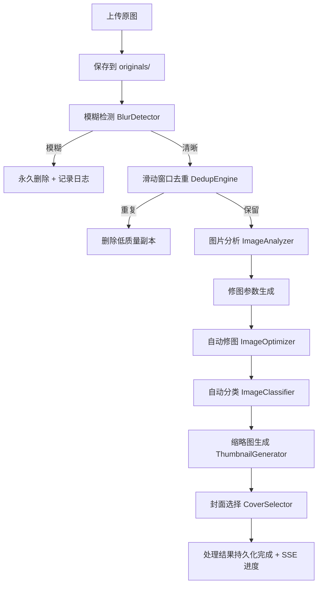
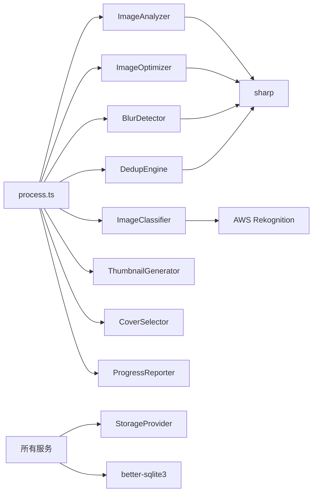

# 设计文档：图片处理流水线 V3

## 概述

本设计对现有图片处理流水线进行全面重构，将当前分散的处理步骤整合为一条严格有序的流水线：

**原图保存 → 模糊检测 → 去重 → 图片分析 → 修图参数生成 → 自动修图 → 自动分类 → 缩略图生成 → 封面选择 → 处理结果持久化完成**

> **说明**：各步骤在执行过程中逐步将结果写入数据库（如分析字段、optimized_path、category 等），最后一步"处理结果持久化完成"指的是所有步骤执行完毕、最终状态汇总确认，而非集中一次性写库。

### 核心变更

1. **模糊检测前置**：模糊图片在去重之前永久删除（非移入回收站），减少后续处理量
2. **滑动窗口去重**：替换现有的全局聚类去重，改为滑动窗口（默认 N=10）+ 汉明距离阈值（默认 5），保留规则基于清晰度 → 分辨率 → 序列顺序
3. **图片分析 + 自适应修图**：新增 ImageAnalyzer 服务分析亮度/对比度/色偏/噪点，ImageOptimizer 根据分析结果自适应调参，替换现有的固定参数优化
4. **AWS Rekognition 分类**：新增 ImageClassifier 服务，使用 detectLabels API 将图片分为 people/animal/landscape/other，优先级：人物 > 动物 > 风景 > 其他
5. **前端分类标签页**：GalleryPage 新增分类标签页（全部 | 风景 | 动物 | 人物 | 其他），支持按分类筛选

### 设计决策

- **模糊检测改为永久删除**：V2 中模糊图片移入回收站，但实际使用中用户几乎不会恢复模糊图片。永久删除简化了数据流，同时保留删除日志用于审计。
- **滑动窗口替代全局聚类**：全局聚类（exemplar clustering + pre-bucketing）在大量图片时计算量大且容易产生链式漂移。滑动窗口更适合连续拍摄场景，复杂度从 O(n²) 降为 O(n·W)。
- **自适应修图替代固定参数**：现有 imageOptimizer 对所有图片使用相同的 gamma/clahe/sharpen 参数，暗图和亮图处理效果差异大。新方案先分析再决定是否/如何调整。
- **Rekognition 而非本地模型**：项目已使用 AWS S3 存储，Rekognition 集成成本低，且 detectLabels 精度高于轻量级本地模型。

## 架构

### 流水线架构图



### 服务依赖关系



## 组件与接口

### 1. BlurDetector（重构）

**文件**: `server/src/services/blurDetector.ts`

**变更**: 模糊图片从"移入回收站"改为"永久删除"，新增删除日志记录。

```typescript
interface BlurDeleteLog {
  mediaId: string;
  filename: string;
  sharpnessScore: number;
  reason: string;
  deletedAt: string;
}

interface BlurDetectResult {
  blurryCount: number;
  suspectCount: number;
  deleteLogs: BlurDeleteLog[];
  results: BlurResult[];
}
```

**关键变更**:
- `detectBlurry()` 中模糊图片不再 `status = 'trashed'`，而是直接从 `media_items` 表删除记录，并从存储中删除文件
- 新增 `deleteLogs` 数组记录每张被删除图片的信息
- 阈值改为单一阈值（默认 50），低于阈值即为模糊，不再使用 soft/hard 双阈值
- 检测出错时标记为 suspect 状态，不删除

> **永久删除执行顺序**: 先删除数据库记录（`DELETE FROM media_items`），再删除存储文件（`storageProvider.delete()`）。原因：如果先删文件后删 DB 失败，会出现"DB 有记录但文件不存在"的孤儿记录，后续所有读取该图片的操作都会报错；而先删 DB 后删文件失败，最坏情况是存储中残留一个无引用的文件（孤儿文件），不影响业务逻辑，可通过定期清理脚本回收。去重删除同理。

### 2. DedupEngine（重构）

**文件**: `server/src/services/dedupEngine.ts`

**变更**: 从全局 exemplar clustering 改为滑动窗口去重。

```typescript
interface SlidingWindowDedupOptions {
  windowSize?: number;         // 默认 10
  hammingThreshold?: number;   // 默认 5（汉明距离，0-64）
}

interface DedupResult {
  kept: string[];              // 保留的 mediaId 列表
  removed: string[];           // 被删除的 mediaId 列表
  removedCount: number;
}
```

**算法**:
1. 按 `created_at` 排序获取所有存活图片
2. 为每张图片计算 pHash（复用现有 `computePHash`）
3. 对每张图片 i，与 i+1 到 i+windowSize 的图片比较汉明距离
4. 若距离 ≤ hammingThreshold，判定为重复对
5. 保留规则：① 清晰度分数更高 ② 清晰度接近（差值 < 10）则保留分辨率更高 ③ 仍相同则保留序列靠前的
6. 被淘汰的图片永久删除（从存储和数据库中移除）

### 3. ImageAnalyzer（新增）

**文件**: `server/src/services/imageAnalyzer.ts`

```typescript
interface ImageAnalysis {
  avgBrightness: number;    // 0-255，RGB 通道均值的平均
  contrastLevel: number;    // 标准差，0-128
  colorCastR: number;       // R 通道均值与总均值的偏差
  colorCastG: number;       // G 通道均值与总均值的偏差
  colorCastB: number;       // B 通道均值与总均值的偏差
  noiseLevel: number;       // 高频比率，0-1+
}

async function analyzeImage(imagePath: string): Promise<ImageAnalysis>;
async function analyzeTrip(tripId: string): Promise<void>;
```

**实现**: 使用 `sharp.stats()` 获取各通道的 mean 和 stdev，计算亮度、对比度、色偏。噪点使用现有 qualitySelector 中的拉普拉斯方差比率方法。

### 4. ImageOptimizer（重构）

**文件**: `server/src/services/imageOptimizer.ts`

**变更**: 从固定参数优化改为基于 ImageAnalyzer 结果的自适应优化。

```typescript
interface OptimizeParams {
  gammaCorrection?: number;     // gamma 值，仅暗图/亮图时设置
  claheEnabled?: boolean;       // 仅暗图时启用
  claheOptions?: { width: number; height: number; maxSlope: number };
  tintCorrection?: { r: number; g: number; b: number };  // 色偏矫正
  sharpenSigma?: number;        // 锐化强度
  medianFilter?: number;        // 噪点抑制（中值滤波核大小）
}

function computeOptimizeParams(analysis: ImageAnalysis): OptimizeParams;
async function optimizeImage(imagePath: string, tripId: string, mediaId: string, params: OptimizeParams): Promise<string>;
```

**自适应规则**（默认轻处理，必要时才增强）:
- 亮度 < 90: gamma(1.1)，仅当对比度也偏低（< 40）时才额外启用 clahe（maxSlope: 1.5）
- 亮度 > 170: gamma(0.9)
- 亮度 90-170: 跳过亮度校正
- 对比度 < 40 且亮度正常: clahe（maxSlope: 1.5）增强
- 对比度 > 80: 轻微降低
- 对比度 40-80: 跳过
- 色偏偏差 ≥ 10: 使用 tint 矫正
- 噪点 ≥ 0.3 且噪点 < 0.6: median(3) 保守降噪，同时降低锐化强度至 sigma: 0.3
- 噪点 ≥ 0.6: 跳过锐化，仅 median(3) 降噪
- 噪点 < 0.3: sharpen(sigma: 0.45) 轻度锐化

> **注意**: CLAHE 不适用于所有暗图（如水下、雾感、颗粒重的场景），因此仅在亮度和对比度同时偏低时才启用。高噪点图片降低或跳过锐化，避免放大噪点。

> **实现映射说明**: `OptimizeParams` 中的参数为业务层抽象，具体落地时需与 sharp 实际支持的 API 做一一映射。例如 `tintCorrection` 映射到 `sharp.tint()`，`medianFilter` 映射到 `sharp.median()`，`gammaCorrection` 映射到 `sharp.gamma()`。

### 5. ImageClassifier（新增）

**文件**: `server/src/services/imageClassifier.ts`

```typescript
import { RekognitionClient, DetectLabelsCommand } from '@aws-sdk/client-rekognition';

type ImageCategory = 'people' | 'animal' | 'landscape' | 'other';

interface ClassifyResult {
  category: ImageCategory;
  allCategories: ImageCategory[];  // 所有匹配的分类
  labels: string[];                // Rekognition 返回的原始标签
}

const PEOPLE_LABELS = ['Person', 'Human', 'Face', 'People', 'Man', 'Woman', 'Child', 'Boy', 'Girl'];
const ANIMAL_LABELS = ['Dog', 'Cat', 'Bird', 'Animal', 'Pet', 'Wildlife', 'Fish', 'Mammal', 'Reptile', 'Insect'];
const LANDSCAPE_LABELS = ['Mountain', 'Beach', 'Sky', 'Ocean', 'Forest', 'Lake', 'River', 'Sunset', 'Sunrise', 'Nature', 'Scenery', 'Landscape', 'Sea', 'Cloud', 'Field', 'Valley', 'Waterfall', 'Desert'];

// 优先级: people > animal > landscape > other
function mapLabelsToCategory(labels: string[]): ClassifyResult;
async function classifyImage(imageBuffer: Buffer): Promise<ClassifyResult>;
async function classifyTrip(tripId: string): Promise<void>;
```

**依赖**: 需要新增 `@aws-sdk/client-rekognition` 依赖。项目已有 `@aws-sdk/client-s3`，AWS 凭证可复用。

### 6. ProgressReporter（更新）

**文件**: `server/src/services/progressReporter.ts`

**变更**: 更新步骤列表以匹配新流水线顺序。

```typescript
type StepName = 'originalSave' | 'blurDetect' | 'dedup' | 'analyze' | 'optimize' | 'classify' | 'thumbnail' | 'cover';
// 总步骤数: 8（不含视频处理）
```

### 7. GalleryPage（更新）

**文件**: `client/src/pages/GalleryPage.tsx` 和 `client/src/pages/MyGalleryPage.tsx`

**变更**: 新增分类标签页 UI。

```typescript
type CategoryTab = 'all' | 'landscape' | 'animal' | 'people' | 'other';

const CATEGORY_LABELS: Record<CategoryTab, string> = {
  all: '全部',
  landscape: '风景',
  animal: '动物',
  people: '人物',
  other: '其他',
};
```

**实现**: 
- 前端通过 `?category=xxx` 查询参数或前端本地过滤实现分类筛选
- 每个标签页显示该分类下的图片数量
- 空分类显示空状态提示

### 8. Gallery API（更新）

**文件**: `server/src/routes/gallery.ts`

**变更**: 支持按 category 筛选。

```typescript
// GET /api/trips/:id/gallery?category=landscape
// category 参数可选，不传则返回全部
```

### 9. Pipeline 编排（重构）

**文件**: `server/src/routes/process.ts`

**变更**: 重新编排处理步骤顺序，移除 qualitySelector 的 processTrip 调用，新增 analyze/classify 步骤。

新流水线顺序:
1. 原图保存（已在上传时完成，此步骤验证）
2. 模糊检测 → 永久删除模糊图
3. 滑动窗口去重 → 永久删除重复图
4. 图片分析 → 写入 DB
5. 修图参数生成 + 自动修图 → 保存到 optimized/
6. 自动分类 → 写入 category 字段和 media_tags
7. 缩略图生成
8. 封面选择
9. 处理结果持久化完成 + 返回摘要

## 数据模型

### media_items 表新增字段

```sql
-- 图片分析结果
ALTER TABLE media_items ADD COLUMN avg_brightness REAL;
ALTER TABLE media_items ADD COLUMN contrast_level REAL;
ALTER TABLE media_items ADD COLUMN color_cast_r REAL;
ALTER TABLE media_items ADD COLUMN color_cast_g REAL;
ALTER TABLE media_items ADD COLUMN color_cast_b REAL;
ALTER TABLE media_items ADD COLUMN noise_level REAL;

-- 图片分类
ALTER TABLE media_items ADD COLUMN category TEXT;  -- 'landscape' | 'animal' | 'people' | 'other'
```

### 现有字段复用

| 字段 | 用途 |
|------|------|
| `sharpness_score` | 模糊检测 + 去重保留规则 |
| `optimized_path` | 自适应修图输出路径 |
| `thumbnail_path` | 缩略图路径 |
| `quality_score` | 封面选择排序（现阶段复用现有六维加权评分逻辑；后续可基于新分析结果重新定义评分公式） |
| `processing_error` | 各步骤错误记录 |

### media_tags 表

`media_tags` 表存储两类标签：

1. **业务分类标签**（tag_name 为 `category:people`、`category:landscape`、`category:animal`、`category:other`）：由 `mapLabelsToCategory` 映射后的分类结果，用于前端分类筛选
2. **Rekognition 原始标签**（tag_name 为 `rekognition:Person`、`rekognition:Mountain` 等）：保留 Rekognition 返回的原始标签，便于后续细粒度展示或重新分类

```sql
-- 示例：一张同时包含人物和风景的图片
-- 业务分类标签
INSERT INTO media_tags (id, media_id, tag_name, created_at) VALUES (uuid, mediaId, 'category:people', now);
INSERT INTO media_tags (id, media_id, tag_name, created_at) VALUES (uuid, mediaId, 'category:landscape', now);
-- Rekognition 原始标签
INSERT INTO media_tags (id, media_id, tag_name, created_at) VALUES (uuid, mediaId, 'rekognition:Person', now);
INSERT INTO media_tags (id, media_id, tag_name, created_at) VALUES (uuid, mediaId, 'rekognition:Mountain', now);
INSERT INTO media_tags (id, media_id, tag_name, created_at) VALUES (uuid, mediaId, 'rekognition:Sky', now);
```

主分类存储在 `media_items.category` 字段（值为 people/animal/landscape/other），用于快速查询和前端筛选。

> **重跑分类时的去重策略**: 分类步骤在写入标签前，先删除该 media_id 下所有 `category:*` 和 `rekognition:*` 前缀的旧标签（`DELETE FROM media_tags WHERE media_id = ? AND (tag_name LIKE 'category:%' OR tag_name LIKE 'rekognition:%')`），再写入新标签。同时清空 `media_items.category` 字段后重新赋值。这样重跑分类不会产生重复标签。

### 处理结果摘要（ProcessResult 更新）

```typescript
interface ProcessResult {
  tripId: string;
  totalImages: number;
  totalVideos: number;
  blurryDeletedCount: number;     // 模糊删除数
  dedupDeletedCount: number;      // 去重删除数
  analyzedCount: number;          // 分析成功数
  optimizedCount: number;         // 优化成功数
  classifiedCount: number;        // 分类成功数
  categoryStats: {                // 分类统计
    people: number;
    animal: number;
    landscape: number;
    other: number;
  };
  compiledCount: number;          // 视频编译数
  failedCount: number;
  coverImageId: string | null;
}
```

## 正确性属性（Correctness Properties）

*属性（Property）是指在系统所有有效执行中都应成立的特征或行为——本质上是对系统应做什么的形式化陈述。属性是人类可读规格说明与机器可验证正确性保证之间的桥梁。*

### Property 1: 原始文件完整性不变量

*For any* 图片，在流水线处理完成后，原始文件（`{tripId}/originals/` 下的文件）的内容哈希应与处理前完全一致。

**Validates: Requirements 1.2**

### Property 2: 模糊检测分类与删除一致性

*For any* 图片和任意清晰度阈值 T，若该图片的清晰度分数（SharpnessScore）< T，则该图片应被判定为模糊并从数据库和存储中永久删除，且删除日志应包含文件名、清晰度分数、删除原因和删除时间四个字段。若清晰度分数 ≥ T，则该图片应被保留。

**Validates: Requirements 2.2, 2.5**

### Property 3: 滑动窗口比较范围约束

*For any* 图片序列和窗口大小 W，位置 i 的图片仅与位置 i+1 到 min(i+W, n-1) 的图片进行汉明距离比较，不与窗口外的图片比较。

**Validates: Requirements 3.2**

### Property 4: 去重保留优先级

*For any* 两张被判定为重复的图片（汉明距离 ≤ 阈值），系统应保留清晰度分数更高的一张；若清晰度差值 < 10，则保留分辨率（width × height）更高的一张；若仍相同，则保留序列中靠前的一张。被淘汰的图片应被删除。

**Validates: Requirements 3.3, 3.7**

### Property 5: 图片分析结果存储往返

*For any* 图片，经 ImageAnalyzer 分析后，从数据库读取的 avg_brightness、contrast_level、color_cast_r、color_cast_g、color_cast_b、noise_level 六个字段应与分析函数的返回值一致。

**Validates: Requirements 4.1, 4.2**

### Property 6: 自适应优化参数跳过规则

*For any* ImageAnalysis 结果，当 avg_brightness ∈ [90, 170] 时生成的参数不包含 gamma 校正；当 contrast_level ∈ [40, 80] 时不包含对比度调整；当所有 color_cast 偏差 < 10 时不包含色偏矫正；当 noise_level < 0.3 时不包含噪点抑制。当 noise_level ≥ 0.6 时不包含锐化。CLAHE 仅在亮度 < 90 且对比度 < 40 时启用。反之，当值超出正常范围时，对应的校正参数应被设置。

**Validates: Requirements 5.1, 5.5, 5.6, 5.7, 5.8**

### Property 7: 优化保持分辨率不变量

*For any* 图片，经 ImageOptimizer 优化后，输出图片的宽度和高度应与输入图片完全一致。

**Validates: Requirements 5.3**

### Property 8: 标签到分类映射优先级

*For any* Rekognition 标签集合，`mapLabelsToCategory` 函数应返回且仅返回四个分类之一（people/animal/landscape/other）。当标签集同时命中多个分类时，主分类应按优先级 people > animal > landscape > other 确定。当标签集不命中任何已知分类时，应返回 other。

**Validates: Requirements 6.2, 6.3, 6.4, 6.5, 6.6, 6.7**

### Property 9: 分类结果存储一致性

*For any* 已分类的图片，`media_items.category` 字段应等于 `mapLabelsToCategory` 返回的主分类，且 `media_tags` 表中应包含所有匹配的分类标签（不仅是主分类）。

**Validates: Requirements 6.8**

### Property 10: 分类筛选正确性

*For any* 分类标签页选择（landscape/animal/people/other），显示的图片集合应恰好等于该分类下所有图片的集合，且每个标签页显示的数量应等于该集合的大小。选择"全部"时应显示所有图片。

**Validates: Requirements 7.2, 7.3**

### Property 11: 缩略图尺寸约束

*For any* 生成的缩略图，其宽度和高度均应 ≤ 400 像素，且格式应为 WebP。

**Validates: Requirements 9.2**

### Property 12: 封面选择最高质量

*For any* 包含至少一张图片的相册，被选为封面的图片应是该相册中 quality_score 最高的图片。

**Validates: Requirements 10.2**

## 错误处理

### 各步骤错误处理策略

| 步骤 | 错误处理 | 是否中断流水线 |
|------|----------|---------------|
| 原图保存 | 返回上传失败错误 | 是（上传阶段） |
| 模糊检测 | 标记为 suspect，追加记录 processing_error | 否 |
| 去重 | 哈希计算失败的图片跳过（不参与去重） | 否 |
| 图片分析 | 追加记录 processing_error，继续下一张 | 否 |
| 自动修图 | 追加记录 processing_error，**该图跳过后续的分类和缩略图生成** | 否（跳过该图后续步骤） |
| 自动分类 | 分类为 other，追加记录 processing_error | 否 |
| 缩略图生成 | 记录错误日志，继续下一张 | 否 |
| 封面选择 | 无图片时设为 null | 否 |

### 错误记录格式

所有步骤的错误以**追加方式**写入 `media_items.processing_error` 字段，每条错误带步骤前缀，格式为 `[步骤名] 错误消息`，多条错误用换行符分隔。例如：`[analyze] sharp stats failed\n[classify] Rekognition timeout`。这样同一张图片在多个步骤失败时不会互相覆盖。流水线级别的错误通过 SSE `error` 事件推送给前端。

### AWS Rekognition 错误处理

- API 调用超时：重试 1 次，仍失败则分类为 other
- 凭证错误：记录错误，所有图片分类为 other
- 限流（ThrottlingException）：指数退避重试，最多 3 次

## 测试策略

### 双重测试方法

本功能采用单元测试 + 属性测试的双重测试策略：

- **单元测试（Unit Tests）**: 验证具体示例、边界情况和错误条件
- **属性测试（Property-Based Tests）**: 验证跨所有输入的通用属性

两者互补：单元测试捕获具体 bug，属性测试验证通用正确性。

### 属性测试配置

- **测试库**: `fast-check`（项目已有依赖）
- **每个属性测试最少运行 100 次迭代**
- **每个属性测试必须通过注释引用设计文档中的属性编号**
- **标签格式**: `Feature: image-pipeline-v3, Property {number}: {property_text}`
- **每个正确性属性由一个属性测试实现**

### 单元测试范围

| 测试文件 | 覆盖内容 |
|----------|----------|
| `blurDetector.test.ts` | 模糊检测阈值、永久删除行为、错误处理（suspect 标记）、删除日志格式 |
| `dedupEngine.test.ts` | 滑动窗口范围、汉明距离计算、保留优先级、空序列/单图片边界 |
| `imageAnalyzer.test.ts` | 分析结果字段完整性、DB 存储、分析失败错误记录 |
| `imageOptimizer.test.ts` | 自适应参数生成、跳过规则、分辨率不变、输出路径格式 |
| `imageClassifier.test.ts` | 标签映射、优先级规则、API 失败降级、分类存储 |
| `GalleryPage.test.tsx` | 分类标签页渲染、筛选行为、数量显示、空状态、默认选中 |

### 属性测试范围

| 属性 | 测试文件 | 生成器 |
|------|----------|--------|
| Property 1 | `blurDetector.test.ts` | 随机图片 Buffer + tripId |
| Property 2 | `blurDetector.test.ts` | 随机清晰度分数 (0-500) + 随机阈值 (10-200) |
| Property 3 | `dedupEngine.test.ts` | 随机图片序列 (1-50) + 随机窗口大小 (1-20) |
| Property 4 | `dedupEngine.test.ts` | 随机图片对（不同清晰度/分辨率组合） |
| Property 5 | `imageAnalyzer.test.ts` | 随机 ImageAnalysis 对象 |
| Property 6 | `imageOptimizer.test.ts` | 随机 ImageAnalysis（各字段在正常/异常范围内随机） |
| Property 7 | `imageOptimizer.test.ts` | 随机图片尺寸 |
| Property 8 | `imageClassifier.test.ts` | 随机 Rekognition 标签子集组合 |
| Property 9 | `imageClassifier.test.ts` | 随机标签集 + 分类结果 |
| Property 10 | `GalleryPage.test.tsx` | 随机图片列表（随机分类分布） |
| Property 11 | `thumbnailGenerator.test.ts` | 随机图片尺寸 (1-10000 × 1-10000) |
| Property 12 | `coverSelector.test.ts` | 随机图片列表（随机 quality_score） |
