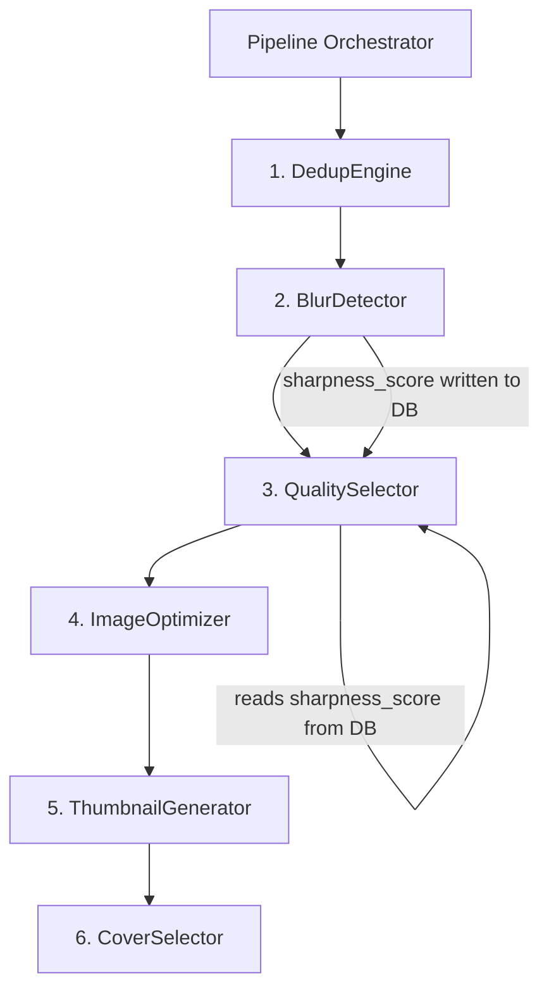
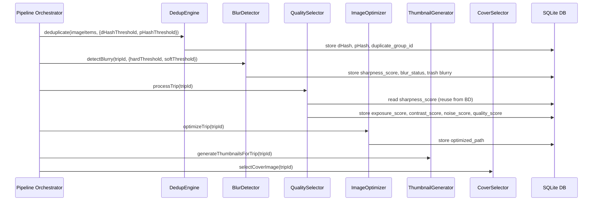

# Design Document: Image Processing V2

## Overview

本设计文档描述图片处理管线 V2 的技术架构，对四个核心服务模块进行升级：

1. **BlurDetector** — 从单阈值二分法升级为双阈值三分类（clear/suspect/blurry）
2. **DedupEngine** — 从 dHash + Union-Find 升级为 dHash+pHash 双层验证 + Exemplar Clustering
3. **QualitySelector** — 从分辨率主导评分升级为六维加权评分（sharpness 40%, exposure+contrast 20%, resolution 20%, noise 10%, file_size 10%）
4. **ImageOptimizer** — 从 normalize+modulate+sharpen 升级为 median(3)→gamma/clahe→sharpen(0.5-0.8)+withMetadata

所有图片处理仅使用 sharp Node.js 库，不引入 OpenCV 或其他原生绑定。

管线执行顺序调整为：dedup → blur detection → quality scoring → image optimization → thumbnails → cover selection，使 blur detection 计算的 Laplacian variance 可被 quality scoring 直接复用。

## Architecture

### Pipeline Flow



### Data Flow Between Steps



## Components and Interfaces

### 1. BlurDetector (`server/src/services/blurDetector.ts`)

**Changes:** Replace single-threshold binary classification with dual-threshold tri-state classification.

```typescript
// New types
export type BlurStatus = 'clear' | 'suspect' | 'blurry';

export interface BlurDetectOptions {
  hardThreshold?: number;  // default 50, below = blurry
  softThreshold?: number;  // default 150, above = clear, between = suspect
}

export interface BlurResult {
  mediaId: string;
  sharpnessScore: number;
  blurStatus: BlurStatus;
}

export interface BlurDetectResult {
  blurryCount: number;
  suspectCount: number;
  results: BlurResult[];
}

// Updated function signature
export async function detectBlurry(
  tripId: string,
  options?: BlurDetectOptions
): Promise<BlurDetectResult>;

// computeSharpness remains unchanged (Laplacian variance)
export async function computeSharpness(imagePath: string): Promise<number>;
```

**Behavior:**
- Validates `hardThreshold < softThreshold`, throws on violation
- `variance < hardThreshold` → `blurry`, trash with reason 'blur'
- `hardThreshold ≤ variance < softThreshold` → `suspect`, keep active
- `variance ≥ softThreshold` → `clear`
- On computation error: set `blur_status = 'suspect'`, record `processing_error`

### 2. DedupEngine (`server/src/services/dedupEngine.ts`)

**Changes:** Replace Union-Find with exemplar clustering; add pHash second-layer verification; fix dHash resize to preserve aspect ratio.

```typescript
export interface DedupOptions {
  dHashThreshold?: number;  // default 5 (was 10)
  pHashThreshold?: number;  // default 8
}

// New: approximate pHash using sharp-only mean-binarization
export async function computePHash(imagePath: string): Promise<string>;

// Updated: dHash now uses fit:'cover' instead of fit:'fill'
export async function computeHash(imagePath: string): Promise<string>;

// Updated signature
export async function deduplicate(
  imageItems: MediaItem[],
  options?: DedupOptions
): Promise<DuplicateGroup[]>;
```

**pHash Algorithm (sharp-only 均值二值化哈希):**

本项目的 pHash 不使用 DCT 变换（sharp 不提供 DCT API），而是基于均值二值化的近似实现：

1. Resize to 32×32 grayscale using `sharp.resize(32, 32, { fit: 'cover' }).grayscale().raw()`
2. Get raw pixel buffer (1024 bytes)
3. Compute mean of all 1024 pixel values
4. For each of the first 64 pixels (8×8 top-left block): bit = 1 if pixel > mean, else 0
5. Pack 64 bits into 16-char hex string

这不是学术标准的 pHash，但在 sharp-only 约束下提供了与 dHash 不同的感知维度（dHash 比较相邻像素差异，本哈希比较全局亮度分布），两层组合可有效降低误合并。

**Exemplar Clustering Algorithm:**
1. Compute dHash and pHash for all images
2. **候选分桶（Pre-bucketing）：** 在哈希比较前，先按以下条件将图片分桶，只在同一桶内做哈希比较：
   - 宽高比桶：`round(width/height * 10) / 10`（精确到 0.1）
   - 分辨率档位桶：`floor(log2(width * height))`（按 2 的幂分档）
   - 同一桶内的图片才进入后续哈希比较，跨桶不比较
3. For each pair (i, j) **within the same bucket** where i < j:
   - If `hammingDistance(dHash_i, dHash_j) ≤ dHashThreshold` AND `hammingDistance(pHash_i, pHash_j) ≤ pHashThreshold`:
     - Mark as candidate match
3. Build groups using exemplar model:
   - Maintain `Map<number, number[]>` where key = exemplar index, value = member indices
   - For each candidate match (i, j):
     - If neither i nor j is in any group → create new group with i as exemplar, add j
     - If i is an exemplar → check j against i (the exemplar) only; if match, add j to i's group
     - If j is an exemplar → check i against j (the exemplar) only; if match, add i to j's group
     - If both are in different groups → do not merge (prevents chain drift)
4. Store both dHash and pHash in `media_items` table

### 3. QualitySelector (`server/src/services/qualitySelector.ts`)

**Changes:** Replace resolution-biased scoring with six-dimensional weighted scoring.

```typescript
export interface QualityDimensions {
  sharpness: number | null;    // from DB (computed by BlurDetector)
  exposure: number | null;     // from histogram mean
  contrast: number | null;     // from histogram stddev
  resolution: number | null;   // width × height
  noiseArtifact: number | null; // high-freq energy ratio
  fileSize: number | null;     // raw file size
}

export interface NormalizedScores {
  sharpness: number | null;     // min(laplacianVariance / 500, 1.0)
  exposure: number | null;      // 1.0 - |mean - 128| / 128
  contrast: number | null;      // bell curve, optimal at stddev 50-70
  resolution: number | null;    // min(w*h / 12_000_000, 1.0)
  noiseArtifact: number | null; // 1.0 - min(highFreqRatio, 1.0)
  fileSize: number | null;      // min(fileSize / 5_000_000, 1.0)
}

// Weights
const WEIGHTS = {
  sharpness: 0.40,
  exposure: 0.10,
  contrast: 0.10,
  resolution: 0.20,
  noiseArtifact: 0.10,
  fileSize: 0.10,
};
```

**Exposure scoring:** Uses `sharp(imagePath).stats()` to get per-channel mean. Average the channel means, then: `1.0 - Math.abs(mean - 128) / 128`.

**Contrast scoring:** Uses `sharp(imagePath).stats()` to get per-channel stddev. Average the stddevs, then apply bell curve centered at 60 with width 20: `Math.exp(-0.5 * ((stddev - 60) / 20) ** 2)`.

**Noise estimation:** Resize image to small size (e.g., 256×256), apply Laplacian convolution, compute variance of result. Compare to variance of original grayscale at same size. `highFreqRatio = laplacianVariance / (originalVariance + 1)`. Score = `1.0 - min(highFreqRatio, 1.0)`.

**Sharpness reuse:** Read `sharpness_score` from `media_items` table (written by BlurDetector in previous pipeline step). Normalize: `min(sharpnessScore / 500, 1.0)`.

**Fallback on dimension failure:** If any dimension computation fails, set that dimension to `null`. Compute overall using remaining non-null dimensions with re-normalized weights.

### 4. ImageOptimizer (`server/src/services/imageOptimizer.ts`)

**Changes:** Replace current pipeline with correct processing order and parameters.

```typescript
// Pipeline: median(3) → gamma()/clahe() → sharpen(sigma: 0.5-0.8) + withMetadata()
export async function optimizeImage(
  imagePath: string,
  tripId: string,
  mediaId: string,
  options?: OptimizeOptions
): Promise<string>;
```

**New pipeline chain:**
```typescript
let pipeline = sharp(imagePath);

// Optional resize (unchanged)
if (options?.maxResolution) {
  pipeline = pipeline.resize(options.maxResolution, options.maxResolution, {
    fit: 'inside', withoutEnlargement: true,
  });
}

// Step 1: Light denoising
pipeline = pipeline.median(3);

// Step 2: Adaptive brightness/contrast correction
pipeline = pipeline.gamma().clahe({ width: 3, height: 3 });

// Step 3: Light sharpening (sigma 0.5-0.8, using 0.7)
pipeline = pipeline.sharpen({ sigma: 0.7 });

// Preserve EXIF metadata
pipeline = pipeline.withMetadata();

// JPEG quality (if applicable)
if (options?.jpegQuality && isJpeg) {
  pipeline = pipeline.jpeg({ quality: options.jpegQuality });
}
```

**Removed:** `normalize()`, `modulate({ brightness: 1.0 })`.

### 5. Database Migrations (`server/src/database.ts`)

**New columns on `media_items`:**

| Column | Type | Default | Description |
|--------|------|---------|-------------|
| `blur_status` | TEXT | null | 'clear', 'suspect', or 'blurry' |
| `exposure_score` | REAL | null | Normalized exposure score 0.0-1.0 |
| `contrast_score` | REAL | null | Normalized contrast score 0.0-1.0 |
| `noise_score` | REAL | null | Normalized noise score 0.0-1.0 |
| `phash` | TEXT | null | 16-char hex pHash string |

All added via `ALTER TABLE ... ADD COLUMN` with try/catch for idempotency, matching existing migration pattern.

### 6. Pipeline Orchestrator (`server/src/routes/process.ts`)

**Changes:**
- Reorder steps: dedup → blur → quality → optimize → thumbnails → cover
- Pass `hardThreshold`/`softThreshold` to BlurDetector
- Return `blurryCount` and `suspectCount` in response
- SSE stream reports both counts per step

```typescript
// Updated response shape
interface ProcessResult {
  // ... existing fields ...
  blurryCount: number;
  suspectCount: number;  // NEW
  // trashedDuplicateCount removed from separate step (computed inline)
}
```

## Data Models

### Updated MediaItem Type

```typescript
export interface MediaItem {
  // ... existing fields ...
  blurStatus?: 'clear' | 'suspect' | 'blurry';  // NEW
  exposureScore?: number;   // NEW
  contrastScore?: number;   // NEW
  noiseScore?: number;      // NEW
  phash?: string;           // NEW (pHash hex string)
}
```

### Updated QualityScore Type

```typescript
export interface QualityScore {
  sharpness: number | null;
  exposure: number | null;
  contrast: number | null;
  resolution: number | null;
  noiseArtifact: number | null;
  fileSize: number | null;
  overall: number;
}
```

### Updated ProcessResult Type

```typescript
export interface ProcessResult {
  tripId: string;
  totalImages: number;
  totalVideos: number;
  duplicateGroups: { groupId: string; imageCount: number }[];
  totalGroups: number;
  blurryCount: number;
  suspectCount: number;  // NEW
  trashedDuplicateCount: number;
  optimizedCount: number;
  compiledCount: number;
  failedCount: number;
  coverImageId: string | null;
}
```

### Database Row Mapping

The `MediaItemRow` helper in `server/src/helpers/mediaItemRow.ts` needs updating to map the new snake_case DB columns to camelCase TypeScript fields:

```typescript
// New mappings:
blur_status    → blurStatus
exposure_score → exposureScore
contrast_score → contrastScore
noise_score    → noiseScore
phash          → phash
```


## Correctness Properties

*A property is a characteristic or behavior that should hold true across all valid executions of a system — essentially, a formal statement about what the system should do. Properties serve as the bridge between human-readable specifications and machine-verifiable correctness guarantees.*

### Property 1: Blur classification is deterministic and correct

*For any* Laplacian variance value `v` and any valid threshold pair `(hard, soft)` where `hard < soft`, the blur classification must be:
- `'blurry'` if `v < hard`
- `'suspect'` if `hard ≤ v < soft`
- `'clear'` if `v ≥ soft`

And the classification must be deterministic — the same inputs always produce the same output.

**Validates: Requirements 1.1, 1.2, 1.3, 1.5**

### Property 2: Invalid threshold pairs are rejected

*For any* threshold pair `(hard, soft)` where `hard ≥ soft`, the BlurDetector must throw a validation error and not process any images.

**Validates: Requirements 1.6**

### Property 3: Dual-hash matching requires both hashes

*For any* pair of images, they are considered a match only if both `hammingDistance(dHash_i, dHash_j) ≤ dHashThreshold` AND `hammingDistance(pHash_i, pHash_j) ≤ pHashThreshold`. If either hash distance exceeds its threshold, the pair must not be grouped together.

**Validates: Requirements 2.3**

### Property 4: Exemplar clustering invariant

*For any* duplicate group produced by the DedupEngine, every member of the group must have both dHash and pHash distances to the group's exemplar (first member) within their respective thresholds. No member should be in a group solely because it matches a non-exemplar member.

**Validates: Requirements 2.4**

### Property 5: Hash persistence after dedup

*For any* image processed by the DedupEngine, both its dHash (stored in `perceptual_hash`) and pHash (stored in `phash`) must be non-null in the database after dedup completes.

**Validates: Requirements 2.5**

### Property 6: Weighted quality score formula

*For any* set of normalized dimension scores (all in [0.0, 1.0] or null), the overall quality score must equal the weighted sum using weights: sharpness 40%, exposure 10%, contrast 10%, resolution 20%, noise 10%, file_size 10%. When some dimensions are null, the remaining weights must be re-normalized to sum to 1.0.

**Validates: Requirements 3.2, 3.7**

### Property 7: Normalization formulas produce correct values

*For any* raw input values:
- Exposure: for any channel mean `m` in [0, 255], `exposureScore = 1.0 - |m - 128| / 128`
- Contrast: for any stddev `s` ≥ 0, `contrastScore = exp(-0.5 * ((s - 60) / 20)²)`
- Noise: for any high-freq ratio `r` ≥ 0, `noiseScore = 1.0 - min(r, 1.0)`
- Sharpness: for any Laplacian variance `v` ≥ 0, `sharpnessScore = min(v / 500, 1.0)`
- Resolution: for any pixel count `p` ≥ 0, `resolutionScore = min(p / 12_000_000, 1.0)`
- File size: for any size `s` ≥ 0, `fileSizeScore = min(s / 5_000_000, 1.0)`

**Validates: Requirements 3.3, 3.4, 3.5, 3.8**

### Property 8: All normalized scores are bounded in [0.0, 1.0]

*For any* non-negative raw input value, every normalization function must produce a result in the closed interval [0.0, 1.0].

**Validates: Requirements 3.8**

### Property 9: Quality dimensions are persisted

*For any* image processed by the QualitySelector, the `exposure_score`, `contrast_score`, and `noise_score` fields in the database must be set (either to a numeric value or explicitly null on failure).

**Validates: Requirements 3.1, 3.6**

### Property 10: EXIF metadata preservation

*For any* image with EXIF metadata, after optimization by ImageOptimizer, the output file must contain the original EXIF metadata.

**Validates: Requirements 4.5**

## Error Handling

### BlurDetector
- **Laplacian computation failure:** Set `blur_status = 'suspect'` (not 'blurry'), record error in `processing_error`. This prevents false-positive trashing of images that simply failed to process.
- **Invalid thresholds:** Throw `Error('hardThreshold must be less than softThreshold')` before processing any images.
- **File not found / corrupt image:** Caught per-image, recorded in `processing_error`, image classified as 'suspect'.

### DedupEngine
- **Hash computation failure:** Use empty string for that image's hash (won't match anything). Image remains ungrouped rather than being incorrectly grouped.
- **pHash computation failure:** Same as dHash — empty string, no grouping. Both hashes must succeed for a match.
- **Storage download failure:** Per-image catch, skip that image, continue with remaining.

### QualitySelector
- **Individual dimension failure:** Set that dimension to `null`, re-normalize remaining weights for overall score. Never let one failed dimension zero out the entire score.
- **All dimensions fail:** Set `overall = 0`, record `processing_error`.
- **Sharpness not in DB:** If `sharpness_score` is null (BlurDetector didn't run or failed), compute it fresh as fallback.

### ImageOptimizer
- **Sharp pipeline failure:** Per-image catch, record in `processing_error`, continue with next image. Return `optimizedPath: null` for failed images.
- **Temp file cleanup:** Always in `finally` block, ignore cleanup errors.

### Pipeline Orchestrator
- **Step failure:** Each step is wrapped in try/catch. A failed step records errors but does not abort the entire pipeline. Subsequent steps operate on whatever data is available.
- **Client disconnect (SSE):** Check `clientDisconnected` flag before each step. Return early if client is gone.

## Testing Strategy

### Property-Based Testing

Use `fast-check` as the property-based testing library for TypeScript/Node.js.

Each property test must:
- Run a minimum of 100 iterations
- Reference its design document property with a tag comment
- Tag format: `// Feature: image-processing-v2, Property {N}: {title}`

Property tests target pure computation functions that can be tested without database or file I/O:

| Property | Function Under Test | Generator Strategy |
|----------|--------------------|--------------------|
| P1: Blur classification | `classifyBlur(variance, hard, soft)` | Random floats for variance (0-1000), valid threshold pairs |
| P2: Invalid thresholds | `validateThresholds(hard, soft)` | Random pairs where hard ≥ soft |
| P3: Dual-hash matching | `isMatch(dHash1, dHash2, pHash1, pHash2, thresholds)` | Random 16-char hex strings, random thresholds |
| P4: Exemplar invariant | `buildExemplarGroups(matches)` | Random adjacency lists of candidate matches |
| P5: Hash persistence | Integration test with in-memory DB | Random image-like buffers |
| P6: Weighted score | `computeOverall(scores, weights)` | Random score objects with some null dimensions |
| P7: Normalization formulas | Individual normalize functions | Random non-negative floats |
| P8: Score bounds | All normalize functions | Random non-negative floats, verify output ∈ [0, 1] |
| P9: Dimension persistence | Integration test with in-memory DB | Random score objects |
| P10: EXIF preservation | Integration test with sharp | Generated test images with EXIF |

### Unit Testing

Unit tests complement property tests for specific examples and edge cases:

- **BlurDetector:** Test exact boundary values (variance = hardThreshold, variance = softThreshold - 0.001), error path when sharp throws
- **DedupEngine:** Test with known identical images (distance = 0), known different images (distance = 64), empty input array
- **QualitySelector:** Test with all-null dimensions, single non-null dimension, perfectly exposed image (mean = 128)
- **ImageOptimizer:** Test that output file exists, output is valid image, JPEG quality parameter is respected
- **Database migrations:** Test that new columns exist, existing data is not corrupted, columns accept null values
- **Pipeline Orchestrator:** Test step ordering via mocked services, response shape includes suspectCount, SSE events contain both counts

### Integration Testing

- End-to-end pipeline test with a small set of real images covering: clear/suspect/blurry, duplicate pairs, various quality levels
- Verify the full pipeline produces expected DB state after completion
