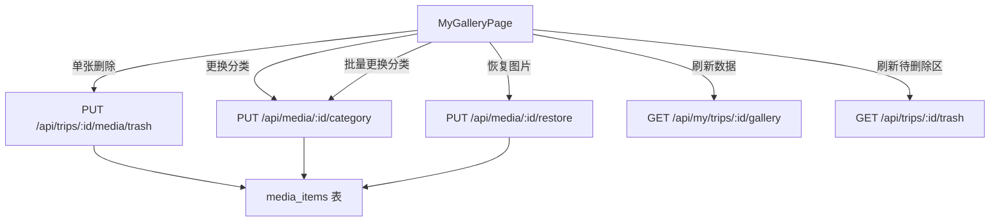

# Design Document: Manual Photo Management

## Overview

本设计实现"我的相册"页面中的手动照片管理功能，包括单张删除、分类更换（单张和批量）、以及从待删除区恢复。这些操作补充了 CLIP 自动分类和去重处理，让用户可以手动纠正自动处理的不准确结果。

核心变更：
- 后端新增 `PUT /api/media/:id/category` 端点用于更换分类
- 前端在 MyGalleryPage 中为每张图片添加删除按钮和分类选择器
- 前端多选模式下增加"更换分类"批量操作
- 复用已有的 `PUT /api/trips/:id/media/trash`（批量删除）和 `PUT /api/media/:id/restore`（恢复）API

## Architecture



前端采用乐观更新策略：分类更换成功后直接更新本地 state，无需重新拉取整个 gallery 数据。删除和恢复操作则通过 refetch gallery + trash 数据来保持一致性（与现有批量删除逻辑一致）。

## Components and Interfaces

### 后端：Category API 端点

在 `server/src/routes/trash.ts` 中新增路由（该文件已包含其他媒体状态管理路由）：

```typescript
// PUT /api/media/:id/category
router.put('/media/:id/category', authMiddleware, requireAuth, (req, res, next) => {
  const VALID_CATEGORIES = ['people', 'animal', 'landscape', 'other'];
  const { category } = req.body;
  // 1. 验证 category 值
  // 2. 查找 media_item，验证存在性
  // 3. 验证权限（media owner / trip owner / admin）
  // 4. 更新 category 字段
  // 5. 返回更新后的 MediaItem
});
```

权限检查逻辑复用 trash.ts 中已有的模式：检查 `req.user` 是否为 media 的 user_id、所属 trip 的 user_id、或 admin。

### 前端：MyGalleryPage 变更

#### 新增状态

```typescript
// 分类选择器状态
const [categoryPickerMediaId, setCategoryPickerMediaId] = useState<string | null>(null);
// 批量分类选择器
const [batchCategoryPickerOpen, setBatchCategoryPickerOpen] = useState(false);
// 批量分类操作中
const [batchCategoryChanging, setBatchCategoryChanging] = useState(false);
```

#### 单张删除按钮

在每张图片卡片上（非多选模式下）添加删除按钮，点击后弹出 `window.confirm` 确认，确认后调用已有的 `PUT /api/trips/:id/media/trash` 接口（mediaIds 数组传单个 id）。

#### 分类选择器组件

内联在图片卡片上的下拉/弹出选择器，包含四个分类选项。点击图片卡片上的分类标签触发显示。选择后调用 `PUT /api/media/:id/category`，成功后更新本地 `data` state 中对应图片的 category。

#### 批量分类操作

在多选模式的底部操作栏中，已有"删除选中"按钮旁边新增"更换分类"按钮。点击后弹出分类选择器，选择后对所有选中图片逐一调用 category API。使用 `Promise.allSettled` 处理部分失败场景。

## Data Models

### 数据库层（无变更）

`media_items` 表已有 `category TEXT` 列，取值为 `people`、`animal`、`landscape`、`other` 或 `NULL`。无需 schema 变更。

### API 请求/响应

#### PUT /api/media/:id/category

请求：
```json
{ "category": "landscape" }
```

成功响应（200）：
```json
{
  "id": "uuid",
  "tripId": "uuid",
  "category": "landscape",
  ...其他 MediaItem 字段
}
```

错误响应：
- 400: `{ "error": { "code": "INVALID_CATEGORY", "message": "分类值无效，必须为 people、animal、landscape 或 other" } }`
- 404: `{ "error": { "code": "NOT_FOUND", "message": "媒体文件不存在" } }`
- 403: `{ "error": { "code": "FORBIDDEN", "message": "无权操作此资源" } }`

### 前端类型（无新增）

已有的 `MediaItem` 类型包含 `category?: string` 字段，`GalleryImage` 包含 `item: MediaItem`。无需新增类型定义。


## Correctness Properties

*A property is a characteristic or behavior that should hold true across all valid executions of a system — essentially, a formal statement about what the system should do. Properties serve as the bridge between human-readable specifications and machine-verifiable correctness guarantees.*

### Property 1: Category update round trip

*For any* active media item and *for any* valid category value (people, animal, landscape, other), calling `PUT /api/media/:id/category` with that value and then reading the media item back should return the same category value.

**Validates: Requirements 2.2, 4.2**

### Property 2: Invalid category rejection

*For any* string that is not one of `people`, `animal`, `landscape`, `other`, calling `PUT /api/media/:id/category` with that string should return a 400 status code and the category field of the media item should remain unchanged.

**Validates: Requirements 2.4, 4.4**

### Property 3: Authorization enforcement on category update

*For any* media item and *for any* authenticated user who is neither the media owner, the trip owner, nor an admin, calling `PUT /api/media/:id/category` should return a 403 status code and the category field should remain unchanged.

**Validates: Requirements 4.3, 4.6**

### Property 4: Trash sets manual reason

*For any* active media item, calling `PUT /api/trips/:id/media/trash` with that item's ID should result in the item having `status = 'trashed'` and `trashed_reason = 'manual'`.

**Validates: Requirements 1.2**

### Property 5: Restore clears trashed state

*For any* trashed media item, calling `PUT /api/media/:id/restore` should result in the item having `status = 'active'` and `trashed_reason = NULL`.

**Validates: Requirements 3.1**

### Property 6: Category filtering correctness

*For any* list of images with assigned categories and *for any* category tab selection, the filtered result should contain exactly those images whose category matches the selected tab (with `other` tab including images with `null` or `other` category, and `all` tab including every image).

**Validates: Requirements 2.3, 3.3**

## Error Handling

| 场景 | 前端行为 | 后端响应 |
|------|---------|---------|
| 单张删除失败 | 图片保持原位，用户可重试 | 已有 trash API 错误处理 |
| 分类更换失败 | 恢复原始分类显示，用户可重试 | 400/403/404/500 |
| 恢复失败 | 图片保持在待删除区，用户可重试 | 已有 restore API 错误处理 |
| 批量分类部分失败 | 显示失败数量提示，保持多选模式 | 逐个请求，各自返回状态 |
| 无效分类值 | 前端不应发送（UI 限制选项） | 400 INVALID_CATEGORY |
| 无权限 | 页面本身已有权限校验 | 403 FORBIDDEN |
| 媒体不存在 | 刷新 gallery 数据 | 404 NOT_FOUND |

前端错误处理策略：
- 单张操作失败：静默失败，保持当前状态，用户可重试（与现有 restore/delete 模式一致）
- 批量操作部分失败：使用 `Promise.allSettled` 收集结果，显示失败数量，成功的部分更新本地状态

## Testing Strategy

### 单元测试

- Category API 端点测试（`server/src/routes/trash.test.ts`）：
  - 有效分类更新返回 200 和更新后的 MediaItem
  - 无效分类返回 400
  - 不存在的媒体返回 404
  - 无权限用户返回 403
  - 媒体拥有者、旅行拥有者、管理员均可操作

- 前端组件测试：
  - 单张删除按钮触发确认对话框
  - 分类选择器显示四个选项
  - 选择相同分类不发送请求
  - 批量分类操作栏在多选模式下显示

### 属性测试

使用 `fast-check` 库进行属性测试，每个属性测试至少运行 100 次迭代。

每个测试用注释标注对应的设计属性：
- `// Feature: manual-photo-management, Property 1: Category update round trip`
- `// Feature: manual-photo-management, Property 2: Invalid category rejection`
- `// Feature: manual-photo-management, Property 3: Authorization enforcement on category update`
- `// Feature: manual-photo-management, Property 4: Trash sets manual reason`
- `// Feature: manual-photo-management, Property 5: Restore clears trashed state`
- `// Feature: manual-photo-management, Property 6: Category filtering correctness`

属性测试重点：
- Property 1-5 在后端 API 层测试，使用 `fast-check` 生成随机分类值、随机用户角色等
- Property 6 在前端逻辑层测试，使用 `fast-check` 生成随机图片列表和分类组合，验证过滤逻辑
