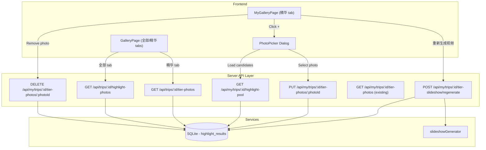

# Design Document: Manual Photo Management (手动精华管理)

## Overview

This feature extends the existing highlight-tier (精华) system to support manual curation. Currently, tier selection is entirely AI-driven via `runTierSelection()` in `highlightTierSelector.ts`. This design adds three capabilities:

1. **Manual remove/add operations** — Users can remove photos from the tier and add replacements from the highlight pool via a Photo Picker dialog in My Gallery.
2. **Slideshow regeneration** — A "重新生成视频" button triggers re-creation of the tier slideshow video using the current (manually curated) tier photos.
3. **Public Gallery tabs** — Visitors see "全部" (all highlights) and "精华" (tier photos + slideshow) tabs in the Public Gallery.

The design preserves the existing subset invariant (`is_highlight_tier = 1` ⟹ `is_highlight = 1` AND `status = 'active'`) and treats category quotas as advisory.

## Architecture


```mermaid
flowchart TD
    subgraph Frontend
        MG["MyGalleryPage (精华 tab)"]
        PP["PhotoPicker Dialog"]
        PG["GalleryPage (全部/精华 tabs)"]
    end

    subgraph Backend["Server API Layer"]
        PUT_ADD["PUT /api/my/trips/:id/tier-photos/:photoId"]
        DEL_REM["DELETE /api/my/trips/:id/tier-photos/:photoId"]
        POST_REGEN["POST /api/my/trips/:id/tier-slideshow/regenerate"]
        GET_TIER["GET /api/trips/:id/tier-photos"]
        GET_HL["GET /api/trips/:id/highlight-photos"]
        GET_MY_TIER["GET /api/my/trips/:id/tier-photos (existing)"]
        GET_MY_POOL["GET /api/my/trips/:id/highlight-pool"]
    end

    subgraph Services
        DB[(SQLite - highlight_results)]
        SG["slideshowGenerator"]
    end

    MG -->|"Remove photo"| DEL_REM
    MG -->|"Click +"| PP
    PP -->|"Load candidates"| GET_MY_POOL
    PP -->|"Select photo"| PUT_ADD
    MG -->|"重新生成视频"| POST_REGEN
    PG -->|"全部 tab"| GET_HL
    PG -->|"精华 tab"| GET_TIER

    PUT_ADD --> DB
    DEL_REM --> DB
    POST_REGEN --> DB
    POST_REGEN --> SG
    GET_TIER --> DB
    GET_HL --> DB
    GET_MY_POOL --> DB
```

### Key Design Decisions

1. **Optimistic UI with server validation** — The frontend updates the UI optimistically on remove/add, rolling back on API failure. The server is the source of truth for invariant enforcement.
2. **Soft quotas** — Category quotas are displayed as informational labels (`"动物: 7/6-9"`) but never block add/remove operations. This gives users full creative control.
3. **Synchronous regeneration** — The `POST /regenerate` endpoint runs slideshow generation inline and returns the new URL on success. This simplifies the frontend (no polling needed) at the cost of a longer request duration (~10-30s depending on photo count). A loading indicator communicates progress.
4. **New highlight-photos endpoint** — A new `GET /api/trips/:id/highlight-photos` endpoint serves all highlight photos (not just tier) for the Public Gallery "全部" tab, keeping it decoupled from the existing `/gallery` endpoint logic.

## Components and Interfaces

### New API Endpoints

#### 1. `PUT /api/my/trips/:id/tier-photos/:photoId` — Add photo to tier

**Auth:** Required (owner or admin)

**Validation:**
- Photo belongs to the specified trip
- `highlight_results.is_highlight = 1` for this photo
- `media_items.status = 'active'`

**Action:** Sets `is_highlight_tier = 1` for the photo in `highlight_results`

**Response:**
```typescript
// 200 OK
{ photo: TierPhotoItem }

// 400 Bad Request
{ error: { code: 'NOT_ELIGIBLE', message: '该照片不在精选池中或已被删除，无法添加到精华' } }

// 403 Forbidden
{ error: { code: 'FORBIDDEN', message: '无权操作此资源' } }

// 404 Not Found
{ error: { code: 'NOT_FOUND', message: '照片不存在' } }
```

#### 2. `DELETE /api/my/trips/:id/tier-photos/:photoId` — Remove photo from tier

**Auth:** Required (owner or admin)

**Validation:**
- Photo belongs to the specified trip
- `highlight_results.is_highlight_tier = 1` currently

**Action:** Sets `is_highlight_tier = 0` for the photo in `highlight_results`

**Response:**
```typescript
// 200 OK
{ success: true }

// 400 Bad Request
{ error: { code: 'NOT_IN_TIER', message: '该照片当前不在精华中' } }

// 403 Forbidden
{ error: { code: 'FORBIDDEN', message: '无权操作此资源' } }

// 404 Not Found
{ error: { code: 'NOT_FOUND', message: '照片不存在' } }
```

#### 3. `POST /api/my/trips/:id/tier-slideshow/regenerate` — Regenerate slideshow

**Auth:** Required (owner or admin)

**Action:** Queries current tier photos, generates a new slideshow video, replaces existing file.

**Response:**
```typescript
// 200 OK
{ slideshowUrl: string }

// 400 Bad Request
{ error: { code: 'NO_TIER_PHOTOS', message: '没有精华照片可用于生成视频' } }

// 403 Forbidden
{ error: { code: 'FORBIDDEN', message: '无权操作此资源' } }

// 500 Internal Server Error
{ error: { code: 'GENERATION_FAILED', message: string } }
```

#### 4. `GET /api/my/trips/:id/highlight-pool` — Get available highlight photos for picker

**Auth:** Required (owner or admin)

**Returns:** All photos where `is_highlight = 1`, `status = 'active'`, and `is_highlight_tier = 0` for this trip.

**Response:**
```typescript
// 200 OK
{ photos: TierPhotoItem[] }
```

#### 5. `GET /api/trips/:id/highlight-photos` — Public highlight photos (全部 tab)

**Auth:** Optional (public for public trips, owner/admin for any)

**Returns:** All photos where `is_highlight = 1` and `status = 'active'` for the trip.

**Response:**
```typescript
// 200 OK
{ photos: TierPhotoItem[] }
```

### Frontend Components

#### 1. PhotoPicker Dialog

A modal dialog opened when the user clicks an Empty_Slot `+` icon.

```typescript
interface PhotoPickerProps {
  tripId: string;
  open: boolean;
  onClose: () => void;
  onSelect: (photo: TierPhotoItem) => void;
}
```

- Fetches available photos from `GET /api/my/trips/:id/highlight-pool`
- Displays photos in a grid with thumbnails
- Clicking a photo triggers `onSelect` and closes the dialog
- Shows loading state while fetching
- Shows empty state message if no eligible photos remain

#### 2. Enhanced "精华" Tab in MyGalleryPage

Changes to the existing tier tab:
- Each tier photo card gains a "移除精华" button (×icon overlay)
- After removal, the card transforms into an Empty_Slot with a `+` icon
- Above the grid: category quota labels (`"动物: 7/6-9"`, etc.)
- Below the slideshow video: "重新生成视频" button
- Button shows spinner during generation, disables interaction

#### 3. Public Gallery Tabs (GalleryPage)

New tab bar added to GalleryPage:
- "全部" tab (default): shows all highlight photos in the existing image grid
- "精华" tab: shows tier photos + tier slideshow video
- Tab bar uses the same `pill-tabs` styling as category tabs

### Client API Functions (additions to `api.ts`)

```typescript
/** Add a photo to the tier */
export async function addToTier(tripId: string, photoId: string): Promise<TierPhotoItem>;

/** Remove a photo from the tier */
export async function removeFromTier(tripId: string, photoId: string): Promise<void>;

/** Regenerate tier slideshow */
export async function regenerateTierSlideshow(tripId: string): Promise<{ slideshowUrl: string }>;

/** Get highlight pool (available photos for picker) */
export async function getHighlightPool(tripId: string): Promise<{ photos: TierPhotoItem[] }>;

/** Get all highlight photos for public gallery */
export async function getHighlightPhotos(tripId: string): Promise<{ photos: TierPhotoItem[] }>;
```

## Data Models

### Database — No Schema Changes

All operations use the existing `highlight_results` table columns:

| Column | Type | Used by this feature |
|--------|------|---------------------|
| trip_id | TEXT FK | Filter by trip |
| photo_id | TEXT FK | Identify specific photo |
| is_highlight | INTEGER | Validate eligibility (must be 1) |
| is_highlight_tier | INTEGER | Toggle 0↔1 for add/remove |

The `media_items` table provides:
| Column | Type | Used by this feature |
|--------|------|---------------------|
| status | TEXT | Must be 'active' for tier eligibility |
| category | TEXT | Display quota counts |

### State Transitions

```
Highlight Pool photo (is_highlight=1, is_highlight_tier=0)
    ──[PUT add]──→ Tier Photo (is_highlight=1, is_highlight_tier=1)
    ←──[DELETE remove]──
```

### Invariants (enforced by server)

1. `is_highlight_tier = 1` ⟹ `is_highlight = 1` (add validation)
2. `is_highlight_tier = 1` ⟹ `media_items.status = 'active'` (add validation)
3. Trashing a tier photo auto-clears `is_highlight_tier` (existing cascade)
4. Removing highlight status auto-clears `is_highlight_tier` (new cascade)


## Correctness Properties

*A property is a characteristic or behavior that should hold true across all valid executions of a system — essentially, a formal statement about what the system should do. Properties serve as the bridge between human-readable specifications and machine-verifiable correctness guarantees.*

### Property 1: Remove clears tier flag

*For any* photo that currently has `is_highlight_tier = 1` in the `highlight_results` table, calling the remove endpoint for that photo SHALL result in `is_highlight_tier = 0` for that row, and the photo SHALL no longer appear in tier photo queries for the trip.

**Validates: Requirements 1.2, 8.2, 8.3**

### Property 2: Highlight pool excludes tier photos and trashed photos

*For any* trip with a mix of highlight photos (various `is_highlight_tier` and `status` values), the highlight pool query SHALL return only photos where `is_highlight = 1` AND `media_items.status = 'active'` AND `is_highlight_tier = 0`. No tier photos and no trashed photos shall appear in the pool results.

**Validates: Requirements 2.2, 2.6, 3.3**

### Property 3: Add enforces subset invariant

*For any* photo, the add-to-tier operation SHALL succeed (setting `is_highlight_tier = 1`) if and only if the photo satisfies `is_highlight = 1` AND `media_items.status = 'active'` AND belongs to the specified trip. For any photo that fails any of these conditions, the operation SHALL be rejected with an appropriate error and `is_highlight_tier` SHALL remain 0.

**Validates: Requirements 2.3, 2.5, 3.1, 7.2, 7.3, 7.5, 10.1**

### Property 4: Quotas are advisory (not enforced)

*For any* trip and category, adding a photo to the tier SHALL succeed regardless of how many tier photos already exist in that category (even above `max`), and removing a photo SHALL succeed regardless of how few would remain (even below `min`).

**Validates: Requirements 4.1, 4.2**

### Property 5: Regeneration uses current tier photos

*For any* trip with at least one tier photo, calling the regenerate endpoint SHALL produce a slideshow using exactly the set of photos currently marked `is_highlight_tier = 1` and `status = 'active'` for that trip. The resulting slideshow URL SHALL be non-null.

**Validates: Requirements 5.2, 9.2**

### Property 6: Public highlight query returns all active highlights

*For any* public trip, the highlight-photos endpoint SHALL return every photo with `is_highlight = 1` AND `media_items.status = 'active'`, and no photo missing either condition SHALL appear in the results.

**Validates: Requirements 6.3**

### Property 7: Trash cascades tier flag

*For any* photo that has `is_highlight_tier = 1`, when that photo's status is changed to 'trashed', the system SHALL automatically set `is_highlight_tier = 0`.

**Validates: Requirements 10.2**

### Property 8: Highlight removal cascades tier flag

*For any* photo that has `is_highlight_tier = 1`, when that photo's `is_highlight` is set to 0, the system SHALL automatically set `is_highlight_tier = 0`.

**Validates: Requirements 10.3**

## Error Handling

| Scenario | HTTP Code | Error Code | Message |
|----------|-----------|------------|---------|
| Photo not found in trip | 404 | `NOT_FOUND` | 照片不存在 |
| Photo not eligible for tier (not highlight or trashed) | 400 | `NOT_ELIGIBLE` | 该照片不在精选池中或已被删除，无法添加到精华 |
| Photo not currently in tier (on remove) | 400 | `NOT_IN_TIER` | 该照片当前不在精华中 |
| No tier photos for regeneration | 400 | `NO_TIER_PHOTOS` | 没有精华照片可用于生成视频 |
| User not owner/admin | 403 | `FORBIDDEN` | 无权操作此资源 |
| Slideshow generation failure | 500 | `GENERATION_FAILED` | (dynamic error detail) |
| Unauthenticated request | 401 | `UNAUTHORIZED` | 未登录 |

**Frontend error handling:**
- On API failure during remove: show toast/error, keep photo in place (no optimistic removal)
- On API failure during add: show toast/error, keep empty slot visible
- On regeneration failure: show error message, restore button to idle state
- Network errors: show generic "网络错误，请重试" message

## Testing Strategy

### Unit Tests (example-based)

- **API endpoint routing**: Verify each endpoint returns 401 without auth, 403 for non-owners
- **UI rendering**: Verify buttons, tabs, and dialog states render correctly
- **Error handling**: Verify error messages display on API failures
- **Public gallery tabs**: Verify tab presence and default state

### Property-Based Tests

**Library:** fast-check (already used in the project per `gallery.property.test.ts`)

**Configuration:** Minimum 100 iterations per property test.

Each property from the Correctness Properties section above will be implemented as a property-based test:

- **Property 1**: Generate random trip+photo in tier, call remove, assert flag=0
- **Property 2**: Generate random sets of photos (mix of states), query pool, assert filtering
- **Property 3**: Generate random photos (eligible and ineligible), call add, assert success/failure matches eligibility
- **Property 4**: Generate random trips at various quota states, add/remove, assert no quota enforcement
- **Property 5**: Generate random tier photo sets, call regenerate (with mocked slideshowGenerator), assert photo list matches
- **Property 6**: Generate random photo sets for public trip, query highlights, assert completeness
- **Property 7**: Generate random tier photos, trash them, assert tier flag cleared
- **Property 8**: Generate random tier photos, remove highlight, assert tier flag cleared

Tag format: `Feature: manual-photo-management, Property {N}: {title}`

### Integration Tests

- End-to-end flow: add photo → verify in tier → regenerate slideshow → verify new URL
- Remove photo → verify removed from tier queries
- Public gallery: verify correct data in both tabs
- Cascade: trash a tier photo → verify auto-removal from tier
