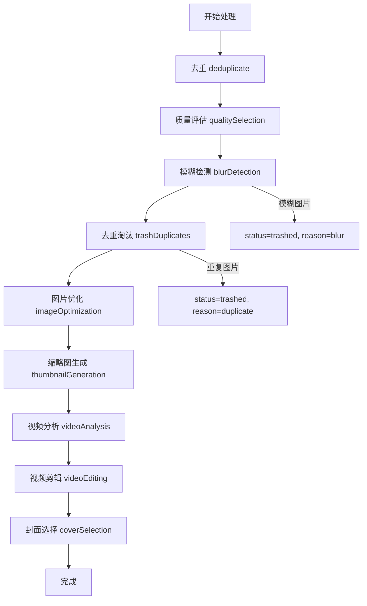
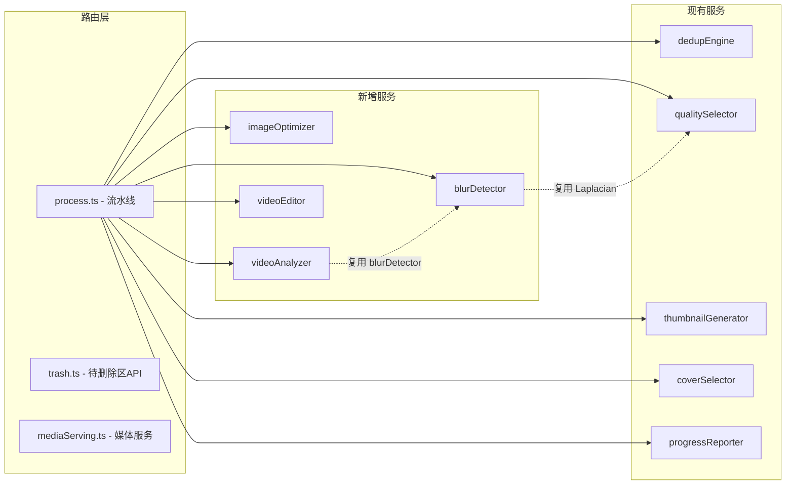

# 技术设计文档：媒体处理增强（media-processing-improvements）

## 概述

本设计在现有处理流水线（deduplicate → qualitySelection → thumbnailGeneration → coverSelection）基础上，新增图片模糊检测、图片基础优化、视频片段质量分析、视频自动剪辑四个处理步骤，并引入待删除区（软删除）机制和处理失败容错。

设计原则：
- 扩展现有服务，不重写已有逻辑
- 新增服务保持与现有服务一致的模式（纯函数 + DB 操作分离）
- 使用 sharp 和 ffmpeg 完成所有处理，不引入 AI/LLM 依赖
- 代码量可控，每个新服务聚焦单一职责

## 架构

### 更新后的处理流水线



### 系统组件关系



## 组件与接口

### 1. blurDetector（模糊检测器）

文件：`server/src/services/blurDetector.ts`

复用现有 `qualitySelector.ts` 中的拉普拉斯方差计算逻辑，封装为独立的模糊判定服务。

```typescript
interface BlurResult {
  mediaId: string;
  sharpnessScore: number;
  isBlurry: boolean;
}

// 计算单张图片的清晰度分数
function computeSharpness(imagePath: string): Promise<number>;

// 批量检测并标记模糊图片
function detectAndTrashBlurry(
  tripId: string,
  threshold?: number  // 默认 100.0
): Promise<{ blurryCount: number; results: BlurResult[] }>;
```

实现要点：
- `computeSharpness` 提取自现有 `computeQualityScore` 中的 Laplacian 方差计算
- 低于阈值的图片：`UPDATE media_items SET status = 'trashed', trashed_reason = 'blur' WHERE id = ?`
- 仅处理 `status = 'active'` 且 `media_type = 'image'` 的记录

### 2. imageOptimizer（图片优化器）

文件：`server/src/services/imageOptimizer.ts`

使用 sharp 对保留的 active 图片执行保守优化。

```typescript
interface OptimizeOptions {
  maxResolution?: number;    // 最大分辨率（宽或高），默认不缩放
  jpegQuality?: number;      // JPEG 质量 60-100，默认 85
}

interface OptimizeResult {
  mediaId: string;
  optimizedPath: string | null;  // null 表示优化失败
  error?: string;
}

// 优化单张图片
function optimizeImage(
  imagePath: string,
  tripId: string,
  mediaId: string,
  options?: OptimizeOptions
): Promise<string>;  // 返回优化后文件的相对路径

// 批量优化旅行中所有 active 图片
function optimizeTrip(
  tripId: string,
  options?: OptimizeOptions
): Promise<OptimizeResult[]>;
```

实现要点：
- 优化链：`sharp(input).normalize().modulate({ brightness: 1.0 }).sharpen({ sigma: 1.0 }).toFile(output)`
- brightness 使用 1.0（不调整），normalize 自动处理曝光/对比度
- 输出路径：`uploads/{tripId}/optimized/{mediaId}_opt.{ext}`
- 如配置了 `maxResolution`，在链头加 `.resize(maxResolution, maxResolution, { fit: 'inside', withoutEnlargement: true })`
- 失败时记录 `processing_error`，不影响其他图片

### 3. videoAnalyzer（视频分析器）

文件：`server/src/services/videoAnalyzer.ts`

使用 ffmpeg 对视频进行片段级质量分析。

```typescript
interface VideoSegment {
  index: number;
  startTime: number;      // 秒
  endTime: number;        // 秒
  duration: number;       // 秒
  sharpnessScore: number; // 关键帧 Laplacian 方差
  stabilityScore: number; // 运动估计稳定性分数 (0-100)
  overallScore: number;   // sharpness * 0.6 + stability * 0.4
  label: 'good' | 'blurry' | 'shaky' | 'slightly_shaky';
}

interface VideoAnalysisResult {
  mediaId: string;
  duration: number;       // 总时长（秒）
  segments: VideoSegment[];
}

// 分析单个视频
function analyzeVideo(
  videoPath: string,
  mediaId: string,
  segmentDuration?: number  // 默认 2 秒
): Promise<VideoAnalysisResult>;
```

实现要点：
- 片段分割：按 `segmentDuration`（默认 2 秒）等分
- 清晰度：对每个片段中间帧用 ffmpeg 抽帧，再用 sharp 计算 Laplacian 方差
- 稳定性：使用 `ffmpeg -vf "mestimate=epzs"` 提取运动向量，计算平均运动幅度
  - 运动幅度 < 5：stability = 100（稳定）
  - 运动幅度 5-15：stability = 线性映射到 50-100（轻微抖动）
  - 运动幅度 > 15：stability = 0-50（严重抖动）
- 标签判定：
  - `blurry`：sharpnessScore < 视频清晰度阈值（默认 50.0）
  - `shaky`：stabilityScore < 30
  - `slightly_shaky`：stabilityScore 30-60
  - `good`：其余

### 4. videoEditor（视频剪辑器）

文件：`server/src/services/videoEditor.ts`

根据分析结果自动剪辑生成成片。

```typescript
interface EditOptions {
  videoResolution?: number;  // 输出分辨率上限
}

interface EditResult {
  mediaId: string;
  compiledPath: string | null;  // null 表示跳过或失败
  selectedSegments: number[];   // 选中的片段索引
  error?: string;
}

// 剪辑单个视频
function editVideo(
  videoPath: string,
  analysis: VideoAnalysisResult,
  tripId: string,
  mediaId: string,
  options?: EditOptions
): Promise<EditResult>;
```

实现要点：
- 目标时长计算：
  - 原始 ≤ 60s：不剪辑，仅剔除 blurry/shaky 片段
  - 原始 60s-600s：目标 120s
  - 原始 ≥ 600s：目标 300s
- 片段选取：按 `overallScore` 降序排列，累计时长达到目标后停止，跳过 `blurry` 和 `shaky` 片段
- `slightly_shaky` 片段：使用 vidstab 两遍防抖
  - 第一遍：`ffmpeg -i segment.mp4 -vf vidstabdetect -f null -`
  - 第二遍：`ffmpeg -i segment.mp4 -vf vidstabtransform`
- 拼接：使用 ffmpeg concat demuxer
  - 生成 concat 文件列表
  - `ffmpeg -f concat -safe 0 -i list.txt -c copy output.mp4`
  - 如果片段编码不一致，使用 `-c:v libx264 -c:a aac` 重编码
- 输出路径：`uploads/{tripId}/compiled/{mediaId}_compiled.mp4`

### 5. 更新 progressReporter

扩展 `StepName` 类型以支持新步骤：

```typescript
type StepName = 'dedup' | 'quality' | 'blurDetect' | 'trashDuplicates' 
  | 'imageOptimize' | 'thumbnail' | 'videoAnalysis' | 'videoEdit' | 'cover';
```

总步骤数从 4 更新为 9。

### 6. 新增 API 路由

文件：`server/src/routes/trash.ts`

| 方法 | 路径 | 说明 |
|------|------|------|
| GET | `/api/trips/:id/trash` | 获取旅行中所有 trashed 文件列表 |
| DELETE | `/api/trips/:id/trash` | 批量永久删除所有 trashed 文件 |
| PUT | `/api/media/:id/restore` | 恢复单个文件为 active |
| DELETE | `/api/media/:id` | 永久删除单个 trashed 文件 |

### 7. 更新 mediaServing.ts

- `GET /api/media/:id/original`：如果 `optimized_path` 存在且文件有效，返回优化版本；否则返回原始文件
- 新增 `GET /api/media/:id/raw`：始终返回原始文件（不经过优化）
- 视频：如果 `compiled_path` 存在，默认返回成片；提供 `?original=true` 参数访问原始视频

### 8. 更新 process.ts 流水线

处理接口新增可选参数：

```typescript
interface ProcessOptions {
  blurThreshold?: number;       // 图片模糊阈值，默认 100.0
  outputConfig?: {
    maxResolution?: number;     // 图片最大分辨率
    jpegQuality?: number;       // JPEG 质量 60-100
    videoResolution?: number;   // 视频输出分辨率
  };
}
```

SSE 流式处理更新为 9 个步骤，每步完成后发送进度事件。


## 数据模型

### media_items 表变更

新增字段（通过 ALTER TABLE 迁移）：

```sql
ALTER TABLE media_items ADD COLUMN status TEXT NOT NULL DEFAULT 'active';
ALTER TABLE media_items ADD COLUMN trashed_reason TEXT;
ALTER TABLE media_items ADD COLUMN processing_error TEXT;
ALTER TABLE media_items ADD COLUMN optimized_path TEXT;
ALTER TABLE media_items ADD COLUMN compiled_path TEXT;
```

| 字段 | 类型 | 说明 |
|------|------|------|
| status | TEXT | `active` / `trashed` / `deleted`，默认 `active` |
| trashed_reason | TEXT | 移入待删除区的原因：`blur` / `duplicate` / `manual` |
| processing_error | TEXT | 最近一次处理失败的错误信息 |
| optimized_path | TEXT | 优化后图片的相对路径 |
| compiled_path | TEXT | 视频成片的相对路径 |

### 更新后的 MediaItem 类型

```typescript
export interface MediaItem {
  id: string;
  tripId: string;
  filePath: string;
  thumbnailPath?: string;
  mediaType: 'image' | 'video' | 'unknown';
  mimeType: string;
  originalFilename: string;
  fileSize: number;
  width?: number;
  height?: number;
  perceptualHash?: string;
  qualityScore?: number;
  sharpnessScore?: number;
  duplicateGroupId?: string;
  status: 'active' | 'trashed' | 'deleted';
  trashedReason?: string;
  processingError?: string;
  optimizedPath?: string;
  compiledPath?: string;
  createdAt: string;
}
```

### 更新后的 ProcessResult 类型

```typescript
export interface ProcessResult {
  tripId: string;
  totalImages: number;
  totalVideos: number;
  duplicateGroups: { groupId: string; imageCount: number }[];
  totalGroups: number;
  blurryCount: number;          // 新增：模糊图片数
  trashedDuplicateCount: number; // 新增：因重复被移入待删除区的图片数
  optimizedCount: number;        // 新增：成功优化的图片数
  compiledCount: number;         // 新增：成功生成成片的视频数
  failedCount: number;           // 新增：处理失败的文件数
  coverImageId: string | null;
}
```

### gallery.ts 查询变更

现有查询需要加上 `status = 'active'` 过滤条件：

```sql
-- 原来
SELECT * FROM media_items WHERE trip_id = ? AND media_type = 'image'
-- 改为
SELECT * FROM media_items WHERE trip_id = ? AND media_type = 'image' AND status = 'active'
```

### 目录结构

```
server/uploads/{tripId}/
├── originals/          # 原始文件（已有）
├── thumbnails/         # 缩略图（已有）
├── optimized/          # 优化后的图片（新增）
└── compiled/           # 视频成片（新增）
```


## 正确性属性（Correctness Properties）

*属性（Property）是指在系统所有合法执行中都应成立的特征或行为——本质上是对系统应做什么的形式化陈述。属性是人类可读规格说明与机器可验证正确性保证之间的桥梁。*

### Property 1: 状态字段不变量

*For any* media item in the database, its `status` field must be one of `active`, `trashed`, or `deleted`. Furthermore, if `status` is `trashed`, then `trashed_reason` must be non-null and one of `blur`, `duplicate`, or `manual`.

**Validates: Requirements 1.1, 1.2**

### Property 2: 基于状态的查询过滤

*For any* trip containing media items with mixed statuses (`active`, `trashed`), the gallery endpoint must return only items with `status = 'active'`, and the trash endpoint must return only items with `status = 'trashed'`. The two result sets must be disjoint and their union must equal all non-deleted items.

**Validates: Requirements 1.3, 1.6**

### Property 3: 待删除区恢复往返

*For any* media item with `status = 'trashed'`, calling the restore endpoint must set its `status` back to `active` and the item must subsequently appear in gallery queries and no longer appear in trash queries.

**Validates: Requirements 1.5, 1.8**

### Property 4: 永久删除移除文件

*For any* media item with `status = 'trashed'`, after calling the permanent delete endpoint, the item's `status` must be `deleted`, and the original file, thumbnail, and optimized file (if any) must no longer exist on disk.

**Validates: Requirements 1.4, 1.7, 1.9**

### Property 5: 模糊检测阈值决定淘汰

*For any* image and any sharpness threshold T, if the image's Laplacian variance sharpness score is below T, then after blur detection the image's `status` must be `trashed` with `trashed_reason = 'blur'`. If the sharpness score is >= T, the image's `status` must remain `active`.

**Validates: Requirements 2.1, 2.2**

### Property 6: 模糊计数报告准确性

*For any* processing result, the `blurryCount` field must equal the number of media items in that trip whose `status = 'trashed'` and `trashed_reason = 'blur'` after processing.

**Validates: Requirements 2.4**

### Property 7: 重复组最优保留不变量

*For any* duplicate group after processing, exactly one member must have `status = 'active'` (the one with the highest quality score), and all other members must have `status = 'trashed'` with `trashed_reason = 'duplicate'`. All members must have non-null `quality_score`.

**Validates: Requirements 3.1, 3.2**

### Property 8: 重复淘汰计数报告准确性

*For any* processing result, the `trashedDuplicateCount` field must equal the number of media items in that trip whose `status = 'trashed'` and `trashed_reason = 'duplicate'` after processing.

**Validates: Requirements 3.4**

### Property 9: 图片优化保留原始并创建新文件

*For any* successfully optimized image, the original file at `file_path` must still exist with unchanged content (byte-identical), and `optimized_path` must point to a valid file at the expected path pattern `uploads/{tripId}/optimized/{mediaId}_opt.{ext}`.

**Validates: Requirements 4.3, 4.4**

### Property 10: 媒体服务优先返回处理后版本

*For any* media item with a valid `optimized_path` (for images) or `compiled_path` (for videos), the default serving endpoint must return the processed version. The raw/original endpoint must always return the unmodified original file.

**Validates: Requirements 4.5, 6.10**

### Property 11: 视频片段评分不变量

*For any* video segment produced by the analyzer, `sharpnessScore` must be >= 0, `stabilityScore` must be in range [0, 100], and `overallScore` must equal `sharpnessScore * 0.6 + stabilityScore * 0.4` (within floating-point tolerance).

**Validates: Requirements 5.2, 5.3, 5.7**

### Property 12: 视频片段标签由阈值决定

*For any* video segment, its label must be determined by: if `sharpnessScore < videoBlurThreshold` then `blurry`; else if `stabilityScore < 30` then `shaky`; else if `stabilityScore < 60` then `slightly_shaky`; else `good`. The label must be consistent with the scores.

**Validates: Requirements 5.4, 5.5, 5.6**

### Property 13: 视频目标时长由原始时长决定

*For any* video, the target compiled duration must follow: if original duration <= 60s, no compilation (only bad segment removal); if 60s < duration < 600s, target ≈ 120s; if duration >= 600s, target ≈ 300s. The actual compiled duration must not exceed the target by more than one segment duration.

**Validates: Requirements 6.1, 6.2, 6.3**

### Property 14: 视频片段选取不变量

*For any* compiled video, the selected segments must not include any segment labeled `blurry` or `shaky`, and the segments must be ordered by `overallScore` descending in the selection (though the final timeline may reorder by time).

**Validates: Requirements 6.4, 6.5**

### Property 15: 视频成片保留原始文件

*For any* successfully compiled video, the original video file at `file_path` must still exist, and `compiled_path` must point to a valid file at the expected path pattern `uploads/{tripId}/compiled/{mediaId}_compiled.mp4`.

**Validates: Requirements 6.8, 6.9**

### Property 16: 输出分辨率约束

*For any* optimized image or compiled video where a `maxResolution` / `videoResolution` limit is configured, the output file's width and height must both be <= the configured limit, while maintaining the original aspect ratio.

**Validates: Requirements 7.2, 7.3**

### Property 17: 错误隔离与报告

*For any* file that fails during processing, its `status` must remain `active`, its `processing_error` field must be non-null with an error description, and all other files in the same trip must still be processed normally. The `failedCount` in the result must equal the count of items with non-null `processing_error`.

**Validates: Requirements 8.1, 8.2, 8.3**

### Property 18: 待删除区展示移入原因

*For any* trashed media item displayed in the trash zone UI, the rendered output must contain the item's thumbnail, filename, and `trashed_reason` text.

**Validates: Requirements 9.3**


## 错误处理

### 处理流水线错误隔离

每个处理步骤对单个文件的操作都包裹在 try-catch 中：

```typescript
for (const item of items) {
  try {
    await processItem(item);
  } catch (err) {
    db.prepare('UPDATE media_items SET processing_error = ? WHERE id = ?')
      .run(err instanceof Error ? err.message : String(err), item.id);
    failedCount++;
    // 继续处理下一个文件
  }
}
```

### 各服务错误处理策略

| 服务 | 失败行为 | 回退策略 |
|------|----------|----------|
| blurDetector | 记录 processing_error，status 保持 active | 图片不被标记为模糊，保留在相册中 |
| imageOptimizer | 记录 processing_error，optimized_path 为 null | 使用原始文件展示 |
| videoAnalyzer | 记录 processing_error，跳过视频剪辑 | 保留原始视频不剪辑 |
| videoEditor | 记录 processing_error，compiled_path 为 null | 使用原始视频播放 |
| vidstab 防抖 | 防抖失败时使用原始片段 | 片段不防抖但仍可纳入成片 |

### API 错误响应

待删除区 API 的错误响应遵循现有 AppError 模式：

```typescript
// 恢复非 trashed 状态的文件
throw new AppError(400, 'INVALID_STATUS', '该文件不在待删除区');

// 删除非 trashed 状态的文件
throw new AppError(400, 'INVALID_STATUS', '只能删除待删除区中的文件');

// 文件不存在
throw new AppError(404, 'NOT_FOUND', '媒体文件不存在');
```

### ffmpeg 进程错误

视频处理中 ffmpeg 子进程可能因多种原因失败（文件损坏、编码不支持等）。所有 ffmpeg 调用设置超时（默认 300 秒），超时后终止进程并记录错误。

## 测试策略

### 双重测试方法

本功能采用单元测试 + 属性测试的双重策略：

- **单元测试（Unit Tests）**：验证具体示例、边界情况和错误条件
- **属性测试（Property-Based Tests）**：验证跨所有输入的通用属性

两者互补，单元测试捕获具体 bug，属性测试验证通用正确性。

### 属性测试配置

- 使用 **fast-check** 库（`@fast-check/vitest`）进行属性测试
- 每个属性测试最少运行 **100 次迭代**
- 每个属性测试必须通过注释引用设计文档中的属性编号
- 标签格式：**Feature: media-processing-improvements, Property {number}: {property_text}**
- 每个正确性属性由**单个**属性测试实现

### 测试分层

#### 单元测试

| 测试文件 | 覆盖范围 |
|----------|----------|
| `blurDetector.test.ts` | computeSharpness 对已知图片的分数、阈值边界 |
| `imageOptimizer.test.ts` | 优化输出文件存在性、原始文件保留、失败回退 |
| `videoAnalyzer.test.ts` | 片段分割数量、评分计算、标签判定 |
| `videoEditor.test.ts` | 目标时长计算、片段选取逻辑、concat 文件生成 |
| `trash.test.ts` | 各 API 端点的 CRUD 操作、状态转换、权限校验 |
| `mediaServing.test.ts` | 优化版本优先返回、原始版本回退 |
| `process.test.ts` | 完整流水线执行、进度事件序列、结果统计 |

#### 属性测试

| 测试文件 | 覆盖属性 |
|----------|----------|
| `blurDetector.property.test.ts` | Property 5（阈值决定淘汰）、Property 6（计数准确性） |
| `qualitySelector.property.test.ts` | Property 7（最优保留）、Property 8（淘汰计数） |
| `videoAnalyzer.property.test.ts` | Property 11（评分不变量）、Property 12（标签判定） |
| `videoEditor.property.test.ts` | Property 13（目标时长）、Property 14（片段选取） |
| `trash.property.test.ts` | Property 1（状态不变量）、Property 2（查询过滤）、Property 3（恢复往返）、Property 4（永久删除） |
| `mediaServing.property.test.ts` | Property 10（服务优先级） |
| `process.property.test.ts` | Property 17（错误隔离） |

### 属性测试示例

```typescript
// Feature: media-processing-improvements, Property 5: 模糊检测阈值决定淘汰
test.prop(
  '清晰度低于阈值的图片应被标记为 trashed',
  [fc.float({ min: 0, max: 200 }), fc.float({ min: 50, max: 150 })],
  ([sharpnessScore, threshold]) => {
    const result = applyBlurThreshold(sharpnessScore, threshold);
    if (sharpnessScore < threshold) {
      expect(result.status).toBe('trashed');
      expect(result.trashedReason).toBe('blur');
    } else {
      expect(result.status).toBe('active');
    }
  },
  { numRuns: 100 }
);
```

### 边界情况测试（单元测试覆盖）

- 空旅行（无图片无视频）的处理
- 所有图片都模糊的情况
- 重复组中所有图片质量分数相同
- 视频时长恰好为 60 秒和 600 秒的边界
- 图片优化失败后的回退
- ffmpeg 不可用时的视频处理
- 待删除区为空时的批量删除
- 恢复已经是 active 状态的文件
