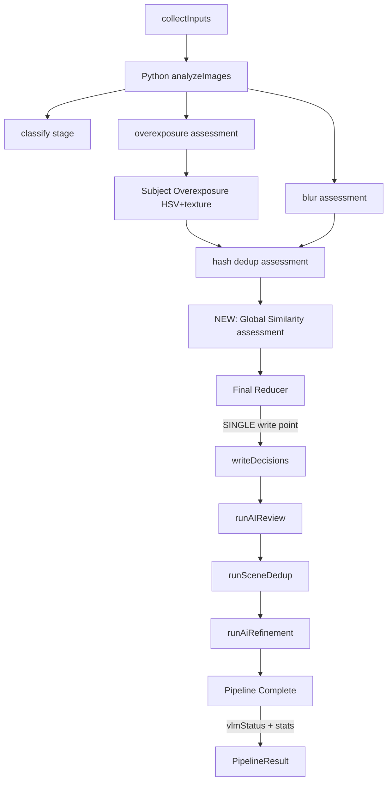

# Design Document: photo-curation-fix

## Overview

This design addresses six interconnected deficiencies in the travel photo album's server-side processing pipeline. The changes span the Python analysis service (subject-level overexposure), the TypeScript pipeline orchestrator (error labeling, threshold logging, VLM status reporting), the result reducer (recognizing overexposure as a trash reason), and the smart curation engine (global similarity candidate generation across time-batches).

All changes are backend-only, preserve existing blur/hash dedup behavior, and maintain the conservative "keep all on failure" policy while making failures visible through structured reporting.

## Architecture

The pipeline processes images in sequential stages. **All assessment stages run first, then a single reducer pass merges all decisions, then a single write pass persists the final state.** No stage after the reducer/write may revert a trash decision.



**Key architectural decisions:**

1. **Subject-level overexposure lives in Python** — OpenCV connected-component analysis on HSV channels requires numpy/cv2, already available in `analyze.py`. Node.js fallback (sharp grayscale >240) remains for when Python is unavailable.

2. **All assessments complete before the single reducer pass** — blur, overexposure, hash dedup, and global similarity all produce assessment objects. The reducer merges them into final `active`/`trashed` decisions. `writeDecisions` persists once. This prevents the old bug where overexposure trash was overwritten by a later write.

3. **Global similarity does NOT require VLM for high-confidence clusters** — High-confidence embedding matches (above `dinov2ConfirmedThreshold`) are resolved locally using quality scores. VLM is only invoked for gray-zone tie-breaks. VLM failure does not prevent high-confidence dedup.

4. **AI stages (post-reducer curation) run AFTER writeDecisions** — They operate on the already-reduced active set. Their trash decisions are written directly to DB (they already do this). This is correct because they only trash, never un-trash. **Important**: The pre-reducer "Global Similarity assessment" stage already handles DINOv2 grouping + local/VLM selection. Post-reducer stages MUST NOT repeat global DINOv2 grouping. The actual post-reducer stages are called exactly once each in this order:
   - `runAIReview` (per-photo quality screening)
   - `runSceneDedup` (time-sorted batch VLM dedup)
   - `runAiRefinement` (per-photo color adjustment)
   
   `runSmartCuration` is NOT called post-reducer — its functionality is now covered by the pre-reducer Global Similarity stage. No stage may be invoked more than once per pipeline run. No image may be evaluated by the same function twice.

5. **VLM stats are accumulated in a shared counter object** — All AI stages increment a single `VLMCallStats` tracker that the pipeline reads at completion. **Source of truth**: the shared tracker is the SOLE authority for final `vlmStatus` derivation. Stage-level result objects (e.g. `GlobalSimilarityResult.vlmCallsMade`) are for debug logging only and MUST NOT be re-added to the shared tracker — the tracker is incremented in real-time during VLM calls, not retroactively from stage results.

## Components and Interfaces

### 1. Subject Overexposure Detector (Python)

**File:** `server/python/analyze.py` — new function `detect_subject_overexposure`

```python
def detect_subject_overexposure(
    image_path: str,
    v_threshold: int = 245,            # HSV V-channel bright threshold
    s_threshold: int = 45,             # HSV S-channel low saturation threshold
    min_area_ratio: float = 0.006,     # minimum connected component area ratio
    max_area_ratio: float = 0.015,     # above this = severe (for single component)
    severe_total_area_ratio: float = 0.012,  # total qualifying area above this = severe
    min_component_pixels: int = 300,   # minimum pixels per qualifying component
    center_weight: float = 1.5,        # weighting for components in center 60%
    texture_gradient_threshold: float = 5.0,  # Sobel gradient std below this = featureless
) -> dict:
    """
    Detect overexposed subjects using multi-criteria analysis.
    
    Detection criteria (ALL must be met for a qualifying region):
    1. HSV V >= v_threshold (very bright)
    2. HSV S <= s_threshold (low saturation / near-white)
    3. Local Sobel gradient std < texture_gradient_threshold (featureless/detail-lost)
    4. Connected component area >= min_component_pixels
    
    Anti-false-positive guards:
    - Bright sand/seafloor: has texture (gradient > threshold), passes S check but fails gradient
    - Water surface reflections: typically small, scattered, fails area threshold
    - Bubbles: small components, fails area threshold
    - Specular highlights: tiny, fails area threshold
    
    Center weighting: Components overlapping center 60% of image contribute 1.5x to area ratio.
    
    Returns:
    {
        "severity": "none" | "mild" | "severe",
        "subjectOverexposed": bool,
        "largestRegionRatio": float | null,
        "totalBrightArea": float,      # sum of qualifying regions / image area
        "numQualifyingRegions": int,
        "overexposureReason": str | null,  # e.g. "subject_highlight_clipped"
    }
    
    Severity levels:
    - none: no qualifying bright regions found
    - mild: total qualifying area ratio in [overexposureSubjectMinAreaRatio, overexposureSubjectSevereTotalAreaRatio)
    - severe: total qualifying area ratio ≥ severe_total_area_ratio param (default 0.012)
              OR any single component ratio > max_area_ratio param (default 0.015)
    
    All thresholds are read from PROCESS_THRESHOLDS / CLI args — never hardcoded.
    """
```

**Integration with pipeline:**
- `severity: "severe"` → `overexposureStatus: 'overexposed'` → reducer trashes it
- `severity: "mild"` → `overexposureStatus: 'normal'` BUT `overexposureQualityPenalty: -0.15` stored in `ImageProcessContext.overexposure.qualityPenalty`. The local quality selector in global similarity reads this penalty and subtracts it from the composite quality score when comparing candidates.
- `severity: "none"` → no effect

**Quality penalty data flow:**
- Python returns `{ severity, qualityPenalty }` where penalty is -0.15 for mild, 0 otherwise
- Node stores in `ctx.overexposure.qualityPenalty: number` (default 0)
- `selectBestByQuality()` computes: `compositeScore + candidate.overexposureQualityPenalty`
- Effect: mild-overexposed candidates are deprioritized but not auto-trashed

**Combined detection logic:**
1. Global check (>40% pixels above 240) → `overexposed` → done
2. Subject-level check (above criteria) → severity assessment → done
3. Neither triggers → `normal`

### 2. Updated Result Reducer

**File:** `server/src/services/pipeline/resultReducer.ts`

```typescript
export type TrashReason = 'blur' | 'overexposure' | 'duplicate' | 'global_similarity';

// Post-reducer AI stages write to DB with their own trashed_reason values:
//   aiReview → 'blurry' | 'low_subject_quality' | 'low_aesthetic_quality' | 'low_video_value'
//   sceneDedup → 'scene_redundant' | 'near_duplicate_worse'
//   aiRefinement → 'blurry' | 'low_subject_quality' | 'low_aesthetic_quality'
//
// These do NOT go through PerImageFinalDecision.trashedReasons (which is pre-reducer only).
// Statistics for post-reducer stages are counted separately by querying DB for
// images trashed AFTER writeDecisions, grouped by trashed_reason.

// Priority ordering for pre-reducer reasons (highest first):
// blur > overexposure > duplicate > global_similarity
export function reduce(
  contexts: ImageProcessContext[],
  dedupAssessment: DedupAssessment | null,
  globalSimilarityAssessment: GlobalSimilarityAssessment | null,
): PerImageFinalDecision[] {
  // For each image:
  // 1. Check blur → append 'blur'
  // 2. Check overexposure (severity=severe) → append 'overexposure'
  // 3. Check dedup removed set → append 'duplicate'
  // 4. Check global similarity trashed set → append 'global_similarity'
  // finalStatus = trashedReasons.length > 0 ? 'trashed' : 'active'
}
```

### 3. Global Similarity Candidate Generator

**File:** `server/src/services/smartCuration/globalSimilarity.ts` (new)

```typescript
export type SelectorSource = 'local_quality' | 'vlm' | 'fallback_keep_all';

export interface ClusterDecision {
  clusterId: string;
  selectedMediaId: string | null;   // null when selectorSource='fallback_keep_all'
  trashedMediaIds: string[];
  keepReasons: string[];      // e.g. ["highest_quality_score", "sharpest"]
  trashReasons: string[];     // e.g. ["near_duplicate_worse"]
  selectorSource: SelectorSource;
  confidence: number;         // 0.0-1.0
  maxSimilarity: number;
  pairEvidence: Array<{ i: string; j: string; similarity: number }>;
  warnings: string[];         // e.g. ["vlm_failed_using_quality_fallback"]
}

export interface GlobalSimilarityResult {
  clusters: ClusterDecision[];
  totalPairsFound: number;
  embeddingsUsed: boolean;
  vlmCallsMade: number;
  vlmCallsFailed: number;
  localQualityResolved: number;   // clusters resolved without VLM
  vlmResolved: number;            // clusters resolved by VLM
  fallbackKeptAll: number;        // clusters where VLM failed on gray-zone
}

export async function runGlobalSimilarity(
  tripId: string,
  prelimActiveMediaIds: string[],
  options?: { onProgress?: PipelineProgressCallback }
): Promise<GlobalSimilarityResult>;
```

**Algorithm (tiered resolution):**

1. Fetch DINOv2 embeddings only for `prelimActiveMediaIds`
2. Compute top-K nearest neighbors (K = `globalSimilarityTopK`, default 10) per image using cosine similarity
3. Classify pairs:
   - **Confirmed**: similarity ≥ `dinov2ConfirmedThreshold` (default 0.88)
   - **Gray-zone**: similarity between `dinov2GrayLowThreshold` (default 0.75) and `dinov2ConfirmedThreshold`
   - **Below threshold**: ignored
4. Use Union-Find for confirmed pairs only to form clusters. Gray-zone pairs are kept as VLM review edges/evidence attached to clusters but never auto-merge two different confirmed clusters. A gray-zone pair where both endpoints are already in the same confirmed cluster adds evidence. A gray-zone pair bridging two different clusters is flagged for VLM review — NOT auto-merged.
5. **Tiered resolution per cluster:**

| Cluster type | Resolution | Selector source |
|---|---|---|
| Confirmed-only cluster (all pairs ≥ confirmed threshold) | **Local quality selector** — keep highest quality score, trash rest (with direct-edge validation per Constraint 3) | `local_quality` |
| Mixed confirmed + gray-zone pairs | **VLM** — send cluster images to active VLM provider for best-selection | `vlm` |
| All pairs gray-zone only | **VLM** — send to active VLM provider for judgment | `vlm` |
| VLM fails on confirmed-only cluster | **Local quality selector** — still resolves safely | `local_quality` |
| VLM fails on gray-zone cluster | **Keep all** — conservative, log warning | `fallback_keep_all` |

6. Return `GlobalSimilarityResult` with full per-cluster metadata

**Local quality selector logic:**
```typescript
function selectBestByQuality(candidates: CurationCandidate[]): string {
  // Sort by composite quality score (sharpness * 0.4 + aesthetic * 0.3 + exposure * 0.3)
  // Return mediaId of highest-scoring candidate
  // Ties broken by: higher resolution > newer capture time
}
```

### 4. VLM Status Reporter

**Changes to:** `server/src/services/pipeline/types.ts` and `runTripProcessingPipeline.ts`

```typescript
export type VLMStatus = 
  | 'not_configured'    // no VLM provider keys set
  | 'disabled'          // AI_REVIEW_ENABLED=false
  | 'skipped'           // VLM available but stage was skipped (e.g. <2 photos)
  | 'success'           // all VLM calls succeeded
  | 'partial_failure'   // some calls succeeded, some failed
  | 'failed';           // all calls failed (auth error, timeout, etc.)

export interface VLMCallStats {
  totalCalls: number;
  successfulCalls: number;
  failedCalls: number;
  parseFailures: number;        // JSON parse failed (model returned bad format)
  timeoutFailures: number;      // request timed out
  providerAuthFailures: number; // 401/403/signature expired
  skippedStages: PipelineStage[];
  stageStats: Record<string, { calls: number; successes: number; failures: number }>;
  diagnostic: string;           // human-readable summary
}
```

**Status derivation logic:**
```typescript
function deriveVLMStatus(
  stats: VLMCallStats,
  vlmEnabled: boolean,
  vlmAvailable: boolean,
): VLMStatus {
  if (!vlmEnabled) return 'disabled';
  if (!vlmAvailable) return 'not_configured';
  if (stats.totalCalls === 0) return 'skipped';
  if (stats.failedCalls === 0 && stats.successfulCalls > 0) return 'success';
  if (stats.successfulCalls > 0 && stats.failedCalls > 0) return 'partial_failure';
  if (stats.failedCalls > 0 && stats.successfulCalls === 0) return 'failed';
  return 'skipped';
}
```

### 5. Threshold Configuration (split DINO/CLIP naming)

**Changes to:** `server/src/services/dedupThresholds.ts`

```typescript
export interface ProcessThresholds {
  // ... existing fields ...
  
  // Overexposure
  overexposureGlobalRatio: number;           // default 0.40
  overexposureSubjectVThreshold: number;     // default 245
  overexposureSubjectSThreshold: number;     // default 45
  overexposureSubjectMinAreaRatio: number;   // default 0.006
  overexposureSubjectMaxAreaRatio: number;   // default 0.015
  overexposureSubjectSevereTotalAreaRatio: number; // default 0.012
  overexposureMinComponentPixels: number;    // default 300
  overexposureTextureGradientThreshold: number; // default 5.0
  
  // DINOv2 (global similarity — used with 384-dim DINOv2-small vectors)
  dinov2ConfirmedThreshold: number;          // default 0.88
  dinov2GrayLowThreshold: number;            // default 0.75
  dinov2DedupThreshold: number;              // default 0.82 (existing)
  
  // CLIP (legacy hybrid dedup — used with 512-dim CLIP vectors)
  clipConfirmedThreshold: number;            // default 0.93 (existing)
  clipGrayHighThreshold: number;             // default 0.90 (existing)
  clipGrayLowThreshold: number;              // default 0.86 (existing)
  
  // Global similarity
  globalSimilarityTopK: number;              // default 10
}
```

**Log format at pipeline start:**
```
[pipeline] thresholds: blur=${blurThreshold}, overexposureGlobal=${overexposureGlobalRatio}, 
  overexposureSubjectV=${overexposureSubjectVThreshold}, overexposureSubjectS=${overexposureSubjectSThreshold},
  overexposureSevereTotalArea=${overexposureSubjectSevereTotalAreaRatio},
  dinov2Confirmed=${dinov2ConfirmedThreshold}, dinov2GrayLow=${dinov2GrayLowThreshold}, dinov2Dedup=${dinov2DedupThreshold},
  clipConfirmed=${clipConfirmedThreshold}, globalSimilarityTopK=${globalSimilarityTopK}
```

**Passing thresholds to Python subprocess:**
- `runTripProcessingPipeline.ts` passes overexposure thresholds to `analyze.py` via CLI arguments: `--subject-v-threshold 245 --subject-s-threshold 45 --min-area-ratio 0.006 --max-area-ratio 0.015 --severe-total-area-ratio 0.012 --min-component-pixels 300 --texture-gradient-threshold 5.0`
- Values are read from `PROCESS_THRESHOLDS` at call time (not hardcoded)
- Node.js sharp fallback also reads from `PROCESS_THRESHOLDS` (uses `overexposureGlobalRatio` for its pixel brightness check)
- Python logs received thresholds at start: `[analyze] overexposure thresholds: V=${v}, S=${s}, minArea=${a}, ...`

### 6. Stage Error Labeling Fix

**Changes to:** `server/src/services/pipeline/runTripProcessingPipeline.ts`

```typescript
// Fix: overexposure errors labeled as 'overexposure' not 'blur'
stageErrors.push({ stage: 'overexposure', error: msg });
```

## Data Models

### Updated `PerImageFinalDecision`

```typescript
export interface PerImageFinalDecision {
  mediaId: string;
  finalBlurStatus: 'clear' | 'suspect' | 'blurry';
  finalCategory: ImageCategory;
  finalStatus: 'active' | 'trashed';
  trashedReasons: Array<'blur' | 'overexposure' | 'duplicate' | 'global_similarity'>;
  overexposureSeverity?: 'none' | 'mild' | 'severe';
  sharpnessScore: number | null;
  qualityScore: number | null;
  categorySource: ClassifySource;
  blurSource: BlurSource | null;
  processingError: string | null;
}
```

### Updated `PipelineResult`

```typescript
export interface PipelineResult {
  tripId: string;
  totalImages: number;
  totalVideos: number;
  blurryDeletedCount: number;
  overexposureDeletedCount: number;
  dedupDeletedCount: number;
  globalSimilarityTrashedCount: number;
  aiReviewTrashedCount: number;
  sceneDedupTrashedCount: number;
  aiRefinementTrashedCount: number;
  analyzedCount: number;
  optimizedCount: number;
  classifiedCount: number;
  categoryStats: { people: number; animal: number; landscape: number; other: number };
  compiledCount: number;
  failedCount: number;
  skippedCount: number;
  partialFailureCount: number;
  downloadFailedCount: number;
  coverImageId: string | null;
  vlmStatus: VLMStatus;
  vlmCallStats: VLMCallStats;
}
```

## Correctness Properties

### Property 1: Subject overexposure classification

*For any* image region where HSV V ≥ 245 AND S ≤ 45 AND local Sobel gradient std < 5.0 AND connected component area ≥ 300 pixels, it SHALL be counted as a qualifying bright region. *For any* image where the total qualifying bright area ratio (with center 1.5x weighting) ≥ `overexposureSubjectSevereTotalAreaRatio` (default 0.012) OR any single component ratio > `overexposureSubjectMaxAreaRatio` (default 0.015), the severity SHALL be `severe`. Between `overexposureSubjectMinAreaRatio` (default 0.006) and `overexposureSubjectSevereTotalAreaRatio`, severity SHALL be `mild`. Below `overexposureSubjectMinAreaRatio`, severity SHALL be `none`. All thresholds are configurable via `PROCESS_THRESHOLDS`.

**Validates: Requirements 1.Q1–1.Q4, 1.3, 1.4, 1.5**

### Property 2: Anti-false-positive for textured bright regions

*For any* bright region (V ≥ 245) where the local Sobel gradient std ≥ 5.0 (has texture), that region SHALL NOT be counted as a qualifying overexposed region regardless of saturation or area.

**Validates: Requirements 1.Q3, 1.5 (textured bright areas like sand stay `none`)**

### Property 3: Result reducer completeness and ordering

*For any* `ImageProcessContext` with a combination of blur, overexposure (severity=severe), dedup removal, and global similarity trash, the result reducer SHALL produce `trashedReasons` containing exactly the applicable reasons in priority order: `blur` > `overexposure` > `duplicate` > `global_similarity`. The `finalStatus` SHALL be `trashed` if and only if `trashedReasons.length > 0`.

**Validates: Requirements 2.1–2.9**

### Property 4: Global similarity tiered resolution

*For any* cluster where all pair similarities ≥ `dinov2ConfirmedThreshold`, the cluster SHALL be resolved by local quality selector (selectorSource = `local_quality`) regardless of VLM availability. *For any* gray-zone cluster where VLM fails, the cluster SHALL use `fallback_keep_all` (no trash decisions) and emit a warning.

**Validates: Requirement 3 — VLM failure does not block high-confidence dedup**

### Property 5: DINOv2 pair classification respects split thresholds

*For any* pair of DINOv2 embeddings with cosine similarity S: if S ≥ `dinov2ConfirmedThreshold` → confirmed; if `dinov2GrayLowThreshold` ≤ S < `dinov2ConfirmedThreshold` → gray-zone; if S < `dinov2GrayLowThreshold` → skip. No pair below `dinov2GrayLowThreshold` SHALL ever enter a cluster.

**Validates: Requirements 3.3, 3.4, 3.5**

### Property 6: Union-Find clustering with chain-merge safeguards

*For any* set of candidate pairs: (a) confirmed pairs form clusters via standard transitivity; (b) gray-zone pairs do NOT bridge two different confirmed clusters — they are flagged for VLM review; (c) any cluster exceeding 8 members SHALL be split at the weakest intra-cluster edge; (d) a candidate SHALL only be trashed if it has a direct confirmed edge (similarity ≥ `dinov2ConfirmedThreshold`) to the selectedMediaId or cluster medoid.

**Validates: Requirements 3.6–3.9 + Implementation Constraint 2**

### Property 7: VLM status derivation

*For any* combination of `vlmEnabled`, `vlmAvailable`, and `VLMCallStats`: `disabled` when vlmEnabled=false; `not_configured` when vlmAvailable=false; `skipped` when totalCalls=0; `success` when failed=0 and calls>0; `partial_failure` when 0<failed<total and successes>0; `failed` when failed>0 and successes=0. Priority: disabled > not_configured > skipped > success/partial_failure/failed.

**Validates: Requirements 4.2–4.6 + Implementation Constraint 5**

### Property 8: Threshold log consistency

*For any* threshold configuration, logged values at pipeline start SHALL exactly match `PROCESS_THRESHOLDS` runtime values.

**Validates: Requirement 5.4**

### Property 9: Overexposure error labeling

*For any* error from the overexposure stage, the `stageErrors` entry SHALL have `stage: 'overexposure'`, never `stage: 'blur'`.

**Validates: Requirements 6.1, 6.2, 6.3**

## Implementation Constraints

The following constraints MUST be respected by all implementation tasks. They address edge cases and semantic ambiguities in the design above.

### Constraint 1: Global Similarity Input Filtering

Global similarity MUST operate on `prelimActiveMediaIds` — the set of images that have NOT been trashed by blur (severity=blurry), severe overexposure, or hash duplicate stages. Implementation must:

- Compute `prelimActiveMediaIds` from the reducer's preliminary pass (blur + overexposure + dedup)
- Only fetch embeddings for `prelimActiveMediaIds`
- Never include a blurry/overexposed/duplicate image in a similarity cluster
- Rationale: a trashed low-quality image should never "win" a quality comparison in a cluster

### Constraint 2: Union-Find Chain Merge Safeguards

Union-Find transitivity can cause dangerous chain merges (A→B→C→D→E where A and E are visually unrelated). Implementation MUST enforce:

1. **Gray-zone pairs do NOT expand confirmed clusters**: If A-B is confirmed and B-C is gray-zone, C does NOT automatically join A-B's cluster. B-C must be VLM-confirmed before C joins.
2. **Cluster size cap**: Any cluster exceeding 8 members MUST be split into sub-clusters by re-running similarity within the cluster and finding natural cut points (lowest intra-cluster edge).
3. **Direct edge requirement for trash**: Every image trashed in a cluster MUST have a direct confirmed-level edge (similarity ≥ `dinov2ConfirmedThreshold`) to either the `selectedMediaId` or the cluster medoid. If an image only connects via chain intermediaries, it MUST NOT be auto-trashed — it gets `fallback_keep_all` treatment.
4. **Implementation**: Use two-phase Union-Find:
   - Phase 1: Build clusters from confirmed pairs only
   - Phase 2: For each gray-zone pair, if both endpoints are already in the same confirmed cluster → add evidence; if they bridge two different clusters → flag for VLM review, do NOT auto-merge

### Constraint 3: Confirmed-Only Cluster Trash Validation

The "All pairs confirmed" row in the tiered resolution table means **confirmed-only cluster** — every pair within the cluster has similarity ≥ `dinov2ConfirmedThreshold`.

Before local_quality trashes a candidate in a confirmed-only cluster:
- Verify the candidate has a **direct** confirmed edge to `selectedMediaId` OR to the cluster medoid (image with highest average similarity to all cluster members)
- If no direct edge exists (candidate only reachable via intermediate nodes), skip trashing that candidate and log: `[globalSimilarity] Skipped trash for ${mediaId}: no direct edge to selected/medoid`

### Constraint 4: Write Semantics Clarification

The pipeline has two distinct write regimes:

**Regime 1 — Deterministic assessment (single write point):**
- Stages: blur, overexposure, hash dedup, global similarity
- All produce assessment objects consumed by the Final Reducer
- `writeDecisions()` is the SOLE write point — called exactly once
- After writeDecisions, these assessments are final and immutable

**Regime 2 — Post-reducer AI curation (append-only):**
- Stages: aiReview, sceneDedup, aiRefinement
- These operate on the active set AFTER writeDecisions
- They may ONLY change status from `active` → `trashed` (append trash)
- They MUST NOT change status from `trashed` → `active` (no un-trash)
- Each AI stage writes its own trash decisions to DB directly (existing behavior)

**PipelineResult final statistics:**
- MUST be computed AFTER all post-reducer stages complete
- Query DB for actual `status='active'` count at that point
- Do NOT rely on pre-AI-stage counts

### Constraint 5: VLMStatus Derivation Priority

The `deriveVLMStatus` function MUST check conditions in this order:

```typescript
function deriveVLMStatus(
  stats: VLMCallStats,
  vlmEnabled: boolean,    // AI_REVIEW_ENABLED env var
  vlmAvailable: boolean,  // isVLMAvailable() — has credentials
): VLMStatus {
  // 1. Feature disabled by user
  if (!vlmEnabled) return 'disabled';
  
  // 2. No provider configured (no keys)
  if (!vlmAvailable) return 'not_configured';
  
  // 3. Available but never called (e.g. <2 photos, or stages skipped for other reasons)
  if (stats.totalCalls === 0) return 'skipped';
  
  // 4. All calls succeeded
  if (stats.failedCalls === 0 && stats.successfulCalls > 0) return 'success';
  
  // 5. Mix of successes and failures
  if (stats.successfulCalls > 0 && stats.failedCalls > 0) return 'partial_failure';
  
  // 6. All calls failed (attempted but none succeeded)
  if (stats.failedCalls > 0 && stats.successfulCalls === 0) return 'failed';
  
  // Fallback (shouldn't reach here)
  return 'skipped';
}
```

Note: `disabled` and `not_configured` are determined BEFORE looking at call stats. `skipped` means "could have called but didn't need to." `failed` means "tried and all attempts failed" — this is distinct from `skipped`.

### Constraint 6: Statistics Counting Semantics (No Double-Count)

A single image may match multiple trash criteria (e.g., both hash duplicate AND global similarity). The counting rules are:

**Pre-reducer counts** (from `PerImageFinalDecision.trashedReasons`):
1. `blurryDeletedCount`: images whose primary trash reason = `blur`
2. `overexposureDeletedCount`: images whose primary trash reason = `overexposure`
3. `dedupDeletedCount`: images whose primary trash reason = `duplicate`
4. `globalSimilarityTrashedCount`: images whose primary trash reason = `global_similarity`
5. Primary trash reason = first entry in `trashedReasons` (priority: blur > overexposure > duplicate > global_similarity)

**Post-reducer counts** (from DB query after all AI stages complete):
6. `aiReviewTrashedCount`: images trashed by runAIReview
7. `sceneDedupTrashedCount`: images trashed by runSceneDedup
8. `aiRefinementTrashedCount`: images trashed by runAiRefinement

**Disambiguation**: Post-reducer stages write both `trashed_reason` (e.g. `blurry`, `scene_redundant`) AND `trashed_stage` (e.g. `ai_review`, `scene_dedup`, `ai_refinement`) to DB. Counting uses `trashed_stage` to attribute deletions unambiguously — NOT `trashed_reason` (which can overlap between stages). Each post-reducer function returns its own `trashedCount` which the pipeline accumulates directly.

**Total:**
- `totalTrashedCount` = count of distinct mediaIds with `status='trashed'` in DB after all stages
- Sum of (pre-reducer counts) + (post-reducer counts) = totalTrashedCount (no overlap because post-reducer only trashes images that were `active` after writeDecisions)

### Constraint 7: Backend Completion Log

At pipeline completion (before returning `PipelineResult`), the pipeline MUST log a structured summary line:

```
[pipeline] ===== SUMMARY trip=${tripId} =====
  blur=${blurryDeletedCount}, overexposure=${overexposureDeletedCount}, dedup=${dedupDeletedCount},
  globalSimilarity=${globalSimilarityTrashedCount}, aiReview=${aiReviewTrashedCount}, sceneDedup=${sceneDedupTrashedCount},
  vlmStatus=${vlmStatus}, vlmCalls=${vlmCallStats.totalCalls}, vlmFailed=${vlmCallStats.failedCalls}, vlmParseFailures=${vlmCallStats.parseFailures},
  finalActive=${activeCount}, finalTrashed=${trashedCount}, total=${totalImages}
```

This log line MUST appear even if the pipeline completes with errors. It is the primary debugging tool for verifying that each stage actually had effect.

## Error Handling

| Scenario | Behavior | Rationale |
|----------|----------|-----------|
| OpenCV fails in subject overexposure | Fall back to global check; log warning | Graceful degradation |
| Python unavailable | Node.js sharp grayscale >240 fallback | CPU-only fallback |
| ML embedding unavailable for global similarity | Skip entirely; log `[globalSimilarity] ML unavailable` | Conservative |
| VLM fails on **confirmed** cluster | Use local quality selector (still resolves) | High-confidence = safe without AI |
| VLM fails on **gray-zone** cluster | Keep all photos in cluster; log warning | Conservative for uncertain cases |
| VLM provider auth error | Cascade to next provider | Existing behavior |
| All providers exhausted | `vlmStatus: 'failed'`; keep all; populate diagnostic | Visibility + safety |
| Malformed threshold env var | Use default; log warning with details | Prevent silent misconfiguration |
| Zero qualifying bright regions | `severity: 'none'` | No false positives |
| Bright sand/seafloor detected | Texture gradient > threshold → not overexposed | Anti-false-positive |

## Testing Strategy

### Property-Based Tests

**TypeScript (fast-check + vitest):**
- `server/src/services/pipeline/__tests__/resultReducer.property.test.ts` — Property 3
- `server/src/services/pipeline/__tests__/vlmStatus.property.test.ts` — Property 7
- `server/src/services/smartCuration/__tests__/globalSimilarity.property.test.ts` — Properties 4, 5, 6
- `server/src/services/__tests__/dedupThresholds.property.test.ts` — Property 8
- `server/src/services/pipeline/__tests__/stageErrors.property.test.ts` — Property 9

**Python (pytest):**
- `server/python/tests/test_subject_overexposure.py` — Properties 1, 2

### Real Underwater Image Regression Suite

**File:** `server/src/services/pipeline/__tests__/underwaterRegression.integration.test.ts`

**Test fixture:** `server/test/fixtures/underwater/` — 20-30 curated underwater test images (committed to repo, no user PII). Gated by environment variable `RUN_UNDERWATER_REGRESSION=1` (skipped in CI by default, runs locally or via explicit flag).

**Fixture images covering:**
- White nudibranch with flash overexposure (should trigger `severity: severe`)
- Bright sandy seafloor (should NOT trigger — has texture)
- Same nudibranch from 2 different angles (should enter same similarity cluster)
- Same moray eel / camouflage fish at different crops (should cluster)
- Normal properly-exposed underwater shots (should pass all checks)
- Water surface reflections / bubbles (should NOT trigger overexposure)

**Regression output format (per run):**
```json
{
  "stageResults": {
    "blur": { "active": 89, "trashed": 22 },
    "overexposure": { "active": 86, "trashed": 3, "mild": 5 },
    "dedup": { "active": 85, "trashed": 1 },
    "globalSimilarity": { "active": 72, "trashed": 13, "clusters": [...] }
  },
  "subjectOverexposedFiles": ["IMG_1234.jpg", "IMG_5678.jpg"],
  "similarityClusters": [
    {
      "clusterId": "c-001",
      "selected": "IMG_2000.jpg",
      "trashed": ["IMG_2001.jpg", "IMG_2002.jpg"],
      "selectorSource": "local_quality",
      "maxSimilarity": 0.94
    }
  ],
  "vlmStats": { "calls": 5, "failed": 0, "parseFailures": 0 },
  "finalCounts": { "active": 18, "trashed": 93 }
}
```

**Acceptance criteria for regression suite:**
1. White nudibranch overexposed photo → `severity: severe` → trashed
2. Bright sand photo → `severity: none` → NOT trashed
3. Two same-nudibranch shots → same cluster → one trashed with reason `near_duplicate_worse`
4. Same moray different crops → same cluster → one trashed
5. VLM unavailable → confirmed clusters still resolved → gray-zone clusters show `fallback_keep_all` warning
6. All active/trashed counts logged per stage


## Scope Boundary

This spec is **backend-only**. The API will return `vlmStatus`, `vlmCallStats`, `overexposureDeletedCount`, `globalSimilarityTrashedCount`, etc. in the `PipelineResult` response, but **frontend display of these fields is out of scope** and will be addressed in a separate task/spec. The current frontend will continue to show "processing complete" without breakdown — this is acceptable for now as long as the backend data is correct and accessible via the API.
