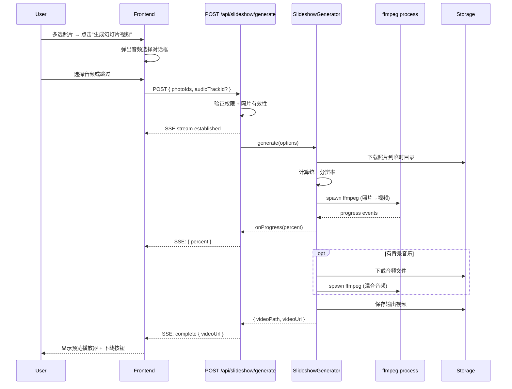

# Design Document: Photo Slideshow Video

## Overview

照片幻灯片视频生成功能允许用户在 MyGalleryPage 多选照片后，通过后端 ffmpeg 将照片按顺序拼接为幻灯片视频（每张 2 秒），可选配背景音乐，输出可下载/预览的 MP4 文件。

**核心设计决策：**
- 使用 `child_process.spawn` 调用 ffmpeg（与 CompilationEngine/ffmpegCompiler 相同模式）
- API 端点 `POST /api/slideshow/generate` 通过 SSE 流式返回进度
- 视频存储路径：`{tripId}/slideshow/`
- 前端在 MyGalleryPage 多选工具栏添加按钮，弹出 AudioPicker 对话框后发起请求
- 视频参数：H.264, 最大 1920x1080, 每张照片 2 秒, 黑边填充保持比例
- 音频处理：短于视频时循环，长于视频时截断，不选则无音轨

## Architecture

```mermaid
graph TB
    subgraph Frontend["Frontend (React)"]
        MG[MyGalleryPage - 多选工具栏]
        SD[SlideshowDialog - 音频选择对话框]
        SP[SlideshowProgress - 进度显示]
    end

    subgraph API["API Layer (Express)"]
        SR[Slideshow Route - POST /api/slideshow/generate]
        DL[Download Route - GET /api/slideshow/:id/download]
    end

    subgraph Services["Backend Services"]
        SG[SlideshowGenerator]
        FF[ffmpeg - child_process.spawn]
    end

    subgraph Storage["Data Layer"]
        DB[(SQLite - slideshow_jobs)]
        FS[StorageProvider - {tripId}/slideshow/]
        AT[audio_tracks - 已有]
    end

    MG --> SD
    SD --> SR
    SR --> SG
    SG --> FF
    SG --> FS
    SR --> SP
    DL --> FS
    SG --> AT
```

### Request Flow: Generate Slideshow Video



## Components and Interfaces

### 1. SlideshowGenerator (`server/src/services/slideshowGenerator.ts`)

核心服务，负责调用 ffmpeg 将照片序列拼接为视频并可选混合音频。

```typescript
interface SlideshowOptions {
  /** 照片文件路径列表（按用户选择顺序） */
  photoPaths: string[];
  /** 音频文件路径（可选） */
  audioPath?: string | null;
  /** 输出目录 */
  outputDir: string;
  /** 每张照片显示时长（秒），默认 2 */
  photoDuration?: number;
  /** 最大输出分辨率，默认 1080 */
  maxResolution?: number;
  /** 超时时间（毫秒），默认 300000 */
  timeoutMs?: number;
  /** 进度回调 */
  onProgress?: (percent: number) => void;
}

interface SlideshowResult {
  success: boolean;
  outputPath: string | null;
  totalDuration: number;
  /** 被跳过的照片索引（文件不存在或不可读） */
  skippedPhotos: number[];
  error?: string;
  warnings?: string[];
}

async function generateSlideshow(options: SlideshowOptions): Promise<SlideshowResult>;
```

**处理流程：**

1. **验证照片文件** — 检查每个路径是否存在且可读，跳过不可读的文件并记录警告
2. **计算输出分辨率** — 读取所有有效照片的尺寸，取最大宽高（不超过 1920x1080）
3. **生成 ffmpeg 输入** — 为每张照片创建 2 秒的输入配置
4. **执行 ffmpeg** — 使用 `child_process.spawn` 调用 ffmpeg，通过 stderr 解析进度
5. **混合音频**（可选）— 如果提供了音频，执行第二次 ffmpeg 调用混合音频
6. **返回结果** — 包含输出路径、总时长、跳过的照片列表

**ffmpeg 命令构建：**

```typescript
// 计算统一分辨率（不超过 1920x1080）
function calculateOutputResolution(
  photoDimensions: Array<{ width: number; height: number }>,
  maxWidth: number,
  maxHeight: number
): { width: number; height: number };

// 构建照片→视频的 ffmpeg 参数
function buildSlideshowArgs(
  photoPaths: string[],
  outputPath: string,
  resolution: { width: number; height: number },
  photoDuration: number
): string[];

// 构建音频混合的 ffmpeg 参数
function buildAudioMixArgs(
  videoPath: string,
  audioPath: string,
  outputPath: string,
  videoDuration: number,
  audioDuration: number
): string[];
```

### 2. Resolution Calculation Logic

```typescript
/**
 * 计算输出分辨率：
 * 1. 找到所有照片中的最大宽度和最大高度
 * 2. 如果超过 1920x1080，按比例缩小到 1920x1080 以内
 * 3. 确保宽高为偶数（ffmpeg H.264 要求）
 */
function calculateOutputResolution(
  photoDimensions: Array<{ width: number; height: number }>,
  maxWidth: number = 1920,
  maxHeight: number = 1080
): { width: number; height: number } {
  let targetW = Math.max(...photoDimensions.map(d => d.width));
  let targetH = Math.max(...photoDimensions.map(d => d.height));

  // Cap at max resolution
  if (targetW > maxWidth || targetH > maxHeight) {
    const scale = Math.min(maxWidth / targetW, maxHeight / targetH);
    targetW = Math.floor(targetW * scale);
    targetH = Math.floor(targetH * scale);
  }

  // Ensure even dimensions (H.264 requirement)
  targetW = targetW % 2 === 0 ? targetW : targetW - 1;
  targetH = targetH % 2 === 0 ? targetH : targetH - 1;

  return { width: targetW, height: targetH };
}
```

### 3. ffmpeg Slideshow Command

使用 ffmpeg 的 concat demuxer + scale+pad filter 实现：

```typescript
function buildSlideshowArgs(
  photoPaths: string[],
  outputPath: string,
  resolution: { width: number; height: number },
  photoDuration: number = 2
): string[] {
  // 每张照片作为独立输入，设置 loop=1 和 duration
  const inputArgs: string[] = [];
  const filterParts: string[] = [];

  for (let i = 0; i < photoPaths.length; i++) {
    inputArgs.push('-loop', '1', '-t', String(photoDuration), '-i', photoPaths[i]);
    // Scale to fit within target resolution, pad with black to exact size
    filterParts.push(
      `[${i}:v]scale=${resolution.width}:${resolution.height}:force_original_aspect_ratio=decrease,` +
      `pad=${resolution.width}:${resolution.height}:(ow-iw)/2:(oh-ih)/2:color=black,` +
      `setsar=1[v${i}]`
    );
  }

  // Concat all scaled streams
  const concatInputs = photoPaths.map((_, i) => `[v${i}]`).join('');
  const concatFilter = `${concatInputs}concat=n=${photoPaths.length}:v=1:a=0[outv]`;

  const filterComplex = [...filterParts, concatFilter].join(';');

  return [
    '-y',
    ...inputArgs,
    '-filter_complex', filterComplex,
    '-map', '[outv]',
    '-c:v', 'libx264',
    '-preset', 'medium',
    '-pix_fmt', 'yuv420p',
    '-movflags', '+faststart',
    '-an',  // No audio in first pass
    outputPath,
  ];
}
```

### 4. Audio Mixing Logic

```typescript
function buildAudioMixArgs(
  videoPath: string,
  audioPath: string,
  outputPath: string,
  videoDuration: number,
  audioDuration: number
): string[] {
  const needsLoop = audioDuration < videoDuration;

  const args: string[] = ['-y'];

  // Video input
  args.push('-i', videoPath);

  // Audio input (with loop if needed)
  if (needsLoop) {
    args.push('-stream_loop', '-1');
  }
  args.push('-i', audioPath);

  // Map video from first input, audio from second
  args.push('-map', '0:v', '-map', '1:a');

  // Copy video codec (no re-encoding), encode audio
  args.push('-c:v', 'copy', '-c:a', 'aac', '-b:a', '128k');

  // Truncate at video duration
  args.push('-t', String(videoDuration));

  args.push('-movflags', '+faststart');
  args.push(outputPath);

  return args;
}
```

### 5. Slideshow API Route (`server/src/routes/slideshow.ts`)

```typescript
// POST /api/slideshow/generate
interface GenerateRequest {
  tripId: string;
  photoIds: string[];       // 至少 2 个，按用户选择顺序
  audioTrackId?: string;    // 可选背景音乐 ID
}

// SSE Events:
// event: progress  data: { percent: number, message?: string }
// event: complete  data: { videoUrl: string, videoId: string, duration: number }
// event: error     data: { message: string, skippedPhotos?: number[] }
// event: heartbeat data: {}
```

**路由处理流程：**

1. 验证用户身份（authMiddleware + requireAuth）
2. 验证 tripId 存在且属于当前用户
3. 验证 photoIds 数量 >= 2
4. 验证所有 photoIds 属于该 trip 且为图片类型
5. 如果提供 audioTrackId，验证音频存在且属于当前用户
6. 建立 SSE 连接
7. 启动 SlideshowGenerator 异步任务
8. 通过 SSE 流式报告进度
9. 完成后发送 complete 事件（含视频 URL）

### 6. Download Endpoint

```typescript
// GET /api/slideshow/:filename
// 通过 mediaServing 路由提供静态文件访问
// Content-Disposition: attachment; filename="slideshow_xxx.mp4"
```

复用现有的 mediaServing 路由模式，为 slideshow 目录下的文件提供下载支持。

### 7. Frontend Components

#### MyGalleryPage 多选工具栏扩展

在现有多选模式的底部操作栏中添加"生成幻灯片视频"按钮：

```typescript
// 在 multiSelectMode && selectedIds.size >= 2 时显示
<button
  onClick={() => setShowSlideshowDialog(true)}
  disabled={slideshowGenerating}
  data-testid="generate-slideshow-btn"
>
  🎬 生成幻灯片视频
</button>
```

#### SlideshowDialog 组件

```typescript
interface SlideshowDialogProps {
  tripId: string;
  photoIds: string[];
  onClose: () => void;
  onComplete: (videoUrl: string) => void;
}
```

对话框流程：
1. 显示音频选择界面（复用 AudioLibraryPanel 的 selectable 模式）
2. 用户选择音频或点击"不加音乐"
3. 发起 SSE 请求，显示进度条
4. 完成后显示预览播放器和下载按钮

## Data Models

### New Table: `slideshow_jobs`

```sql
CREATE TABLE IF NOT EXISTS slideshow_jobs (
  id TEXT PRIMARY KEY,
  trip_id TEXT NOT NULL,
  user_id TEXT NOT NULL,
  status TEXT NOT NULL DEFAULT 'queued' CHECK(status IN ('queued', 'running', 'completed', 'failed')),
  photo_ids TEXT NOT NULL,           -- JSON array of photo IDs
  audio_track_id TEXT,               -- Optional audio track reference
  output_path TEXT,                  -- Storage path of generated video
  total_duration REAL,               -- Video duration in seconds
  skipped_photos TEXT,               -- JSON array of skipped photo indices
  error_message TEXT,
  percent INTEGER NOT NULL DEFAULT 0,
  created_at TEXT NOT NULL,
  completed_at TEXT,
  FOREIGN KEY (trip_id) REFERENCES trips(id),
  FOREIGN KEY (user_id) REFERENCES users(id),
  FOREIGN KEY (audio_track_id) REFERENCES audio_tracks(id)
);

CREATE INDEX IF NOT EXISTS idx_slideshow_jobs_trip_id ON slideshow_jobs(trip_id);
CREATE INDEX IF NOT EXISTS idx_slideshow_jobs_user_id ON slideshow_jobs(user_id);
```

| Column | Type | Description |
|--------|------|-------------|
| id | TEXT (UUID) | Primary key |
| trip_id | TEXT | 所属旅行 ID |
| user_id | TEXT | 创建用户 ID |
| status | TEXT | 任务状态: queued/running/completed/failed |
| photo_ids | TEXT | JSON 数组，照片 ID 列表（保持顺序） |
| audio_track_id | TEXT | 可选背景音乐 ID |
| output_path | TEXT | 生成视频的存储路径 |
| total_duration | REAL | 视频总时长（秒） |
| skipped_photos | TEXT | JSON 数组，被跳过的照片索引 |
| error_message | TEXT | 错误信息 |
| percent | INTEGER | 当前进度百分比 (0-100) |
| created_at | TEXT | 创建时间 ISO 8601 |
| completed_at | TEXT | 完成时间 ISO 8601 |

### Storage Layout

```
{tripId}/slideshow/slideshow_{jobId}.mp4    # 最终输出视频
```

## Error Handling

| Scenario | HTTP Status | Response / SSE Event | Recovery |
|----------|-------------|---------------------|----------|
| 照片数量 < 2 | 400 | `{ error: { code: "INVALID_REQUEST", message: "至少需要选择 2 张照片" } }` | 用户多选更多照片 |
| 照片 ID 无效或不属于该旅行 | 400 | `{ error: { code: "INVALID_PHOTOS", message: "...", invalidIds: [...] } }` | 用户重新选择 |
| 用户无权访问该旅行 | 403 | `{ error: { code: "FORBIDDEN", message: "无权操作此资源" } }` | — |
| 部分照片文件不可读 | — | SSE progress 继续，warnings 中报告 | 跳过不可读照片继续生成 |
| 所有照片均不可读 | — | SSE error: `{ message: "所有照片均无法读取" }` | 用户检查照片后重试 |
| ffmpeg 超时 (>5分钟) | — | SSE error: `{ message: "视频生成超时" }` | 用户重试（减少照片数量） |
| ffmpeg 进程错误 | — | SSE error: `{ message: "视频生成失败: ..." }` | 用户重试 |
| 音频文件不可读 | — | 忽略音频，生成无音轨视频，warnings 中报告 | 自动降级 |
| 已有任务正在处理 | 409 | `{ error: { code: "ALREADY_PROCESSING", message: "..." } }` | 等待当前任务完成 |

**错误恢复原则：**
- 部分照片不可读时降级处理（跳过并警告），不中断整体流程
- 音频不可读时降级为无音轨视频
- 所有临时文件在 finally 块中清理
- ffmpeg 超时通过 SIGKILL 强制终止

## Correctness Properties

*A property is a characteristic or behavior that should hold true across all valid executions of a system — essentially, a formal statement about what the system should do. Properties serve as the bridge between human-readable specifications and machine-verifiable correctness guarantees.*

### Property 1: Photo order preservation

*For any* ordered list of photo paths, the generated ffmpeg command arguments SHALL reference the photos in exactly the same order as the input list, ensuring the slideshow plays photos in the user-specified sequence.

**Validates: Requirements 3.1**

### Property 2: Total duration equals photo count times 2 seconds

*For any* valid set of N photos (where N >= 2), the total video duration produced by the slideshow generator SHALL equal exactly N * 2 seconds.

**Validates: Requirements 3.2**

### Property 3: Output resolution scaling and capping

*For any* set of photo dimensions, the calculated output resolution SHALL satisfy: (a) width ≤ 1920 and height ≤ 1080, (b) width and height are both even numbers, (c) the aspect ratio of the bounding box is preserved when scaling down from dimensions exceeding the maximum.

**Validates: Requirements 3.4, 3.5**

### Property 4: Audio duration matches video duration

*For any* audio track duration and video duration (N * 2 seconds), the audio mixing ffmpeg command SHALL produce output where the audio is truncated to exactly the video duration — achieved by looping when audio is shorter, or direct truncation when audio is longer.

**Validates: Requirements 4.2, 4.3**

### Property 5: Invalid photo ID detection

*For any* request containing a mix of valid and invalid photo IDs (where invalid means non-existent or not belonging to the trip), the API validation SHALL identify and return exactly the set of invalid IDs in the error response.

**Validates: Requirements 2.4**

### Property 6: Missing photo graceful degradation

*For any* set of photo paths where some files are unreadable, the slideshow generator SHALL: (a) skip exactly the unreadable files, (b) include exactly the readable files in the output, (c) report the indices of skipped files in the warnings, and (d) produce a valid video if at least one photo is readable.

**Validates: Requirements 7.2, 7.3**

### Property 7: Access control enforcement

*For any* user and trip combination, the slideshow API SHALL grant access only when the user owns the trip (user_id matches) or the user has admin role. All other combinations SHALL be rejected with 403.

**Validates: Requirements 2.1**

## Testing Strategy

### Unit Tests

- **SlideshowGenerator**: Test ffmpeg argument construction for various photo counts and dimensions
- **Resolution calculation**: Test `calculateOutputResolution` with edge cases (all same size, mixed sizes, very large photos, single pixel)
- **Audio mix args**: Test `buildAudioMixArgs` for loop vs truncate cases
- **API validation**: Test request validation (photo count, ownership, invalid IDs)

### Property-Based Tests

Property-based testing is appropriate for this feature because the resolution calculation, ffmpeg argument building, and audio duration logic are pure functions with clear input/output behavior and large input spaces.

**Library:** [fast-check](https://github.com/dubzzz/fast-check) (TypeScript)

**Configuration:** Minimum 100 iterations per property test.

**Properties to implement:**
1. Photo order preservation (Property 1) — Tag: `Feature: photo-slideshow-video, Property 1: Photo order preservation`
2. Total duration calculation (Property 2) — Tag: `Feature: photo-slideshow-video, Property 2: Total duration equals photo count times 2 seconds`
3. Resolution scaling and capping (Property 3) — Tag: `Feature: photo-slideshow-video, Property 3: Output resolution scaling and capping`
4. Audio duration matching (Property 4) — Tag: `Feature: photo-slideshow-video, Property 4: Audio duration matches video duration`
5. Missing photo graceful degradation (Property 6) — Tag: `Feature: photo-slideshow-video, Property 6: Missing photo graceful degradation`

### Integration Tests

- Full SSE flow: send valid request → receive progress events → receive complete event
- Download endpoint: verify Content-Disposition header and file serving
- Access control: verify 403 for non-owner users
- Concurrent request rejection: verify 409 when job already running

### E2E Tests

- Full workflow: multi-select photos → open dialog → skip audio → progress → preview + download
- With audio: multi-select → select audio → progress → verify video has audio track
