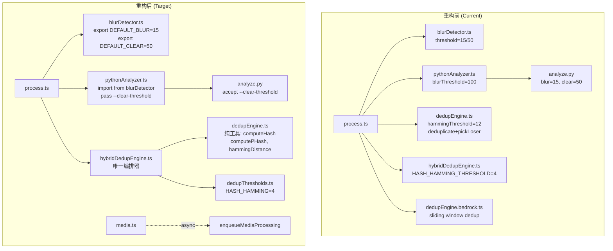
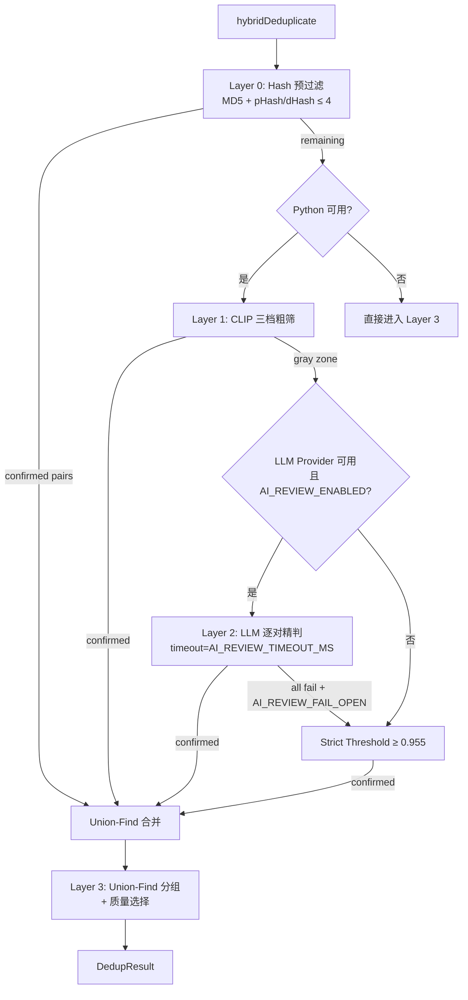
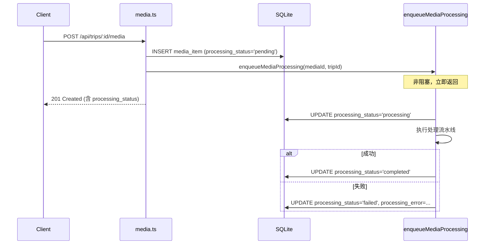

# 设计文档：处理流水线统一重构 (Pipeline Consolidation)

## 概述

本设计文档描述如何统一图片处理流水线中的模糊检测阈值、去重引擎架构、质量选择、环境变量配置和上传后异步处理触发。核心目标是消除多条代码路径中的阈值不一致、退役遗留代码、修复 SQL 查询缺失字段，并为上传路由添加非阻塞异步处理。

### 设计原则

1. **单一真相源 (Single Source of Truth)**：所有阈值常量集中在 `blurDetector.ts`（模糊阈值）和 `dedupThresholds.ts`（去重阈值）中定义
2. **纯工具函数分离**：`dedupEngine.ts` 退化为无状态纯工具模块，不再包含编排逻辑
3. **唯一编排器**：`hybridDedupEngine.ts` 作为所有去重操作的唯一入口
4. **渐进退役**：遗留代码通过 `@deprecated` 标记而非立即删除，保持向后兼容
5. **非阻塞上传**：上传路由在 INSERT 后立即返回，处理在后台异步执行

## 架构

### 重构前后对比



### 去重引擎层级架构（重构后）



### 上传异步处理流程



## 组件与接口

### 1. blurDetector.ts — 模糊检测模块

**变更：导出阈值常量**

```typescript
// 新增导出
export const DEFAULT_BLUR_THRESHOLD = 15;   // < 15 → blurry
export const DEFAULT_CLEAR_THRESHOLD = 50;  // >= 50 → clear, 15~50 → suspect

// 现有函数保持不变
export async function computeSharpness(imagePath: string): Promise<number>;
export function classifyBlur(variance: number, blurThreshold: number, clearThreshold?: number): BlurStatus;
export async function detectBlurry(tripId: string, options?: BlurDetectOptions): Promise<BlurDetectResult>;
```

### 2. pythonAnalyzer.ts — Python 分析器

**变更：导入阈值、传递 --clear-threshold**

```typescript
import { DEFAULT_BLUR_THRESHOLD, DEFAULT_CLEAR_THRESHOLD } from './blurDetector';

export async function analyzeImages(
  imagePaths: string[],
  options?: {
    blurThreshold?: number;   // 默认 DEFAULT_BLUR_THRESHOLD (15)
    clearThreshold?: number;  // 新增，默认 DEFAULT_CLEAR_THRESHOLD (50)
    modelDir?: string;
  }
): Promise<PythonAnalyzeResult[]>;

// 内部 runAnalyzeBatch 新增 --clear-threshold 参数
// args = [..., '--blur-threshold', String(blurThreshold), '--clear-threshold', String(clearThreshold)]
```

### 3. analyze.py — Python CLI

**变更：analyze 子命令已有 --clear-threshold 参数（当前代码已支持），确认默认值为 50**

```python
# analyze 子命令参数（已存在，确认正确）
analyze_parser.add_argument(
    "--clear-threshold", type=float, default=50.0,
    help="Blur detection upper threshold (default: 50)"
)
```

### 4. dedupEngine.ts — 纯工具模块

**变更：移除 deduplicate()、pickLoser()、SlidingWindowDedupOptions**

```typescript
// 仅保留三个纯函数
export async function computeHash(imagePath: string): Promise<string>;
export async function computePHash(imagePath: string): Promise<string>;
export function hammingDistance(hash1: string, hash2: string): number;

// 保留 DedupResult 类型导出（hybridDedupEngine 依赖）
export interface DedupResult {
  kept: string[];
  removed: string[];
  removedCount: number;
}
```

### 5. hybridDedupEngine.ts — 唯一编排器

**变更：ImageRow 添加 blur_status、支持 Python 不可用回退**

```typescript
export interface ImageRow {
  id: string;
  file_path: string;
  original_filename: string;
  sharpness_score: number | null;
  blur_status: string | null;        // 新增
  width: number | null;
  height: number | null;
  file_size: number;
  status: string;
  trashed_reason: string | null;
  created_at: string;
}

// SQL 查询新增 blur_status
// SELECT id, file_path, ..., blur_status, ... FROM media_items WHERE ...

// hybridDeduplicate 新增 Python 不可用回退逻辑
export async function hybridDeduplicate(
  tripId: string,
  options?: HybridDedupOptions & { pythonAvailable?: boolean }
): Promise<DedupResult>;
// 当 pythonAvailable=false 时，跳过 Layer 1 和 Layer 2，仅执行 Layer 0 + Layer 3
```

### 6. qualitySelector.ts — 批量辅助函数

**新增函数**

```typescript
/**
 * 根据 media ID 列表查询 DB 获取 file_path，下载图片，计算质量评分，
 * 返回 overall 最高的 media ID。
 */
export async function selectBestFromMediaIds(mediaIds: string[]): Promise<string>;

/**
 * 根据 media ID 列表查询 DB 获取 file_path，下载图片，计算质量评分，
 * 返回每个 media ID 的评分。
 */
export async function scoreMediaIds(
  mediaIds: string[]
): Promise<Array<{ mediaId: string; score: QualityScore }>>;
```

### 7. media.ts — 上传路由

**新增异步处理触发**

```typescript
// 新增非阻塞函数
function enqueueMediaProcessing(mediaId: string, tripId: string): void {
  // 使用 setImmediate / Promise 在事件循环下一轮执行
  // 不 await，不阻塞上传响应
  setImmediate(async () => {
    const db = getDb();
    try {
      db.prepare("UPDATE media_items SET processing_status = 'processing' WHERE id = ?").run(mediaId);
      // 执行单文件处理流水线（模糊检测、缩略图等）
      // ...
      db.prepare("UPDATE media_items SET processing_status = 'completed' WHERE id = ?").run(mediaId);
    } catch (err) {
      const msg = err instanceof Error ? err.message : String(err);
      db.prepare("UPDATE media_items SET processing_status = 'failed', processing_error = ? WHERE id = ?").run(msg, mediaId);
    }
  });
}
```

### 8. process.ts — 处理路由

**变更：移除旧 deduplicate 导入，使用 hybridDeduplicate 统一路径**

```typescript
// 移除
// import { deduplicate } from '../services/dedupEngine';

// Node.js 回退路径改为
import { isPythonAvailable } from '../services/pythonAnalyzer';
import { hybridDeduplicate } from '../services/hybridDedupEngine';

// Python 不可用时：
const dedupResult = await hybridDeduplicate(tripId, { pythonAvailable: false });
// 内部仅执行 Layer 0 + Layer 3
```

### 9. .env.example — 环境变量

**新增 AI_REVIEW_* 变量**

```dotenv
# ========== AI 审查配置 ==========
# 是否启用 LLM 逐对审查（Layer 2），默认 true
# AI_REVIEW_ENABLED=true

# LLM 审查失败时是否回退到 Strict Threshold，默认 true
# AI_REVIEW_FAIL_OPEN=true

# 单次 LLM 审查超时时间（毫秒），默认 30000
# AI_REVIEW_TIMEOUT_MS=30000
```

### 10. dedupEngine.bedrock.ts — 废弃标记

```typescript
/**
 * @deprecated 此模块已废弃。请使用 llmPairReviewer.ts 进行 LLM 逐对审查，
 * 或使用 hybridDedupEngine.ts 作为去重入口。
 * 多图窗口分组策略对旅行照片过于激进，已被逐对审查替代。
 */

// deduplicate() 函数添加运行时废弃警告
export async function deduplicate(...): Promise<DedupResult> {
  console.warn('[DEPRECATED] dedupEngine.bedrock.deduplicate() is deprecated. Use hybridDedupEngine.hybridDeduplicate() instead.');
  // ... 现有逻辑保持不变
}
```


## 数据模型

### media_items 表变更

新增 `processing_status` 列：

```sql
-- Migration: add processing_status column
ALTER TABLE media_items ADD COLUMN processing_status TEXT DEFAULT 'none';
-- 可选值: 'none' | 'pending' | 'processing' | 'completed' | 'failed'
```

### ImageRow 类型（hybridDedupEngine.ts）

```typescript
// 新增 blur_status 字段
export interface ImageRow {
  id: string;
  file_path: string;
  original_filename: string;
  sharpness_score: number | null;
  blur_status: string | null;        // 新增：'clear' | 'suspect' | 'blurry' | null
  width: number | null;
  height: number | null;
  file_size: number;
  status: string;
  trashed_reason: string | null;
  created_at: string;
}
```

### 环境变量配置模型

| 变量名 | 类型 | 默认值 | 用途 |
|--------|------|--------|------|
| `AI_PROVIDER` | string | `'bedrock'` | bedrockClient.ts 的 provider 选择 |
| `LLM_DEDUP_PROVIDER` | string | `''` (自动检测) | llmPairReviewer.ts 首选 provider |
| `AI_REVIEW_ENABLED` | boolean | `true` | 是否启用 Layer 2 LLM 审查 |
| `AI_REVIEW_FAIL_OPEN` | boolean | `true` | LLM 失败时是否回退 Strict Threshold |
| `AI_REVIEW_TIMEOUT_MS` | number | `30000` | 单次 LLM 审查超时（ms） |

### 阈值常量汇总

| 常量 | 定义位置 | 值 | 用途 |
|------|----------|-----|------|
| `DEFAULT_BLUR_THRESHOLD` | blurDetector.ts | 15 | blur_score < 15 → blurry |
| `DEFAULT_CLEAR_THRESHOLD` | blurDetector.ts | 50 | blur_score >= 50 → clear |
| `HASH_HAMMING_THRESHOLD` | dedupThresholds.ts | 4 | Layer 0 pHash/dHash 阈值 |
| `CLIP_CONFIRMED_THRESHOLD` | dedupThresholds.ts | 0.94 | Layer 1 confirmed 阈值 |
| `CLIP_STRICT_THRESHOLD` | dedupThresholds.ts | 0.955 | Strict Threshold 回退阈值 |


## 正确性属性 (Correctness Properties)

*属性是系统在所有有效执行中都应保持为真的特征或行为——本质上是关于系统应该做什么的形式化陈述。属性是人类可读规范与机器可验证正确性保证之间的桥梁。*

### Property 1: 模糊检测错误状态一致性

*对于任意*图片路径，当模糊检测计算过程中发生异常时，返回的 blur_status 应始终为 `'suspect'`，而非 `'unknown'` 或其他值。

**Validates: Requirements 1.6**

### Property 2: Hash 对分类正确性

*对于任意*两个 16 字符十六进制哈希字符串对 (pHash_A, pHash_B) 和 (dHash_A, dHash_B)，当 `hammingDistance(pHash_A, pHash_B) ≤ 4` 且 `hammingDistance(dHash_A, dHash_B) ≤ 4` 时，Layer 0 应将该对判定为确认重复；当任一距离 > 4 时，不应判定为确认重复。

**Validates: Requirements 3.3**

### Property 3: 清晰图片在质量选择中优先于模糊图片

*对于任意*包含至少一张 blur_status='clear' 和至少一张 blur_status='blurry' 图片的重复组，质量选择器应选择 blur_status='clear' 的图片作为保留项（假设其他维度评分相同）。

**Validates: Requirements 4.2, 4.3**

### Property 4: selectBestFromMediaIds 返回最高评分

*对于任意*非空 media ID 列表及其对应的质量评分，`selectBestFromMediaIds()` 返回的 media ID 应是 overall 评分最高的那个。当存在评分相同的情况时，返回其中任一即可。

**Validates: Requirements 5.3**

### Property 5: hammingDistance 对称性与非负性

*对于任意*两个等长十六进制哈希字符串 A 和 B，`hammingDistance(A, B) === hammingDistance(B, A)`（对称性），且 `hammingDistance(A, B) >= 0`（非负性），且 `hammingDistance(A, A) === 0`（自反性）。

**Validates: Requirements 3.3**

### Property 6: 哈希计算幂等性

*对于任意*有效图片文件路径，连续两次调用 `computeHash(path)` 应返回相同的哈希值；连续两次调用 `computePHash(path)` 也应返回相同的哈希值。即 `f(x) === f(f_input(x))` 的幂等性。

**Validates: Requirements 2.1**

## 错误处理

### 模糊检测错误

| 场景 | 处理方式 |
|------|----------|
| sharp 读取图片失败 | blur_status = 'suspect'，sharpness_score = null，追加 processing_error |
| Python OpenCV 失败 | blur_status = 'suspect'（重构后统一，不再返回 'unknown'） |
| Python 进程崩溃 | 整体回退到 Node.js blurDetector |

### 去重引擎错误

| 场景 | 处理方式 |
|------|----------|
| Python 不可用 | hybridDeduplicate 仅执行 Layer 0 + Layer 3 |
| Layer 0 单图哈希计算失败 | 跳过该图，传递给 Layer 1 |
| Layer 1 CLIP 搜索失败 | 跳过 Layer 1，灰区对为空 |
| Layer 2 所有 LLM provider 失败 | 若 AI_REVIEW_FAIL_OPEN=true，回退 Strict Threshold；否则丢弃该对 |
| Layer 2 单对超时 | 超时时间由 AI_REVIEW_TIMEOUT_MS 控制，超时视为该 provider 失败，尝试下一个 |
| Layer 3 质量评分计算失败 | 赋予 overall=0，继续处理 |

### 上传异步处理错误

| 场景 | 处理方式 |
|------|----------|
| enqueueMediaProcessing 内部异常 | processing_status = 'failed'，processing_error 记录错误信息 |
| 处理过程中图片被删除 | 检查文件存在性，不存在则标记 failed |
| 数据库更新失败 | 捕获异常，记录到 console.error |

### 环境变量缺失

| 变量 | 缺失时行为 |
|------|-----------|
| AI_REVIEW_ENABLED | 默认 true，启用 Layer 2 |
| AI_REVIEW_FAIL_OPEN | 默认 true，LLM 失败回退 Strict Threshold |
| AI_REVIEW_TIMEOUT_MS | 默认 30000ms |
| AI_PROVIDER | 默认 'bedrock' |
| LLM_DEDUP_PROVIDER | 默认空，自动检测 |

## 测试策略

### 双轨测试方法

本项目采用单元测试 + 属性测试的双轨方法：

- **单元测试 (Unit Tests)**：验证具体示例、边界条件和错误场景
- **属性测试 (Property-Based Tests)**：验证跨所有输入的通用属性

### 属性测试库

使用 [fast-check](https://github.com/dubzzz/fast-check) 作为 TypeScript 属性测试库，配合 vitest 测试框架。

### 属性测试配置

- 每个属性测试最少运行 **100 次迭代**
- 每个属性测试必须通过注释引用设计文档中的属性编号
- 标签格式：**Feature: pipeline-consolidation, Property {number}: {property_text}**
- 每个正确性属性由**单个**属性测试实现

### 单元测试计划

| 测试文件 | 覆盖需求 | 测试内容 |
|----------|----------|----------|
| `blurDetector.test.ts` | 1.1 | 验证 DEFAULT_BLUR_THRESHOLD=15, DEFAULT_CLEAR_THRESHOLD=50 导出 |
| `dedupEngine.test.ts` | 2.1, 2.2 | 验证仅导出 computeHash, computePHash, hammingDistance；deduplicate 不存在 |
| `hybridDedupEngine.test.ts` | 2.4, 4.1 | Python 不可用时仅执行 L0+L3；ImageRow 包含 blur_status |
| `qualitySelector.test.ts` | 5.1, 5.2, 5.4 | selectBestFromMediaIds 和 scoreMediaIds 存在；失败时 overall=0 |
| `pythonAnalyzer.test.ts` | 1.2, 1.3 | 默认 blurThreshold=15；args 包含 --clear-threshold |
| `media.test.ts` | 8.1-8.7 | 上传后 processing_status=pending；enqueueMediaProcessing 被调用 |
| `process.test.ts` | 2.5, 9.3 | 无 deduplicate 导入；无 BedrockDedupEngine 导入 |

### 属性测试计划

| 属性 | 测试文件 | 生成器 |
|------|----------|--------|
| Property 1: 错误状态一致性 | `blurDetector.property.test.ts` | 生成随机图片路径（含无效路径） |
| Property 2: Hash 对分类 | `hybridDedupEngine.property.test.ts` | 生成随机 16 字符十六进制字符串对 |
| Property 3: 清晰优先 | `qualitySelector.property.test.ts` | 生成随机质量评分组（含 clear/blurry） |
| Property 4: 最高评分选择 | `qualitySelector.property.test.ts` | 生成随机 QualityScore 数组 |
| Property 5: hammingDistance 对称性 | `dedupEngine.property.test.ts` | 生成随机等长十六进制字符串对 |
| Property 6: 哈希幂等性 | `dedupEngine.property.test.ts` | 使用固定测试图片，多次调用 |

