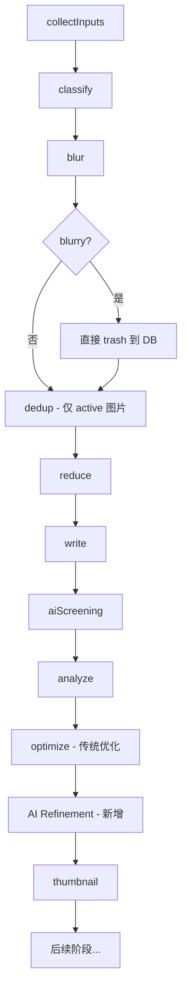
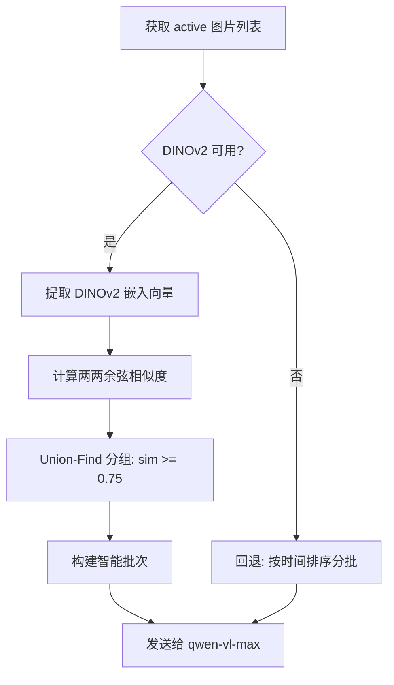

# Design Document: Pipeline Image Optimization

## Overview

本设计文档描述旅行相册 pipeline 的四项优化改进：

1. **模糊检测直接 trash**：将 blur 阶段从"仅标记"改为"立即 trash"，使后续阶段不再处理确认模糊的图片，节省 dedup 和 AI 筛选的计算资源。
2. **AI 精修阶段**：新增 `aiImageOptimizer.ts` 服务，在传统 optimize 阶段之后调用 qwen-vl-max（DashScope）获取针对性的亮度/对比度/饱和度/锐度调整建议，再用 sharp 执行调整。
3. **AI 筛选分批优化**：利用 DINOv2 嵌入向量对图片预分组，确保视觉相似的图片在同一批次内被 AI 审查，解决跨批次相似图片遗漏问题。
4. **DINOv2 阈值确认**：将 `DINOV2_DEDUP_THRESHOLD` 默认值确认为 0.9，解决人物照片过度去重问题。

设计原则：
- **渐进增强**：AI 精修为可选阶段，任何失败不影响 pipeline 整体流程
- **保守调整**：参数裁剪到安全范围 [0, 2]，避免异常参数破坏图片质量
- **资源节约**：blur 阶段提前淘汰模糊图片，减少后续阶段的无效计算
- **智能分批**：相似度预分组提升 AI 筛选的去重效果

## Architecture

### Pipeline 阶段执行顺序



### 关键变更点

| 变更 | 位置 | 影响 |
|------|------|------|
| blur 阶段直接 trash | `runBlurStage()` 函数末尾 | 新增 DB 写入逻辑 |
| 后续阶段过滤 | `runDedupStage()`, `runAiScreening()` | 已有 `status='active'` 过滤，无需修改 |
| AI 精修阶段 | 新文件 `aiImageOptimizer.ts` | optimize 之后、thumbnail 之前插入 |
| AI 筛选分批优化 | 修改 `aiImageScreener.ts` | 新增相似度预分组逻辑 |
| DINOv2 阈值 | `dedupThresholds.ts` | 默认值已为 0.9，确认不变 |

## Components and Interfaces

### 1. Blur Stage 修改（`runBlurStage` 增强）

在现有 `runBlurStage` 函数末尾增加 DB 写入逻辑：

```typescript
// 在 runBlurStage 末尾新增
async function applyBlurTrash(
  contexts: ImageProcessContext[],
  db: Database
): Promise<{ trashedCount: number }> {
  const trashStmt = db.prepare(
    `UPDATE media_items 
     SET status = 'trashed', trashed_reason = 'blur', 
         blur_status = 'blurry', sharpness_score = ?
     WHERE id = ?`
  );
  const updateStmt = db.prepare(
    `UPDATE media_items SET blur_status = ?, sharpness_score = ? WHERE id = ?`
  );
  const errorStmt = db.prepare(
    `UPDATE media_items 
     SET blur_status = 'suspect', status = 'active',
         processing_error = CASE
           WHEN processing_error IS NULL THEN ?
           ELSE processing_error || char(10) || ?
         END
     WHERE id = ?`
  );

  let trashedCount = 0;
  for (const ctx of contexts) {
    if (!ctx.blur) continue;
    if (ctx.blur.blurStatus === 'blurry') {
      trashStmt.run(ctx.blur.sharpnessScore, ctx.mediaId);
      trashedCount++;
    } else {
      updateStmt.run(ctx.blur.blurStatus, ctx.blur.sharpnessScore, ctx.mediaId);
    }
  }
  return { trashedCount };
}
```

### 2. AI 精修服务（`aiImageOptimizer.ts` — 新文件）

```typescript
// server/src/services/aiImageOptimizer.ts

export interface AdjustmentParams {
  brightness: number;  // 0~2, 1.0 = 不调整
  contrast: number;    // 0~2, 1.0 = 不调整
  saturation: number;  // 0~2, 1.0 = 不调整
  sharpness: number;   // 0~2, 1.0 = 不调整
}

export interface AiOptimizeResult {
  mediaId: string;
  optimizedPath: string | null;
  params: AdjustmentParams | null;
  skipped: boolean;
  error?: string;
}

export interface AiOptimizeBatchResult {
  totalProcessed: number;
  optimizedCount: number;
  skippedCount: number;
  errorCount: number;
  results: AiOptimizeResult[];
}

// 核心函数签名
export async function runAiRefinement(tripId: string): Promise<AiOptimizeBatchResult>;
export function parseAdjustmentParams(responseText: string): AdjustmentParams | null;
export function validateAndClamp(raw: Record<string, unknown>): AdjustmentParams;
export async function applyAdjustments(
  imagePath: string, 
  params: AdjustmentParams, 
  tripId: string, 
  mediaId: string
): Promise<string>;
```

### 3. DashScope 客户端调用

复用现有 `aiImageScreener.ts` 中的 DashScope 客户端模式（OpenAI 兼容协议）：

```typescript
function createRefinementClient(): OpenAI {
  const apiKey = process.env.DASHSCOPE_API_KEY;
  if (!apiKey) throw new Error('DASHSCOPE_API_KEY required');
  const baseURL = process.env.DASHSCOPE_BASE_URL || 
    'https://dashscope.aliyuncs.com/compatible-mode/v1';
  return new OpenAI({ apiKey, baseURL, timeout: 30000 });
}
```

### 4. AI 筛选相似度预分组（`aiImageScreener.ts` 修改）

在 `runAiScreening` 函数中，替换原有的按时间排序分批逻辑为相似度预分组：

```typescript
// 相似度预分组常量
const GROUPING_THRESHOLD = 0.75; // DINOv2 余弦相似度分组阈值
const BATCH_SIZE = 10;

interface SimilarityGroup {
  imageIds: string[];
  centroidIdx: number; // 组内代表图片的索引
}

/**
 * 利用 DINOv2 嵌入向量对图片进行相似度预分组。
 * 使用 Union-Find 将相似度 >= threshold 的图片归入同一组。
 */
async function groupBySimilarity(
  images: Array<{ id: string; file_path: string }>,
  threshold: number
): Promise<SimilarityGroup[]>;

/**
 * 基于相似度分组构建 AI 筛选批次。
 * 优先将同组图片放入同一批次，不足时用相邻组或未分组图片填充。
 */
function buildSmartBatches(
  images: Array<{ id: string; file_path: string }>,
  groups: SimilarityGroup[],
  batchSize: number
): Array<Array<{ id: string; file_path: string }>>;
```

**分组算法流程：**



**批次构建策略：**
1. 按组大小降序排列
2. 大组（> BATCH_SIZE）拆分为多个批次
3. 小组合并填充：优先选择与当前组相似度最高的其他小组
4. 未分组图片（孤立图片）填充剩余空间

### 5. Pipeline 集成点

在 `runTripProcessingPipeline.ts` 中，optimize 阶段之后、thumbnail 阶段之前插入：

```typescript
// ---- Stage: aiRefinement (optional) ----
const aiRefinementEnabled = process.env.AI_REVIEW_ENABLED === 'true';
const dashScopeConfigured = !!process.env.DASHSCOPE_API_KEY;
if (aiRefinementEnabled && dashScopeConfigured) {
  onProgress('aiRefinement', 'start');
  t0 = Date.now();
  try {
    const refinementResult = await runAiRefinement(tripId);
    console.log(`[pipeline] aiRefinement: ${refinementResult.optimizedCount} optimized, ${Date.now() - t0}ms`);
    onProgress('aiRefinement', 'complete', `${refinementResult.optimizedCount} refined`);
  } catch (err) {
    const msg = err instanceof Error ? err.message : String(err);
    stageErrors.push({ stage: 'aiRefinement', error: msg });
    onProgress('aiRefinement', 'complete', `failed: ${msg}`);
  }
}
```

## Data Models

### 数据库字段（已有，无需 migration）

`media_items` 表相关字段：

| 字段 | 类型 | 用途 |
|------|------|------|
| `status` | TEXT | 'active' / 'trashed' |
| `trashed_reason` | TEXT | 'blur' / 'duplicate' / 'ai_screening' |
| `blur_status` | TEXT | 'clear' / 'suspect' / 'blurry' |
| `sharpness_score` | REAL | Laplacian 方差值 |
| `optimized_path` | TEXT | 优化后图片的存储路径 |
| `processing_error` | TEXT | 处理错误日志（多行追加） |

### AdjustmentParams 数据结构

```typescript
interface AdjustmentParams {
  brightness: number;  // [0, 2], 1.0 = 无调整
  contrast: number;    // [0, 2], 1.0 = 无调整
  saturation: number;  // [0, 2], 1.0 = 无调整
  sharpness: number;   // [0, 2], 1.0 = 无调整
}
```

**校验规则：**
- 缺失字段 → 默认 1.0
- 非数值类型（null、string、boolean、NaN）→ 默认 1.0
- 超出 [0, 2] 范围 → 裁剪到边界值

### DashScope Prompt 设计（AI 精修）

```
你是一位专业的水下摄影后期处理专家。请分析这张水下照片，给出精确的调整建议。

请返回 JSON 格式：
{"brightness": 1.0, "contrast": 1.0, "saturation": 1.0, "sharpness": 1.0}

规则：
- 每个值范围 0~2，1.0 表示不调整
- brightness: 水下照片通常偏暗，适当提亮（1.1~1.4）
- contrast: 水下散射降低对比度，适当增强（1.1~1.3）
- saturation: 水下色彩衰减，适当增强（1.1~1.5）
- sharpness: 轻微锐化改善清晰度（1.0~1.3）
- 如果照片已经很好，返回全 1.0
- 不要过度调整，宁可保守
```

### 关于 AI Screening 分批优化的设计决策

当前 AI screening 按上传时间排序、每 10 张一批发送给 qwen-vl-max。这导致一个问题：**如果相似图片（如同一场景连拍）跨越了批次边界，AI 无法在同一批次内比较它们，相似图片可能都被保留。**

**解决方案：DINOv2 相似度预分组**

利用 dedup 阶段已经计算的 DINOv2 嵌入向量（通过 Python 服务的 `extractEmbeddings` 函数），在 AI screening 之前对图片进行相似度聚类：

1. **复用已有能力**：DINOv2 嵌入提取已在 `hybridDedupEngine.ts` 中实现，AI screening 可复用相同的 Python 服务接口
2. **分组阈值 0.75**：低于 dedup 阈值 0.9，确保"视觉相似但不完全重复"的图片也能被分到同一批次
3. **优雅降级**：当 Python 服务不可用时，回退到原有的时间排序分批策略

### Sharp 调整映射

| AdjustmentParams 字段 | Sharp 操作 | 说明 |
|----------------------|-----------|------|
| `brightness` | `sharp.modulate({ brightness })` | 亮度乘数 |
| `contrast` | `sharp.linear(contrast, -(128 * (contrast - 1)))` | 线性对比度 |
| `saturation` | `sharp.modulate({ saturation })` | 饱和度乘数 |
| `sharpness` | `sharp.sharpen({ sigma: (sharpness - 1) * 2 })` | 仅 > 1.0 时锐化 |

## Correctness Properties

*A property is a characteristic or behavior that should hold true across all valid executions of a system — essentially, a formal statement about what the system should do. Properties serve as the bridge between human-readable specifications and machine-verifiable correctness guarantees.*

### Property 1: Blur 阶段状态转换正确性

*For any* image with `blurStatus = 'blurry'`, after the blur stage applies its DB update, the image SHALL have `status = 'trashed'`, `trashed_reason = 'blur'`, `blur_status = 'blurry'`, and a non-null `sharpness_score`. Conversely, *for any* image with `blurStatus` of 'suspect' or 'clear', the image SHALL have `status = 'active'`.

**Validates: Requirements 1.1, 1.4, 1.5**

### Property 2: 后续阶段仅处理 active 图片

*For any* set of images entering a pipeline stage after blur (dedup, AI screening, AI refinement), the stage input SHALL contain only images with `status = 'active'`, and no image with `status = 'trashed'` SHALL be included.

**Validates: Requirements 1.2, 1.3, 2.2**

### Property 3: Reduce 阶段保持 blur trash 决策

*For any* `ImageProcessContext` array where some contexts have `blur.blurStatus = 'blurry'`, the `reduce()` function SHALL produce decisions where those images have `finalStatus = 'trashed'` and `trashedReasons` includes `'blur'`.

**Validates: Requirements 1.6**

### Property 4: AdjustmentParams 解析与校验的完整性

*For any* raw text response from DashScope (including valid JSON, markdown-wrapped JSON, partial JSON, or completely invalid text), the `parseAdjustmentParams` function SHALL either return a valid `AdjustmentParams` object where all four fields are numbers in [0, 2], or return null. When a field is missing, non-numeric, or out of range, it SHALL be defaulted to 1.0 or clamped to [0, 2].

**Validates: Requirements 2.4, 3.1, 3.2, 3.3, 3.5**

### Property 5: Sharp 仅对非 1.0 字段执行调整

*For any* valid `AdjustmentParams`, the sharp processing SHALL only apply operations for fields whose values differ from 1.0. If all four fields equal 1.0, no sharp processing SHALL occur and the existing `optimized_path` SHALL remain unchanged.

**Validates: Requirements 2.5, 2.9, 2.10**

### Property 6: AI 精修错误隔离

*For any* batch of images processed by AI refinement, if the DashScope call fails for one image (network error, timeout, invalid response), the remaining images SHALL still be processed independently, and the failed image's existing `optimized_path` SHALL remain unchanged.

**Validates: Requirements 2.7, 4.3**

### Property 7: DINOv2 阈值解析正确性

*For any* value of the `DINOV2_DEDUP_THRESHOLD` environment variable, the effective threshold SHALL be: the parsed float value if it is a valid number in [0.0, 1.0], otherwise the default 0.9. Invalid values SHALL trigger a warning log.

**Validates: Requirements 5.1, 5.2, 5.3**

### Property 8: JSON 提取的鲁棒性

*For any* text containing a valid JSON object (possibly wrapped in markdown code blocks or surrounded by prose), the `parseAdjustmentParams` function SHALL successfully extract and parse the JSON. *For any* text containing no valid JSON object, it SHALL return null.

**Validates: Requirements 3.3, 3.4**

### Property 9: 相似度预分组保证同组图片在同一批次

*For any* set of images where a subset has DINOv2 余弦相似度 ≥ 0.75，the `buildSmartBatches` function SHALL place those images in the same batch (when the group size ≤ batch limit). No two images from the same similarity group SHALL appear in different batches unless the group exceeds the batch size limit.

**Validates: Requirements 6.1, 6.2**

### Property 10: 预分组降级不影响功能

*For any* execution where DINOv2 embeddings are unavailable, the AI screening SHALL still process all active images using the fallback time-ordered batching strategy, producing valid screening results.

**Validates: Requirements 6.5**

## Error Handling

### Blur 阶段错误处理

| 错误场景 | 处理方式 |
|---------|---------|
| 图片文件损坏/无法读取 | `blurStatus = 'suspect'`, `status = 'active'`, 错误追加到 `processing_error` |
| sharp 计算异常 | 同上 |
| DB 写入失败 | 记录错误日志，不中断 pipeline |

### AI 精修阶段错误处理

| 错误场景 | 处理方式 |
|---------|---------|
| DashScope API 超时（30s） | 跳过该图片，记录警告日志 |
| DashScope 返回 HTTP 非 2xx | 跳过该图片，记录错误日志 |
| 响应无法解析为 JSON | 尝试提取 JSON；仍失败则跳过，记录警告 |
| 参数超出范围 | 裁剪到 [0, 2]，继续处理 |
| sharp 处理失败 | 跳过该图片，保留现有 `optimized_path` |
| 整个 AI 精修阶段异常 | 记录 stageError，不影响后续 thumbnail 阶段 |

### DINOv2 阈值错误处理

| 错误场景 | 处理方式 |
|---------|---------|
| 环境变量为非数字字符串 | 使用默认值 0.9，stderr 输出警告 |
| 环境变量超出 [0, 1] 范围 | 使用默认值 0.9，stderr 输出警告 |
| 环境变量未设置 | 使用默认值 0.9（正常行为） |

## Testing Strategy

### 单元测试

| 测试目标 | 测试方法 |
|---------|---------|
| `applyBlurTrash()` | Mock DB，验证不同 blurStatus 的 DB 操作 |
| `parseAdjustmentParams()` | 各种输入格式（有效 JSON、markdown 包裹、无效文本） |
| `validateAndClamp()` | 边界值、缺失字段、非数值类型 |
| `applyAdjustments()` | Mock sharp，验证参数映射 |
| `groupBySimilarity()` | 给定相似度矩阵，验证分组结果 |
| `buildSmartBatches()` | 给定分组结果，验证批次构建逻辑 |
| Pipeline 阶段顺序 | 验证 AI refinement 在 optimize 之后、thumbnail 之前 |
| DINOv2 阈值解析 | 有效/无效环境变量值 |

### Property-Based Testing

使用 **fast-check** 库进行属性测试，每个属性测试最少运行 100 次迭代。

| Property | 测试策略 |
|----------|---------|
| Property 1 | 生成随机 `ImageProcessContext` 数组（含不同 blurStatus），验证 DB 状态转换 |
| Property 2 | 生成混合 status 的图片集，验证阶段输入过滤 |
| Property 3 | 生成随机 contexts + dedupAssessment，验证 reduce() 输出 |
| Property 4 | 生成随机 JSON 字符串（含各种格式），验证解析结果始终符合 schema |
| Property 5 | 生成随机 AdjustmentParams，验证 sharp 操作仅对非 1.0 字段触发 |
| Property 6 | 生成随机图片批次（部分模拟失败），验证错误隔离 |
| Property 7 | 生成随机环境变量值，验证阈值解析逻辑 |
| Property 8 | 生成随机文本包裹的 JSON，验证提取逻辑 |
| Property 9 | 生成随机图片集合及相似度矩阵，验证同组图片在同一批次 |
| Property 10 | 模拟 DINOv2 不可用场景，验证回退到时间排序分批 |

### 集成测试

| 测试目标 | 测试方法 |
|---------|---------|
| DashScope API 调用 | Mock OpenAI client，验证请求格式和超时配置 |
| 完整 pipeline 流程 | 端到端测试：上传图片 → 运行 pipeline → 验证最终状态 |
| AI 精修与传统 optimize 的交互 | 验证 optimized_path 覆盖逻辑 |
| 相似度预分组 + AI 筛选 | 上传一组相似图片，验证它们被分到同一批次并被正确筛选 |
| DINOv2 不可用降级 | 停止 Python 服务，验证 AI screening 仍正常工作 |

### 测试标签格式

每个属性测试必须包含注释引用设计文档中的属性：

```typescript
// Feature: pipeline-image-optimization, Property 4: AdjustmentParams 解析与校验的完整性
```
