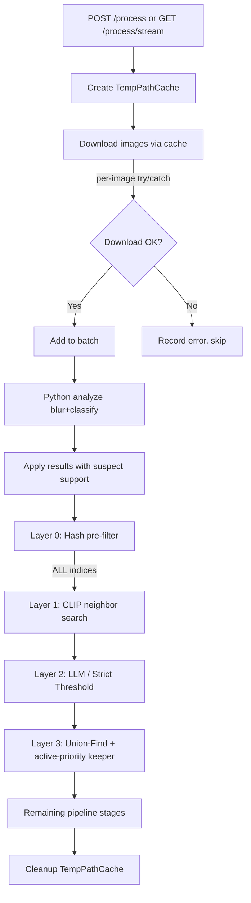

# Design Document: Pipeline Robustness

## Overview

This design addresses five robustness issues in the image processing pipeline. The changes are surgical — each fix targets a specific file with minimal blast radius:

1. **Blur status type alignment** — Add `'suspect'` to `PythonAnalyzeResult.blurStatus` in `pythonAnalyzer.ts` so the TypeScript type matches what `analyze.py` actually returns.
2. **Per-image download failure handling** — Wrap each `downloadToTemp()` call in `process.ts` with try/catch, skip failed images, and record errors per-item.
3. **Dedup transitivity preservation** — Change `hybridDedupEngine.ts` Layer 0 to pass ALL indices to Layer 1 (not just non-confirmed ones), so transitive chains like A↔B (hash) + B↔C (CLIP) merge correctly.
4. **Active-over-trashed keeper priority** — Modify `runLayer3()` in `hybridDedupEngine.ts` to always prefer active images over trashed images when selecting the keeper.
5. **Per-run temp path cache** — Introduce a `TempPathCache` class that wraps `downloadToTemp()` with a `Map<string, string>` to avoid redundant downloads within a single pipeline run.

All five changes are backward-compatible. No database schema changes. No new API endpoints.

## Architecture

The pipeline flow remains unchanged. The fixes slot into existing stages:



Key architectural decisions:
- **TempPathCache is per-request, not global** — avoids stale paths across runs and simplifies cleanup.
- **Layer 0 no longer filters indices** — it still records confirmed pairs for Union-Find, but passes all indices to Layer 1. This is the minimal change to fix transitivity.
- **Active-over-trashed is a sort-key change** — no new data structures, just a priority comparison before quality scores.

## Components and Interfaces

### 1. `PythonAnalyzeResult.blurStatus` type fix (`pythonAnalyzer.ts`)

Current type:
```typescript
blurStatus: 'clear' | 'blurry' | 'unknown';
```

New type:
```typescript
blurStatus: 'clear' | 'suspect' | 'blurry' | 'unknown';
```

No changes to `mapAnalyzeResult` — it already passes through the raw value. The fix is purely a type widening.

### 2. `TempPathCache` class (new file: `server/src/helpers/tempPathCache.ts`)

```typescript
import fs from 'fs';
import { StorageProvider } from '../storage/types';

/**
 * Per-processing-run cache that maps storage-relative paths to local temp paths.
 * Ensures each image is downloaded at most once per pipeline run.
 */
export class TempPathCache {
  private cache = new Map<string, string>();
  private storageProvider: StorageProvider;

  constructor(storageProvider: StorageProvider) {
    this.storageProvider = storageProvider;
  }

  /**
   * Get a local temp path for the given storage-relative path.
   * Downloads on first access; returns cached path on subsequent calls.
   * If a cached file has been deleted, re-downloads automatically.
   */
  async get(relativePath: string): Promise<string> {
    const cached = this.cache.get(relativePath);
    if (cached) {
      try {
        fs.accessSync(cached, fs.constants.R_OK);
        return cached;
      } catch {
        // Cached file gone — re-download
        this.cache.delete(relativePath);
      }
    }
    const localPath = await this.storageProvider.downloadToTemp(relativePath);
    this.cache.set(relativePath, localPath);
    return localPath;
  }

  /**
   * Clean up all cached temp files. Safe to call multiple times.
   * Skips files that are the same as the relative path (local provider returns original path).
   */
  cleanup(): void {
    for (const [relativePath, localPath] of this.cache.entries()) {
      // Don't delete original files (local provider returns the actual file path)
      if (localPath === relativePath) continue;
      try { fs.unlinkSync(localPath); } catch { /* ignore */ }
    }
    this.cache.clear();
  }

  /** Number of cached entries. */
  get size(): number {
    return this.cache.size;
  }
}
```

### 3. Per-image download failure handling (`process.ts`)

The download loop changes from:
```typescript
for (const row of imageRows) {
  const localPath = await storageProvider.downloadToTemp(row.file_path);
  tempPaths.push(localPath);
}
```

To:
```typescript
const successRows: ImageRow[] = [];
const tempPaths: string[] = [];
for (const row of imageRows) {
  try {
    const localPath = await tempCache.get(row.file_path);
    tempPaths.push(localPath);
    successRows.push(row);
  } catch (err) {
    const errorMsg = err instanceof Error ? err.message : String(err);
    const errText = `[download] ${errorMsg}`;
    appendErrorStmt.run(errText, errText, row.id);
    console.log(`[process] Download failed for ${row.original_filename}: ${errorMsg}`);
  }
}
```

Then `analyzeImages(tempPaths)` is called with only the successful paths, and `applyPythonAnalyzeResults` receives `successRows` instead of `imageRows`.

### 4. Layer 0 transitivity fix (`hybridDedupEngine.ts`)

`runLayer0` return type changes:

```typescript
export interface Layer0Result {
  confirmedPairs: Array<{ i: number; j: number }>;
  // REMOVED: remainingIndices — all indices now pass to Layer 1
}
```

The caller in `hybridDeduplicate` changes from:
```typescript
const layer1Result = await runLayer1(rows, layer0Result.remainingIndices, ...);
```
To:
```typescript
// Pass ALL indices to Layer 1 so transitive chains are discovered
const allIndices = Array.from({ length: rows.length }, (_, i) => i);
const layer1Result = await runLayer1(rows, allIndices, ...);
```

`runLayer0` itself still computes confirmed pairs the same way — it just no longer computes `remainingIndices`.

### 5. Active-over-trashed keeper priority (`hybridDedupEngine.ts` `runLayer3`)

The keeper selection logic in `runLayer3` adds a status-priority check before quality comparison:

```typescript
// Partition into active and trashed
const activeIndices = groupIndices.filter(idx => rows[idx].status === 'active');
const candidateIndices = activeIndices.length > 0 ? activeIndices : groupIndices;

// Only compute quality scores for candidates
for (const idx of candidateIndices) {
  // ... compute quality score
}

// Select best from candidates only
```

This ensures trashed images are never chosen as keeper when any active image exists in the group.


## Data Models

No database schema changes are required. All fixes operate on existing columns:

- `media_items.processing_error` (TEXT, nullable) — used to record per-image download failures (Requirement 2)
- `media_items.status` ('active' | 'trashed' | 'deleted') — used for active-over-trashed priority (Requirement 4)
- `media_items.blur_status` (TEXT) — already stores 'suspect' at the DB level; the fix is TypeScript-only (Requirement 1)

### Type Changes

**`pythonAnalyzer.ts` — `PythonAnalyzeResult`**
```typescript
// Before
blurStatus: 'clear' | 'blurry' | 'unknown';

// After
blurStatus: 'clear' | 'suspect' | 'blurry' | 'unknown';
```

**`hybridDedupEngine.ts` — `Layer0Result`**
```typescript
// Before
export interface Layer0Result {
  confirmedPairs: Array<{ i: number; j: number }>;
  remainingIndices: number[];
}

// After
export interface Layer0Result {
  confirmedPairs: Array<{ i: number; j: number }>;
  // remainingIndices removed — all indices pass to Layer 1
}
```

**New file: `server/src/helpers/tempPathCache.ts`**
```typescript
export class TempPathCache {
  private cache: Map<string, string>;
  private storageProvider: StorageProvider;
  constructor(storageProvider: StorageProvider);
  get(relativePath: string): Promise<string>;
  cleanup(): void;
  get size(): number;
}
```

### Function Signature Changes

**`runLayer0`** — return type drops `remainingIndices`:
```typescript
// Before
export async function runLayer0(rows: ImageRow[], options?): Promise<Layer0Result>
// Layer0Result had { confirmedPairs, remainingIndices }

// After
export async function runLayer0(rows: ImageRow[], options?): Promise<Layer0Result>
// Layer0Result has { confirmedPairs } only
```

**`runLayer3`** — no signature change, but internal logic adds active-priority:
```typescript
// Behavior change: active images always preferred over trashed as keeper
export async function runLayer3(
  rows: ImageRow[],
  allConfirmedPairs: Array<{ i: number; j: number }>
): Promise<{ groups: DedupGroup[]; kept: string[]; removed: string[] }>
```

**`hybridDeduplicate`** — accepts optional `TempPathCache`:
```typescript
export interface HybridDedupOptions {
  // ... existing fields ...
  /** Optional temp path cache for reusing downloaded files */
  tempCache?: TempPathCache;
}
```


## Correctness Properties

*A property is a characteristic or behavior that should hold true across all valid executions of a system — essentially, a formal statement about what the system should do. Properties serve as the bridge between human-readable specifications and machine-verifiable correctness guarantees.*

### Property 1: Blur status passthrough preservation

*For any* raw Python output object with `blur_status` in `{'clear', 'suspect', 'blurry', 'unknown'}`, `mapAnalyzeResult` SHALL produce a `PythonAnalyzeResult` whose `blurStatus` field equals the input `blur_status` value exactly.

**Validates: Requirements 1.1, 1.2, 1.3**

### Property 2: Only blurry images are trashed by applyPythonAnalyzeResults

*For any* `PythonAnalyzeResult` with `error = false` and `blurStatus` in `{'clear', 'suspect', 'unknown'}`, `applyPythonAnalyzeResults` SHALL NOT set the image's status to `'trashed'`. Only results with `blurStatus = 'blurry'` cause trashing.

**Validates: Requirements 1.4**

### Property 3: Download failure isolation and correct result mapping

*For any* list of N image rows where a subset F of downloads fail, the pipeline SHALL: (a) pass exactly N−|F| paths to `analyzeImages`, (b) record a `processing_error` for each image in F, and (c) correctly map each analyze result back to its corresponding original image row (not to a failed row).

**Validates: Requirements 2.1, 2.2, 2.3, 2.4**

### Property 4: All indices pass to Layer 1 regardless of Layer 0 results

*For any* set of images processed by the hybrid dedup engine, the set of indices passed to Layer 1 SHALL equal the full set `{0, 1, ..., N-1}` regardless of which pairs Layer 0 confirmed as duplicates.

**Validates: Requirements 3.1, 3.2, 3.4**

### Property 5: Active-over-trashed keeper priority

*For any* duplicate group containing at least one active image, the keeper selected by Layer 3 SHALL be an active image. When all images in a group are trashed, the keeper SHALL be the trashed image with the highest quality score (with existing tie-breakers).

**Validates: Requirements 4.1, 4.2, 4.3, 4.4**

### Property 6: TempPathCache download-once guarantee with re-download on disappearance

*For any* sequence of `get(path)` calls on a `TempPathCache`, the underlying `downloadToTemp` SHALL be called exactly once for each unique path, unless the cached file becomes inaccessible between calls, in which case `downloadToTemp` SHALL be called again exactly once.

**Validates: Requirements 5.2, 5.3, 5.6**

### Property 7: TempPathCache cleanup completeness

*For any* set of entries in a `TempPathCache`, calling `cleanup()` SHALL remove all cached temp files from disk (except original files in local storage) and reset the cache to empty.

**Validates: Requirements 5.4**

## Error Handling

### Download failures (Requirement 2)
- Each `downloadToTemp()` call is wrapped in try/catch
- On failure: error message is written to `media_items.processing_error` with `[download]` prefix
- The image is excluded from the batch sent to Python
- If ALL downloads fail: `analyzeImages` is not called, pipeline continues to subsequent stages
- No new error types introduced — uses existing `processing_error` column

### Python analysis failures (existing behavior, unchanged)
- If Python fails entirely, the existing fallback to Node.js blur detection + classification remains
- Per-image Python errors (result.error=true) are handled by existing logic in `applyPythonAnalyzeResults`

### TempPathCache failures (Requirement 5)
- If `downloadToTemp()` fails inside `TempPathCache.get()`, the error propagates to the caller (no silent swallowing)
- If a cached file disappears mid-run, `get()` re-downloads transparently
- `cleanup()` uses try/catch per file — one file failing to delete doesn't prevent cleanup of others

### Layer 3 keeper selection (Requirement 4)
- If quality score computation fails for an active image, it gets score 0 but still takes priority over trashed images
- This prevents a scenario where a trashed image with a computed score beats an active image with a failed score

## Testing Strategy

### Property-Based Tests (fast-check)

All property tests use [fast-check](https://github.com/dubzzz/fast-check) with minimum 100 iterations per property.

| Property | Test File | What's Generated |
|----------|-----------|-----------------|
| P1: Blur status passthrough | `pythonAnalyzer.test.ts` | Random raw Python output objects with blur_status from valid set |
| P2: Only blurry trashed | `process.test.ts` | Random PythonAnalyzeResult arrays with mixed blur statuses |
| P3: Download failure isolation | `process.test.ts` | Random image row lists with random failure index subsets |
| P4: All indices to Layer 1 | `hybridDedupEngine.test.ts` | Random image counts and random Layer 0 confirmed pair sets |
| P5: Active-over-trashed keeper | `hybridDedupEngine.test.ts` | Random duplicate groups with mixed active/trashed statuses and quality scores |
| P6: Cache download-once | `tempPathCache.test.ts` | Random sequences of get() calls with random paths, with optional mid-sequence file deletion |
| P7: Cache cleanup | `tempPathCache.test.ts` | Random sets of cached paths |

Configuration:
- Library: `fast-check` (already available in project or to be added)
- Minimum iterations: 100 per property
- Tag format: `Feature: pipeline-robustness, Property {N}: {title}`

### Unit Tests (example-based)

- `mapAnalyzeResult` with explicit `'suspect'` input → verify output
- `applyPythonAnalyzeResults` with a mix of blurry/suspect/clear results → verify DB state
- `runLayer3` with a group of 1 active + 2 trashed → verify active is keeper
- `runLayer3` with all-trashed group → verify highest quality is keeper
- `TempPathCache.get()` called twice with same path → verify single download
- `TempPathCache.cleanup()` → verify files deleted and cache empty
- Download loop with all failures → verify pipeline doesn't crash
- SSE endpoint with download failures → verify error events sent correctly

### Integration Tests

- Full pipeline run with one corrupted image file → verify trip processes successfully with error recorded
- Full pipeline run verifying TempPathCache is used across stages (download count matches unique image count)
- SSE streaming with download failures → verify SSE events include failure info

