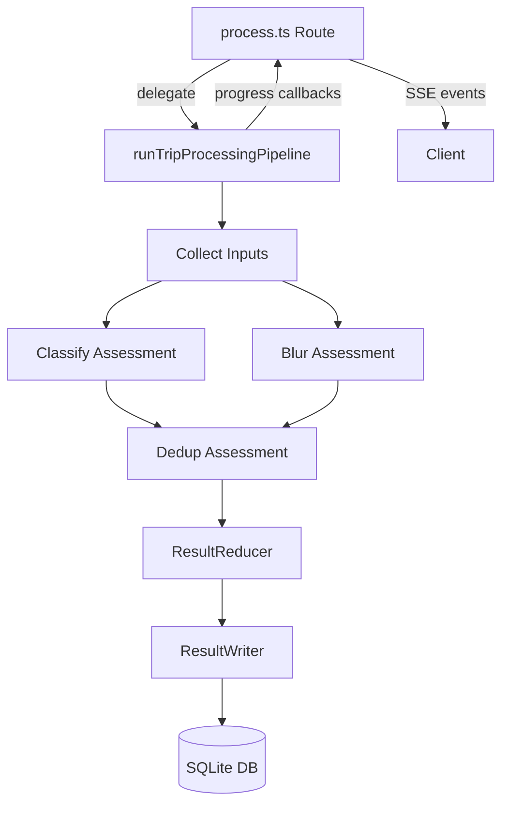
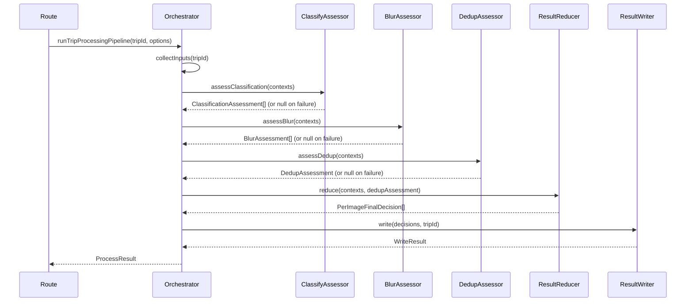
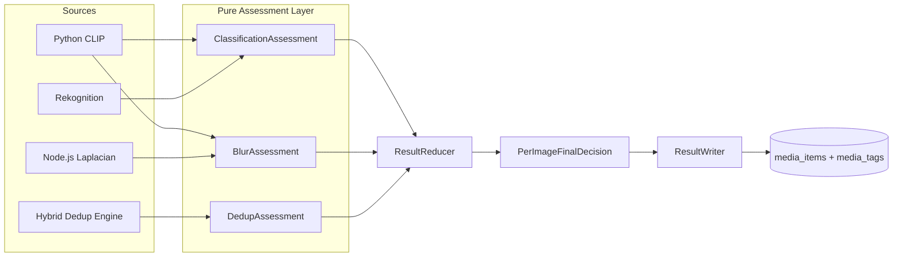

# Design Document: Pipeline V4 Refactor

## Overview

本次重构将图片处理流水线从"算法服务直接写数据库"架构改造为"评估 → 归并 → 写入"三段式架构。核心变更：

1. 每个算法服务（classify、blur、dedup）变为纯函数，只返回 Assessment 对象
2. 各 stage 内部完成 fallback 链（Python → Rekognition → Node），ResultReducer 只做 final status / trashedReasons 合并
3. ResultWriter 作为唯一 DB 写入点，使用事务保证原子性
4. process.ts 精简为薄路由层，委托给 pipeline orchestrator
5. 统一阈值配置对象 PROCESS_THRESHOLDS 支持环境变量覆盖

新增文件位于 `server/src/services/pipeline/` 目录：
- `types.ts` — 所有 pipeline 类型定义
- `runTripProcessingPipeline.ts` — orchestrator 编排器
- `resultReducer.ts` — final status / trashedReasons 合并（不做多源优先级）
- `resultWriter.ts` — 唯一 DB 写入模块

## Architecture

### 高层架构



### 阶段执行流



### 设计决策

1. **纯函数评估**: 算法服务不再导入 `getDb()` 或 `getStorageProvider()`。它们接收本地文件路径，返回纯数据对象。这消除了分类失败导致模糊结果丢失的级联问题。

2. **独立失败**: 每个评估阶段独立 try/catch。classify 失败时 blur 和 dedup 继续执行，反之亦然。失败的 slot 设为 null，由 ResultReducer 处理。

3. **单一写入点**: 只有 ResultWriter 执行 DB 写入，使用 `better-sqlite3` 的 `transaction()` 包装，保证原子性。任何写入失败都会回滚全部变更。

4. **hybridDedupEngine 自检测**: 不再接收 `pythonAvailable` 参数，内部调用 `isPythonAvailable()` 和 `isMLServiceAvailable()` 自行决定使用哪些层。

5. **Python analyze.py 独立错误字段**: 输出格式新增 `classify_error` 和 `blur_error` 字段，替代共享的 `error` boolean，使一个能力失败时另一个结果仍可用。

6. **统一阈值**: `PROCESS_THRESHOLDS` 对象集中管理所有阈值（含 `dinov2DedupThreshold`），每个值支持 `process.env` 覆盖。模块不再定义本地常量或接受阈值参数。

7. **Reducer 职责边界**: `runClassifyStage` 负责 Python → Rekognition → fallback 回退链，`runBlurStage` 负责 Python → Node 回退链。ResultReducer 只负责：blur 是否删除、dedup 是否删除、原因合并、空值兜底。不做多源优先级选择。

8. **单图部分失败**: Orchestrator 支持单图级别的部分失败。一张图的分类失败只 null 该图的 classification slot，不影响同阶段其他图的结果。

9. **ResultWriter 写库范围**: 当前版本去重结果仅更新 media_items，不维护独立重复组表（duplicate_groups）。

10. **assessDedup 纯净性**: `assessDedup()` 不隐式读写 DB 状态来决定 keep/remove。所有决策输入来自函数参数或纯 helper 输出。

## Components and Interfaces

### 新增文件

#### `server/src/services/pipeline/types.ts`

```typescript
import type { ImageCategory } from '../pythonAnalyzer';

// --- Assessment Types (pure data, no side effects) ---

export type ClassifySource = 'python' | 'rekognition' | 'fallback';
export type BlurSource = 'python' | 'node';

export interface ClassificationAssessment {
  category: ImageCategory;
  categoryScores: Record<string, number> | null;
  source: ClassifySource;
  error?: string;
}

export interface BlurAssessment {
  sharpnessScore: number | null;
  blurStatus: 'clear' | 'suspect' | 'blurry';
  musiqScore?: number | null;
  source: BlurSource;
  error?: string;
}

export interface DedupAssessment {
  confirmedPairs: Array<{ i: number; j: number }>;
  groups: Array<{ indices: number[]; keepIndex: number }>;
  kept: string[];
  removed: string[];
  skippedIndices: number[];
  skippedReasons: Record<number, string>;
  capabilitiesUsed: {
    hash: boolean;
    clip: boolean;
    dinov2: boolean;
    llm: boolean;
  };
  evidenceByPair: Array<{
    i: number;
    j: number;
    hashMatched?: boolean;
    clipScore?: number;
    dinoScore?: number;
    llmConfirmed?: boolean;
  }>;
}

// --- Processing Context ---

export interface ImageProcessContext {
  mediaId: string;
  tripId: string;
  filePath: string;       // storage-relative path
  localPath: string | null; // local temp path (null if download failed)
  downloadOk: boolean;
  downloadError?: string | null;
  processingErrors: string[];
  index: number;           // position in the image list
  classification: ClassificationAssessment | null;
  blur: BlurAssessment | null;
}

// --- Final Decision ---

export interface PerImageFinalDecision {
  mediaId: string;
  finalBlurStatus: 'clear' | 'suspect' | 'blurry';
  finalCategory: ImageCategory;
  finalStatus: 'active' | 'trashed';
  trashedReasons: Array<'blur' | 'duplicate'>;
  sharpnessScore: number | null;
  qualityScore: number | null;
  categorySource: ClassifySource;
  blurSource: BlurSource | null;
  processingError: string | null;
}

// --- Pipeline Options & Result ---

export type PipelineStage =
  | 'collectInputs'
  | 'classify'
  | 'blur'
  | 'dedup'
  | 'reduce'
  | 'write'
  | 'analyze'
  | 'optimize'
  | 'thumbnail'
  | 'videoAnalysis'
  | 'videoEdit'
  | 'cover';

export interface PipelineProgressCallback {
  (stage: PipelineStage, status: 'start' | 'complete' | 'progress', detail?: string): void;
}

export interface PipelineOptions {
  onProgress?: PipelineProgressCallback;
  videoResolution?: number;
}

export interface PipelineResult {
  tripId: string;
  totalImages: number;
  totalVideos: number;
  blurryDeletedCount: number;
  dedupDeletedCount: number;
  analyzedCount: number;
  optimizedCount: number;
  classifiedCount: number;
  categoryStats: { people: number; animal: number; landscape: number; other: number };
  compiledCount: number;
  failedCount: number;
  skippedCount: number;
  partialFailureCount: number;
  downloadFailedCount: number;
  coverImageId: string | null;
}
```

#### `server/src/services/pipeline/runTripProcessingPipeline.ts`

```typescript
import type {
  ImageProcessContext,
  PipelineOptions,
  PipelineResult,
  DedupAssessment,
  PipelineProgressCallback,
} from './types';

/**
 * Pipeline orchestrator. Executes stages in order:
 * collect → classify → blur → dedup → reduce → write → analyze → optimize → thumbnail → video → cover
 *
 * Each assessment stage is independently try/caught.
 * Failure in one stage does not prevent subsequent stages from running.
 */
export async function runTripProcessingPipeline(
  tripId: string,
  options?: PipelineOptions,
): Promise<PipelineResult>;
```

Key internal functions:

```typescript
/** Download all active images to temp, build ImageProcessContext[] */
function collectInputs(
  tripId: string,
  tempCache: TempPathCache,
): Promise<ImageProcessContext[]>;

/** Run classification on all contexts. Mutates context.classification in place. */
async function runClassifyStage(
  contexts: ImageProcessContext[],
): Promise<void>;

/** Run blur detection on all contexts. Mutates context.blur in place. */
async function runBlurStage(
  contexts: ImageProcessContext[],
): Promise<void>;

/** Run dedup on all contexts. Returns DedupAssessment. */
async function runDedupStage(
  contexts: ImageProcessContext[],
  tempCache: TempPathCache,
): Promise<DedupAssessment | null>;
```

#### `server/src/services/pipeline/resultReducer.ts`

```typescript
import type {
  ImageProcessContext,
  DedupAssessment,
  PerImageFinalDecision,
} from './types';

/**
 * Merge assessments into final decisions.
 *
 * NOTE: Multi-source fallback is already resolved within each stage.
 * The reducer only receives the winning assessment per image.
 *
 * Reducer responsibilities:
 * - If blurry → add 'blur' to trashedReasons
 * - If dedup removed → add 'duplicate' to trashedReasons
 * - If trashedReasons non-empty → finalStatus = 'trashed'
 * - If all assessments null → active, category=other, blurStatus=suspect
 */
export function reduce(
  contexts: ImageProcessContext[],
  dedupAssessment: DedupAssessment | null,
): PerImageFinalDecision[];
```

#### `server/src/services/pipeline/resultWriter.ts`

```typescript
import type { PerImageFinalDecision } from './types';

export interface WriteResult {
  updatedCount: number;
  error?: string;
}

/**
 * Write all final decisions to the database in a single transaction.
 *
 * Updates media_items: blur_status, sharpness_score, category, status,
 * trashed_reason (first of trashedReasons[] or comma-joined for DB compat),
 * processing_error.
 * Replaces category tags in media_tags.
 *
 * NOTE: Current version does NOT maintain duplicate_groups table.
 * Dedup results are reflected only in media_items.status and trashed_reason.
 *
 * On failure: rolls back all changes and returns error.
 */
export function writeDecisions(
  tripId: string,
  decisions: PerImageFinalDecision[],
): WriteResult;
```

### Modified Files

#### `server/src/services/dedupThresholds.ts` → unified PROCESS_THRESHOLDS

```typescript
export interface ProcessThresholds {
  // Blur thresholds
  blurThreshold: number;
  clearThreshold: number;
  musiqBlurThreshold: number;
  // Dedup thresholds
  hashHammingThreshold: number;
  clipConfirmedThreshold: number;
  clipGrayHighThreshold: number;
  clipGrayLowThreshold: number;
  clipStrictThreshold: number;
  clipTopK: number;
  grayLowSeqDistance: number;
  grayLowHashDistance: number;
  // DINOv2 threshold
  dinov2DedupThreshold: number;
}

/** Read from env with defaults. Frozen object. */
export const PROCESS_THRESHOLDS: Readonly<ProcessThresholds>;

// Legacy named exports preserved for backward compatibility
export const HASH_HAMMING_THRESHOLD: number;
export const CLIP_CONFIRMED_THRESHOLD: number;
// ... etc
```

#### `server/src/services/imageClassifier.ts` — new pure assessment function

> **Note**: `assessClassification` is a pure Rekognition-only helper. Python CLIP classification is driven by the orchestrator via `pythonAnalyzer`. The `runClassifyStage` in the orchestrator handles the fallback chain: Python CLIP → Rekognition (`assessClassification`) → fallback.

```typescript
/** Pure assessment: no DB writes. Returns ClassificationAssessment. */
export async function assessClassification(
  imageBytes: Buffer,
): Promise<ClassificationAssessment>;

/** Pure assessment from labels (for Rekognition results). */
export function assessFromLabels(
  labels: LabelWithConfidence[],
): ClassificationAssessment;
```

Existing `classifyTrip()` and `classifyImage()` remain for backward compatibility but are no longer called by the pipeline.

#### `server/src/services/blurDetector.ts` — new pure assessment function

> **Note**: `assessBlur` is a pure Node.js Laplacian-only helper. Python OpenCV blur detection is driven by the orchestrator via `pythonAnalyzer`. The `runBlurStage` in the orchestrator handles the fallback chain: Python OpenCV → Node.js Laplacian (`assessBlur`).

```typescript
/** Pure assessment: no DB writes. Returns BlurAssessment. */
export async function assessBlur(
  imagePath: string,
): Promise<BlurAssessment>;
```

Existing `detectBlurry()` remains for backward compatibility.

#### `server/src/services/hybridDedupEngine.ts` — pure assessment + self-detection

```typescript
/** Pure assessment: no DB writes. Self-detects Python/ML availability. */
export async function assessDedup(
  rows: ImageRow[],
  tempCache: TempPathCache,
): Promise<DedupAssessment>;
```

Removes `pythonAvailable` option. Internally calls `isPythonAvailable()` and `isMLServiceAvailable()`.

#### `server/src/services/pythonAnalyzer.ts` — per-capability availability

```typescript
export interface PythonCapabilities {
  classify: boolean;
  blur: boolean;
  dedup: boolean;
}

/** Check which Python capabilities are available. */
export function getPythonCapabilities(): PythonCapabilities;
```

#### `server/python/analyze.py` — separate error fields

Output format changes from:
```json
{"file": "...", "error": true, "error_message": "...", "category": null, ...}
```
To:
```json
{
  "file": "...",
  "classify_error": "CLIP model failed: ...",
  "blur_error": null,
  "category": null,
  "category_scores": null,
  "blur_status": "clear",
  "blur_score": 42.5
}
```

#### `server/src/routes/process.ts` — thin route

```typescript
// POST /:id/process
router.post('/:id/process', async (req, res) => {
  // 1. Validate trip exists
  // 2. Check not already processing
  // 3. Call runTripProcessingPipeline(tripId)
  // 4. Return result as JSON
});

// GET /:id/process/stream
router.get('/:id/process/stream', async (req, res) => {
  // 1. Validate trip exists
  // 2. Setup SSE
  // 3. Call runTripProcessingPipeline(tripId, { onProgress })
  // 4. Forward progress events via SSE
});
```

No direct calls to blurDetector, imageClassifier, or hybridDedupEngine.

## Data Models

### Assessment Flow



### Database Fields Updated by ResultWriter

| Field | Source |
|-------|--------|
| `blur_status` | BlurAssessment.blurStatus |
| `sharpness_score` | BlurAssessment.sharpnessScore |
| `category` | ClassificationAssessment.category |
| `status` | Derived: 'trashed' if blur/dedup, else 'active' |
| `trashed_reason` | Derived: first of trashedReasons array, or null |
| `processing_error` | Accumulated errors from all stages |

### PROCESS_THRESHOLDS Configuration

```typescript
const PROCESS_THRESHOLDS = {
  blurThreshold:          env('BLUR_THRESHOLD', 15),
  clearThreshold:         env('CLEAR_THRESHOLD', 50),
  musiqBlurThreshold:     env('MUSIQ_BLUR_THRESHOLD', 30),
  hashHammingThreshold:   env('HASH_HAMMING_THRESHOLD', 4),
  clipConfirmedThreshold: env('CLIP_CONFIRMED_THRESHOLD', 0.90),
  clipGrayHighThreshold:  env('CLIP_GRAY_HIGH_THRESHOLD', 0.85),
  clipGrayLowThreshold:   env('CLIP_GRAY_LOW_THRESHOLD', 0.80),
  clipStrictThreshold:    env('CLIP_STRICT_THRESHOLD', 0.92),
  clipTopK:               env('CLIP_TOP_K', 15),
  grayLowSeqDistance:     env('GRAY_LOW_SEQ_DISTANCE', 12),
  grayLowHashDistance:    env('GRAY_LOW_HASH_DISTANCE', 16),
  dinov2DedupThreshold:   env('DINOV2_DEDUP_THRESHOLD', 0.80),
};
```


## Correctness Properties

*A property is a characteristic or behavior that should hold true across all valid executions of a system — essentially, a formal statement about what the system should do. Properties serve as the bridge between human-readable specifications and machine-verifiable correctness guarantees.*

### Property 1: Assessment function purity

*For any* assessment function (assessClassification, assessBlur, assessDedup) and *for any* valid input, the function SHALL return a plain data object and SHALL NOT invoke any database operations (getDb, prepare, run, exec).

**Validates: Requirements 1.6, 3.4, 4.3, 5.1**

### Property 2: Stage failure independence

*For any* pipeline execution where one assessment stage (classify, blur, or dedup) throws an error, the orchestrator SHALL still execute all subsequent stages, and the failed stage's assessment slot SHALL be null in the corresponding ImageProcessContext.

**Validates: Requirements 2.2, 2.3, 2.4**

### Property 3: Reducer completeness

*For any* list of ImageProcessContexts with any combination of null and non-null assessments, and *for any* DedupAssessment (including null), the ResultReducer SHALL produce exactly one PerImageFinalDecision per context, and each decision SHALL have valid finalStatus, finalCategory, and finalBlurStatus fields.

**Validates: Requirements 6.1**

### Property 4: Fallback chain in stages

*For any* image where Python classification fails, the `runClassifyStage` SHALL attempt Rekognition, and if that also fails, SHALL set classification to `{ category: 'other', source: 'fallback' }`. The ResultReducer SHALL NOT perform any source priority selection — it receives exactly one classification per image.

**Validates: Requirements 3.1, 3.2, 3.3, 3.5**

### Property 5: Blur fallback chain in stages

*For any* image where Python blur detection fails, the `runBlurStage` SHALL attempt Node.js Laplacian, and if that also fails, SHALL set blur to `{ blurStatus: 'suspect', sharpnessScore: null, source: 'node', error: '...' }`. The ResultReducer SHALL NOT perform any blur source priority selection.

**Validates: Requirements 4.1, 4.2, 4.4**

### Property 6: TrashedReason derivation

*For any* image:
- If BlurAssessment.blurStatus is 'blurry' AND the image is in DedupAssessment.removed, then trashedReasons SHALL be ['blur', 'duplicate']
- If BlurAssessment.blurStatus is 'blurry' AND the image is NOT in DedupAssessment.removed, then trashedReasons SHALL be ['blur']
- If BlurAssessment.blurStatus is NOT 'blurry' AND the image is in DedupAssessment.removed, then trashedReasons SHALL be ['duplicate']
- If all assessments are null and the image is not dedup-removed, then finalStatus SHALL be 'active', finalCategory SHALL be 'other', and finalBlurStatus SHALL be 'suspect'

**Validates: Requirements 6.4, 6.5, 6.6, 6.7**

### Property 7: Transaction atomicity

*For any* list of PerImageFinalDecisions passed to ResultWriter, either ALL media_items rows and media_tags rows are updated, or NONE are updated. If the transaction throws, the database state SHALL be identical to before the call.

**Validates: Requirements 7.2, 7.3**

### Property 8: ResultWriter field coverage

*For any* PerImageFinalDecision, the ResultWriter SHALL update blur_status, sharpness_score, category, status, trashed_reason, and processing_error on the corresponding media_items row, AND SHALL delete old category tags and insert a new category tag, all within the same transaction.

**Validates: Requirements 7.4, 7.5**

### Property 9: Environment variable threshold overrides

*For any* threshold key in PROCESS_THRESHOLDS and *for any* valid numeric string set as the corresponding environment variable, the PROCESS_THRESHOLDS object SHALL return the parsed numeric value instead of the default.

**Validates: Requirements 10.2**

### Property 10: Blur failure fallback

*For any* image where the Node.js blur computation throws an error, the BlurAssessment SHALL have blurStatus set to 'suspect', sharpnessScore set to null, and error set to a non-empty string.

**Validates: Requirements 4.4**

### Property 11: Dedup skipped indices reporting

*For any* set of images where a subset of downloads fail, the DedupAssessment.skippedIndices SHALL contain exactly the indices of failed downloads, and the remaining images SHALL be processed normally.

**Validates: Requirements 5.4**

## Error Handling

### Per-Stage Error Isolation

Each assessment stage runs in its own try/catch block within the orchestrator. **Critical**: the outer try/catch is a safety net only. Inside each stage, per-image failures are caught individually — a single image failure only nulls that image's assessment, it does NOT null the entire stage for all images.

```typescript
// In runTripProcessingPipeline:
// Outer try/catch is safety net for unexpected stage-level crashes
try {
  await runClassifyStage(contexts);
  // Inside runClassifyStage, each image has its own try/catch:
  // for (const ctx of contexts) {
  //   try { ctx.classification = await classifyOneImage(ctx); }
  //   catch { ctx.classification = { category: 'other', source: 'fallback' }; }
  // }
} catch (err) {
  stageErrors.push({ stage: 'classify', error: err.message });
  // Only reached if the entire stage crashes unexpectedly
}

try {
  await runBlurStage(contexts);
} catch (err) {
  stageErrors.push({ stage: 'blur', error: err.message });
  // contexts[*].blur remains null
}

try {
  dedupAssessment = await runDedupStage(contexts, tempCache);
} catch (err) {
  stageErrors.push({ stage: 'dedup', error: err.message });
  dedupAssessment = null;
}
```

### Per-Image Error Handling

Within each stage, individual image failures are caught and recorded. A single image failure only nulls that image's assessment — it does NOT null the entire stage result for all images.

- **Classify stage**: If Python fails for image X, try Rekognition. If both fail, set `classification = { category: 'other', source: 'fallback' }`. Other images continue normally.
- **Blur stage**: If Python fails, try Node.js Laplacian. If both fail, set `blur = { blurStatus: 'suspect', sharpnessScore: null, source: 'node', error: '...' }`. Other images continue normally.
- **Dedup stage**: If image download fails, add index to `skippedIndices` with reason in `skippedReasons`. Process remaining images.

### ResultWriter Transaction Failure

If the DB transaction fails:
1. All changes are rolled back (better-sqlite3 transaction semantics)
2. Error is returned in `WriteResult.error`
3. Orchestrator logs the error and returns it in `PipelineResult`
4. No partial writes exist — the database is in the same state as before the pipeline ran

### Python analyze.py Error Isolation

The Python script now returns independent error fields:
- `classify_error`: non-null string if CLIP classification failed
- `blur_error`: non-null string if OpenCV blur detection failed

The TypeScript `pythonAnalyzer.ts` maps these to separate assessment objects, allowing one capability's result to be used even when the other fails.

## Testing Strategy

### Unit Tests (Example-Based)

- **Orchestrator stage ordering**: Mock all stages, verify execution order
- **Route handler delegation**: Verify process.ts calls orchestrator and returns result directly
- **PROCESS_THRESHOLDS defaults**: Verify all keys exist with correct default values
- **Python output parsing**: Verify separate classify_error/blur_error field mapping
- **SSE progress forwarding**: Mock orchestrator progress callbacks, verify SSE events

### Property-Based Tests

Property-based testing is appropriate for this feature because the core logic (ResultReducer, ResultWriter, assessment functions) involves pure functions with clear input/output behavior and universal properties that should hold across a wide range of inputs.

**Library**: `fast-check` (already available in the project's test dependencies or to be added)

**Configuration**: Minimum 100 iterations per property test.

**Tag format**: `Feature: pipeline-v4-refactor, Property {N}: {title}`

Tests to implement:

1. **Property 1 — Assessment purity**: Generate random image contexts, call assessment functions with mocked dependencies, verify no DB calls.
   - Tag: `Feature: pipeline-v4-refactor, Property 1: Assessment function purity`

2. **Property 2 — Stage failure independence**: Generate random stage failure combinations, verify subsequent stages execute.
   - Tag: `Feature: pipeline-v4-refactor, Property 2: Stage failure independence`

3. **Property 3 — Reducer completeness**: Generate random combinations of null/non-null assessments, verify one decision per context with valid fields.
   - Tag: `Feature: pipeline-v4-refactor, Property 3: Reducer completeness`

4. **Property 4 — Classification source priority**: Generate pairs of ClassificationAssessments with different sources, verify priority ordering.
   - Tag: `Feature: pipeline-v4-refactor, Property 4: Classification source priority`

5. **Property 5 — Blur source priority**: Generate pairs of BlurAssessments with different sources, verify Python preferred.
   - Tag: `Feature: pipeline-v4-refactor, Property 5: Blur source priority`

6. **Property 6 — TrashedReason derivation**: Generate all combinations of blurry/not-blurry × dedup-removed/not-removed × all-null, verify trashedReason.
   - Tag: `Feature: pipeline-v4-refactor, Property 6: TrashedReason derivation`

7. **Property 7 — Transaction atomicity**: Generate random decision lists, inject DB failures, verify all-or-nothing semantics.
   - Tag: `Feature: pipeline-v4-refactor, Property 7: Transaction atomicity`

8. **Property 8 — ResultWriter field coverage**: Generate random decisions, verify all six fields + tags are updated.
   - Tag: `Feature: pipeline-v4-refactor, Property 8: ResultWriter field coverage`

9. **Property 9 — Env var threshold overrides**: Generate random threshold keys and numeric values, set env vars, verify PROCESS_THRESHOLDS reflects them.
   - Tag: `Feature: pipeline-v4-refactor, Property 9: Environment variable threshold overrides`

10. **Property 10 — Blur failure fallback**: Generate random errors, verify suspect/null/error-message result.
    - Tag: `Feature: pipeline-v4-refactor, Property 10: Blur failure fallback`

11. **Property 11 — Dedup skipped indices**: Generate random subsets of failed downloads, verify skippedIndices matches exactly.
    - Tag: `Feature: pipeline-v4-refactor, Property 11: Dedup skipped indices reporting`

### Integration Tests

- **Full pipeline run**: End-to-end test with a small set of real images, verifying DB state after pipeline completes
- **Python fallback chain**: Test with Python available/unavailable, verify correct assessment sources
- **SSE streaming**: Test the streaming endpoint with a mock pipeline, verify event sequence
