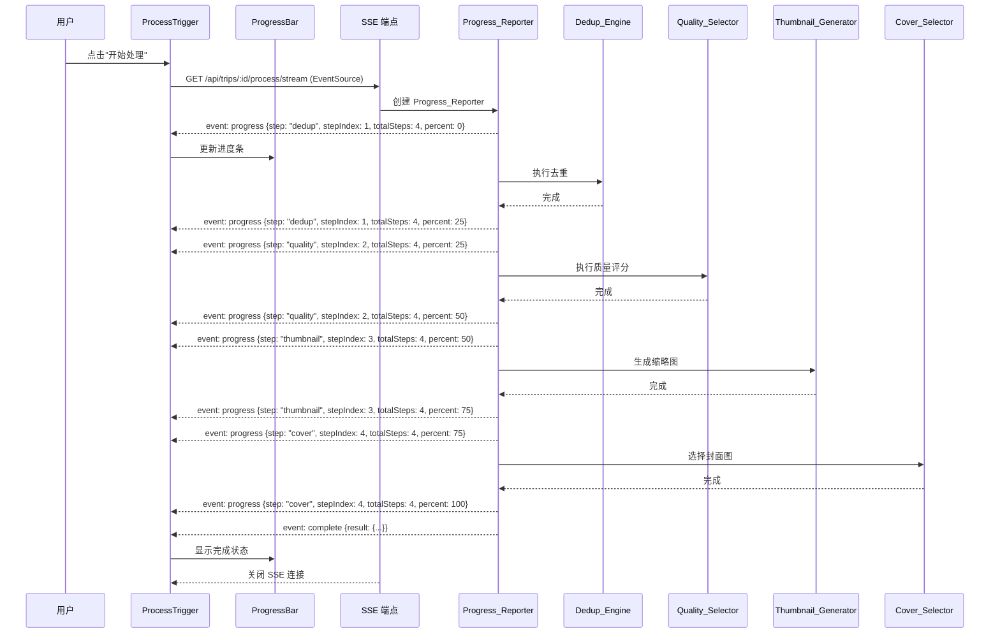
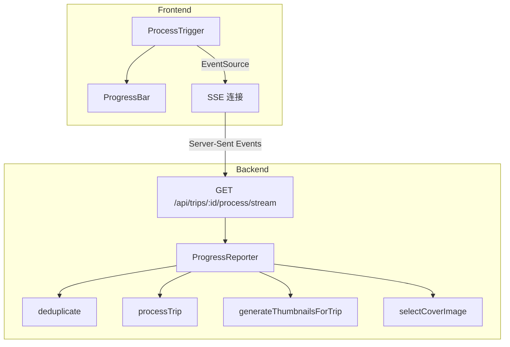

# 技术设计文档：处理进度条功能

## 概述

本功能为旅行相册网站的素材处理流程增加实时进度反馈。当前系统在用户触发处理后（去重 → 质量评分 → 缩略图生成 → 封面图选择），前端仅显示"处理中..."文字，无法告知用户当前进展。

本设计通过 Server-Sent Events（SSE）将后端处理进度实时推送到前端，前端以可视化进度条展示当前步骤名称、步骤序号和整体进度百分比。

核心改动：
- 后端：将现有的 `POST /api/trips/:id/process` 端点改为 SSE 流式响应，在每个处理步骤前后推送进度事件
- 前端：将 `ProcessTrigger` 组件从 axios POST 请求改为 EventSource SSE 连接，新增 `ProgressBar` 子组件展示进度

## 架构

### SSE 进度推送流程



### 组件关系



## 组件与接口

### 1. Progress_Reporter（后端进度报告器）

封装 SSE 响应对象，提供类型安全的进度推送方法。不修改现有处理服务的代码，仅在路由层调用各服务前后发送进度事件。

**接口：**

```typescript
interface ProgressEvent {
  step: 'dedup' | 'quality' | 'thumbnail' | 'cover';
  stepIndex: number;    // 1-based
  totalSteps: number;   // 固定为 4
  percent: number;      // 0-100，每步占 25%
}

interface CompleteEvent {
  tripId: string;
  totalImages: number;
  duplicateGroups: { groupId: string; imageCount: number }[];
  totalGroups: number;
  coverImageId: string | null;
}

interface ErrorEvent {
  message: string;
  step?: string;
}

class ProgressReporter {
  constructor(res: Response);

  // 初始化 SSE 响应头
  initSSE(): void;

  // 推送步骤开始事件
  sendStepStart(step: ProgressEvent['step']): void;

  // 推送步骤完成事件
  sendStepComplete(step: ProgressEvent['step']): void;

  // 推送处理完成事件并关闭连接
  sendComplete(result: CompleteEvent): void;

  // 推送错误事件并关闭连接
  sendError(error: ErrorEvent): void;
}
```

**实现位置：** `server/src/services/progressReporter.ts`

**设计决策：** ProgressReporter 作为独立服务类，不侵入现有的 dedupEngine、qualitySelector 等服务。进度推送逻辑完全在路由层控制，保持现有服务的纯净性。

### 2. SSE 流式端点

新增 `GET /api/trips/:id/process/stream` 端点，替代原有的 POST 端点作为带进度反馈的处理入口。原有 POST 端点保留不变，保持向后兼容。

**SSE 事件格式：**

```
event: progress
data: {"step":"dedup","stepIndex":1,"totalSteps":4,"percent":0}

event: progress
data: {"step":"dedup","stepIndex":1,"totalSteps":4,"percent":25}

event: complete
data: {"tripId":"...","totalImages":10,"duplicateGroups":[...],"totalGroups":2,"coverImageId":"..."}

event: error
data: {"message":"去重处理失败","step":"dedup"}
```

**实现位置：** `server/src/routes/process.ts`（在现有文件中新增路由）

### 3. ProgressBar（前端进度条组件）

纯展示组件，接收进度状态并渲染可视化进度条。

**接口：**

```typescript
type ProgressStatus = 'idle' | 'processing' | 'complete' | 'error' | 'disconnected';

interface ProgressBarProps {
  status: ProgressStatus;
  currentStep: string | null;       // 步骤标识符，如 "dedup"
  stepIndex: number;                 // 当前步骤序号 (1-based)
  totalSteps: number;                // 总步骤数
  percent: number;                   // 0-100
  errorMessage?: string;             // 错误信息
}
```

**实现位置：** `client/src/components/ProgressBar.tsx`

### 4. 步骤名称映射（前端）

将后端步骤标识符映射为中文名称的纯函数。

```typescript
const STEP_LABELS: Record<string, string> = {
  dedup: '图片去重',
  quality: '质量评分',
  thumbnail: '缩略图生成',
  cover: '封面图选择',
};

function getStepLabel(step: string): string {
  return STEP_LABELS[step] ?? step;
}
```

**实现位置：** `client/src/components/ProgressBar.tsx`（组件内部）

### 5. ProcessTrigger 改造

改造现有 `ProcessTrigger` 组件，将 axios POST 请求替换为 EventSource SSE 连接，集成 ProgressBar 子组件。

**关键变更：**
- 点击按钮后创建 `EventSource` 连接到 `/api/trips/:id/process/stream`
- 监听 `progress`、`complete`、`error` 事件更新组件状态
- 组件卸载或页面离开时调用 `eventSource.close()` 释放连接
- SSE 连接断开时显示连接中断提示

### REST API 端点变更

| 方法 | 路径 | 说明 | 状态 |
|------|------|------|------|
| POST | `/api/trips/:id/process` | 原有处理端点（无进度） | 保留 |
| GET | `/api/trips/:id/process/stream` | SSE 流式处理端点（带进度） | 新增 |

## 数据模型

本功能不需要新增数据库表或修改现有 schema。进度信息是瞬态数据，仅通过 SSE 流传输，不持久化。

### SSE 事件数据结构

```typescript
// 进度事件 - 每个步骤开始和完成时各推送一次
interface ProgressEventData {
  step: 'dedup' | 'quality' | 'thumbnail' | 'cover';
  stepIndex: number;    // 1-4
  totalSteps: 4;
  percent: number;      // 0, 25, 50, 75, 100
}

// 完成事件 - 所有步骤完成后推送
interface CompleteEventData {
  tripId: string;
  totalImages: number;
  duplicateGroups: { groupId: string; imageCount: number }[];
  totalGroups: number;
  coverImageId: string | null;
}

// 错误事件 - 任一步骤失败时推送
interface ErrorEventData {
  message: string;
  step?: string;
}
```

### 前端状态模型

```typescript
interface ProcessingState {
  status: ProgressStatus;           // 'idle' | 'processing' | 'complete' | 'error' | 'disconnected'
  currentStep: string | null;       // 当前步骤标识符
  stepIndex: number;                // 当前步骤序号
  totalSteps: number;               // 总步骤数
  percent: number;                  // 整体进度百分比
  result: CompleteEventData | null; // 处理结果
  errorMessage: string;             // 错误信息
}
```

### 进度百分比计算规则

四个步骤等分 100%，每步占 25%：

| 事件 | percent |
|------|---------|
| dedup 开始 | 0% |
| dedup 完成 | 25% |
| quality 开始 | 25% |
| quality 完成 | 50% |
| thumbnail 开始 | 50% |
| thumbnail 完成 | 75% |
| cover 开始 | 75% |
| cover 完成 | 100% |


## 正确性属性

*属性是一种在系统所有有效执行中都应成立的特征或行为——本质上是关于系统应该做什么的形式化陈述。属性是人类可读规范与机器可验证正确性保证之间的桥梁。*

### Property 1: 进度事件结构完整性

*For any* 处理步骤（dedup、quality、thumbnail、cover），ProgressReporter 推送的 ProgressEvent 必须包含四个字段：step（步骤名称）、stepIndex（步骤序号，1-based）、totalSteps（总步骤数，固定为 4）和 percent（整体进度百分比，0-100）。

**Validates: Requirements 1.2, 1.3, 1.4**

### Property 2: 进度百分比等分计算

*For any* 步骤序号 stepIndex（1 到 4），步骤开始时的 percent 应等于 `(stepIndex - 1) * 25`，步骤完成时的 percent 应等于 `stepIndex * 25`。

**Validates: Requirements 1.5**

### Property 3: 错误事件包含错误信息

*For any* 处理步骤在执行过程中抛出的错误，ProgressReporter 推送的错误事件必须包含该错误的描述信息和发生错误的步骤名称。

**Validates: Requirements 1.7**

### Property 4: 进度条渲染内容完整性

*For any* 有效的进度状态（status 为 'processing'，stepIndex 在 1-4 之间，percent 在 0-100 之间），ProgressBar 组件的渲染输出必须同时包含：当前步骤的中文名称、步骤序号与总步骤数的格式化文本（如"步骤 X/4"）、以及百分比数值文本。

**Validates: Requirements 2.1, 2.2, 2.3, 2.4**

### Property 5: 错误状态展示错误信息

*For any* 非空错误信息字符串，当 ProgressBar 处于 error 状态时，渲染输出必须包含该错误信息文本。

**Validates: Requirements 2.7**

### Property 6: SSE 事件格式合规性

*For any* ProgressReporter 发送的事件数据，输出到响应流的内容必须符合 SSE 协议格式：以 `event:` 行指定事件类型，以 `data:` 行包含 JSON 序列化的事件数据，并以空行结尾。

**Validates: Requirements 3.4**

### Property 7: 步骤名称映射完备性

*For any* 已知的步骤标识符（dedup、quality、thumbnail、cover），getStepLabel 函数返回的中文名称必须与预定义映射一致（dedup→图片去重、quality→质量评分、thumbnail→缩略图生成、cover→封面图选择），且对于未知标识符应原样返回。

**Validates: Requirements 4.1, 4.2, 4.3, 4.4**

## 错误处理

| 错误场景 | 处理策略 |
|----------|----------|
| 旅行 ID 不存在 | SSE 端点返回 404 JSON 错误（在建立 SSE 连接前检查） |
| 去重步骤失败 | ProgressReporter 推送 error 事件（含步骤名和错误描述），关闭 SSE 连接 |
| 质量评分步骤失败 | 同上 |
| 缩略图生成步骤失败 | 同上 |
| 封面图选择步骤失败 | 同上 |
| SSE 连接意外断开 | 前端 EventSource 的 onerror 触发，显示连接中断提示，允许重新触发 |
| 用户离开页面 | 组件 useEffect cleanup 调用 eventSource.close()，服务端检测到连接关闭后停止推送 |
| 客户端在处理中途关闭连接 | 服务端在下次 res.write() 时检测到连接已关闭，停止后续处理步骤 |

### SSE 端点错误响应

在建立 SSE 连接前（设置 SSE 响应头前），如果旅行不存在，直接返回标准 JSON 错误响应：

```json
{ "error": { "code": "NOT_FOUND", "message": "旅行不存在" } }
```

建立 SSE 连接后的错误通过 SSE error 事件推送：

```
event: error
data: {"message":"去重处理失败: xxx","step":"dedup"}
```

## 测试策略

### 测试框架

- 单元测试与属性测试：**Vitest** + **fast-check**（项目已配置）
- 前端组件测试：**@testing-library/react**（项目已配置）
- 每个属性测试配置最少 100 次迭代

### 单元测试

单元测试聚焦于具体示例、边界情况和集成点：

1. **ProgressReporter 单元测试**
   - 测试 initSSE 设置正确的响应头（Content-Type、Cache-Control、Connection）
   - 测试完整处理流程推送的事件序列（需求 1.6）
   - 测试连接断开后不再推送事件

2. **SSE 端点集成测试**
   - 测试旅行不存在时返回 404（在 SSE 连接建立前）
   - 测试 SSE 连接意外断开的处理（需求 3.2）

3. **ProgressBar 组件测试**
   - 测试 complete 状态显示处理结果摘要（需求 2.6）
   - 测试 disconnected 状态显示连接中断提示（需求 3.2）
   - 测试进度条动画 CSS transition 属性存在（需求 2.5）

4. **ProcessTrigger 组件测试**
   - 测试组件卸载时关闭 EventSource 连接（需求 3.3）
   - 测试步骤名称映射的四个具体值（需求 4.1-4.4）

### 属性测试

每个属性测试必须引用设计文档中的对应属性，使用 fast-check 库实现：

1. **Feature: processing-progress, Property 1: 进度事件结构完整性**
   - 生成随机步骤标识符（从四个有效值中选取），调用 sendStepStart/sendStepComplete，验证写入响应流的事件数据包含所有必需字段

2. **Feature: processing-progress, Property 2: 进度百分比等分计算**
   - 生成随机步骤序号（1-4），验证步骤开始时 percent = (stepIndex-1)*25，步骤完成时 percent = stepIndex*25

3. **Feature: processing-progress, Property 3: 错误事件包含错误信息**
   - 生成随机错误信息字符串和随机步骤名称，调用 sendError，验证写入的事件数据包含错误信息和步骤名称

4. **Feature: processing-progress, Property 4: 进度条渲染内容完整性**
   - 生成随机有效进度状态（stepIndex 1-4，percent 0-100），渲染 ProgressBar 组件，验证输出包含中文步骤名、步骤序号文本和百分比文本

5. **Feature: processing-progress, Property 5: 错误状态展示错误信息**
   - 生成随机非空字符串作为错误信息，渲染 error 状态的 ProgressBar，验证输出包含该错误信息

6. **Feature: processing-progress, Property 6: SSE 事件格式合规性**
   - 生成随机事件类型和随机 JSON 可序列化数据，通过 ProgressReporter 发送，验证输出符合 `event: {type}\ndata: {json}\n\n` 格式

7. **Feature: processing-progress, Property 7: 步骤名称映射完备性**
   - 生成随机步骤标识符（包括四个有效值和随机无效值），验证有效值返回对应中文名，无效值原样返回
