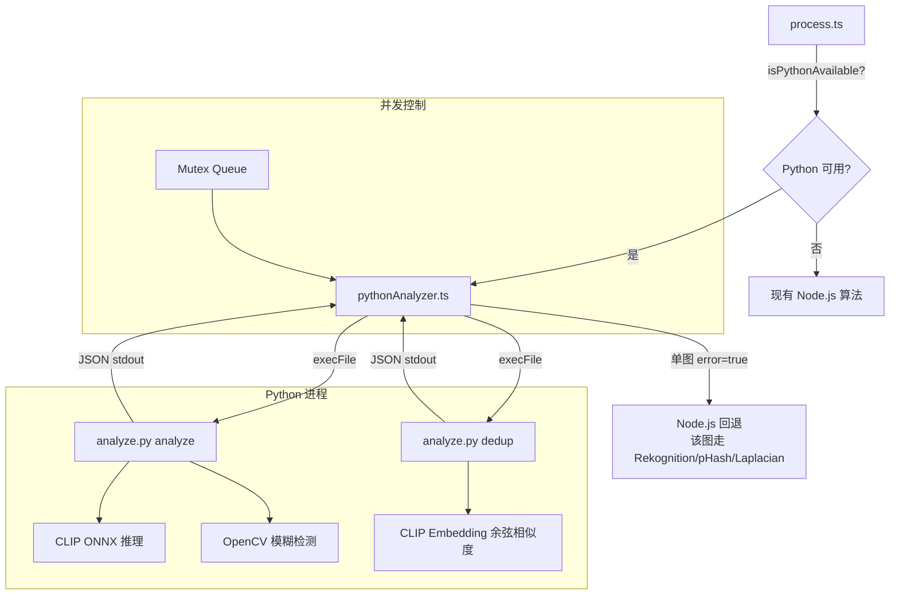
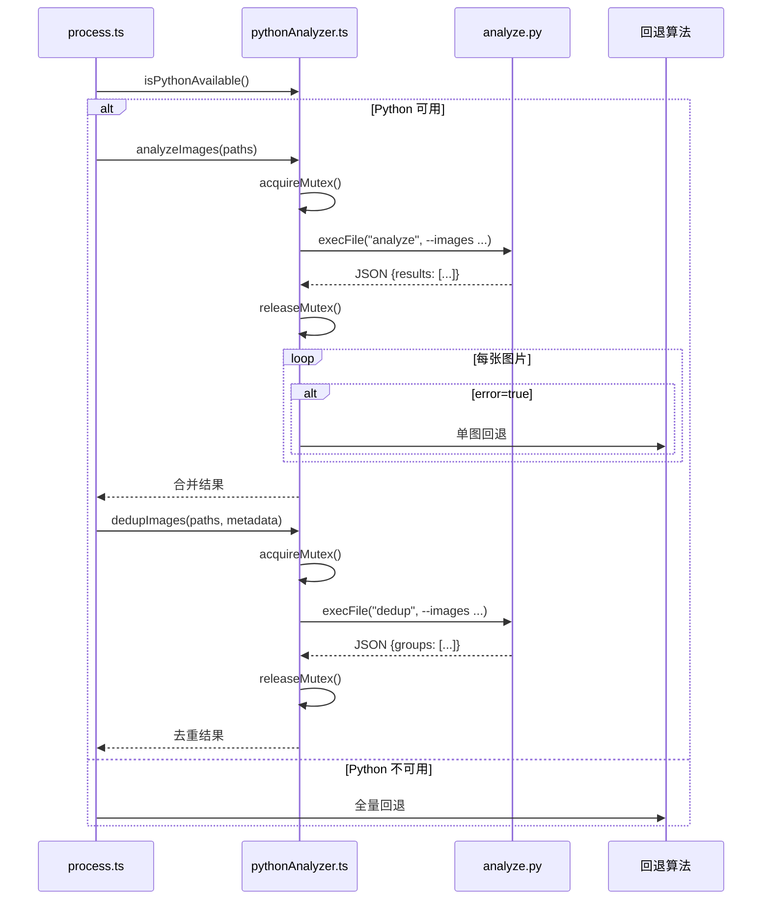
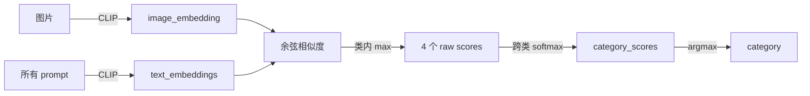
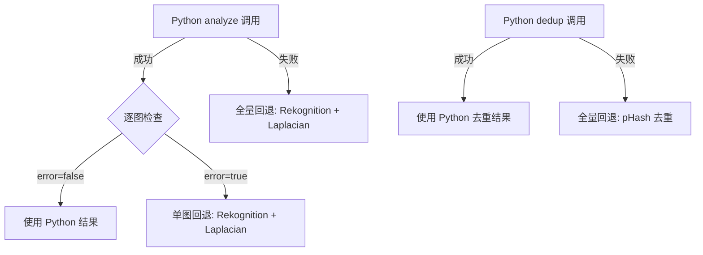

# 设计文档：Python CLIP 图片分析

## 概述

本设计将 Python 生态的 CLIP（ONNX Runtime）和 OpenCV 引入现有 Node.js 处理流水线，替代 AWS Rekognition 分类、pHash 去重和 Node.js Laplacian 模糊检测。Python 脚本作为 CLI 工具运行，Node.js 通过 `child_process.execFile` 调用，不常驻内存。

核心设计决策：
- **ONNX Runtime** 而非 PyTorch：CPU 友好，内存约 500MB vs 1.5GB
- **CLI 子命令** 而非 HTTP 服务：无需常驻进程，按需启动
- **互斥锁 + 队列**：t3.medium（2核 4GB）只允许 1 个 Python 进程同时运行
- **批量处理 + 分批**：单次最多 200 张图，超出时分批并保留 20 张重叠
- **渐进式回退**：Python 不可用或单图失败时，自动回退到现有 Node.js 算法

## 架构

### 系统架构图



### 文件结构

```
server/
├── python/
│   ├── analyze.py              # CLI 主入口（analyze/dedup 子命令）
│   ├── prepare_model.py        # 模型下载 + ONNX 导出脚本
│   ├── model_config.json       # 模型版本、路径、sha256 校验
│   ├── requirements.txt        # Python 依赖
│   └── models/                 # 本地模型目录（gitignore）
│       └── clip-vit-base-patch32-onnx/
│           ├── model.onnx
│           ├── tokenizer.json
│           └── ...
├── src/
│   └── services/
│       └── pythonAnalyzer.ts   # Node.js 封装层
```

### 处理流水线集成



## 组件与接口

### 1. Python CLI（analyze.py）

#### analyze 子命令

```bash
python analyze.py analyze \
  --images /path/to/img1.jpg /path/to/img2.jpg ... \
  --model-dir ./models \
  --blur-threshold 100
```

输出（stdout JSON）：
```json
{
  "results": [
    {
      "file": "/path/to/img1.jpg",
      "error": false,
      "category": "animal",
      "category_scores": {"people": 0.05, "animal": 0.80, "landscape": 0.12, "other": 0.03},
      "blur_status": "clear",
      "blur_score": 245.7
    },
    {
      "file": "/path/to/img2.jpg",
      "error": true,
      "error_message": "Failed to open image",
      "category": null,
      "category_scores": null,
      "blur_status": "unknown",
      "blur_score": null
    }
  ],
  "model_load_time_ms": 4800,
  "total_time_ms": 52300
}
```

#### dedup 子命令

```bash
python analyze.py dedup \
  --images /path/to/img1.jpg /path/to/img2.jpg ... \
  --threshold 0.9 \
  --model-dir ./models \
  --metadata '{"0": {"blur_score": 245, "width": 4000, "height": 3000, "file_size": 5200000}, ...}'
```

输出（stdout JSON）：
```json
{
  "groups": [
    {
      "indices": [0, 3, 7],
      "keep": 3,
      "similarities": [[0, 3, 0.95], [0, 7, 0.92], [3, 7, 0.91]]
    }
  ],
  "embedding_time_ms": 48000,
  "total_time_ms": 55000
}
```

#### 退出码

| 退出码 | 含义 |
|--------|------|
| 0 | 成功 |
| 1 | 运行时错误 |
| 2 | 模型文件不存在 |

### 2. 模型准备脚本（prepare_model.py）

```bash
python prepare_model.py --config model_config.json --output-dir ./models
```

功能：
1. 从 HuggingFace 下载 openai/clip-vit-base-patch32（固定 revision）
2. 使用 optimum 导出为 ONNX 格式
3. 验证导出文件的 sha256 校验和
4. 写入 models/ 目录

### 3. 模型配置（model_config.json）

```json
{
  "model_name": "openai/clip-vit-base-patch32",
  "revision": "e5c8b8b5e7e3b7f3c5d5e5f5a5b5c5d5e5f5a5b5",
  "onnx_dir": "models/clip-vit-base-patch32-onnx",
  "checksums": {
    "model.onnx": "sha256:abcdef1234567890...",
    "tokenizer.json": "sha256:1234567890abcdef..."
  }
}
```

### 4. Node.js 封装层（pythonAnalyzer.ts）

```typescript
// 导出接口
// isPythonAvailable() 检测：Python 3.9+ 可执行、模型目录存在、model_config.json 中声明的关键文件 checksum 校验通过
// 缓存策略：进程启动时检测一次并缓存结果；Python 调用返回 exit code 2 时将缓存置为 false 且不再重试
export function isPythonAvailable(): boolean;

export interface PythonAnalyzeResult {
  file: string;
  error: boolean;
  errorMessage?: string;
  category: ImageCategory | null;
  categoryScores: Record<string, number> | null;
  blurStatus: 'clear' | 'blurry' | 'unknown';
  blurScore: number | null;
}

export interface PythonDedupGroup {
  indices: number[];
  keep: number;
  similarities: [number, number, number][];
}

export interface PythonDedupResult {
  groups: PythonDedupGroup[];
}

export async function analyzeImages(
  imagePaths: string[],
  options?: { blurThreshold?: number; modelDir?: string }
): Promise<PythonAnalyzeResult[]>;

export async function dedupImages(
  imagePaths: string[],
  metadata: Record<number, { blur_score: number; width: number; height: number; file_size: number }>,
  options?: { threshold?: number; modelDir?: string }
): Promise<PythonDedupResult>;
```

#### 并发控制

```typescript
// 互斥锁实现：同一时刻只允许 1 个 Python 进程
class PythonMutex {
  private queue: Array<() => void> = [];
  private locked = false;

  async acquire(): Promise<void> {
    if (!this.locked) {
      this.locked = true;
      return;
    }
    return new Promise(resolve => this.queue.push(resolve));
  }

  release(): void {
    const next = this.queue.shift();
    if (next) {
      next(); // 下一个等待者获得锁
    } else {
      this.locked = false;
    }
  }
}
```

#### 批量分片

**analyze 命令**：当图片数 > 200 时，自动分批，每批最多 200 张，无需重叠（analyze 是逐图独立处理）。

**dedup 命令**：不使用分批重叠策略。dedup 始终在整个 trip 范围内工作：
- ≤ 500 张：全量余弦相似度矩阵
- > 500 张：逐图 top-k 近邻检索（见去重算法章节）

### 5. 分类评分算法

#### Prompt Template 配置

```python
CATEGORY_PROMPTS = {
    "animal": [
        "a photo of an animal",
        "a photo of wildlife in nature",
        "a photo of a lion in the grassland",
        "a photo of fish underwater",
        "a photo of birds in the sky",
        "a photo of elephants",
        "a photo of a giraffe",
    ],
    "landscape": [
        "a photo of natural scenery",
        "a photo of mountains and sky",
        "a photo of ocean and beach",
        "a photo of a sunset",
        "a photo of a forest",
    ],
    "people": [
        "a photo of a person",
        "a photo of people",
        "a portrait photo",
        "a photo of a diver underwater",
    ],
    "other": [
        "a photo of food",
        "a photo of an object",
        "an abstract photo",
        "a photo of text or documents",
    ],
}
```

#### 评分聚合流程



1. 提取图片 embedding（512维）
2. 提取所有 prompt 的 text embedding
3. 计算图片与每个 prompt 的余弦相似度
4. 同一类别内取 max（class-internal max aggregation）
5. 四个类别的 max 值做 softmax 归一化 → `category_scores`
6. 取最高分类别 → `category`

### 6. 模糊检测算法

```python
def detect_blur(image_path, threshold=100):
    img = cv2.imread(image_path)
    gray = cv2.cvtColor(img, cv2.COLOR_BGR2GRAY)
    
    # CLAHE 亮度归一化，消除暗图偏差
    clahe = cv2.createCLAHE(clipLimit=2.0, tileGridSize=(8, 8))
    normalized = clahe.apply(gray)
    
    # Laplacian 方差
    laplacian = cv2.Laplacian(normalized, cv2.CV_64F)
    blur_score = laplacian.var()
    
    blur_status = "blurry" if blur_score < threshold else "clear"
    return blur_status, blur_score
```

### 7. 去重算法

#### ≤ 500 张：全量余弦相似度矩阵

```python
# embeddings: (N, 512) numpy array
# 归一化
norms = np.linalg.norm(embeddings, axis=1, keepdims=True)
normalized = embeddings / norms
# 余弦相似度矩阵 (N, N)
sim_matrix = normalized @ normalized.T
# 找出相似度 > threshold 的对
```

#### > 500 张：逐图 top-k 近邻（V1 避免 O(n²) 内存，计算仍为 O(n²)）

```python
# V1: 逐图计算相似度，避免 O(n²) 内存占用（但计算量仍为 O(n²)）
# V2 可用 faiss 索引避免 O(n²) 计算
for i in range(N):
    sims = normalized[i] @ normalized.T  # (N,) — 单行计算
    top_k_indices = np.argpartition(sims, -50)[-50:]
    for j in top_k_indices:
        if sims[j] > threshold and j > i:
            # 标记为重复对
```

#### 保留优先级

重复组内选择保留图片的优先级：
1. `blur_score` 最高（最清晰）
2. 分辨率（width × height）最高
3. 文件大小最大

## 数据模型

### Python 输出 JSON Schema

#### analyze 输出

```typescript
interface AnalyzeOutput {
  results: Array<{
    file: string;
    error: boolean;
    error_message?: string;
    category: 'people' | 'animal' | 'landscape' | 'other' | null;
    category_scores: {
      people: number;
      animal: number;
      landscape: number;
      other: number;
    } | null;
    blur_status: 'clear' | 'blurry' | 'unknown';
    blur_score: number | null;
  }>;
  model_load_time_ms: number;
  total_time_ms: number;
}
```

#### dedup 输出

```typescript
interface DedupOutput {
  groups: Array<{
    indices: number[];      // 重复组中的图片索引
    keep: number;           // 推荐保留的图片索引
    similarities: [number, number, number][];  // [i, j, similarity]
  }>;
  embedding_time_ms: number;
  total_time_ms: number;
}
```

### 数据库字段映射

Python 输出与现有数据库字段完全兼容，无需新增列：

| Python 输出字段 | DB 列 | 说明 |
|----------------|-------|------|
| category | media_items.category | people/animal/landscape/other |
| blur_status | media_items.blur_status | clear/blurry/unknown |
| blur_score | media_items.sharpness_score | 数值越高越清晰 |
| (dedup 结果) | media_items.status | 'trashed' |
| (dedup 结果) | media_items.trashed_reason | 'duplicate' |

### 性能基线（t3.medium, 2核 CPU）

| 操作 | 单图耗时 | 100 张总耗时 |
|------|---------|-------------|
| 模型冷加载 | ~5s（首次） | 5s |
| CLIP 推理（分类） | ~0.5s/张 | ~50s |
| OpenCV 模糊检测 | ~0.01s/张 | ~1s |
| analyze 总计 | - | ~60s |
| CLIP Embedding（去重） | ~0.5s/张 | ~50s |
| 余弦相似度计算 | - | ~5s |
| dedup 总计 | - | ~55s |

### 批量处理限制

| 参数 | 值 | 说明 |
|------|-----|------|
| 单批最大图片数（analyze） | 200 | 避免内存溢出 |
| dedup 分批策略 | 不分批 | 整 trip 范围内全量或 top-k |
| top-k 近邻数 | 50 | >500 张时的近邻搜索 |
| execFile timeout | 300s | 防止进程挂起 |
| execFile maxBuffer | 50MB | 防止 JSON 输出撑爆 Node |
| 最大并发 Python 进程 | 1 | 互斥锁控制 |


## 正确性属性（Correctness Properties）

*属性是在系统所有有效执行中都应成立的特征或行为——本质上是关于系统应该做什么的形式化陈述。属性是人类可读规范与机器可验证正确性保证之间的桥梁。*

### Property 1: Softmax 归一化输出有效概率分布

*For any* 图片的 CLIP 分类结果，`category_scores` 中的四个值（people, animal, landscape, other）应全部 >= 0，且总和约等于 1.0（误差 < 0.01）。

**Validates: Requirements 2.3, 2.4**

### Property 2: Analyze 输出字段值域有效性

*For any* 成功处理的图片（error=false），返回的 `category` 必须是 `"people" | "animal" | "landscape" | "other"` 之一，`blur_status` 必须是 `"clear" | "blurry"` 之一，`blur_score` 必须是非负数值。

**Validates: Requirements 2.2, 3.3, 7.4**

### Property 3: 模糊阈值分类一致性

*For any* 非负 blur_score 和正数 threshold，当 blur_score < threshold 时 blur_status 应为 "blurry"，当 blur_score >= threshold 时 blur_status 应为 "clear"。

**Validates: Requirements 3.4**

### Property 4: CLIP Embedding 维度不变性

*For any* 成功提取的图片 embedding，其维度应恒为 512。

**Validates: Requirements 4.1**

### Property 5: 去重分组正确性（连通分量）

*For any* 一组图片 embeddings 和阈值 threshold，若两张图片之间存在高于阈值的相似边（直接或通过其他图片间接连通），则它们应落在同一连通重复组中。不存在任何相似边连通的图片不应被分到同一组。

**Validates: Requirements 4.3**

### Property 6: 去重保留优先级

*For any* 重复组及其元数据（blur_score, width, height, file_size），被推荐保留的图片应是组内 blur_score 最高的；若 blur_score 相同，则分辨率（width×height）最高的；若分辨率也相同，则文件大小最大的。

**Validates: Requirements 4.5**

### Property 7: stdout JSON 输出完整性

*For any* analyze 或 dedup 命令的调用（无论是否有单图失败），stdout 输出应始终是可解析的合法 JSON。

**Validates: Requirements 5.3, 5.4**

### Property 8: 部分失败隔离

*For any* 包含有效和无效图片路径的批量输入，结果数组长度应等于输入图片数，无效图片标记 error=true 不影响有效图片的正常结果（category、blur_status 等字段正常填充）。

**Validates: Requirements 5.5, 6.4**

### Property 9: Python JSON 输出解析往返

*For any* 合法的 Python analyze JSON 输出字符串，经 Node.js 封装层解析后再序列化回 JSON，应与原始数据在语义上等价（字段名 snake_case → camelCase 映射正确，数值精度保持）。

**Validates: Requirements 6.2**

## 错误处理

### Python 脚本层

| 错误场景 | 处理方式 |
|---------|---------|
| 模型文件不存在 | exit code 2，stderr 输出错误信息 |
| 单张图片打开失败 | 该图 error=true，继续处理其他图 |
| 单张图片 CLIP 推理失败 | 该图 error=true，category=null |
| 单张图片 OpenCV 失败 | blur_status='unknown'，blur_score=null |
| 内存不足 | exit code 1，stderr 输出 OOM 信息 |
| 未知异常 | exit code 1，stderr 输出 traceback |

### Node.js 封装层

| 错误场景 | 处理方式 |
|---------|---------|
| Python 不可用（isPythonAvailable=false） | 直接走回退算法，不尝试调用 |
| execFile timeout（>300s） | 杀死进程，全量回退 |
| exit code 2（模型不存在） | 全量回退，标记 isPythonAvailable=false |
| exit code 1（运行时错误） | 全量回退 |
| JSON 解析失败 | 全量回退 |
| 单图 error=true | 仅该图走 Node.js 回退（analyze 失败 → Rekognition + Laplacian） |
| maxBuffer 超限 | 杀死进程，全量回退 |

### 回退策略



- **analyze 单图失败** → 该图走 Rekognition 分类 + Node.js Laplacian 模糊检测
- **analyze 整体失败** → 全部图走 Rekognition + Laplacian
- **dedup 整体失败** → 整个 trip 走 pHash 去重

## 测试策略

### 属性测试（Property-Based Testing）

使用 **fast-check**（Node.js）和 **hypothesis**（Python）进行属性测试，每个属性至少运行 100 次迭代。

#### Node.js 侧（fast-check）

| 属性 | 测试内容 | 标签 |
|------|---------|------|
| Property 1 | 生成随机 4 维 raw scores，验证 softmax 输出 sum≈1 且 all>=0 | Feature: python-clip-analysis, Property 1: Softmax normalization validity |
| Property 2 | 生成随机 analyze 结果，验证字段值域 | Feature: python-clip-analysis, Property 2: Analyze output field validity |
| Property 3 | 生成随机 (blur_score, threshold) 对，验证分类一致性 | Feature: python-clip-analysis, Property 3: Blur threshold classification |
| Property 6 | 生成随机重复组元数据，验证保留选择 | Feature: python-clip-analysis, Property 6: Retention priority |
| Property 7 | 生成随机 analyze/dedup 输出，验证 JSON 可解析 | Feature: python-clip-analysis, Property 7: stdout JSON validity |
| Property 8 | 生成混合有效/无效路径的批量输入，验证隔离性 | Feature: python-clip-analysis, Property 8: Partial failure isolation |
| Property 9 | 生成随机 Python JSON 输出，验证解析往返 | Feature: python-clip-analysis, Property 9: JSON parsing round-trip |

#### Python 侧（hypothesis）

| 属性 | 测试内容 | 标签 |
|------|---------|------|
| Property 1 | 生成随机 raw scores，验证 softmax 归一化 | Feature: python-clip-analysis, Property 1: Softmax normalization validity |
| Property 3 | 生成随机 (score, threshold)，验证阈值分类 | Feature: python-clip-analysis, Property 3: Blur threshold classification |
| Property 4 | 验证 embedding 维度恒为 512（需模型可用） | Feature: python-clip-analysis, Property 4: Embedding dimensionality |
| Property 5 | 生成随机 embedding 矩阵，验证分组正确性 | Feature: python-clip-analysis, Property 5: Duplicate grouping correctness |
| Property 6 | 生成随机元数据，验证保留优先级 | Feature: python-clip-analysis, Property 6: Retention priority |

### 单元测试

| 测试 | 内容 |
|------|------|
| model_config.json 内容 | 验证包含 model_name、revision、checksums 字段 |
| requirements.txt 内容 | 验证包含所有必需依赖 |
| exit code 2 | 模型目录不存在时返回 exit code 2 |
| isPythonAvailable() | Python 不存在时返回 false |
| 全量回退 | Python 失败时走 Rekognition + pHash + Laplacian |
| SSE 步骤名 | 验证 blurDetect/dedup/classify 步骤名不变 |
| timeout/maxBuffer 配置 | 验证 execFile 参数 |
| CLAHE 预处理 | 暗图不被误判为模糊（对比有无 CLAHE） |
| 批量分片 | analyze >200 张时正确分批，无重叠；dedup 不分批 |
| 互斥锁 | 并发调用时排队执行 |

### 测试配置

- Node.js: `vitest` + `fast-check`，属性测试 100+ 迭代
- Python: `pytest` + `hypothesis`，属性测试 100+ 迭代
- 每个属性测试必须注释引用设计文档中的属性编号
- 标签格式：`Feature: python-clip-analysis, Property {N}: {property_text}`
