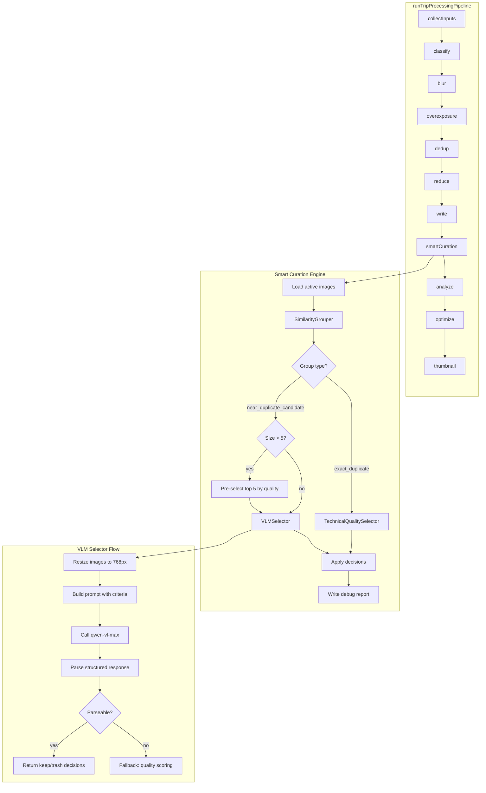
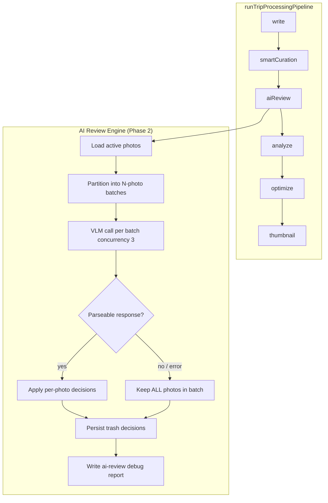
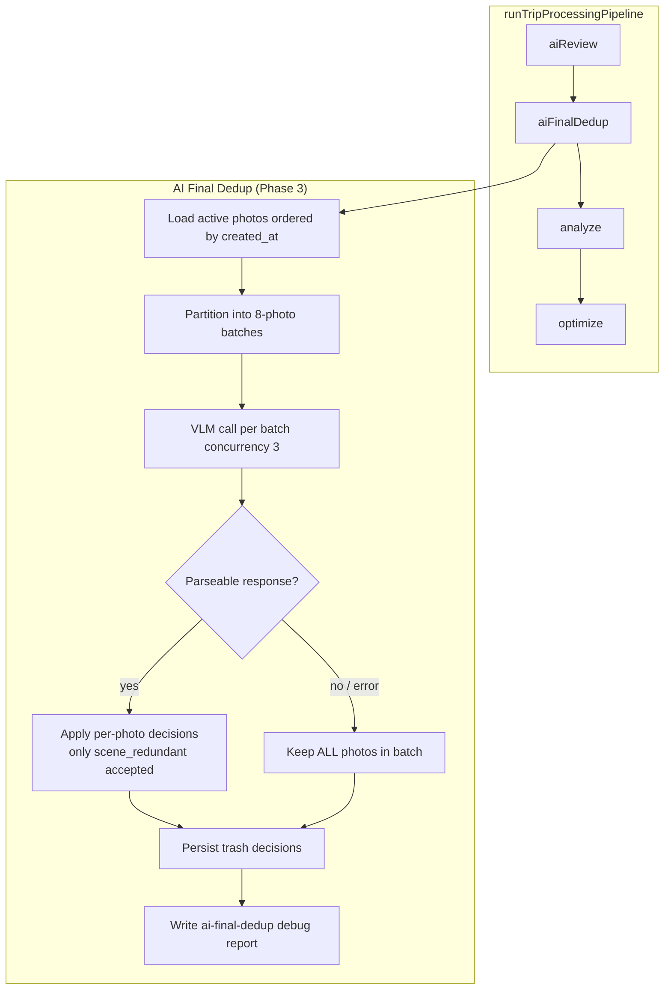

# Design Document: Smart Curation

## Overview

Smart Curation replaces the existing `aiScreening` pipeline stage with a two-phase curation engine. Phase 1 groups photos by visual similarity using DINOv2 embeddings with tiered thresholds (exact duplicate >= 0.94, near-duplicate >= 0.86). Phase 2 selects the best photo(s) from each group using technical quality scoring for exact duplicates and VLM-based evaluation (DashScope qwen-vl-max) for near-duplicate candidates.

The system is designed for travel/diving photography where underwater blue-tinted images are common. It produces soft-delete decisions with specific machine-readable trash reasons and a debug JSON report for auditability.

### Design Decisions

1. **Reuse existing UnionFind and embedding infrastructure** - The `hybridDedupEngine.ts` already has a battle-tested UnionFind and DINOv2 embedding pipeline. Smart Curation wraps these rather than reimplementing.
2. **Exact duplicates skip VLM** - Groups with similarity >= 0.94 are resolved by technical quality scoring alone, saving VLM API cost.
3. **Pre-selection for large groups** - Groups with > 5 candidates are pre-filtered to top 3-5 by technical quality before VLM evaluation, keeping VLM calls within the 5-image limit.
4. **Concurrency-limited VLM calls** - A semaphore limits parallel VLM requests to 3, matching the existing `aiImageScreener` pattern.
5. **Graceful degradation** - If DINOv2 is unavailable, fall back to pHash/dHash. If VLM is unavailable or returns unparseable output, fall back to technical quality scoring.

## Architecture



## Components and Interfaces

### SmartCurationEngine - Orchestrator

```typescript
// server/src/services/smartCuration/smartCurationEngine.ts

/** Trash reasons as a union type */
export type TrashReason =
  | 'exact_duplicate'
  | 'near_duplicate_worse'
  | 'scene_redundant'
  | 'blurry'
  | 'low_subject_quality'
  | 'low_aesthetic_quality'
  | 'low_video_value';

/** Group classification based on similarity tier */
export type GroupType = 'exact_duplicate' | 'near_duplicate_candidate';

/** Similarity source used for grouping */
export type SimilaritySource = 'dinov2' | 'phash' | 'dhash' | 'clip';

/** A photo candidate within the curation pipeline */
export interface CurationCandidate {
  mediaId: string;
  filePath: string;
  originalFilename: string;
  fileSize: number;
  width: number | null;
  height: number | null;
  sharpnessScore: number | null;
}

/** A group of similar photos */
export interface CurationGroup {
  groupId: string;
  groupType: GroupType;
  similaritySource: SimilaritySource;
  maxSimilarity: number;
  candidates: CurationCandidate[];
}

/** Decision for a single photo */
export interface CurationDecision {
  mediaId: string;
  decision: 'keep' | 'trash';
  reason: TrashReason | null;
  groupId: string;
  groupType: GroupType | 'ungrouped';
  similaritySource: SimilaritySource | null;
  similarityScore: number | null;
}

/** Result of the full curation run */
export interface SmartCurationResult {
  totalProcessed: number;
  totalTrashed: number;
  totalKept: number;
  groupsProcessed: number;
  vlmCallsMade: number;
  fallbacksUsed: number;
  debugReportPath: string;
}

/** Options for the smart curation engine */
export interface SmartCurationOptions {
  onProgress?: (stage: string, status: string, detail?: string) => void;
}

/**
 * Main entry point: runs smart curation on all active images for a trip.
 * Called by the pipeline after the write stage.
 */
export async function runSmartCuration(
  tripId: string,
  options?: SmartCurationOptions
): Promise<SmartCurationResult>;
```

### SimilarityGrouper

```typescript
// server/src/services/smartCuration/similarityGrouper.ts

import { CurationCandidate, CurationGroup, SimilaritySource } from './smartCurationEngine';

/** Thresholds for tiered grouping */
export const EXACT_DUPLICATE_THRESHOLD = 0.94;
export const NEAR_DUPLICATE_THRESHOLD = 0.86;

/** Raw similarity edge between two candidates */
export interface SimilarityEdge {
  i: number;
  j: number;
  similarity: number;
  source: SimilaritySource;
}

/**
 * Groups candidates by visual similarity using DINOv2 embeddings
 * with Union-Find clustering. Falls back to pHash/dHash if ML service
 * is unavailable.
 *
 * Returns groups of 2+ candidates. Singletons are not included
 * (they are implicitly "kept").
 */
export async function groupBySimilarity(
  candidates: CurationCandidate[]
): Promise<{
  groups: CurationGroup[];
  ungrouped: CurationCandidate[];
  similaritySource: SimilaritySource;
}>;
```

### VLMSelector

```typescript
// server/src/services/smartCuration/vlmSelector.ts

import { CurationCandidate, TrashReason } from './smartCurationEngine';

/** VLM response for a single group evaluation */
export interface VLMSelectionResponse {
  keep: number[];
  trash: Array<{
    index: number;
    reason: TrashReason;
  }>;
}

/** Keep quota based on group size */
export interface KeepQuota {
  min: number;
  max: number;
}

/**
 * Determines the keep quota for a group based on its size.
 * - 2-3 photos: keep exactly 1
 * - 4-8 photos: keep 1-2
 * - 9+ photos: keep 2-3
 */
export function getKeepQuota(groupSize: number): KeepQuota;

/**
 * Calls the VLM to select the best photo(s) from a group of candidates.
 * Images are resized to 768px and sent as base64 to qwen-vl-max.
 *
 * Returns structured decisions. If VLM response is unparseable,
 * throws an error (caller handles fallback).
 */
export async function selectBestByVLM(
  candidates: CurationCandidate[],
  keepQuota: KeepQuota
): Promise<VLMSelectionResponse>;

/**
 * Parses the VLM text response into a structured VLMSelectionResponse.
 * Returns null if the response cannot be parsed.
 */
export function parseVLMResponse(
  responseText: string,
  candidateCount: number,
  keepQuota: KeepQuota
): VLMSelectionResponse | null;
```

### TechnicalQualitySelector

```typescript
// server/src/services/smartCuration/technicalQualitySelector.ts

import { CurationCandidate } from './smartCurationEngine';

/**
 * Selects the best photo from a group using technical quality metrics
 * (sharpness, resolution, file size). Used for exact duplicate groups
 * and as fallback when VLM is unavailable.
 *
 * Returns the index of the best candidate.
 */
export async function selectBestByQuality(
  candidates: CurationCandidate[]
): Promise<number>;

/**
 * Pre-selects the top N candidates by technical quality score.
 * Used to reduce large groups before VLM evaluation.
 */
export async function preselectTopCandidates(
  candidates: CurationCandidate[],
  maxCount: number
): Promise<{ selected: CurationCandidate[]; originalIndices: number[] }>;
```

### DebugReportWriter

```typescript
// server/src/services/smartCuration/debugReportWriter.ts

import { CurationDecision } from './smartCurationEngine';

/** Debug report entry for a single photo */
export interface DebugReportEntry {
  mediaId: string;
  filename: string;
  groupId: string;
  groupType: 'exact_duplicate' | 'near_duplicate_candidate' | 'ungrouped';
  similaritySource: 'dinov2' | 'phash' | 'dhash' | 'clip' | null;
  similarityScore: number | null;
  decision: 'keep' | 'trash';
  reason: string | null;
}

/** Full debug report structure */
export interface DebugReport {
  tripId: string;
  timestamp: string;
  totalProcessed: number;
  totalKept: number;
  totalTrashed: number;
  groups: Array<{
    groupId: string;
    groupType: string;
    candidateCount: number;
    keptCount: number;
  }>;
  entries: DebugReportEntry[];
}

/**
 * Writes the debug report JSON to a predictable path.
 * Path: data/debug/smart-curation-{tripId}-{timestamp}.json
 */
export async function writeDebugReport(
  tripId: string,
  decisions: CurationDecision[],
  groups: Array<{ groupId: string; groupType: string; candidateCount: number }>
): Promise<string>;
```

### VLM Prompt Design

The VLM prompt is designed for group-internal best-photo selection optimized for travel slideshow video output:

```typescript
export function buildCurationPrompt(candidateCount: number, keepQuota: KeepQuota): string {
  const keepText = keepQuota.min === keepQuota.max
    ? `exactly ${keepQuota.min}`
    : `${keepQuota.min} to ${keepQuota.max}`;

  return `You are a professional travel photo curator selecting the best photos for a travel slideshow video.

You are shown ${candidateCount} photos from the same scene or subject. These may be underwater/diving photos with blue tint and low contrast - this is NORMAL for underwater photography and should NOT be treated as a defect.

Select the ${keepText} best photo(s) for a travel slideshow video.

SELECTION CRITERIA (in priority order):
1. Subject size and completeness - the main subject should be large, fully visible, not cut off
2. Subject sharpness and clarity - the subject should be in focus
3. Pose and gesture quality - natural, dynamic, or interesting poses preferred
4. Composition suitability for video - rule of thirds, visual balance, works at 16:9
5. Color naturalness - for non-underwater: vivid natural colors; for underwater: good visibility through blue tint
6. Occlusion level - subject not blocked by other objects
7. Background cleanliness - minimal distracting elements
8. Information content - the photo tells a story or captures a moment

FOR UNDERWATER PHOTOS:
- Blue/green color cast is NORMAL, do not penalize
- Evaluate based on subject visibility and composition
- Prefer shots where marine life is most complete and clearly visible

RESPOND IN THIS EXACT JSON FORMAT:
{
  "keep": [<indices of photos to keep, 0-based>],
  "trash": [
    {"index": <0-based index>, "reason": "<one of: near_duplicate_worse, scene_redundant, blurry, low_subject_quality, low_aesthetic_quality, low_video_value>"}
  ]
}

IMPORTANT:
- Indices are 0-based (first photo is 0)
- Every photo must appear in either "keep" or "trash"
- Each trashed photo must have exactly one reason
- You must keep ${keepText} photo(s)`;
}
```

## Data Models

### Database Changes

No new tables are required. The existing `media_items.trashed_reason` column is reused with new enum values:

```sql
-- Existing column, new values added:
-- media_items.trashed_reason TEXT
-- New values: 'exact_duplicate', 'near_duplicate_worse', 'scene_redundant',
--             'blurry', 'low_subject_quality', 'low_aesthetic_quality', 'low_video_value'
-- No schema migration needed - trashed_reason is already a free-text column.
```

### Debug Report File Structure

```json
{
  "tripId": "abc-123",
  "timestamp": "2024-01-15T10:30:00.000Z",
  "totalProcessed": 45,
  "totalKept": 28,
  "totalTrashed": 17,
  "groups": [
    {
      "groupId": "g-001",
      "groupType": "exact_duplicate",
      "candidateCount": 3,
      "keptCount": 1
    }
  ],
  "entries": [
    {
      "mediaId": "media-001",
      "filename": "IMG_0001.jpg",
      "groupId": "g-001",
      "groupType": "exact_duplicate",
      "similaritySource": "dinov2",
      "similarityScore": 0.97,
      "decision": "keep",
      "reason": null
    },
    {
      "mediaId": "media-002",
      "filename": "IMG_0002.jpg",
      "groupId": "g-001",
      "groupType": "exact_duplicate",
      "similaritySource": "dinov2",
      "similarityScore": 0.97,
      "decision": "trash",
      "reason": "exact_duplicate"
    }
  ]
}
```

### Pipeline Integration

The `smartCuration` stage replaces the existing `aiScreening` stage in `runTripProcessingPipeline.ts`:

```typescript
// In runTripProcessingPipeline.ts - replaces the aiScreening block:

// ---- Stage: smartCuration ----
// Runs AFTER write so that dedup trashed images are already committed to DB
onProgress('smartCuration', 'start');
t0 = Date.now();
try {
  const curationResult = await runSmartCuration(tripId, {
    onProgress: (stage, status, detail) => {
      onProgress('smartCuration', status, detail);
    },
  });
  console.log(
    `[pipeline] smartCuration: ${curationResult.totalTrashed} trashed from ` +
    `${curationResult.totalProcessed} images, ${curationResult.vlmCallsMade} VLM calls, ` +
    `${Date.now() - t0}ms`
  );
  onProgress('smartCuration', 'complete', `${curationResult.totalTrashed} trashed`);
} catch (err) {
  const msg = err instanceof Error ? err.message : String(err);
  stageErrors.push({ stage: 'smartCuration', error: msg });
  console.error(`[pipeline] smartCuration FAILED: ${msg} (${Date.now() - t0}ms)`);
  onProgress('smartCuration', 'complete', `failed: ${msg}`);
}
```

## Correctness Properties

*A property is a characteristic or behavior that should hold true across all valid executions of a system - essentially, a formal statement about what the system should do. Properties serve as the bridge between human-readable specifications and machine-verifiable correctness guarantees.*

### Property 1: Tiered Grouping by Cosine Similarity

*For any* set of image embeddings and any pair (i, j), if cosine_similarity(i, j) >= 0.94 then i and j SHALL be in the same group with type `exact_duplicate`; if 0.86 <= cosine_similarity(i, j) < 0.94 then they SHALL be in the same group with type `near_duplicate_candidate`; if cosine_similarity(i, j) < 0.86 then they SHALL NOT be in the same group.

**Validates: Requirements 1.2, 1.3, 1.4**

### Property 2: Group Size Determines Keep Quota

*For any* CurationGroup, the number of photos kept SHALL satisfy: if group size is 2-3, exactly 1 is kept; if group size is 4-8, 1-2 are kept; if group size is 9+, 2-3 are kept.

**Validates: Requirements 2.1, 2.2, 2.3**

### Property 3: Pre-selection Reduces Large Groups to At Most 5

*For any* CurationGroup with more than 5 candidates, the candidates sent to the VLM SHALL number at most 5, and those 5 SHALL be the top-scoring candidates by technical quality.

**Validates: Requirements 3.3, 8.2**

### Property 4: VLM Response Parsing Round-Trip

*For any* valid VLMSelectionResponse (with keep indices and trash entries summing to candidateCount, and all reasons being valid TrashReason values), serializing to JSON and parsing back SHALL produce an equivalent VLMSelectionResponse.

**Validates: Requirements 3.4**

### Property 5: Trash Reason Matches Group Type and Determination

*For any* photo trashed from an `exact_duplicate` group, the trash reason SHALL be `exact_duplicate`. *For any* photo trashed from a `near_duplicate_candidate` group, the trash reason SHALL be one of: `near_duplicate_worse`, `scene_redundant`, `blurry`, `low_subject_quality`, `low_aesthetic_quality`, `low_video_value`.

**Validates: Requirements 4.1, 4.2, 4.3, 4.4, 4.5, 4.6, 4.7**

### Property 6: Soft Delete Invariant

*For any* curation decision that trashes a photo, the system SHALL only modify `status` to 'trashed' and set `trashed_reason`; the `file_path` value SHALL remain unchanged and no storage delete operation SHALL be invoked.

**Validates: Requirements 5.1, 5.2**

### Property 7: Debug Report Completeness

*For any* set of curation decisions, the generated debug report SHALL contain exactly one entry per processed photo, and each entry SHALL include all required fields: `mediaId`, `filename`, `groupId`, `groupType`, `similaritySource`, `similarityScore`, `decision`, and `reason`.

**Validates: Requirements 6.2, 6.3, 6.4**

### Property 8: VLM Invoked Only for Near-Duplicate Groups with 2+ Members

*For any* curation run, the VLM SHALL be invoked only for groups classified as `near_duplicate_candidate` containing 2 or more photos. Singleton groups, ungrouped photos, and `exact_duplicate` groups SHALL never trigger a VLM call.

**Validates: Requirements 8.1, 8.3, 8.5**

### Property 9: Curation Processes Only Active Photos

*For any* trip with a mix of active, trashed, and other-status photos, the Smart Curation Engine SHALL process only photos with `status = 'active'` and SHALL not modify photos with any other status.

**Validates: Requirements 7.2**

### Property 10: Union-Find Grouping Transitivity

*For any* set of embeddings where similarity(A,B) >= threshold and similarity(B,C) >= threshold, A, B, and C SHALL all be in the same group (transitivity via Union-Find), even if similarity(A,C) < threshold.

**Validates: Requirements 1.1**

## Error Handling

| Scenario | Behavior | Fallback |
|----------|----------|----------|
| DINOv2 ML service unavailable | Log warning, use pHash/dHash hamming distance for grouping | Groups may be less accurate but pipeline continues |
| DASHSCOPE_API_KEY not configured | Skip VLM selection entirely | Use technical quality scoring for all groups |
| VLM returns unparseable response | Log warning, increment fallbacksUsed counter | Select best by technical quality (sharpness, resolution, file size) |
| VLM API timeout (30s) | Retry once, then fall back | Technical quality scoring |
| Image download/resize fails | Skip that candidate from the group | Remaining candidates still evaluated |
| All candidates in a group fail to download | Skip the entire group, keep all photos | No decisions made for that group |
| Single-photo group | Auto-keep without any evaluation | N/A |
| Empty trip (no active images) | Return immediately with zero counts | N/A |
| Debug report write fails | Log error but do not fail the pipeline | Curation decisions are still applied to DB |

### Error Recovery Strategy

```typescript
// Concurrency-limited VLM calls with error isolation
const CONCURRENCY_LIMIT = 3;

async function processGroupsWithConcurrency(
  groups: CurationGroup[],
  processFn: (group: CurationGroup) => Promise<CurationDecision[]>
): Promise<CurationDecision[]> {
  const allDecisions: CurationDecision[] = [];

  for (let i = 0; i < groups.length; i += CONCURRENCY_LIMIT) {
    const batch = groups.slice(i, i + CONCURRENCY_LIMIT);
    const results = await Promise.allSettled(
      batch.map(group => processFn(group))
    );

    for (const result of results) {
      if (result.status === 'fulfilled') {
        allDecisions.push(...result.value);
      } else {
        // Group processing failed - keep all candidates in that group
        console.warn(`[smartCuration] Group processing failed: ${result.reason}`);
      }
    }
  }

  return allDecisions;
}
```

## Testing Strategy

### Property-Based Tests (fast-check)

The project uses TypeScript with Vitest. Property-based tests will use [fast-check](https://github.com/dubzzz/fast-check) with minimum 100 iterations per property.

**Test file:** `server/src/services/smartCuration/smartCuration.property.test.ts`

Each property test is tagged with:
```typescript
// Feature: smart-curation, Property N: <property text>
```

**Generators needed:**
- `arbEmbedding(dim: number)` - random unit-normalized float vectors
- `arbCurationCandidate()` - random candidate with valid fields
- `arbCurationGroup(minSize, maxSize)` - random group of candidates
- `arbVLMResponse(candidateCount, keepQuota)` - valid VLM response JSON
- `arbTrashReason()` - random valid TrashReason enum value

### Unit Tests (Vitest)

**Test file:** `server/src/services/smartCuration/smartCuration.test.ts`

- VLM prompt contains all required criteria keywords
- VLM prompt mentions underwater/diving and blue tint
- Fallback to pHash/dHash when ML service unavailable (mocked)
- Fallback to quality scoring when VLM response is unparseable
- Singleton groups auto-kept without VLM
- DASHSCOPE_API_KEY unset leads to no VLM calls, quality scoring only
- Debug report written to expected path pattern
- Pipeline integration: smartCuration stage called after write

### Integration Tests

- End-to-end pipeline run with test images verifying curation decisions are persisted to DB
- VLM call concurrency never exceeds 3 (instrumented mock)
- Progress callback receives smartCuration stage events


---

## Phase 2: AI Final Review (`aiReview` stage)

The original Phase 1 design only invokes the VLM for similarity groups, which leaves two gaps:

1. **Ungrouped photos bypass the VLM entirely.** A blurry shot with no similar peer in the trip survives Phase 1 unconditionally because the engine never sends it for visual evaluation.
2. **Exact-duplicate groups bypass the VLM.** Burst shots of human subjects routinely sit at 0.94–0.97 cosine similarity, classifying them as `exact_duplicate` under the original 0.94 threshold. Phase 1 then collapses them to a single survivor by sharpness alone — closing eyes, awkward poses, and bad expressions can all "win" if they happen to be in focus.

Phase 2 closes both gaps by adding a separate pipeline stage that runs **after** Phase 1 and asks the VLM for an independent per-photo verdict on every still-active photo.

### Design Decisions

1. **Separate stage, not a flag on Phase 1.** Keeping `aiReview` as its own pipeline stage gives the operator independent progress reporting, isolated error handling, and a separate debug report. It also lets us tune the prompt independently — Phase 1 picks the best of N similar photos; Phase 2 judges each photo on its own merits.
2. **Conservative fallback by default.** Per explicit user requirement: a failed batch keeps every photo. The cost of leaving one uncurated photo in the album is much smaller than the cost of deleting a good photo we never actually looked at.
3. **Same VLM, different prompt.** We reuse DashScope qwen-vl-max via the existing OpenAI-compatible client. The prompt is rewritten to emphasise **independent per-photo judgement** rather than within-batch ranking.
4. **Phase 1 threshold raised 0.94 → 0.98.** Burst shots of humans now correctly land in the near-duplicate tier and get VLM evaluation. The previous 0.94 default is wrong for any trip that contains people.

### Architecture



### Components and Interfaces

```typescript
// server/src/services/smartCuration/aiReview.ts

export interface AIReviewResult {
  totalProcessed: number;
  totalKept: number;
  totalTrashed: number;
  vlmCallsMade: number;     // batches with a parseable response
  vlmCallsFailed: number;   // batches that fell back to "keep all"
  debugReportPath: string;
}

export interface AIReviewOptions {
  onProgress?: (
    stage: string,
    status: 'start' | 'progress' | 'complete',
    detail?: string
  ) => void;
}

/** Evaluates every active photo with the VLM and applies trash decisions. */
export async function runAIReview(
  tripId: string,
  options?: AIReviewOptions
): Promise<AIReviewResult>;

/** Builds the per-photo independent-judgement prompt. */
export function buildReviewPrompt(batchSize: number): string;

/** Parses the structured per-photo response. Returns null on any failure. */
export function parseReviewResponse(
  responseText: string,
  batchSize: number
): Array<{ candidateIndex: number; decision: 'keep' | 'trash'; reason: TrashReason | null }> | null;
```

### Phase 2 Prompt Design

The Phase 2 prompt is materially different from Phase 1's. Phase 1 says *"pick the best M of these N similar photos"*. Phase 2 says *"judge each photo independently — does it deserve a place in a slideshow?"*

```text
You are a professional travel photo curator preparing a slideshow video.

You are shown N photos. **Judge each photo INDEPENDENTLY** — these are not a series, and they do NOT have to be ranked against each other. For each photo, decide whether it deserves a place in a polished travel slideshow.

These may include underwater/diving photos with blue tint and low contrast — this is NORMAL for underwater photography and is NOT a defect. Do not trash a photo just for blue cast.

TRASH the photo if any of these are clearly true:
- The main subject is severely blurry / out of focus (camera shake or missed focus)
- The main subject is severely over- or under-exposed so detail is lost
- The composition is broken: subject heavily cut off, dominant occlusion, or no discernible subject
- The image is uninteresting filler (empty water/sand/sky with nothing of note)

KEEP the photo otherwise. When in doubt, KEEP. It is much worse to delete a good photo than to keep a mediocre one.

Trash reasons (pick exactly one per trashed photo):
- "blurry"               — out of focus / camera shake on the main subject
- "low_subject_quality"  — subject heavily cut off, occluded, exposure ruined
- "low_aesthetic_quality"— composition broken / distracting clutter / no clear subject
- "low_video_value"      — technically OK but boring filler unsuitable for a slideshow

RESPOND IN THIS EXACT JSON FORMAT:
{
  "results": [
    {"index": 0, "decision": "keep"},
    {"index": 1, "decision": "trash", "reason": "blurry"},
    ...
  ]
}
```

### Phase 2 Configuration

| Knob | Default | Env override |
|---|---|---|
| Batch size (photos per VLM call) | 5 | hard-coded |
| Concurrent batches | 3 | hard-coded |
| Per-call image download/resize concurrency | 5 | hard-coded |
| VLM request timeout | 60 000 ms | `SMART_CURATION_VLM_TIMEOUT_MS` |
| DashScope endpoint | `compatible-mode/v1` | `DASHSCOPE_BASE_URL` |
| DashScope model | `qwen-vl-max` | `DASHSCOPE_MODEL` |

### Phase 2 Error Handling (Conservative)

| Scenario | Behaviour |
|---|---|
| `DASHSCOPE_API_KEY` missing | Skip Phase 2 entirely; every photo kept. Log warning. |
| Single batch VLM call throws (timeout, 5xx, etc.) | Keep every photo in that batch. Increment `vlmCallsFailed`. |
| Single batch returns unparseable / malformed JSON | Keep every photo in that batch. Increment `vlmCallsFailed`. |
| Image download fails for one candidate | The whole batch fails (because the VLM call cannot include all images) → keep all. |
| Whole-stage exception (e.g. DB unreachable) | Stage emits an error to `stageErrors`; pipeline continues with subsequent stages (analyze, optimize, etc.). |

### Phase 2 Correctness Properties

#### Property 11: Phase 2 Conservative Fallback

*For any* batch whose VLM call throws, returns an unparseable response, or has any image fail to download, the AI_Review_Engine SHALL emit a `keep` decision for **every** photo in that batch and SHALL NOT emit any `trash` decision attributable to that batch.

**Validates: Requirement 10.9**

#### Property 12: Phase 2 Trash Reason Whitelist

*For any* trash decision emitted by Phase 2, the `reason` field SHALL be one of: `blurry`, `low_subject_quality`, `low_aesthetic_quality`, `low_video_value`. Values outside this set SHALL cause the entire batch's response to be treated as unparseable (and trigger Property 11).

**Validates: Requirements 10.3 – 10.7**

#### Property 13: Phase 2 Soft Delete Invariant

*For any* photo trashed by Phase 2, the system SHALL only modify `status` to `trashed` and set `trashed_reason`; `file_path` SHALL remain unchanged.

**Validates: Requirement 10.11**


---

## Phase 3: AI Cross-Photo Dedup (`aiFinalDedup` stage)

Phase 2 evaluates each photo independently and is blind to relationships between photos. After Phase 2 the trip can still contain near-duplicate pairs (same subject, same framing) that DINOv2 rated at 0.75–0.82 — below our 0.80 grouping threshold or just below depending on calibration — and so were never compared by either Phase 1 or Phase 2. Phase 3 closes this gap.

### Design Decisions

1. **Reuse Phase 2's architecture.** The stage shape (load active candidates → batch → concurrent VLM calls → conservative fallback per batch → debug report) is identical to Phase 2. Only the prompt, the trash-reason whitelist, and the batch size differ.
2. **Order by `created_at`.** Burst shots are temporally adjacent in camera output, so ordering by `created_at` (≈ filename) puts the photos most likely to be redundant in the same batch.
3. **Larger batch (default 8).** Phase 2 needs only individual judgement, so 5 photos is enough. Phase 3 needs cross-photo comparison; 8 photos balances coverage against token usage and VLM attention drift.
4. **Conservative prompt.** "When in doubt, KEEP" is repeated explicitly. Phase 1 and Phase 2 already trimmed aggressively, so Phase 3's job is to catch the last few obvious dupes, not to be aggressive.
5. **Restricted reason whitelist.** Only `scene_redundant` (and `near_duplicate_worse` as a tolerated synonym) are accepted. Quality-based reasons (`blurry`, `low_*`) belong to Phase 2 and would be a sign the prompt was misunderstood.
6. **Cross-batch redundancy is an accepted limitation.** Full pairwise comparison would cost O(N²) VLM calls. The temporal-adjacency batching captures the dominant case at O(N/batchSize) cost.

### Architecture



### Components and Interfaces

```typescript
// server/src/services/smartCuration/aiFinalDedup.ts

export interface AIFinalDedupResult {
  totalProcessed: number;
  totalKept: number;
  totalTrashed: number;
  vlmCallsMade: number;     // batches with 2+ photos that returned a parseable response
  vlmCallsFailed: number;   // batches that fell back to "keep all"
  debugReportPath: string;
}

export interface AIFinalDedupOptions {
  onProgress?: (
    stage: string,
    status: 'start' | 'progress' | 'complete',
    detail?: string
  ) => void;
}

export async function runAIFinalDedup(
  tripId: string,
  options?: AIFinalDedupOptions
): Promise<AIFinalDedupResult>;

export function buildDedupPrompt(batchSize: number): string;

export function parseDedupResponse(
  responseText: string,
  batchSize: number
): Array<{ candidateIndex: number; decision: 'keep' | 'trash'; reason: TrashReason | null }> | null;
```

### Phase 3 Configuration

| Knob | Default | Env override |
|---|---|---|
| Photos per VLM call | 8 | `SMART_CURATION_DEDUP_BATCH_SIZE` (range 2..12) |
| Concurrent batches | 3 | hard-coded |
| Per-call image download/resize concurrency | 5 | hard-coded |
| VLM request timeout | 60 000 ms | `SMART_CURATION_VLM_TIMEOUT_MS` (shared with Phase 2) |

### Phase 3 Correctness Properties

#### Property 14: Phase 3 Conservative Fallback

*For any* batch whose VLM call throws, returns an unparseable response, or has any image fail to download, the AI Final Dedup stage SHALL emit a `keep` decision for **every** photo in that batch and SHALL NOT emit any `trash` decision attributable to that batch.

**Validates: Requirement 12.9**

#### Property 15: Phase 3 Trash Reason Whitelist

*For any* trash decision emitted by Phase 3, the `reason` field SHALL be `scene_redundant` or `near_duplicate_worse`. Any other reason value in the VLM response SHALL cause the entire batch's response to be treated as unparseable.

**Validates: Requirement 12.3**

#### Property 16: Phase 3 Singleton Bypass

*For any* trip with exactly one active photo at Phase 3 entry, the stage SHALL NOT make a VLM call and SHALL keep that photo, returning `vlmCallsMade: 0`.

**Validates: Requirement 12.8**
