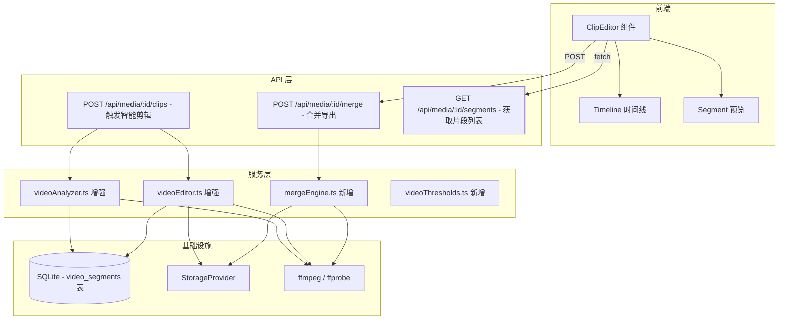

# 设计文档：智能视频剪辑

## 概述

本功能在现有 `videoAnalyzer.ts` 和 `videoEditor.ts` 基础上进行增强，实现视频自动筛选与摘要剪辑。核心流程：

1. **分析增强**：在现有清晰度/稳定性评分基础上，新增曝光评分（亮度直方图分析）和基于 ffmpeg `select` 滤镜的场景切点检测
2. **智能选择**：根据视频时长分档确定目标时长，按综合评分选择片段，优先保留相邻片段以减少碎片化
3. **过渡效果**：在片段拼接处应用可配置的视频/音频过渡效果（硬切、淡入淡出、交叉淡化）
4. **手动编辑**：前端提供片段编辑器，支持预览、删除、拖拽排序、多选合并导出
5. **合并引擎**：新增 API 路由，支持用户自定义片段顺序合并导出

所有质量阈值遵循 `dedupThresholds.ts` 的 `env()` 模式，通过环境变量可配置。

## 架构



### 设计决策

1. **增强而非新建**：在现有 `videoAnalyzer.ts` 中新增 `computeExposureScore` 和 `detectSceneCuts` 函数，在 `videoEditor.ts` 中增强 `selectSegments` 和 `calculateTargetDuration`，保持代码组织一致性
2. **独立合并引擎**：`mergeEngine.ts` 作为新文件，因为用户手动合并是独立于自动剪辑的流程
3. **阈值独立文件**：`videoThresholds.ts` 遵循 `dedupThresholds.ts` 模式，视频相关阈值集中管理
4. **片段持久化**：分析结果存入 `video_segments` 表，避免重复分析，支持前端查询

## 组件与接口

### 1. videoAnalyzer.ts 增强

```typescript
// 新增：曝光评分接口
export interface ExposureAnalysis {
  exposureScore: number;       // 0-100，50 为理想曝光
  meanBrightness: number;      // 平均亮度 0-255
  brightnessStdDev: number;    // 亮度标准差
}

// 增强：VideoSegment 新增字段
export interface VideoSegment {
  index: number;
  startTime: number;
  endTime: number;
  duration: number;
  sharpnessScore: number;
  stabilityScore: number;
  exposureScore: number;        // 新增
  overallScore: number;         // 重新计算：含曝光权重
  label: 'good' | 'blurry' | 'shaky' | 'slightly_shaky'
       | 'severely_blurry' | 'severely_shaky' | 'severely_exposed';  // 新增严重标签
}

// 新增：场景切点检测
export interface SceneCut {
  timestamp: number;
  score: number;               // 场景变化强度 0-1
}

// 新增函数
export function computeExposureScore(framePath: string): Promise<ExposureAnalysis>;
export function detectSceneCuts(videoPath: string, threshold?: number): Promise<SceneCut[]>;
```

**computeExposureScore 实现方案**：
- 使用 `sharp` 提取帧的灰度直方图
- 计算平均亮度和标准差
- 映射规则：亮度在 [60, 200] 范围内且标准差 > 30 为理想曝光（100 分），偏离越远分数越低
- 过暗（< 30）或过曝（> 230）直接判定为严重曝光异常

**detectSceneCuts 实现方案**：
- 使用 ffmpeg `select='gt(scene,THRESHOLD)'` 滤镜检测场景变化
- 解析 ffmpeg 输出获取切点时间戳和变化强度
- 默认阈值 0.3，可通过 `VIDEO_SCENE_THRESHOLD` 环境变量配置

### 2. videoEditor.ts 增强

```typescript
// 增强：EditOptions
export interface EditOptions {
  videoResolution?: number;
  transitionType?: 'none' | 'fade' | 'crossfade';  // 新增
  transitionDuration?: number;                       // 新增，秒
}

// 增强：EditResult
export interface EditResult {
  mediaId: string;
  compiledPath: string | null;
  selectedSegments: number[];
  segmentDetails: SegmentDetail[];   // 新增：片段详情供前端使用
  error?: string;
}

export interface SegmentDetail {
  index: number;
  startTime: number;
  endTime: number;
  duration: number;
  overallScore: number;
  label: string;
}
```

**calculateTargetDuration 更新**（按需求调整分档）：
- `< 60s` → `null`（仅去除低质量片段）
- `[60s, 600s]` → `60s`
- `> 600s` → `300s`

**selectSegments 增强**：
- 新增曝光过滤：排除 `severely_exposed` 标签
- 新增相邻片段优先逻辑：评分相近（差距 ≤ 10%）时优先选择与已选片段相邻（间隔 ≤ 2s）的片段
- 保持最终按 startTime 排序输出

### 3. mergeEngine.ts（新增）

```typescript
export interface MergeRequest {
  mediaId: string;
  tripId: string;
  segmentIndices: number[];          // 用户选择的片段索引
  transitionType?: 'none' | 'fade' | 'crossfade';
  transitionDuration?: number;
}

export interface MergeResult {
  success: boolean;
  mergedPath: string | null;
  error?: string;
}

export async function mergeSegments(
  videoPath: string,
  segments: VideoSegment[],
  request: MergeRequest
): Promise<MergeResult>;
```

### 4. videoThresholds.ts（新增）

```typescript
export interface VideoThresholds {
  // 严重模糊阈值（Sharpness_Score 下限）
  severeBlurThreshold: number;
  // 严重抖动阈值（Stability_Score 下限）
  severeShakeThreshold: number;
  // 严重曝光异常阈值
  severeExposureLow: number;
  severeExposureHigh: number;
  // 最小片段时长（秒）
  minSegmentDuration: number;
  // 时长分档边界
  shortVideoCutoff: number;
  mediumVideoCutoff: number;
  // 目标时长
  mediumTargetDuration: number;
  longTargetDuration: number;
  // 场景检测阈值
  sceneDetectThreshold: number;
  // 默认过渡时长（秒）
  defaultTransitionDuration: number;
  // 相邻片段间隔阈值（秒）
  adjacencyGapThreshold: number;
  // 评分相近判定比例
  scoreProximityRatio: number;
  // 切点前后动作缓冲时间（秒）
  cutBufferDuration: number;
}

export const VIDEO_THRESHOLDS: Readonly<VideoThresholds> = Object.freeze({
  severeBlurThreshold:      env('VIDEO_SEVERE_BLUR', 20),
  severeShakeThreshold:     env('VIDEO_SEVERE_SHAKE', 15),
  severeExposureLow:        env('VIDEO_SEVERE_EXPOSURE_LOW', 10),
  severeExposureHigh:       env('VIDEO_SEVERE_EXPOSURE_HIGH', 90),
  minSegmentDuration:       env('VIDEO_MIN_SEGMENT_DURATION', 2),
  shortVideoCutoff:         env('VIDEO_SHORT_CUTOFF', 60),
  mediumVideoCutoff:        env('VIDEO_MEDIUM_CUTOFF', 600),
  mediumTargetDuration:     env('VIDEO_MEDIUM_TARGET', 60),
  longTargetDuration:       env('VIDEO_LONG_TARGET', 300),
  sceneDetectThreshold:     env('VIDEO_SCENE_THRESHOLD', 0.3),
  defaultTransitionDuration: env('VIDEO_TRANSITION_DURATION', 0.5),
  adjacencyGapThreshold:    env('VIDEO_ADJACENCY_GAP', 2),
  scoreProximityRatio:      env('VIDEO_SCORE_PROXIMITY', 0.1),
  // 切点前后动作缓冲时间（秒）
  cutBufferDuration:        env('VIDEO_CUT_BUFFER', 0.5),
});
```

### 5. API 路由

```typescript
// server/src/routes/clips.ts

// GET /api/media/:mediaId/segments
// 返回视频的分析片段列表（从 video_segments 表读取）

// POST /api/media/:mediaId/clips
// 触发智能剪辑流程，返回 jobId（异步处理）

// POST /api/media/:mediaId/merge
// Body: { segmentIndices: number[], transitionType?: string, transitionDuration?: number }
// 合并指定片段，返回 jobId（异步处理）

// GET /api/jobs/:jobId
// 查询任务状态（复用现有 processing_jobs 表）
```

### 6. ClipEditor 前端组件

```typescript
// client/src/components/ClipEditor.tsx

interface ClipEditorProps {
  mediaId: string;
  tripId: string;
}

// 功能：
// - 从 API 加载片段列表
// - 时间线展示（每个片段显示缩略图、时长、评分标签）
// - 点击片段预览播放
// - 勾选/取消勾选片段
// - 拖拽调整顺序
// - 合并导出按钮（调用 merge API）
// - 合并进度展示
```

## 数据模型

### video_segments 表（新增）

```sql
CREATE TABLE IF NOT EXISTS video_segments (
  id TEXT PRIMARY KEY,
  media_id TEXT NOT NULL,
  segment_index INTEGER NOT NULL,
  start_time REAL NOT NULL,
  end_time REAL NOT NULL,
  duration REAL NOT NULL,
  sharpness_score REAL,
  stability_score REAL,
  exposure_score REAL,
  overall_score REAL,
  label TEXT NOT NULL,
  selected INTEGER NOT NULL DEFAULT 0,
  created_at TEXT NOT NULL,
  FOREIGN KEY (media_id) REFERENCES media_items(id)
);

CREATE INDEX IF NOT EXISTS idx_video_segments_media ON video_segments(media_id);
CREATE UNIQUE INDEX IF NOT EXISTS idx_video_segments_media_index ON video_segments(media_id, segment_index);
```

### media_items 表扩展

```sql
-- 新增列
ALTER TABLE media_items ADD COLUMN video_analysis_json TEXT;
-- 存储完整分析结果 JSON，用于快速恢复（可选，video_segments 表为主）
```

### processing_jobs 复用

合并任务复用现有 `processing_jobs` 表，`current_step` 设为 `'videoMerge'`。


## 正确性属性

*属性（Property）是在系统所有有效执行中都应成立的特征或行为——本质上是对系统应做什么的形式化陈述。属性是人类可读规格说明与机器可验证正确性保证之间的桥梁。*

### 属性 1：视频时长分档正确性

*对于任意*正数视频时长 d，`calculateTargetDuration(d)` 应满足：
- d < 60 时返回 null
- 60 ≤ d ≤ 600 时返回 60
- d > 600 时返回 300

**验证需求：R1-AC1, R1-AC3, R1-AC4**

### 属性 2：短视频全片保留

*对于任意*全部标签为 "good" 的片段集合，当 targetDuration 为 null 时，`selectSegments` 应返回与输入完全相同的片段集合（不删除、不修改）。

**验证需求：R1-AC2**

### 属性 3：不填充不重复

*对于任意*片段集合和 targetDuration，当有效片段总时长不足 targetDuration 时，`selectSegments` 输出的总时长应等于所有有效片段的总时长，不进行填充或重复。

**验证需求：R1-AC5, R8-AC2**

### 属性 4：质量标签分配正确性

*对于任意* sharpnessScore、stabilityScore 和 exposureScore 的组合，`assignLabel` 函数应满足：
- sharpnessScore < severeBlurThreshold → "severely_blurry"
- stabilityScore < severeShakeThreshold → "severely_shaky"
- exposureScore < severeExposureLow 或 exposureScore > severeExposureHigh → "severely_exposed"
- 以上条件均不满足时，按现有逻辑分配 "blurry"/"shaky"/"slightly_shaky"/"good"

**验证需求：R2-AC2, R2-AC3, R2-AC4**

### 属性 5：严重低质量片段排除

*对于任意*片段集合，`selectSegments` 的输出不应包含任何标签为 "severely_blurry"、"severely_shaky" 或 "severely_exposed" 的片段。

**验证需求：R2-AC5**

### 属性 6：最小片段时长不变量

*对于任意* `selectSegments` 的输出，每个片段的 duration 应 ≥ minSegmentDuration（默认 2 秒）。

**验证需求：R3-AC3**

### 属性 7：目标时长上限

*对于任意*非 null 的 targetDuration 和任意片段集合，`selectSegments` 输出的累计时长不应超过 targetDuration 加上最后一个被选中片段的时长（允许最后一个片段导致的合理超出）。

**验证需求：R4-AC3**

### 属性 8：时间顺序输出

*对于任意* `selectSegments` 的输出片段列表，片段应按 startTime 严格递增排列。

**验证需求：R4-AC6**

### 属性 9：相邻片段优先选择

*对于任意*片段集合，当两个候选片段评分差距不超过 10% 且在时间线上间隔不超过 adjacencyGapThreshold 时，`selectSegments` 应优先选择能与已选片段形成连续区间的片段。

**验证需求：R4-AC4, R4-AC5**

### 属性 10：过渡效果跳过条件

*对于任意*片段，当其 duration < 2 × transitionDuration 时，过渡效果构建函数应返回空过渡（跳过），不对该片段应用过渡效果。

**验证需求：R6-AC6**

### 属性 11：阈值配置环境变量覆盖

*对于任意*环境变量值（有效数字字符串），`VIDEO_THRESHOLDS` 对象中对应字段的值应等于该环境变量解析后的数值；未设置环境变量时应等于默认值。

**验证需求：R10-AC1, R10-AC2, R10-AC3, R10-AC4, R10-AC5, R10-AC6, R10-AC7**

## 错误处理

| 场景 | 处理方式 |
|------|---------|
| ffmpeg 不可用或崩溃 | 捕获错误，返回 `EditResult.error`，不中断整体流程 |
| 视频文件损坏/无法读取 | ffprobe 失败时返回 duration=0，segments=[]，上层跳过 |
| 无有效片段 | `selectSegments` 返回空数组，`editVideo` 返回 error="无有效片段" |
| 合并请求片段列表为空 | API 返回 400，message="片段选择列表不能为空" |
| 合并过程 ffmpeg 错误 | 捕获错误，清理临时文件，返回 `MergeResult.error` |
| 存储写入失败 | 捕获错误，清理临时文件，返回错误信息 |
| 无音频轨道 | ffmpeg 命令中检测音频流，无音频时跳过音频相关过渡处理 |
| 场景检测失败 | 回退到固定时长切分（现有行为） |
| 帧提取失败（曝光分析） | exposureScore 默认为 50（中性值），不影响其他评分 |

## 测试策略

### 属性测试（Property-Based Testing）

使用 `fast-check` 库，每个属性测试最少运行 100 次迭代。

测试覆盖属性 1-11，重点关注：
- `calculateTargetDuration`：纯函数，全输入空间覆盖
- `assignLabel`：纯函数，三维评分空间的标签映射
- `selectSegments`：核心选择算法的不变量（排除、排序、时长上限、相邻优先）
- `VIDEO_THRESHOLDS`：环境变量覆盖机制

每个测试标注对应属性：
```
// Feature: smart-video-editing, Property 1: 视频时长分档正确性
```

### 单元测试

- `computeExposureScore`：具体亮度值的示例测试（全黑、全白、正常曝光）
- `detectSceneCuts`：mock ffmpeg 输出的解析测试
- `mergeSegments`：空列表边界、单片段、错误处理
- 过渡效果 ffmpeg filter 字符串生成的示例测试

### 集成测试

- 完整流程：上传视频 → 分析 → 智能剪辑 → 获取片段 → 合并导出
- API 路由：参数校验、权限检查、异步任务状态查询
- 存储集成：合并视频正确保存到 StorageProvider

### 前端组件测试

- ClipEditor：片段渲染、删除、拖拽排序、合并触发
- 使用 vitest + React Testing Library
