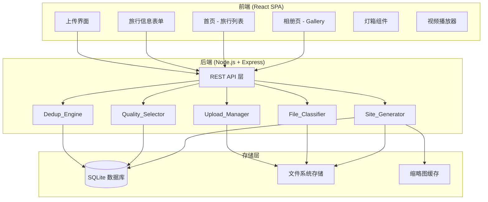
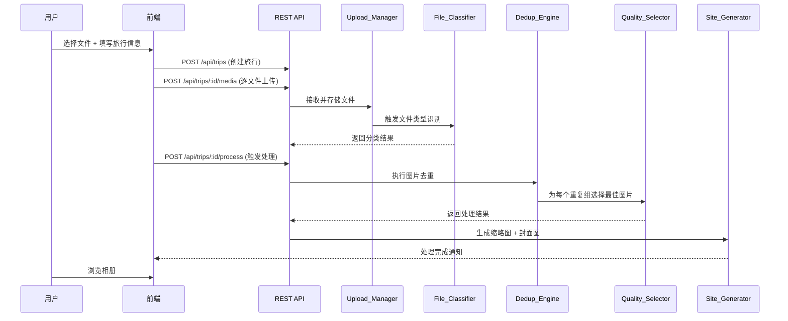
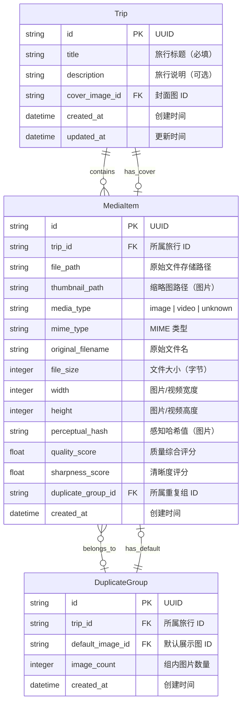

# 技术设计文档：旅行相册展示网站

## 概述

本系统是一个旅行相册自动化管理与展示平台。用户批量上传旅行素材（图片和视频），填写旅行标题和说明后，系统自动完成文件类型识别、图片去重/近重复聚合、最佳质量图片选择，并生成一个按旅行维度组织的响应式相册/视频展示网站。

系统采用前后端分离架构：
- 前端使用 React + TypeScript 构建 SPA，负责上传交互、相册浏览和媒体播放
- 后端使用 Node.js + Express + TypeScript 提供 REST API，负责文件处理、去重引擎和站点生成
- 使用 SQLite 作为数据库，sharp 处理图片，fluent-ffmpeg 处理视频

## 架构

### 系统架构图



### 处理流程




## 组件与接口

### 1. Upload_Manager（上传管理器）

负责接收用户批量上传的文件，验证格式，存储到文件系统，并跟踪上传进度。

**接口：**

```typescript
interface UploadManager {
  // 验证文件格式是否受支持
  validateFileFormat(file: File): { valid: boolean; reason?: string };
  
  // 上传单个文件到指定旅行，返回 MediaItem
  uploadFile(tripId: string, file: File, onProgress: (percent: number) => void): Promise<MediaItem>;
  
  // 获取支持的文件格式列表
  getSupportedFormats(): { images: string[]; videos: string[] };
}
```

**支持的格式：**
- 图片：`image/jpeg`, `image/png`, `image/webp`, `image/heic`
- 视频：`video/mp4`, `video/quicktime`, `video/x-msvideo`, `video/x-matroska`

### 2. File_Classifier（文件分类器）

根据文件 MIME 类型和文件头（magic bytes）自动识别文件类型。

**接口：**

```typescript
type MediaType = 'image' | 'video' | 'unknown';

interface FileClassifier {
  // 根据 MIME 类型和文件头信息分类文件
  classify(filePath: string): Promise<{ type: MediaType; mimeType: string }>;
  
  // 批量分类
  classifyBatch(filePaths: string[]): Promise<Array<{ filePath: string; type: MediaType; mimeType: string }>>;
}
```

**实现策略：**
- 优先读取文件头 magic bytes 判断真实类型（使用 `file-type` 库）
- 回退到文件扩展名判断
- 无法识别时标记为 `unknown`

### 3. Dedup_Engine（去重引擎）

使用感知哈希算法检测重复和近似图片，将其聚合为 Duplicate_Group。

**接口：**

```typescript
interface DedupEngine {
  // 计算单张图片的感知哈希
  computeHash(imagePath: string): Promise<string>;
  
  // 计算两个哈希之间的汉明距离（相似度）
  hammingDistance(hash1: string, hash2: string): number;
  
  // 对一批图片执行去重，返回分组结果
  deduplicate(imageItems: MediaItem[], threshold?: number): Promise<DuplicateGroup[]>;
}
```

**算法选择：** 使用 dHash（差异哈希），64 位哈希值，默认汉明距离阈值为 10（可配置）。

**设计决策：** 选择 dHash 而非 pHash，因为 dHash 计算更快且对旋转不敏感，适合旅行照片场景。阈值 10/64 约为 15.6% 的容差，能有效识别近似图片同时避免误判。

### 4. Quality_Selector（质量选择器）

在 Duplicate_Group 中综合评估图片质量，选择最佳展示图。

**接口：**

```typescript
interface QualitySelector {
  // 计算单张图片的质量评分
  computeQualityScore(imagePath: string): Promise<QualityScore>;
  
  // 从一组图片中选择质量最好的
  selectBest(group: DuplicateGroup): Promise<MediaItem>;
}

interface QualityScore {
  resolution: number;    // 宽 × 高 像素总数
  fileSize: number;      // 文件大小（字节）
  sharpness: number;     // 清晰度评分（拉普拉斯方差）
  overall: number;       // 综合评分
}
```

**评分策略：**
1. 首先按分辨率（像素总数）降序排列
2. 分辨率相同时，按清晰度评分（拉普拉斯方差）降序排列
3. 清晰度也相同时，按文件大小降序排列

**清晰度计算：** 使用拉普拉斯算子对图片进行卷积，计算结果的方差作为清晰度评分。方差越大表示图片越清晰。通过 sharp 库实现。

### 5. Site_Generator（站点生成器）

生成响应式展示页面，包括首页和各旅行的 Gallery 页面。

**接口：**

```typescript
interface SiteGenerator {
  // 生成缩略图
  generateThumbnail(imagePath: string, size: { width: number; height: number }): Promise<string>;
  
  // 从视频提取第一帧
  extractVideoFrame(videoPath: string): Promise<string>;
  
  // 为旅行选择封面图
  selectCoverImage(trip: Trip): Promise<string>;
  
  // 获取首页数据（所有旅行，按时间倒序）
  getHomePageData(): Promise<TripSummary[]>;
  
  // 获取某次旅行的 Gallery 数据
  getGalleryData(tripId: string): Promise<GalleryData>;
}
```

### REST API 端点

| 方法 | 路径 | 说明 |
|------|------|------|
| POST | `/api/trips` | 创建旅行（标题 + 说明） |
| GET | `/api/trips` | 获取所有旅行列表（首页） |
| GET | `/api/trips/:id` | 获取旅行详情 |
| PUT | `/api/trips/:id` | 修改旅行标题/说明 |
| POST | `/api/trips/:id/media` | 上传单个媒体文件 |
| POST | `/api/trips/:id/process` | 触发去重和质量选择处理 |
| GET | `/api/trips/:id/gallery` | 获取 Gallery 数据 |
| PUT | `/api/trips/:id/cover` | 手动更换封面图 |
| PUT | `/api/duplicate-groups/:id/default` | 手动更换重复组默认展示图 |
| GET | `/api/media/:id/thumbnail` | 获取缩略图 |
| GET | `/api/media/:id/original` | 获取原始文件 |


## 数据模型

### 数据库 Schema（SQLite）



### TypeScript 类型定义

```typescript
interface Trip {
  id: string;
  title: string;
  description?: string;
  coverImageId?: string;
  createdAt: Date;
  updatedAt: Date;
}

interface MediaItem {
  id: string;
  tripId: string;
  filePath: string;
  thumbnailPath?: string;
  mediaType: 'image' | 'video' | 'unknown';
  mimeType: string;
  originalFilename: string;
  fileSize: number;
  width?: number;
  height?: number;
  perceptualHash?: string;
  qualityScore?: number;
  sharpnessScore?: number;
  duplicateGroupId?: string;
  createdAt: Date;
}

interface DuplicateGroup {
  id: string;
  tripId: string;
  defaultImageId: string;
  imageCount: number;
  createdAt: Date;
}

interface TripSummary {
  id: string;
  title: string;
  descriptionExcerpt?: string;
  coverImageUrl: string;
  mediaCount: number;
  createdAt: Date;
}

interface GalleryData {
  trip: Trip;
  images: GalleryImage[];
  videos: MediaItem[];
}

interface GalleryImage {
  item: MediaItem;
  isDefault: boolean;
  duplicateGroup?: DuplicateGroup;
  thumbnailUrl: string;
  originalUrl: string;
}

interface QualityScore {
  resolution: number;
  fileSize: number;
  sharpness: number;
  overall: number;
}
```

### 文件存储结构

```
uploads/
  ├── {trip_id}/
  │   ├── originals/        # 原始上传文件
  │   │   ├── {media_id}.jpg
  │   │   ├── {media_id}.mp4
  │   │   └── ...
  │   └── thumbnails/       # 生成的缩略图
  │       ├── {media_id}_thumb.webp
  │       └── ...
  └── frames/               # 视频提取帧
      └── {media_id}_frame.jpg
```


## 正确性属性

*属性是一种在系统所有有效执行中都应成立的特征或行为——本质上是关于系统应该做什么的形式化陈述。属性是人类可读规范与机器可验证正确性保证之间的桥梁。*

### Property 1: 文件格式验证的完备性

*For any* 文件，Upload_Manager 的格式验证函数返回 `valid=true` 当且仅当该文件的 MIME 类型属于支持的格式集合（JPEG、PNG、WebP、HEIC、MP4、MOV、AVI、MKV）。

**Validates: Requirements 1.2, 1.3**

### Property 2: 上传进度值范围

*For any* 文件上传过程中触发的进度回调，其百分比值应始终在 0 到 100 之间（含边界），且最终回调值应为 100。

**Validates: Requirements 1.5**

### Property 3: 旅行标题验证

*For any* 旅行创建请求，当且仅当标题为非空且非纯空白字符串时，创建操作应成功；否则应被拒绝且不产生任何副作用。

**Validates: Requirements 2.1, 2.3**

### Property 4: 旅行描述可选性

*For any* 有效的旅行标题，无论是否提供描述字段，旅行创建操作都应成功，且创建后的旅行对象的标题和描述与输入一致。

**Validates: Requirements 2.2**

### Property 5: 旅行信息修改的往返一致性

*For any* 已创建的旅行，修改其标题和/或说明后重新查询，返回的标题和说明应与修改后的值完全一致。

**Validates: Requirements 2.4**

### Property 6: 文件类型分类正确性

*For any* 具有已知图片 magic bytes 的文件，File_Classifier 应返回 `image`；对于具有已知视频 magic bytes 的文件，应返回 `video`；对于无法识别的文件，应返回 `unknown`。

**Validates: Requirements 3.1, 3.2**

### Property 7: 感知哈希的一致性

*For any* 图片文件，多次计算其感知哈希应始终返回相同的哈希值（确定性）。

**Validates: Requirements 4.2**

### Property 8: 去重分组的正确性

*For any* 两张图片，若其感知哈希的汉明距离小于等于阈值，则它们应被归入同一个 Duplicate_Group；若汉明距离大于阈值，则它们不应被归入同一组。

**Validates: Requirements 4.3**

### Property 9: 去重操作的文件保全与计数不变量

*For any* 一批图片经过去重处理后，所有原始文件均应保留（不删除），且所有 Duplicate_Group 中的图片数量之和加上未分组的图片数量应等于原始输入图片总数。

**Validates: Requirements 4.4, 4.5**

### Property 10: 最佳图片选择的正确性

*For any* Duplicate_Group，Quality_Selector 选择的默认展示图应满足：（a）该图片属于该组成员，（b）该图片的分辨率不低于组内任何其他图片，（c）若存在多张最高分辨率图片，则选择清晰度评分最高的。

**Validates: Requirements 5.1, 5.2, 5.3, 5.4**

### Property 11: 默认展示图手动更换的往返一致性

*For any* Duplicate_Group，用户将默认展示图更换为组内另一张图片后，查询该组的默认展示图应返回新设置的图片。

**Validates: Requirements 5.5**

### Property 12: 首页旅行列表的排序与完整性

*For any* 一组旅行，首页返回的旅行列表应包含所有旅行，按创建时间降序排列，且每个条目包含标题、说明摘要和封面图 URL。

**Validates: Requirements 6.1, 6.2**

### Property 13: Gallery 数据的图片/视频分区

*For any* 旅行的 Gallery 数据，images 数组中的每个元素的 mediaType 应为 `image`，videos 数组中的每个元素的 mediaType 应为 `video`，且两个数组的元素总数应等于该旅行的全部可展示素材数。

**Validates: Requirements 6.4**

### Property 14: 缩略图生成不变量

*For any* Gallery 中的展示图片，应存在对应的缩略图文件，且缩略图的尺寸（宽和高）应小于等于原始图片的尺寸。

**Validates: Requirements 6.8**

### Property 15: 封面图自动选择的正确性

*For any* 包含图片的旅行，自动选择的封面图应为该旅行中质量评分最高的图片。

**Validates: Requirements 7.1**

### Property 16: 封面图手动更换的往返一致性

*For any* 旅行，用户手动更换封面图后，查询该旅行的封面图应返回新设置的图片。

**Validates: Requirements 7.2**


## 错误处理

### 上传错误

| 错误场景 | 处理策略 |
|----------|----------|
| 不支持的文件格式 | 上传前校验，返回 400 错误并说明不支持的格式，跳过该文件 |
| 文件大小超限 | 设置单文件上限（如 500MB），超限返回 413 错误 |
| 网络中断 | 已上传文件保留，前端记录失败文件列表，支持重试 |
| 存储空间不足 | 返回 507 错误，提示用户清理空间 |

### 处理错误

| 错误场景 | 处理策略 |
|----------|----------|
| 文件类型无法识别 | 标记为 `unknown`，通知用户，不参与去重流程 |
| 图片哈希计算失败 | 记录错误日志，该图片不参与去重，单独展示 |
| 缩略图生成失败 | 使用原图作为降级方案，记录错误日志 |
| 视频帧提取失败 | 使用默认占位图，记录错误日志 |
| 质量评分计算失败 | 使用默认评分（0），该图片在排序中优先级最低 |

### 数据验证错误

| 错误场景 | 处理策略 |
|----------|----------|
| 旅行标题为空 | 返回 400 错误，提示必须填写标题 |
| 旅行 ID 不存在 | 返回 404 错误 |
| 重复组 ID 不存在 | 返回 404 错误 |
| 设置的默认图片不属于该组 | 返回 400 错误，提示图片不属于该重复组 |

### 全局错误处理

- 所有 API 返回统一的错误响应格式：`{ error: { code: string, message: string } }`
- 服务端未捕获异常返回 500 错误，不暴露内部细节
- 关键操作记录结构化日志，便于排查问题

## 测试策略

### 测试框架选择

- 单元测试与属性测试：**Vitest** + **fast-check**
- fast-check 是 TypeScript/JavaScript 生态中成熟的属性测试库，与 Vitest 无缝集成
- 每个属性测试配置最少 100 次迭代

### 单元测试

单元测试聚焦于具体示例、边界情况和错误条件：

1. **Upload_Manager 单元测试**
   - 测试网络中断时已上传文件的保留（需求 1.4）
   - 测试各种支持格式的具体文件上传

2. **File_Classifier 单元测试**
   - 测试具体的已知文件类型识别（JPEG、PNG、MP4 等）
   - 测试损坏文件或空文件的处理

3. **Dedup_Engine 单元测试**
   - 测试完全相同图片的去重
   - 测试明显不同图片不被误判

4. **Quality_Selector 单元测试**
   - 测试分辨率相同但清晰度不同的图片选择（需求 5.4）
   - 测试单张图片组的处理

5. **Site_Generator 单元测试**
   - 测试无图片旅行使用视频帧作为封面（需求 7.3）
   - 测试无任何可用素材时使用占位图（需求 7.4）
   - 测试 Gallery 页面请求返回正确数据（需求 6.3）

### 属性测试

每个属性测试必须引用设计文档中的对应属性，使用 fast-check 库实现：

1. **Feature: travel-album-site, Property 1: 文件格式验证的完备性**
   - 生成随机 MIME 类型字符串，验证验证函数的正确性

2. **Feature: travel-album-site, Property 2: 上传进度值范围**
   - 生成随机文件大小，验证进度回调值始终在 [0, 100] 范围内

3. **Feature: travel-album-site, Property 3: 旅行标题验证**
   - 生成随机字符串（包括空字符串和纯空白字符串），验证创建行为

4. **Feature: travel-album-site, Property 4: 旅行描述可选性**
   - 生成随机标题和可选描述，验证创建成功且数据一致

5. **Feature: travel-album-site, Property 5: 旅行信息修改的往返一致性**
   - 生成随机标题和描述，创建后修改再查询，验证往返一致

6. **Feature: travel-album-site, Property 6: 文件类型分类正确性**
   - 生成带有已知 magic bytes 的随机文件，验证分类结果

7. **Feature: travel-album-site, Property 7: 感知哈希的一致性**
   - 对随机图片多次计算哈希，验证结果一致

8. **Feature: travel-album-site, Property 8: 去重分组的正确性**
   - 生成随机哈希对和阈值，验证分组逻辑

9. **Feature: travel-album-site, Property 9: 去重操作的文件保全与计数不变量**
   - 生成随机图片集合，执行去重后验证文件保全和计数

10. **Feature: travel-album-site, Property 10: 最佳图片选择的正确性**
    - 生成随机 QualityScore 集合，验证选择结果满足排序规则

11. **Feature: travel-album-site, Property 11: 默认展示图手动更换的往返一致性**
    - 生成随机组和目标图片，更换后查询验证

12. **Feature: travel-album-site, Property 12: 首页旅行列表的排序与完整性**
    - 生成随机旅行集合，验证返回列表的排序和字段完整性

13. **Feature: travel-album-site, Property 13: Gallery 数据的图片/视频分区**
    - 生成随机混合素材集合，验证分区正确性和计数

14. **Feature: travel-album-site, Property 14: 缩略图生成不变量**
    - 生成随机尺寸图片，验证缩略图存在且尺寸更小

15. **Feature: travel-album-site, Property 15: 封面图自动选择的正确性**
    - 生成随机质量评分的图片集合，验证封面选择

16. **Feature: travel-album-site, Property 16: 封面图手动更换的往返一致性**
    - 生成随机旅行和目标图片，更换后查询验证
