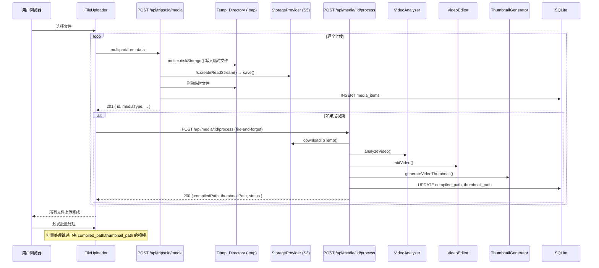

# 设计文档

## 概述

本设计对现有上传和处理流水线进行两项改进：

1. **Multer 磁盘存储**：将 `multer.memoryStorage()` 替换为 `multer.diskStorage()`，上传文件先写入 `getTempDir()` 提供的临时目录（`server/.tmp`），再通过 `fs.createReadStream()` 流式读取并保存至 `StorageProvider`（S3）。这避免了大视频文件（10GB+）在 Node.js 进程内存中完整缓冲导致 OOM。

2. **视频即时处理**：新增 `POST /api/media/:id/process` 端点，前端在每个视频上传成功后立即调用该端点触发单视频处理（分析→剪辑→缩略图）。处理与后续文件上传并行执行。批量处理流水线跳过已完成即时处理的视频。

### 设计决策

- **磁盘存储而非流式上传**：multer 不支持直接流式写入 S3，且后续需要本地文件路径进行 `classify()` 分类。使用磁盘存储是最简单可靠的方案。
- **复用 `getTempDir()`**：已有的临时目录助手确保与 uploads 在同一分区，避免跨分区移动文件。
- **单视频处理端点独立于批量流水线**：保持批量处理的完整性（图片去重需要所有图片就绪），仅将视频处理提前。
- **fire-and-forget 模式**：前端触发视频处理后不等待结果，失败仅记录日志不阻塞上传。

## 架构



### 变更范围

| 文件 | 变更类型 | 说明 |
|------|---------|------|
| `server/src/routes/media.ts` | 修改 | multer 切换为 diskStorage，流式上传至 S3 |
| `server/src/routes/process.ts` | 修改 | 批量处理跳过已处理视频 |
| `server/src/routes/media.ts` 或新文件 | 新增 | 单视频处理端点 |
| `client/src/components/FileUploader.tsx` | 修改 | 上传成功后触发视频即时处理 |
| `client/src/pages/UploadPage.tsx` | 修改 | 传递视频处理回调 |
| `client/src/pages/MyGalleryPage.tsx` | 修改 | 追加素材时传递视频处理回调 |

## 组件与接口

### 1. Multer 磁盘存储配置（media.ts）

```typescript
import { getTempDir } from '../helpers/tempDir';

const storage = multer.diskStorage({
  destination: (_req, _file, cb) => {
    cb(null, getTempDir());
  },
  filename: (_req, file, cb) => {
    const uniqueName = `${Date.now()}-${Math.random().toString(36).slice(2)}${path.extname(file.originalname)}`;
    cb(null, uniqueName);
  },
});

const upload = multer({ storage });
```

上传处理流程变更：
- `req.file.buffer` → `req.file.path`（磁盘路径）
- `file.buffer.length` → `fs.statSync(req.file.path).size`（文件大小）
- `storageProvider.save(relativePath, file.buffer)` → `storageProvider.save(relativePath, fs.createReadStream(req.file.path))`
- 保存完成后 `fs.unlinkSync(req.file.path)` 清理临时文件
- 分类时直接使用 `req.file.path`，无需再 `downloadToTemp`

### 2. 单视频处理端点（media.ts）

```typescript
// POST /api/media/:id/process
interface SingleVideoProcessResponse {
  mediaId: string;
  compiledPath: string | null;
  thumbnailPath: string | null;
  status: 'success' | 'error';
  error?: string;
}
```

端点逻辑：
1. 验证媒体项存在（404 if not）
2. 验证 `media_type === 'video'`（400 if not）
3. 验证请求者是旅行所有者或管理员
4. 从 S3 下载视频到临时文件
5. 执行 `analyzeVideo()` → `editVideo()` → `generateVideoThumbnail()`
6. 更新数据库 `compiled_path` 和 `thumbnail_path`
7. 返回处理结果

### 3. FileUploader 组件变更

新增可选属性：
```typescript
interface FileUploaderProps {
  tripId: string;
  onAllUploaded?: (count: number) => void;
  onVideoUploaded?: (mediaId: string, mediaType: string) => void; // 新增
}
```

上传成功后的逻辑：
```typescript
// 在 uploadFile 成功回调中
const responseData = response.data; // { id, mediaType, ... }
if (responseData.mediaType === 'video') {
  // fire-and-forget: 触发视频即时处理
  fetch(`/api/media/${responseData.id}/process`, { method: 'POST', headers: { Authorization: ... } })
    .catch(err => console.error('Video processing failed:', err));
  onVideoUploaded?.(responseData.id, responseData.mediaType);
}
```

### 4. 批量处理跳过逻辑（process.ts）

在视频分析和剪辑步骤中，检查视频是否已有 `compiled_path` 或 `thumbnail_path`：

```typescript
const videoRows = db.prepare(
  "SELECT * FROM media_items WHERE trip_id = ? AND media_type = 'video' AND status = 'active'"
).all(tripId) as MediaItemRow[];

// 过滤出未处理的视频
const unprocessedVideos = videoRows.filter(v => !v.compiled_path && !v.thumbnail_path);
```

已处理的视频直接计入 `compiledCount`，不再重复下载和处理。

## 数据模型

### 现有表结构（无变更）

`media_items` 表已包含所有需要的字段：
- `compiled_path TEXT` — 视频剪辑后的存储路径
- `thumbnail_path TEXT` — 缩略图存储路径
- `processing_error TEXT` — 处理错误信息
- `file_size INTEGER` — 文件大小

### StorageProvider 接口（无变更）

`save()` 方法已支持 `Buffer | Readable` 参数，无需修改接口即可接受 `fs.createReadStream()` 返回的流。

### API 响应模型

单视频处理端点响应：
```typescript
{
  mediaId: string;
  compiledPath: string | null;
  thumbnailPath: string | null;
  status: 'success' | 'error';
  error?: string;
}
```

上传端点响应（现有，无变更）：
```typescript
// MediaItem 对象，包含 id, mediaType 等字段
// FileUploader 需要读取 response.data.mediaType 来判断是否触发视频处理
```


## 正确性属性

*属性（Property）是指在系统所有合法执行中都应成立的特征或行为——本质上是对系统应做什么的形式化陈述。属性是人类可读规格说明与机器可验证正确性保证之间的桥梁。*

### 属性 1：上传文件内容完整性（Round-Trip）

*对于任意*上传的文件，通过磁盘存储写入临时目录后流式保存至 StorageProvider，再从 StorageProvider 读取的内容应与原始文件内容完全一致，且数据库中 `file_size` 字段应等于原始文件的实际字节大小。

**验证需求：1.2, 1.6**

### 属性 2：临时文件必定清理

*对于任意*上传请求（无论 StorageProvider 保存成功或失败），请求完成后 `getTempDir()` 目录中不应残留该次上传的临时文件。

**验证需求：1.3, 1.4**

### 属性 3：视频处理端点输入验证

*对于任意*媒体项 ID，当调用 `POST /api/media/:id/process` 时：若该 ID 不存在则返回 404；若该媒体项的 `media_type` 不是 `video` 则返回 400；仅当 `media_type === 'video'` 时执行处理。

**验证需求：2.2, 2.3, 2.4**

### 属性 4：视频处理成功后数据库与响应一致性

*对于任意*成功处理的视频，处理完成后数据库中 `compiled_path` 和 `thumbnail_path` 应为非空值，且 API 响应中的 `compiledPath`、`thumbnailPath` 字段应与数据库值一致，`status` 应为 `'success'`。

**验证需求：2.6, 2.7, 2.9**

### 属性 5：视频处理失败时错误持久化

*对于任意*处理过程中发生错误的视频，数据库中 `processing_error` 字段应包含非空错误信息，且 API 响应的 `status` 应为 `'error'`，`error` 字段应包含错误描述。

**验证需求：2.8**

### 属性 6：视频上传后自动触发处理

*对于任意*通过 FileUploader 成功上传的视频文件（`mediaType === 'video'`），上传完成后应立即发起 `POST /api/media/:id/process` 请求，且该请求不阻塞后续文件的上传。

**验证需求：3.1, 3.2, 3.3**

### 属性 7：视频处理失败不影响上传流程

*对于任意*视频即时处理请求失败的情况，FileUploader 的上传队列应继续正常执行，所有文件上传完成后 `onAllUploaded` 回调仍应被调用。

**验证需求：3.4, 3.5**

### 属性 8：批量处理跳过已处理视频

*对于任意*旅行中已通过单视频处理端点完成处理（`compiled_path` 或 `thumbnail_path` 非空）的视频，批量处理流水线不应重复处理这些视频，且处理摘要中的 `compiledCount` 应正确包含已预处理的视频数量。

**验证需求：3.6, 4.3**

## 错误处理

### 上传阶段

| 错误场景 | 处理方式 |
|---------|---------|
| multer 写入磁盘失败（磁盘满） | multer 自动返回 500，临时文件由 OS 清理 |
| StorageProvider.save() 失败 | 在 `finally` 块中删除临时文件，返回 500 错误 |
| 文件分类失败 | 非致命，media_type 保持 `unknown`，继续流程 |
| 临时文件删除失败 | 记录警告日志，不影响响应（文件会在下次重启时清理） |

### 视频即时处理阶段

| 错误场景 | 处理方式 |
|---------|---------|
| 媒体项不存在 | 返回 404 |
| 非视频类型 | 返回 400 |
| S3 下载失败 | 将错误写入 `processing_error`，返回错误响应 |
| videoAnalyzer 失败 | 将错误写入 `processing_error`，返回错误响应 |
| videoEditor 失败 | 将错误写入 `processing_error`，返回错误响应 |
| thumbnailGenerator 失败 | 非致命，compiled_path 仍可更新，thumbnail_path 为空 |
| 前端处理请求失败 | `console.error` 记录，不阻塞上传 |

### 批量处理阶段

| 错误场景 | 处理方式 |
|---------|---------|
| 已处理视频的 compiled_path 存在 | 跳过该视频，计入 compiledCount |
| 未处理视频处理失败 | 与现有逻辑一致，记录 processing_error，failedCount++ |

## 测试策略

### 单元测试

使用 `vitest` 框架，重点覆盖：

1. **磁盘存储上传路由**（`media.test.ts`）
   - 验证 multer 使用 diskStorage 配置
   - 验证上传成功后临时文件被清理
   - 验证上传失败后临时文件被清理
   - 验证 file_size 从磁盘 stat 获取

2. **单视频处理端点**（`media.test.ts` 或 `process.test.ts`）
   - 404：媒体项不存在
   - 400：非视频类型
   - 成功处理：DB 更新 compiled_path 和 thumbnail_path
   - 处理失败：DB 更新 processing_error

3. **FileUploader 组件**（`FileUploader.test.tsx`）
   - 视频上传后触发处理请求
   - 处理请求失败不影响上传
   - onVideoUploaded 回调被正确调用
   - onAllUploaded 仍正常触发

4. **批量处理跳过逻辑**（`process.test.ts`）
   - 已有 compiled_path 的视频被跳过
   - compiledCount 正确统计

### 属性测试

使用 `fast-check` 库，每个属性测试至少运行 100 次迭代。

每个测试用注释标注对应的设计属性：
- 格式：**Feature: upload-and-process-improvements, Property {number}: {property_text}**

属性测试重点：

1. **属性 1**：生成随机二进制内容，上传后从 StorageProvider 读取验证内容一致，验证 DB file_size 匹配
2. **属性 2**：生成随机文件，模拟成功/失败场景，验证临时目录无残留
3. **属性 3**：生成随机媒体项（存在/不存在、video/image/unknown），验证端点返回正确状态码
4. **属性 8**：生成随机视频列表（部分已有 compiled_path），执行批量处理，验证已处理视频未被重复处理
