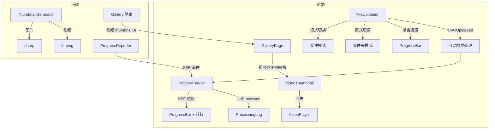
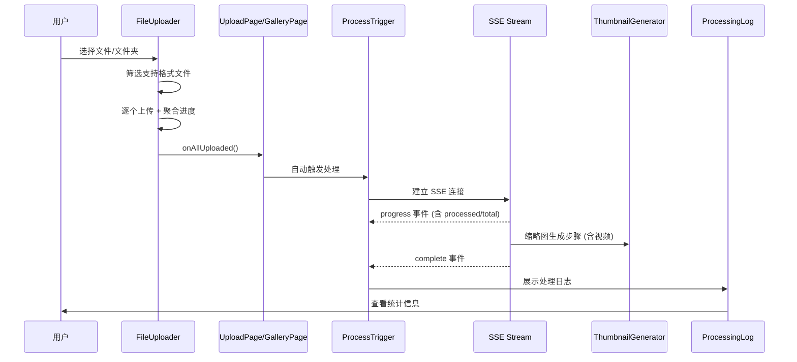

# 技术设计文档

## 概述

本设计文档描述六项 UX 改进的技术实现方案：文件夹上传、上传进度简化、上传后自动处理、处理日志窗口、追加素材处理确认、以及视频缩略图展示。这些改进涉及前端组件重构（FileUploader、ProcessTrigger、UploadPage、GalleryPage）和后端服务扩展（ThumbnailGenerator、ProgressReporter、Gallery 路由）。

核心设计决策：
- FileUploader 通过模式切换按钮支持文件/文件夹选择，使用 `webkitdirectory` 属性
- 上传进度从逐文件列表改为聚合进度条 + 计数文本
- 上传完成后自动调用 ProcessTrigger 的处理逻辑，无需用户手动点击
- 处理完成后弹出 ProcessingLog 模态窗口展示统计信息
- 视频缩略图复用 coverSelector 中的 ffmpeg 帧提取逻辑，提取到 thumbnailGenerator 中
- Gallery 路由为视频返回 `thumbnailUrl` 字段，前端统一使用缩略图网格展示

## 架构

### 整体架构图



### 数据流



## 组件和接口

### 1. FileUploader 组件重构

当前 FileUploader 展示逐文件上传列表。重构后：

**新增 Props：**
无需新增 props，现有 `tripId` 和 `onAllUploaded` 已足够。

**内部状态变更：**
- 新增 `mode: 'file' | 'folder'` 状态，控制 input 元素的 `webkitdirectory` 属性
- 新增 `skippedCount: number` 状态，记录文件夹模式下被跳过的不支持格式文件数量
- 移除逐文件上传列表的 UI 渲染，改为聚合进度条
- 新增 `completedCount` 和 `totalCount` 计算值用于进度展示
- 保留 `entries` 状态用于内部跟踪，但不再逐条渲染

**模式切换：**
- 渲染两个按钮："选择文件" 和 "选择文件夹"
- 点击 "选择文件" 时，input 不设置 `webkitdirectory`，使用 `multiple` 属性
- 点击 "选择文件夹" 时，input 设置 `webkitdirectory` 属性
- 选择文件后自动开始上传（无需手动点击"开始上传"按钮）

**聚合进度展示：**
- 上传过程中显示 ProgressBar 组件（复用现有组件或简化版）
- 进度百分比 = `completedCount / totalCount * 100`
- 进度条旁显示 "已上传数/总上传数" 文本（如 "3/10"）
- 失败文件在进度条下方显示文件名和重试按钮

**文件夹模式筛选：**
- 使用现有 `isFormatSupported()` 函数筛选文件
- 跳过不支持格式的文件，显示 "已跳过 N 个不支持格式的文件" 警告
- 如果没有任何支持格式的文件，显示 "未找到支持格式的文件" 提示

### 2. ProcessTrigger 组件扩展

**新增 Props：**
```typescript
interface ProcessTriggerProps {
  tripId: string;
  autoStart?: boolean;           // 新增：是否自动开始处理
  onProcessed?: (result: ProcessResult) => void;
}
```

**新增行为：**
- 当 `autoStart` 为 `true` 时，组件挂载后自动调用 `handleProcess()`，不渲染"开始处理"按钮
- SSE progress 事件中新增 `processed` 和 `total` 字段，用于展示 "已处理数/总处理数"

**ProcessResult 扩展：**
```typescript
interface ProcessResult {
  tripId: string;
  totalImages: number;
  totalVideos: number;           // 新增
  duplicateGroups: { groupId: string; imageCount: number }[];
  totalGroups: number;
  coverImageId?: string;
}
```

### 3. ProcessingLog 组件（新增）

**Props：**
```typescript
interface ProcessingLogProps {
  uploadCount: number;           // 本次上传文件数量
  result: ProcessResult;         // 处理结果
  onClose: () => void;           // 关闭回调
}
```

**展示内容：**
- 本次上传文件数量
- 处理的图片数量
- 处理的视频数量
- 检测到的重复组数量
- 最终保留的图片数量（totalImages - 重复组中被去除的数量）

**UI 形式：** 模态窗口，包含关闭按钮。

### 4. UploadPage 流程变更

当前流程：create → upload → (手动点击) → process → done

新流程：create → upload → (自动) process → done (含 ProcessingLog)

**实现：**
- 移除 `process` 步骤中的手动触发按钮
- 在 `upload` 步骤中，FileUploader 的 `onAllUploaded` 回调触发后，自动切换到 `process` 步骤
- `process` 步骤中 ProcessTrigger 使用 `autoStart={true}`
- ProcessTrigger 的 `onProcessed` 回调中，展示 ProcessingLog 模态窗口
- 用户关闭 ProcessingLog 后进入 `done` 步骤

### 5. GalleryPage 追加素材流程变更

当前流程：upload → (手动点击) → process → done

新流程：upload → (自动) process → done (含 ProcessingLog)

**实现：**
- `handleAllUploaded` 回调中，直接将 `appendMode` 设为 `processing`
- 追加区域中 ProcessTrigger 使用 `autoStart={true}`
- 处理完成后展示 ProcessingLog，关闭后刷新 gallery 数据

### 6. GalleryPage 视频缩略图展示

**变更：**
- 视频区域从文本列表改为与图片相同的缩略图网格布局
- Gallery 路由为每个视频返回 `thumbnailUrl` 字段
- 视频缩略图上叠加播放图标（▶）以区分视频和图片
- 点击视频缩略图打开 VideoPlayer 组件
- 如果视频没有缩略图（提取失败），使用默认占位图

**Gallery 路由变更：**
```typescript
// videos 数组中每个元素新增 thumbnailUrl 字段
interface GalleryVideo {
  // ...现有字段
  thumbnailUrl: string;  // 新增：/api/media/{id}/thumbnail 或占位图 URL
}
```

### 7. ThumbnailGenerator 扩展

**新增函数：**
```typescript
// 从视频中提取一帧作为缩略图
async function generateVideoThumbnail(
  videoPath: string,
  tripId: string,
  mediaId: string
): Promise<string>
```

**实现：**
- 使用 fluent-ffmpeg 提取视频第一帧（复用 coverSelector 中的 `extractVideoFrame` 逻辑）
- 提取的帧通过 sharp 缩放为 400x400 以内（保持宽高比），转为 WebP 格式
- 保存到 `uploads/{tripId}/thumbnails/{mediaId}_thumb.webp`
- 返回相对路径并更新 DB 的 `thumbnail_path` 字段

**`generateThumbnailsForTrip` 扩展：**
- 当前只查询 `media_type = 'image'` 的记录
- 扩展为同时查询 `media_type = 'video'` 的记录
- 对图片调用 `generateThumbnail`，对视频调用 `generateVideoThumbnail`

### 8. ProgressReporter 扩展

**SSE progress 事件扩展：**
```typescript
interface ProgressEvent {
  step: StepName;
  stepIndex: number;
  totalSteps: number;
  percent: number;
  processed?: number;   // 新增：当前步骤已处理的项目数
  total?: number;        // 新增：当前步骤总项目数
}
```

**CompleteEvent 扩展：**
```typescript
interface CompleteEvent {
  tripId: string;
  totalImages: number;
  totalVideos: number;   // 新增
  duplicateGroups: { groupId: string; imageCount: number }[];
  totalGroups: number;
  coverImageId: string | null;
}
```

### 9. mediaServing 路由扩展

当前 `/api/media/:id/thumbnail` 端点只处理图片缩略图。需要扩展以支持视频缩略图：
- 如果 media_item 的 `thumbnail_path` 存在且文件存在，直接返回
- 如果不存在且 `media_type` 为 `image`，调用现有的 `generateThumbnail` 即时生成
- 如果不存在且 `media_type` 为 `video`，调用新的 `generateVideoThumbnail` 即时生成
- 如果视频缩略图生成失败，返回 404（前端使用占位图）

## 数据模型

### 现有数据模型（无需变更）

`media_items` 表已有 `thumbnail_path` 字段，视频缩略图将使用同一字段存储路径。无需数据库 schema 变更。

```
media_items:
  id TEXT PRIMARY KEY
  trip_id TEXT NOT NULL
  file_path TEXT NOT NULL
  thumbnail_path TEXT          -- 图片和视频的缩略图路径
  media_type TEXT NOT NULL     -- 'image' | 'video' | 'unknown'
  mime_type TEXT NOT NULL
  original_filename TEXT NOT NULL
  file_size INTEGER NOT NULL
  ...
```

### 前端状态模型

**FileUploader 内部状态：**
```typescript
interface FileUploaderState {
  mode: 'file' | 'folder';
  entries: UploadFileEntry[];
  skippedCount: number;
  uploading: boolean;
  warnings: string[];
}
// 计算值：
// completedCount = entries.filter(e => e.status === 'completed').length
// totalCount = entries.length
// failedEntries = entries.filter(e => e.status === 'failed')
// progressPercent = totalCount > 0 ? Math.round(completedCount / totalCount * 100) : 0
```

**UploadPage 步骤流：**
```typescript
type Step = 'create' | 'upload' | 'process' | 'done';
// upload 步骤中 onAllUploaded 自动切换到 process
// process 步骤中 autoStart 自动开始处理
// onProcessed 后展示 ProcessingLog，关闭后切换到 done
```

**GalleryPage 追加模式：**
```typescript
type AppendMode = 'idle' | 'uploading' | 'processing' | 'done';
// 移除 'uploaded' 状态，上传完成后直接进入 'processing'
```

### Gallery API 响应模型变更

```typescript
// GalleryData.videos 中每个元素新增 thumbnailUrl
interface GalleryVideo extends MediaItem {
  thumbnailUrl: string;  // /api/media/{id}/thumbnail
}
```


## 正确性属性

*属性是在系统所有有效执行中都应保持为真的特征或行为——本质上是关于系统应该做什么的形式化陈述。属性是人类可读规范与机器可验证正确性保证之间的桥梁。*

以下属性基于需求文档中的验收标准推导而来。

### 属性 1：文件格式筛选正确分区

*对于任意*一组文件（包含支持和不支持格式的混合文件），`isFormatSupported` 函数将文件分为"支持"和"不支持"两组后，支持组中的每个文件的 MIME 类型或扩展名都在支持列表中，不支持组中的每个文件的 MIME 类型和扩展名都不在支持列表中，且两组文件数量之和等于原始文件总数。

**验证需求：1.2, 1.4**

### 属性 2：上传进度百分比计算

*对于任意*非负整数 `completedCount` 和正整数 `totalCount`（其中 `completedCount <= totalCount`），上传进度百分比应等于 `Math.round(completedCount / totalCount * 100)`，且结果始终在 0 到 100 之间（含边界）。

**验证需求：2.4**

### 属性 3：处理日志展示所有必需统计信息

*对于任意*有效的 `ProcessResult` 对象和 `uploadCount` 值，ProcessingLog 组件渲染后的输出应包含：上传文件数量、处理的图片数量、检测到的重复组数量、以及最终保留的图片数量。

**验证需求：4.2**

### 属性 4：视频缩略图尺寸约束

*对于任意*生成的视频缩略图，其宽度和高度都应不超过 400 像素，且保持原始视频的宽高比（在合理的舍入误差范围内）。

**验证需求：6.2**

### 属性 5：视频缩略图路径持久化往返

*对于任意*成功生成缩略图的视频 media_item，生成缩略图后查询数据库中该 media_item 的 `thumbnail_path` 字段，应返回与生成函数返回值一致的相对路径，且该路径指向的文件在磁盘上存在。

**验证需求：6.7**

## 错误处理

### 文件上传错误

| 错误场景 | 处理方式 |
|---------|---------|
| 单个文件上传失败 | 在进度条下方显示失败文件名和重试按钮，不影响其他文件上传 |
| 文件夹中无支持格式文件 | 显示 "未找到支持格式的文件" 提示，不触发上传 |
| 文件夹中部分文件不支持 | 跳过不支持文件，显示 "已跳过 N 个不支持格式的文件" 警告 |

### 处理流程错误

| 错误场景 | 处理方式 |
|---------|---------|
| SSE 连接中断 | 显示 "连接中断，请重新处理" 提示和重试按钮 |
| 处理步骤失败 | 显示具体错误信息和 "重新处理" 按钮 |
| 视频帧提取失败 | 后端记录错误日志，继续处理其他文件；前端使用默认占位图 |

### 视频缩略图错误

| 错误场景 | 处理方式 |
|---------|---------|
| ffmpeg 不可用 | 记录错误日志，视频 thumbnail_path 保持 null |
| 视频文件损坏 | 记录错误日志，跳过该视频的缩略图生成 |
| 即时生成失败 | mediaServing 路由返回 404，前端显示占位图 |

## 测试策略

### 单元测试

单元测试用于验证具体示例、边界情况和错误条件：

**FileUploader 组件测试：**
- 模式切换按钮正确渲染和切换
- 文件夹模式下 input 元素具有 `webkitdirectory` 属性
- 不支持格式文件被跳过并显示警告
- 全部不支持格式时显示 "未找到支持格式的文件"
- 上传过程中不显示逐文件列表
- 上传过程中显示聚合进度条和计数文本
- 失败文件显示文件名和重试按钮
- 所有文件上传完成后调用 `onAllUploaded`

**ProcessTrigger 组件测试：**
- `autoStart={true}` 时自动开始处理
- SSE progress 事件中显示 "已处理数/总处理数"
- 处理完成后调用 `onProcessed` 并传递扩展的 ProcessResult

**ProcessingLog 组件测试：**
- 渲染所有必需统计信息
- 关闭按钮可用并触发 `onClose`

**UploadPage 流程测试：**
- 上传完成后自动进入处理步骤
- 处理完成后展示 ProcessingLog
- 关闭 ProcessingLog 后进入 done 步骤

**GalleryPage 测试：**
- 视频以缩略图网格展示
- 视频缩略图上有播放图标
- 点击视频缩略图打开 VideoPlayer
- 追加素材上传完成后自动触发处理
- 处理完成后刷新 gallery 数据

**ThumbnailGenerator 测试：**
- `generateVideoThumbnail` 对有效视频生成缩略图文件
- 视频帧提取失败时记录错误并跳过
- `generateThumbnailsForTrip` 同时处理图片和视频

**mediaServing 路由测试：**
- 视频缩略图存在时直接返回
- 视频缩略图不存在时即时生成
- 视频缩略图生成失败时返回 404

### 属性测试

属性测试使用 `fast-check` 库（TypeScript 生态中的属性测试库），每个属性测试至少运行 100 次迭代。

每个属性测试必须通过注释引用设计文档中的属性编号：

```typescript
// Feature: ux-improvements, Property 1: 文件格式筛选正确分区
```

**属性测试列表：**

1. **文件格式筛选正确分区** — 生成随机文件名和 MIME 类型组合，验证 `isFormatSupported` 的分区结果正确且完整
2. **上传进度百分比计算** — 生成随机 completedCount/totalCount 对，验证百分比计算结果正确且在 [0, 100] 范围内
3. **处理日志展示所有必需统计信息** — 生成随机 ProcessResult 对象，验证 ProcessingLog 渲染输出包含所有必需字段
4. **视频缩略图尺寸约束** — 生成随机宽高值，验证缩放后的尺寸在 400x400 以内且保持宽高比
5. **视频缩略图路径持久化往返** — 生成缩略图后查询 DB，验证路径一致且文件存在
