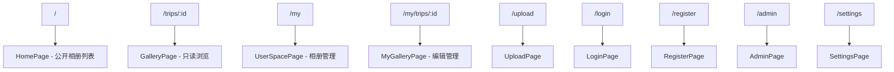
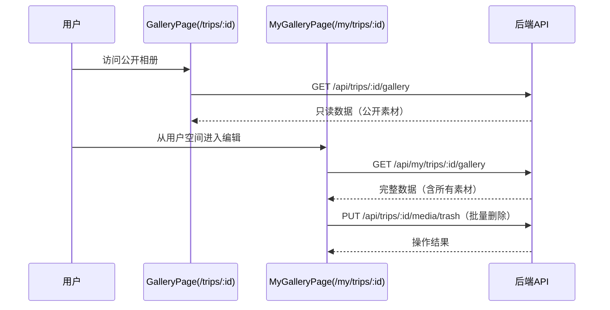

# 技术设计文档：UX与权限展示优化

## 概述

本设计对旅行相册系统的前端进行权限展示重构，核心目标是将「公开浏览」与「编辑管理」在路由级别彻底分离。当前系统中 GalleryPage（/trips/:id）同时承载只读浏览和编辑功能，通过 `canEdit` 标志位条件渲染编辑控件；HomePage 前端仍保留 unlisted 渲染逻辑；NavHeader 对所有已登录用户展示全部导航项。

重构后的架构：
- **GalleryPage（/trips/:id）**：纯只读公开浏览页，剥离所有编辑功能
- **MyGalleryPage（/my/trips/:id）**：新建的编辑管理页，集中所有编辑功能 + 多选删除
- **NavHeader**：基于 `useLocation()` 判断当前上下文（公开页 vs 用户空间），条件渲染不同导航项
- **HomePage**：移除 unlisted 渲染逻辑，所有卡片均为可点击的公开相册
- **UserSpacePage**：增加可见性切换、删除按钮、管理员会员管理入口
- **后端**：新增 `PUT /api/trips/:id/media/trash` 批量标记删除接口；将管理视图 gallery 接口从 `/api/users/me/trips/:id/gallery` 重命名为 `/api/my/trips/:id/gallery`

### 与旧需求的冲突说明

本轮重构与 V2 spec 中的以下设计存在冲突，以本轮「公开页永远只读」为准：

| V2 旧设计 | 本轮新设计 | 说明 |
|-----------|-----------|------|
| GalleryPage（/trips/:id）通过 `canEdit` 条件渲染编辑控件 | /trips/:id 彻底只读，编辑功能移至 /my/trips/:id | 路由级分离取代条件渲染 |
| NavHeader 登录后统一显示所有导航项 | NavHeader 按公开页/用户空间分场景渲染 | 基于 `useLocation()` 判断上下文 |
| HomePage 前端渲染 unlisted 相册（带"未公开"标记） | HomePage 只渲染 public 相册，移除 unlisted 逻辑 | 后端已只返回 public，前端对齐 |
| 管理员在 /trips/:id 通过 `canEdit` 获得编辑权限 | 管理员通过 /my/trips/:id 或 /admin/trips/:id 获得编辑权限 | 公开页对所有人一视同仁 |

## 架构

### 路由结构



### NavHeader 上下文判断

NavHeader 使用 `useLocation()` 获取当前路径，判断是否处于用户空间：

```
isUserSpace = pathname.startsWith('/my') || pathname === '/upload' || pathname === '/admin' || pathname === '/settings'
```

| 状态 | 公开页面 | 用户空间 |
|------|---------|---------|
| 未登录 | Logo + 登录 + 注册 | N/A（受 ProtectedRoute 保护） |
| 已登录（普通用户） | Logo + 用户名 + 我的空间 + 退出 | Logo + 用户名 + 我的空间 + 设置 + 新建旅行 + 退出 |
| 已登录（管理员） | Logo + 用户名 + 我的空间 + 退出 | Logo + 用户名 + 我的空间 + 设置 + 会员管理 + 新建旅行 + 退出 |

### 数据流



### 管理员查看他人空间

管理员通过 `/admin/users/:userId/trips` 路由查看任意用户的相册列表，点击相册进入 `/my/trips/:id` 编辑模式（admin 对所有相册有编辑权限）。

```
/admin/users/:userId/trips → AdminUserTripsPage（管理员查看指定用户的相册列表）
/my/trips/:id → MyGalleryPage（管理员编辑任意相册）
```

前端路由注册：
```typescript
<Route path="/admin/users/:userId/trips" element={<ProtectedRoute requireAdmin><AdminUserTripsPage /></ProtectedRoute>} />
```

## 组件与接口

### 1. NavHeader（修改 App.tsx 中的内联组件）

**变更**：根据 `useLocation()` 路径前缀和认证状态条件渲染导航项。

```typescript
function NavHeader() {
  const location = useLocation();
  const { isLoggedIn, user, logout } = useAuth();

  // 判断是否在用户空间
  const isUserSpace = location.pathname.startsWith('/my')
    || location.pathname === '/upload'
    || location.pathname === '/admin'
    || location.pathname === '/settings';

  // 未登录：仅显示 Logo + 登录 + 注册
  // 已登录 + 公开页面：Logo + 用户名 + 我的空间 + 退出
  // 已登录 + 用户空间：Logo + 用户名 + 我的空间 + 设置 + (会员管理 if admin) + 新建旅行 + 退出
}
```

### 2. GalleryPage（/trips/:id）— 只读化改造

**变更**：剥离所有编辑功能，变为纯只读浏览页。

移除的功能：
- `canEdit` 判断逻辑及所有依赖它的条件渲染
- 编辑按钮（`openEditModal`）、追加素材按钮（`handleAppendClick`）、更换封面图按钮
- 编辑模态框（edit modal）、封面选择器（cover picker）、默认图选择器（default picker）
- 待删除区（trash zone）
- 追加素材区域（append area）及相关状态
- 重复组选择器按钮（`🔄 N张` 按钮）

保留的功能：
- 图片网格浏览 + Lightbox
- 视频网格浏览 + VideoPlayer
- 返回首页链接
- 相册标题和描述展示
- unlisted 相册的「该相册未公开」提示

新增行为：
- 登录后自动跳转：如果用户在此页面登录成功，检查相册所有权，若为所有者或 admin 则跳转到 `/my/trips/:id`

### 3. MyGalleryPage（/my/trips/:id）— 新建编辑管理页

**新组件**：`client/src/pages/MyGalleryPage.tsx`

功能：
- 使用 `GET /api/my/trips/:id/gallery` 获取完整数据（后端新路由，替代原 `/api/users/me/trips/:id/gallery`，语义更清晰）
- 编辑旅行信息（标题、描述）
- 追加素材（FileUploader + ProcessTrigger）
- 更换封面图
- 重复组选择器（选择默认展示图）
- 待删除区（查看、恢复、清空）
- **多选模式**：工具栏「选择」按钮 → 每张素材左上角勾选框 → 底部操作栏（已选数量 + 删除选中）→ 确认对话框 → 批量标记 trashed

权限检查：
- 需要登录（ProtectedRoute 包裹）
- 组件内部检查：当前用户是相册所有者或 admin，否则显示无权限提示

状态管理：
```typescript
// 多选模式状态
const [multiSelectMode, setMultiSelectMode] = useState(false);
const [selectedIds, setSelectedIds] = useState<Set<string>>(new Set());
```

### 4. UserSpacePage（/my）— 功能增强

**变更**：
- 相册卡片链接从 `/trips/:id` 改为 `/my/trips/:id`
- 每个卡片增加可见性状态标签（「公开」/「不公开」）
- 每个卡片增加 Visibility_Toggle 按钮（调用 `PUT /api/trips/:id/visibility`）
- 每个卡片增加「删除相册」按钮
- 管理员额外显示「会员管理」按钮

### 5. HomePage — 清理 unlisted 逻辑

**变更**：
- 移除 `isUnlisted` 判断和相关条件渲染（opacity、未公开 badge、不可点击的 div 包裹）
- 所有卡片统一使用 `<Link to={/trips/${trip.id}}>` 包裹
- 移除 `TripSummary` 接口中的 `visibility` 字段引用（后端已只返回 public）

### 6. 后端新增接口：批量标记删除

**路由**：`PUT /api/trips/:id/media/trash`

**位置**：`server/src/routes/trash.ts`

```typescript
// PUT /api/trips/:id/media/trash — Batch mark media items as trashed
router.put('/trips/:id/media/trash', authMiddleware, requireAuth, (req, res, next) => {
  // 参数：{ mediaIds: string[] }
  // 验证：trip 存在、用户是 owner 或 admin
  // 操作：将所有 mediaIds 对应的 active 状态素材标记为 trashed，trashedReason = 'manual'
  // 返回：{ trashedCount: number }
});
```

### 6b. 后端接口重命名：管理视图 gallery

将 `GET /api/users/me/trips/:id/gallery` 重命名为 `GET /api/my/trips/:id/gallery`，语义更清晰地表达「我的相册管理视图」。

**变更**：
- `server/src/routes/users.ts` 中将路由从 `/me/trips/:id/gallery` 移至新路由文件或调整挂载点
- 新路由挂载在 `/api/my` 下，路径为 `/trips/:id/gallery`
- 保留原路由 `/api/users/me/trips/:id/gallery` 作为兼容（可选，后续版本移除）
- 前端 MyGalleryPage 使用新路径 `/api/my/trips/:id/gallery`

### 6c. 管理员查看他人相册列表页

**新组件**：`client/src/pages/AdminUserTripsPage.tsx`

- 路由：`/admin/users/:userId/trips`
- 使用 `GET /api/admin/users/:userId/trips` 获取指定用户的相册列表（已有后端接口）
- 相册卡片链接指向 `/my/trips/:id`（admin 有编辑权限）
- 需要 admin 权限（ProtectedRoute requireAdmin）

### 7. LoginPage — 登录后跳转逻辑

**变更**：支持 `returnTo` 查询参数。当从 GalleryPage 点击登录时，携带当前相册 ID 信息，登录成功后根据所有权决定跳转目标。

实现方式：GalleryPage 的登录链接携带 `?returnTo=/trips/:id`，LoginPage 登录成功后：
1. 解析 `returnTo` 参数
2. 如果匹配 `/trips/:id` 模式，调用 API 检查相册所有权
3. 所有者或 admin → 跳转 `/my/trips/:id`
4. 非所有者 → 跳转回 `/trips/:id`（留在公开相册页，不跳首页）
5. 检查失败（API 错误等） → 跳转回 `returnTo` 原始路径（留在当前公开相册页）
6. 无 returnTo → 跳转 `/`

## 数据模型

### 前端状态

无新增全局状态。变更集中在组件内部：

**MyGalleryPage 内部状态**：
```typescript
interface MyGalleryPageState {
  // 复用 GalleryData 类型
  data: GalleryData | null;
  loading: boolean;
  error: string;

  // 多选模式
  multiSelectMode: boolean;
  selectedIds: Set<string>;  // 选中的 media item IDs
  batchDeleting: boolean;

  // 编辑功能（从 GalleryPage 迁移）
  editModalOpen: boolean;
  editTitle: string;
  editDescription: string;
  coverPickerOpen: boolean;
  defaultPickerGroupId: string | null;
  // ... 其余编辑状态同现有 GalleryPage
}
```

### 后端数据模型

无新增数据库表或字段。批量删除接口复用现有 `media_items` 表的 `status` 和 `trashed_reason` 字段。

**批量删除请求体**：
```typescript
interface BatchTrashRequest {
  mediaIds: string[];  // 要标记为 trashed 的素材 ID 列表
}

interface BatchTrashResponse {
  trashedCount: number;  // 实际标记成功的数量
}
```

### 路由注册变更（App.tsx）

```typescript
// 新增路由
<Route path="/my/trips/:id" element={<ProtectedRoute><MyGalleryPage /></ProtectedRoute>} />
```


## 正确性属性（Correctness Properties）

*属性（Property）是指在系统所有合法执行中都应成立的特征或行为——本质上是对系统应做什么的形式化陈述。属性是人类可读规格说明与机器可验证正确性保证之间的桥梁。*

### Property 1: NavHeader 根据认证状态和路由上下文渲染正确的导航项

*For any* 已登录用户（admin 或 regular）和任意路由路径，NavHeader 应根据路径是否属于用户空间（/my、/upload、/admin、/settings）渲染不同的导航项集合：
- 公开页面：仅显示用户名、我的空间、退出
- 用户空间：显示用户名、我的空间、设置、新建旅行、退出（admin 额外显示会员管理）
- 未登录：仅显示登录、注册

**Validates: Requirements 1.1, 1.2, 1.3, 1.4, 1.5**

### Property 2: GalleryPage 不渲染任何编辑控件

*For any* 用户状态（未登录、普通用户、所有者、admin）和任意相册数据，GalleryPage（/trips/:id）组件不应渲染编辑按钮、追加素材按钮、更换封面图按钮、重复组选择器按钮或待删除区。

**Validates: Requirements 2.1, 2.2, 3.1, 7.7**

### Property 3: 公开相册接口仅返回公开可见的默认图片

*For any* 公开相册的 gallery 请求（非所有者、非 admin），返回的图片列表中每个重复组仅包含 default_image_id 对应的图片，且所有素材的 visibility 均为 "public"。

**Validates: Requirements 2.3, 3.2**

### Property 4: UserSpacePage 相册卡片包含完整管理控件

*For any* 用户空间中的相册列表项，每个相册卡片应同时显示：可见性状态标签（「公开」或「不公开」）、可见性切换按钮、删除按钮，且卡片链接指向 `/my/trips/:id`。

**Validates: Requirements 4.3, 7.2, 9.1, 9.2**

### Property 5: UserSpacePage 展示用户所有相册（含 public 和 unlisted）

*For any* 已登录用户，UserSpacePage 应展示该用户创建的所有相册，不论其 visibility 是 public 还是 unlisted。

**Validates: Requirements 4.1**

### Property 6: 批量标记删除将所有选中素材设为 trashed

*For any* 非空的 active 状态素材 ID 集合，调用 `PUT /api/trips/:id/media/trash` 后，所有对应素材的 status 应变为 "trashed"，trashedReason 应为 "manual"。

**Validates: Requirements 4.5, 4.6, 8.5**

### Property 7: MyGalleryPage 对非所有者非 admin 拒绝访问

*For any* 已登录用户，当其既不是相册所有者也不是 admin 时，访问 `/my/trips/:id` 应显示无权限提示，不渲染任何编辑控件。

**Validates: Requirements 7.5**

### Property 8: 多选模式下所有素材显示勾选框且选中时显示操作栏

*For any* MyGalleryPage 中的素材列表，当 multiSelectMode 为 true 时，每个图片和视频应显示勾选框；当 selectedIds 非空时，页面底部应显示包含已选数量和「删除选中」按钮的操作栏。

**Validates: Requirements 8.2, 8.3**

### Property 9: 可见性切换调用 API 并更新 UI 标签

*For any* 相册卡片，点击 Visibility_Toggle 后应调用 `PUT /api/trips/:id/visibility` 将可见性在 "public" 和 "unlisted" 之间切换，成功后 UI 标签立即更新为新状态。

**Validates: Requirements 9.3, 9.4**

### Property 10: 登录后根据所有权决定跳转目标

*For any* 用户从 GalleryPage（/trips/:id）登录成功后，若该用户是相册所有者或 admin，则自动跳转到 `/my/trips/:id`；否则保持在 `/trips/:id`（不跳转到首页）。检查失败时也保持在 `/trips/:id`。

**Validates: Requirements 10.1, 10.2, 10.3, 10.4**

### Property 11: HomePage 所有卡片链接指向公开浏览路由

*For any* HomePage 中的相册卡片，其链接应指向 `/trips/:id`（只读模式），不应存在不可点击的卡片或 unlisted 标记。

**Validates: Requirements 7.3**

## 错误处理

### 前端错误处理

| 场景 | 处理方式 |
|------|---------|
| MyGalleryPage 权限不足（非所有者非 admin） | 显示「无权访问此相册」提示，不渲染编辑控件 |
| MyGalleryPage 未登录访问 | ProtectedRoute 重定向到 /login |
| 批量删除 API 失败 | 显示错误提示，保持多选模式和选中状态不变 |
| 可见性切换 API 失败 | 显示错误提示，回滚 UI 到原可见性状态（乐观更新回滚） |
| 登录后跳转检查 API 失败 | 降级为跳转回 `returnTo` 原始路径（留在当前公开相册页，不跳首页） |
| GalleryPage 加载 unlisted 相册 | 显示「该相册未公开」提示（保持现有行为） |
| MyGalleryPage 相册不存在 | 显示 404 提示 |

### 后端错误处理

| 场景 | HTTP 状态码 | 错误码 |
|------|------------|--------|
| 批量删除：trip 不存在 | 404 | NOT_FOUND |
| 批量删除：非所有者非 admin | 403 | FORBIDDEN |
| 批量删除：mediaIds 为空或非数组 | 400 | INVALID_REQUEST |
| 批量删除：部分 mediaId 不属于该 trip | 跳过不匹配项，返回实际处理数量 |

## 测试策略

### 双重测试方法

本功能采用单元测试 + 属性测试的双重策略：

- **单元测试**：验证具体示例、边界情况和错误条件
- **属性测试**：验证跨所有输入的通用属性

### 属性测试配置

- **库**：前端使用 `fast-check`（配合 vitest），后端使用 `fast-check`（配合 vitest）
- **每个属性测试最少运行 100 次迭代**
- **每个属性测试必须通过注释引用设计文档中的属性编号**
- **标签格式**：`Feature: ux-permission-refinement, Property {number}: {property_text}`
- **每个正确性属性由单个属性测试实现**

### 单元测试范围

| 测试目标 | 测试内容 |
|---------|---------|
| NavHeader | 未登录状态仅显示登录/注册（示例测试） |
| GalleryPage | 不渲染编辑控件（属性测试覆盖） |
| MyGalleryPage | 所有者看到完整编辑控件（示例测试） |
| MyGalleryPage | admin 看到完整编辑控件（示例测试） |
| MyGalleryPage | 点击「选择」进入多选模式（示例测试） |
| MyGalleryPage | 点击「取消」退出多选模式并清除选中（示例测试） |
| MyGalleryPage | 批量删除完成后退出多选模式（示例测试） |
| UserSpacePage | admin 看到「会员管理」按钮（示例测试） |
| LoginPage | 登录后跳转逻辑（示例测试） |
| PUT /api/trips/:id/media/trash | 空 mediaIds 返回 400（示例测试） |
| PUT /api/trips/:id/media/trash | 非所有者返回 403（示例测试） |
| 可见性切换 | API 失败时回滚 UI（边界测试） |

### 属性测试范围

| 属性编号 | 测试描述 | 生成器 |
|---------|---------|--------|
| Property 1 | NavHeader 导航项随上下文变化 | 随机用户角色 × 随机路由路径 |
| Property 2 | GalleryPage 无编辑控件 | 随机用户状态 × 随机相册数据 |
| Property 3 | 公开 gallery 仅返回公开默认图 | 随机相册数据（含 mixed visibility） |
| Property 4 | UserSpacePage 卡片包含管理控件 | 随机相册列表 |
| Property 5 | UserSpacePage 展示所有相册 | 随机 public/unlisted 相册集合 |
| Property 6 | 批量 trash 标记所有选中素材 | 随机 active 素材 ID 子集 |
| Property 7 | MyGalleryPage 非授权用户拒绝访问 | 随机非所有者用户 × 随机相册 |
| Property 8 | 多选模式勾选框和操作栏 | 随机素材列表 × 随机选中子集 |
| Property 9 | 可见性切换 API 调用和 UI 更新 | 随机相册 × 随机初始可见性 |
| Property 10 | 登录后跳转目标 | 随机用户 × 随机相册所有权 |
| Property 11 | HomePage 卡片链接 | 随机公开相册列表 |
