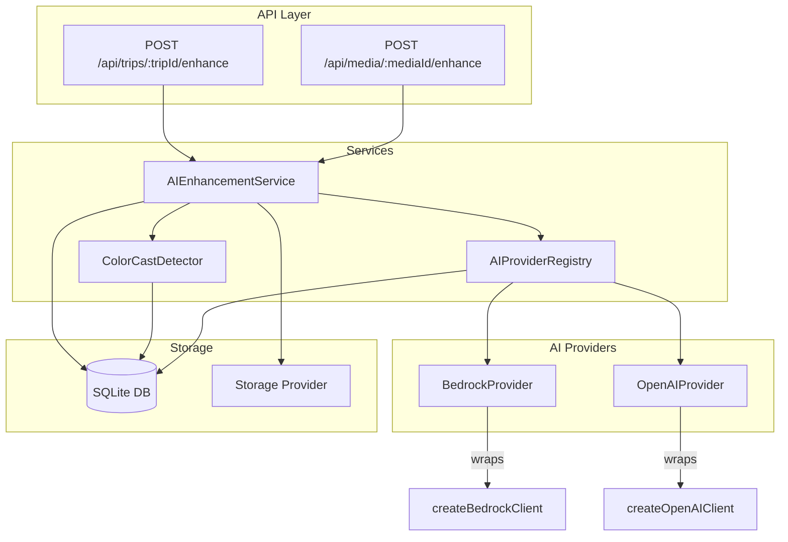
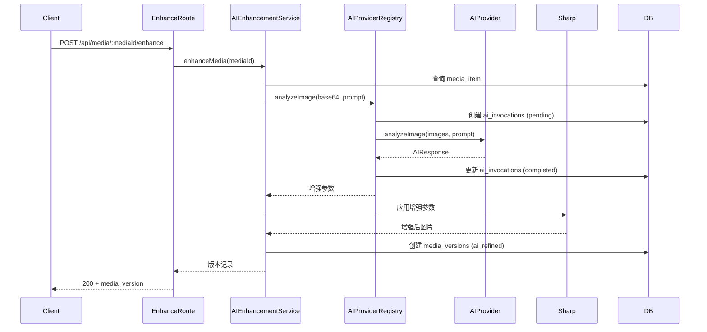

# Design Document: v2-image-processing

## Overview

本设计文档描述 v2 智能媒体处理系统第二阶段的技术实现方案。在 v2-schema-foundation 完成数据库 schema 增强的基础上，本阶段实现三个核心模块：

1. **色偏检测器（Color Cast Detector）** — 基于 sharp 通道统计的纯函数，量化色偏类型和严重程度
2. **AI Provider 抽象层** — 统一接口 + 注册中心 + 自动日志，支持 Bedrock/OpenAI 无缝切换
3. **AI 精修服务（AI Enhancement Service）** — AI 分析推荐参数 → sharp 处理 → 生成增强版本

### 设计原则

- **纯函数优先**：色偏检测算法为纯函数，便于测试和复用
- **接口隔离**：AI Provider 通过统一接口解耦业务逻辑与具体实现
- **渐进增强**：AI 精修失败时回退到规则引擎（computeOptimizeParams）
- **可观测性**：所有 AI 调用自动记录到 ai_invocations 表

## Architecture



### 数据流



## Components and Interfaces

### 1. ColorCastDetector (`server/src/services/colorCastDetector.ts`)

```typescript
// 色偏类型
export type ColorCastType = 'warm' | 'cool' | 'green' | 'magenta' | 'neutral';

// 严重程度
export type SeverityLevel = 'none' | 'mild' | 'moderate' | 'severe';

// 色偏检测结果
export interface ColorCastResult {
  type: ColorCastType;
  severity: SeverityLevel;
  colorScore: number;          // [0, 1]，1.0 = 无色偏
  channelDeviations: {
    r: number;
    g: number;
    b: number;
  };
  maxDeviation: number;        // 最大绝对偏差
}

// 批量处理结果
export interface BatchColorCastResult {
  totalProcessed: number;
  severityCounts: Record<SeverityLevel, number>;
  errors: Array<{ mediaId: string; error: string }>;
}

// 核心函数
export function detectColorCast(channelMeans: { r: number; g: number; b: number }): ColorCastResult;
export function detectColorCastFromFile(imagePath: string): Promise<ColorCastResult>;
export function detectColorCastBatch(tripId: string): Promise<BatchColorCastResult>;
```

**算法逻辑：**
1. 使用 `sharp.stats()` 获取 R/G/B 通道均值
2. 计算整体亮度均值 `brightness = (rMean + gMean + bMean) / 3`
3. 计算各通道偏差 `deviation = channelMean - brightness`
4. 取最大绝对偏差 `maxDev = max(|devR|, |devG|, |devB|)`
5. 根据 maxDev 判定严重程度：
   - `< 5` → none / neutral
   - `5-15` → mild
   - `15-30` → moderate
   - `> 30` → severe
6. 根据偏差方向判定类型：
   - R 偏高 → warm
   - B 偏高 → cool
   - G 偏高 → green
   - R+B 偏高（G 偏低）→ magenta
7. `colorScore = 1.0 - clamp(maxDev / 50, 0, 1)`

### 2. AI Provider Interface (`server/src/services/ai/types.ts`)

```typescript
// AI 响应标准格式
export interface AIResponse {
  text: string;
  inputTokens: number;
  outputTokens: number;
  elapsedMs: number;
}

// Provider 能力
export type AICapability = 'text-generation' | 'image-analysis' | 'embedding';

// Provider 元数据
export interface AIProviderMetadata {
  name: string;
  model: string;
  capabilities: AICapability[];
  costPerInputToken: number;
  costPerOutputToken: number;
}

// 统一 Provider 接口
export interface AIProvider {
  readonly metadata: AIProviderMetadata;

  generateText(prompt: string, options?: {
    maxTokens?: number;
    temperature?: number;
  }): Promise<AIResponse>;

  analyzeImage(images: Array<{ base64: string; mediaType: string }>, prompt: string, options?: {
    maxTokens?: number;
  }): Promise<AIResponse>;

  getHealth(): Promise<{ available: boolean; latencyMs: number }>;
}
```

### 3. AI Provider Registry (`server/src/services/ai/registry.ts`)

```typescript
export interface InvocationContext {
  mediaId?: string;
  segmentId?: string;
  taskType: string;
}

export class AIProviderRegistry {
  private providers: Map<string, AIProvider>;
  private defaultProviderName: string;

  register(name: string, provider: AIProvider): void;
  get(name?: string): AIProvider;
  getDefault(): AIProvider;
  listProviders(): string[];

  // 带自动日志的调用方法
  invokeText(prompt: string, context: InvocationContext, options?: {
    providerName?: string;
    maxTokens?: number;
  }): Promise<AIResponse>;

  invokeImageAnalysis(images: Array<{ base64: string; mediaType: string }>, prompt: string, context: InvocationContext, options?: {
    providerName?: string;
    maxTokens?: number;
  }): Promise<AIResponse>;
}

// 单例工厂
export function getAIProviderRegistry(): AIProviderRegistry;
```

**自动日志机制：**
- 调用前：插入 ai_invocations 记录（status=pending, started_at=now）
- 调用成功：更新 status=completed, response_payload, token counts, estimated_cost, finished_at
- 调用失败：更新 status=failed, error_message, finished_at

### 4. Bedrock Provider (`server/src/services/ai/bedrockProvider.ts`)

```typescript
export class BedrockProvider implements AIProvider {
  readonly metadata: AIProviderMetadata;
  private client: BedrockClient;  // 复用现有 createBedrockClient()

  constructor();
  generateText(prompt: string, options?: { maxTokens?: number }): Promise<AIResponse>;
  analyzeImage(images: Array<{ base64: string; mediaType: string }>, prompt: string, options?: { maxTokens?: number }): Promise<AIResponse>;
  getHealth(): Promise<{ available: boolean; latencyMs: number }>;
}
```

### 5. OpenAI Provider (`server/src/services/ai/openaiProvider.ts`)

```typescript
export class OpenAIProvider implements AIProvider {
  readonly metadata: AIProviderMetadata;
  private client: OpenAI;

  constructor();
  generateText(prompt: string, options?: { maxTokens?: number }): Promise<AIResponse>;
  analyzeImage(images: Array<{ base64: string; mediaType: string }>, prompt: string, options?: { maxTokens?: number }): Promise<AIResponse>;
  getHealth(): Promise<{ available: boolean; latencyMs: number }>;
}
```

### 6. AI Enhancement Service (`server/src/services/aiEnhancementService.ts`)

```typescript
// AI 推荐的增强参数
export interface EnhancementParams {
  brightness: number;       // gamma 调整, 0.5-2.0
  contrast: number;         // 对比度调整系数
  saturation: number;       // 饱和度调整系数
  sharpenSigma: number;     // 锐化 sigma, 0-3.0
  noiseReduction: number;   // 中值滤波核大小, 0-5
  colorCorrection?: {
    r: number;              // R 通道调整
    g: number;              // G 通道调整
    b: number;              // B 通道调整
  };
}

// 增强结果
export interface EnhancementResult {
  mediaId: string;
  versionId: string;
  filePath: string;
  params: EnhancementParams;
  modelName: string;
}

// 批量增强结果
export interface BatchEnhancementResult {
  totalProcessed: number;
  successful: number;
  failed: number;
  skipped: number;
  results: Array<EnhancementResult | { mediaId: string; error: string }>;
}

// 核心方法
export class AIEnhancementService {
  analyzeForEnhancement(mediaId: string): Promise<EnhancementParams>;
  applyEnhancement(mediaId: string, params: EnhancementParams): Promise<string>;
  enhanceMedia(mediaId: string): Promise<EnhancementResult>;
  enhanceBatch(tripId: string, filters?: { maxQualityScore?: number; maxColorScore?: number }): Promise<BatchEnhancementResult>;
}
```

**参数安全边界：**
- gamma: clamp(0.5, 2.0)
- sharpenSigma: clamp(0, 3.0)
- noiseReduction (median): clamp(0, 5)，且必须为奇数
- saturation: clamp(0.5, 2.0)
- contrast: clamp(0.5, 2.0)

### 7. Enhancement API Routes (`server/src/routes/enhance.ts`)

```typescript
// POST /api/media/:mediaId/enhance
// 触发单张图片 AI 精修
// Response: 200 { version: MediaVersionRow } | 400 | 409

// POST /api/trips/:tripId/enhance
// 批量精修（可选 filter 参数）
// Body: { maxQualityScore?: number, maxColorScore?: number }
// Response: 200 { summary: BatchEnhancementResult }
```

## Data Models

### media_analysis 表（已存在，色偏检测写入）

| 字段 | 类型 | 用途 |
|------|------|------|
| color_score | REAL | 色偏评分 [0,1]，1.0=无色偏 |
| reason | TEXT | JSON 格式存储 `{ castType, severity, channelDeviations }` |

### media_versions 表（已存在，增强版本写入）

| 字段 | 类型 | 用途 |
|------|------|------|
| version_type | TEXT | 'ai_refined' |
| model_name | TEXT | 使用的 AI 模型名称 |
| params | TEXT | JSON 格式的 EnhancementParams |
| status | TEXT | 'ready' |

### ai_invocations 表（已存在，自动日志写入）

| 字段 | 类型 | 用途 |
|------|------|------|
| provider | TEXT | 'bedrock' / 'openai' |
| model_name | TEXT | 具体模型 ID |
| task_type | TEXT | 'color_cast_analysis' / 'image_enhancement' |
| input_tokens | INTEGER | 输入 token 数 |
| output_tokens | INTEGER | 输出 token 数 |
| estimated_cost | REAL | 估算费用 |
| status | TEXT | 'pending' → 'completed' / 'failed' |

### 并发控制（内存锁）

使用 `Set<string>` 跟踪正在处理的 mediaId，防止同一图片重复增强：

```typescript
const enhancingMediaIds = new Set<string>();
```


## Correctness Properties

*A property is a characteristic or behavior that should hold true across all valid executions of a system — essentially, a formal statement about what the system should do. Properties serve as the bridge between human-readable specifications and machine-verifiable correctness guarantees.*

### Property 1: Channel Deviation Invariant

*For any* RGB channel means (r, g, b) in [0, 255], the computed channel deviations SHALL always sum to zero (devR + devG + devB = 0), since each deviation is defined as channelMean minus the overall mean.

**Validates: Requirements 1.1**

### Property 2: Severity and Type Classification Correctness

*For any* RGB channel means, the Color_Cast_Detector SHALL produce a severity and type that exactly match the threshold rules: maxDeviation < 5 → (none, neutral); 5 ≤ maxDev < 15 → mild; 15 ≤ maxDev < 30 → moderate; maxDev ≥ 30 → severe. The type SHALL always be one of {warm, cool, green, magenta, neutral}.

**Validates: Requirements 1.2, 1.3, 1.5, 1.6, 1.7, 1.8**

### Property 3: Color Score Bounded

*For any* RGB channel means in [0, 255], the computed color_score SHALL always be in the range [0.0, 1.0].

**Validates: Requirements 1.4**

### Property 4: ColorCastResult JSON Round-Trip

*For any* valid ColorCastResult object, serializing it to JSON and parsing it back SHALL produce an equivalent object with identical type, severity, colorScore, and channelDeviations.

**Validates: Requirements 2.2**

### Property 5: Batch Severity Count Invariant

*For any* batch color cast detection result, the sum of all severity counts (none + mild + moderate + severe) SHALL equal totalProcessed.

**Validates: Requirements 3.2**

### Property 6: Registry Provider Lookup

*For any* set of providers registered with unique names, requesting a provider by its registered name SHALL return that exact provider instance, and requesting a non-registered name SHALL throw an error.

**Validates: Requirements 5.1, 5.2, 5.4**

### Property 7: Enhancement Parameter Clamping

*For any* raw enhancement parameters (potentially out of bounds), the validation/clamping function SHALL produce output where: gamma ∈ [0.5, 2.0], sharpenSigma ∈ [0, 3.0], noiseReduction ∈ [0, 5], saturation ∈ [0.5, 2.0], contrast ∈ [0.5, 2.0].

**Validates: Requirements 7.4**

### Property 8: Eligibility Filter Correctness

*For any* media item with quality_score and color_score values, the eligibility predicate SHALL return true if and only if quality_score < 0.7 OR color_score < 0.6.

**Validates: Requirements 10.1, 10.4**

### Property 9: Batch Enhancement Count Invariant

*For any* batch enhancement result, successful + failed + skipped SHALL equal totalProcessed.

**Validates: Requirements 10.3**

## Error Handling

### 色偏检测错误处理

| 场景 | 处理方式 |
|------|----------|
| 图片文件不存在或无法读取 | 记录错误，跳过该项，继续批量处理 |
| sharp 统计计算失败 | 同上 |
| 数据库写入失败 | 抛出异常，由调用方处理 |

### AI Provider 错误处理

| 场景 | 处理方式 |
|------|----------|
| Provider 不可用（网络超时） | 记录 ai_invocations (failed)，抛出异常 |
| Provider 返回无效响应 | 记录错误，回退到规则引擎 |
| Provider 限流（429） | 指数退避重试（最多 3 次） |
| Provider 未注册 | 抛出描述性错误，列出可用 providers |
| API Key 缺失 | 构造时抛出配置错误 |

### AI 精修错误处理

| 场景 | 处理方式 |
|------|----------|
| AI 响应无法解析为 EnhancementParams | 回退到 computeOptimizeParams 规则引擎 |
| sharp 处理失败 | 记录错误，保留原图不变 |
| 并发请求同一 mediaId | 返回 409 Conflict |
| media_item 不存在或非图片 | 返回 400 Bad Request |
| 批量处理中单项失败 | 记录失败，继续处理剩余项 |

### 错误响应格式

```typescript
interface ErrorResponse {
  error: {
    code: string;       // 机器可读错误码
    message: string;    // 人类可读描述
    details?: unknown;  // 可选的额外信息
  };
}
```

错误码定义：
- `MEDIA_NOT_FOUND` — 媒体项不存在
- `INVALID_MEDIA_TYPE` — 非图片类型
- `ENHANCEMENT_IN_PROGRESS` — 该图片正在增强中
- `AI_PROVIDER_ERROR` — AI 提供商调用失败
- `PROVIDER_NOT_FOUND` — 请求的 AI Provider 未注册
- `PARAMETER_VALIDATION_ERROR` — 增强参数超出安全范围

## Testing Strategy

### 属性测试（Property-Based Testing）

使用 **fast-check** 库进行属性测试，每个属性最少运行 100 次迭代。

**测试文件：** `server/src/services/colorCastDetector.test.ts`、`server/src/services/ai/registry.test.ts`、`server/src/services/aiEnhancementService.test.ts`

每个属性测试必须包含注释标签：
```
// Feature: v2-image-processing, Property N: <property_text>
```

**属性测试覆盖：**
1. detectColorCast 纯函数 — Properties 1, 2, 3
2. ColorCastResult 序列化 — Property 4
3. 批量结果聚合 — Property 5
4. Registry 查找 — Property 6
5. 参数 clamping — Property 7
6. 资格过滤 — Property 8
7. 批量计数 — Property 9

### 单元测试（Example-Based）

- 色偏检测：具体图片场景（纯红、纯蓝、中性灰）
- AI Provider：mock 响应验证接口契约
- 增强参数解析：具体 AI 响应 JSON 解析
- 并发控制：模拟同时请求验证 409
- 回退逻辑：无效 AI 响应触发规则引擎

### 集成测试

- API 路由测试：supertest 验证 HTTP 接口
- 数据库持久化：验证 media_analysis、media_versions、ai_invocations 写入
- 端到端增强流程：真实图片 → AI mock → sharp 处理 → 版本记录

### 测试工具

- **fast-check**: 属性测试框架
- **vitest**: 测试运行器
- **supertest**: HTTP 集成测试
- **sharp**: 真实图片处理验证（使用测试用小图片）
