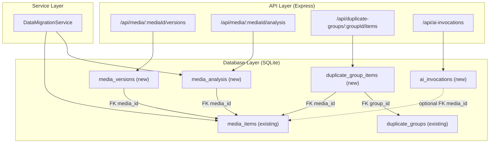

# Design Document: v2-schema-foundation

## Overview

本设计覆盖 v2 智能媒体处理系统第一阶段的数据库 schema 增强和基础 CRUD API。核心目标是将当前散落在 `media_items` 表中的分析数据规范化到独立表中，并新增版本管理、重复组成员关系和 AI 调用记录的存储能力。

**设计目标：**
- 新增 4 张表（media_versions, media_analysis, duplicate_group_items, ai_invocations）
- 为每张表提供 RESTful CRUD API
- 提供数据迁移服务，将现有 media_items 中的分析字段迁移到 media_analysis
- 确保与现有级联删除逻辑的兼容性

**设计决策：**
- ID 类型统一使用 TEXT（UUID），与现有表保持一致
- DDL 在 `server/src/database.ts` 的 `initTables()` 中执行，使用 `CREATE TABLE IF NOT EXISTS`
- 外键约束通过 `FOREIGN KEY` 声明，SQLite 已启用 `PRAGMA foreign_keys = ON`
- 迁移后现有 media_items 字段暂时保留（向后兼容），后续版本再移除

## Architecture



**集成点：**
1. `trips.ts` DELETE 路由：需要在级联删除中加入 media_versions、media_analysis、duplicate_group_items 的清理
2. Pipeline `resultWriter.ts`：后续可写入 media_analysis 和 media_versions
3. `dedupEngine.ts`：后续可写入 duplicate_group_items
4. `bedrockClient.ts` / `llmPairReviewer.ts`：后续可写入 ai_invocations

## Components and Interfaces

### 1. Schema Migrator（database.ts 扩展）

在 `initTables()` 中追加 4 张表的 DDL 和索引创建。

```typescript
// 追加到 initTables() 的 db.exec() 中
interface SchemaAdditions {
  tables: ['media_versions', 'media_analysis', 'duplicate_group_items', 'ai_invocations'];
  indexes: string[];
}
```

### 2. Media Versions Router

**文件：** `server/src/routes/mediaVersions.ts`

```typescript
import { Router } from 'express';

const router = Router({ mergeParams: true });

// POST   /api/media/:mediaId/versions          → 创建版本记录
// GET    /api/media/:mediaId/versions          → 列出所有版本
// GET    /api/media/:mediaId/versions/:versionId → 获取单个版本
// DELETE /api/media/:mediaId/versions/:versionId → 删除版本记录

export default router;
```

### 3. Media Analysis Router

**文件：** `server/src/routes/mediaAnalysis.ts`

```typescript
import { Router } from 'express';

const router = Router({ mergeParams: true });

// POST /api/media/:mediaId/analysis              → 创建分析记录
// GET  /api/media/:mediaId/analysis              → 获取最新分析（?history=true 返回全部）
// PUT  /api/media/:mediaId/analysis/:analysisId  → 更新分析记录

export default router;
```

### 4. Duplicate Group Items Router

**文件：** `server/src/routes/duplicateGroupItems.ts`

```typescript
import { Router } from 'express';

const router = Router({ mergeParams: true });

// POST   /api/duplicate-groups/:groupId/items          → 添加成员
// GET    /api/duplicate-groups/:groupId/items          → 列出成员
// PUT    /api/duplicate-groups/:groupId/items/:itemId  → 更新推荐
// DELETE /api/duplicate-groups/:groupId/items/:itemId  → 删除成员

export default router;
```

### 5. AI Invocations Router

**文件：** `server/src/routes/aiInvocations.ts`

```typescript
import { Router } from 'express';

const router = Router();

// POST /api/ai-invocations           → 创建调用记录
// GET  /api/ai-invocations           → 查询（支持 filter + pagination）
// PUT  /api/ai-invocations/:id       → 更新状态
// GET  /api/ai-invocations/summary   → 聚合统计

export default router;
```

### 6. Data Migration Service

**文件：** `server/src/services/analysisMigration.ts`

```typescript
export interface AnalysisMigrationResult {
  migratedCount: number;
  skippedCount: number;
  errorCount: number;
  errors: Array<{ mediaId: string; error: string }>;
}

export function migrateAnalysisData(): AnalysisMigrationResult;
```

### 7. Cascade Delete 扩展

在 `trips.ts` 的 DELETE 路由中，在删除 media_items 之前，追加：
```typescript
db.prepare(`DELETE FROM media_versions WHERE media_id IN (${placeholders})`).run(...ids);
db.prepare(`DELETE FROM media_analysis WHERE media_id IN (${placeholders})`).run(...ids);
db.prepare(`DELETE FROM duplicate_group_items WHERE media_id IN (${placeholders})`).run(...ids);
```

## Data Models

### media_versions 表

```sql
CREATE TABLE IF NOT EXISTS media_versions (
  id TEXT PRIMARY KEY,
  media_id TEXT NOT NULL,
  version_type TEXT NOT NULL,
  file_path TEXT NOT NULL,
  file_size INTEGER,
  width INTEGER,
  height INTEGER,
  duration REAL,
  model_name TEXT,
  processor_name TEXT,
  params TEXT,
  status TEXT DEFAULT 'ready',
  created_at TEXT NOT NULL,
  FOREIGN KEY (media_id) REFERENCES media_items(id)
);

CREATE INDEX IF NOT EXISTS idx_media_versions_media_id ON media_versions(media_id);
```

**version_type 枚举值：** `original`, `thumbnail`, `preview`, `enhanced`, `ai_refined`, `proxy`, `segment`, `final_output`

### media_analysis 表

```sql
CREATE TABLE IF NOT EXISTS media_analysis (
  id TEXT PRIMARY KEY,
  media_id TEXT NOT NULL,
  blur_score REAL,
  sharpness_score REAL,
  exposure_score REAL,
  color_score REAL,
  noise_score REAL,
  aesthetic_score REAL,
  quality_score REAL,
  is_blurry INTEGER DEFAULT 0,
  is_overexposed INTEGER DEFAULT 0,
  is_underexposed INTEGER DEFAULT 0,
  is_duplicate INTEGER DEFAULT 0,
  is_recommended INTEGER DEFAULT 0,
  recommendation TEXT,
  reason TEXT,
  analysis_version TEXT,
  created_at TEXT NOT NULL,
  FOREIGN KEY (media_id) REFERENCES media_items(id)
);

CREATE INDEX IF NOT EXISTS idx_media_analysis_media_id ON media_analysis(media_id);
```

### duplicate_group_items 表

```sql
CREATE TABLE IF NOT EXISTS duplicate_group_items (
  id TEXT PRIMARY KEY,
  group_id TEXT NOT NULL,
  media_id TEXT NOT NULL,
  similarity_score REAL,
  quality_score REAL,
  recommendation TEXT,
  reason TEXT,
  created_at TEXT NOT NULL,
  FOREIGN KEY (group_id) REFERENCES duplicate_groups(id),
  FOREIGN KEY (media_id) REFERENCES media_items(id)
);

CREATE INDEX IF NOT EXISTS idx_duplicate_group_items_group_id ON duplicate_group_items(group_id);
CREATE UNIQUE INDEX IF NOT EXISTS idx_duplicate_group_items_group_media ON duplicate_group_items(group_id, media_id);
```

### ai_invocations 表

```sql
CREATE TABLE IF NOT EXISTS ai_invocations (
  id TEXT PRIMARY KEY,
  media_id TEXT,
  segment_id TEXT,
  provider TEXT,
  model_name TEXT,
  task_type TEXT,
  request_payload TEXT,
  response_payload TEXT,
  input_tokens INTEGER,
  output_tokens INTEGER,
  estimated_cost REAL,
  status TEXT,
  error_message TEXT,
  started_at TEXT,
  finished_at TEXT,
  created_at TEXT NOT NULL
);

CREATE INDEX IF NOT EXISTS idx_ai_invocations_media_id ON ai_invocations(media_id);
CREATE INDEX IF NOT EXISTS idx_ai_invocations_task_type ON ai_invocations(task_type);
```

### API 请求/响应格式

#### Media Versions

**POST /api/media/:mediaId/versions**
```json
// Request
{
  "version_type": "thumbnail",
  "file_path": "uploads/thumbnails/abc123.webp",
  "file_size": 45000,
  "width": 400,
  "height": 300,
  "model_name": null,
  "processor_name": "sharp",
  "params": "{\"quality\": 80}"
}
// Response 201
{
  "id": "uuid",
  "media_id": "media-uuid",
  "version_type": "thumbnail",
  "file_path": "uploads/thumbnails/abc123.webp",
  "file_size": 45000,
  "width": 400,
  "height": 300,
  "duration": null,
  "model_name": null,
  "processor_name": "sharp",
  "params": "{\"quality\": 80}",
  "status": "ready",
  "created_at": "2025-01-01T00:00:00.000Z"
}
```

#### Media Analysis

**POST /api/media/:mediaId/analysis**
```json
// Request
{
  "blur_score": 0.85,
  "sharpness_score": 0.9,
  "exposure_score": 0.75,
  "quality_score": 0.82,
  "is_blurry": 0,
  "recommendation": "keep",
  "reason": "清晰度高，曝光正常",
  "analysis_version": "v1.0"
}
// Response 201
{
  "id": "uuid",
  "media_id": "media-uuid",
  "blur_score": 0.85,
  ...
  "created_at": "2025-01-01T00:00:00.000Z"
}
```

#### Duplicate Group Items

**POST /api/duplicate-groups/:groupId/items**
```json
// Request
{
  "media_id": "media-uuid",
  "similarity_score": 0.95,
  "quality_score": 0.88,
  "recommendation": "keep",
  "reason": "清晰度最高"
}
// Response 201 / 409 (conflict if media_id already in group)
```

#### AI Invocations

**POST /api/ai-invocations**
```json
// Request
{
  "media_id": "media-uuid",
  "provider": "bedrock",
  "model_name": "claude-3-haiku",
  "task_type": "image_analysis",
  "request_payload": "...",
  "input_tokens": 500,
  "status": "pending",
  "started_at": "2025-01-01T00:00:00.000Z"
}
```

**GET /api/ai-invocations/summary**
```json
// Response
{
  "total_invocations": 150,
  "total_input_tokens": 75000,
  "total_output_tokens": 30000,
  "total_estimated_cost": 1.25,
  "by_task_type": {
    "image_analysis": { "count": 100, "cost": 0.80 },
    "pair_review": { "count": 50, "cost": 0.45 }
  }
}
```


## Correctness Properties

*A property is a characteristic or behavior that should hold true across all valid executions of a system—essentially, a formal statement about what the system should do. Properties serve as the bridge between human-readable specifications and machine-verifiable correctness guarantees.*

### Property 1: Version CRUD round-trip

*For any* valid media item and any valid version data (with a valid version_type), creating a version via POST and then retrieving it via GET should return a record with identical field values. Furthermore, after DELETE, the record should no longer be retrievable.

**Validates: Requirements 5.1, 5.2, 5.3, 5.4**

### Property 2: Version type validation

*For any* string value, the Media Versions API SHALL accept it as a version_type if and only if it is one of: original, thumbnail, preview, enhanced, ai_refined, proxy, segment, final_output. All other strings SHALL be rejected with status 400.

**Validates: Requirements 1.4, 5.5**

### Property 3: Analysis CRUD round-trip

*For any* valid media item and any valid analysis data (scores in [0,1] range, integer flags in {0,1}), creating an analysis record via POST and then retrieving it via GET should return a record with identical field values. Updating via PUT should reflect the new values on subsequent GET.

**Validates: Requirements 6.1, 6.3**

### Property 4: Analysis history ordering

*For any* media item with N analysis records (N ≥ 2), a GET request with history=true SHALL return all N records ordered by created_at descending, and a GET request without history SHALL return only the record with the latest created_at.

**Validates: Requirements 6.2, 6.4**

### Property 5: Duplicate group items CRUD round-trip

*For any* valid duplicate group and any valid item data with a unique media_id, creating an item via POST and then retrieving the group's items via GET should include the created item with identical field values. After DELETE, the item should no longer appear in the group's item list.

**Validates: Requirements 7.1, 7.2, 7.3, 7.4**

### Property 6: Duplicate group items uniqueness constraint

*For any* duplicate group and any media_id, if an item with that media_id already exists in the group, a subsequent POST with the same media_id SHALL return status 409 and the group's item count SHALL remain unchanged.

**Validates: Requirements 7.5**

### Property 7: AI invocations CRUD round-trip

*For any* valid AI invocation data, creating a record via POST and then retrieving it should return identical field values. Updating via PUT with new status/response data should reflect the changes on subsequent GET.

**Validates: Requirements 8.1, 8.3**

### Property 8: AI invocations filter correctness

*For any* set of AI invocation records with varying media_id, task_type, and status values, a GET request with a specific filter SHALL return only records that match ALL specified filter criteria, and the result count SHALL equal the number of matching records in the database.

**Validates: Requirements 8.2**

### Property 9: AI invocations aggregation correctness

*For any* set of N AI invocation records with known input_tokens, output_tokens, and estimated_cost values, the summary endpoint SHALL return total_invocations = N, total_input_tokens = sum of all input_tokens, total_output_tokens = sum of all output_tokens, and total_estimated_cost = sum of all estimated_cost.

**Validates: Requirements 8.4**

### Property 10: Migration data mapping correctness

*For any* media_item with at least one non-null analysis field (quality_score, sharpness_score, exposure_score, noise_score, blur_status), running the migration service SHALL create a media_analysis record where: quality_score maps to quality_score, sharpness_score maps to sharpness_score, exposure_score maps to exposure_score, noise_score maps to noise_score, and blur_status text ("blurry"/"clear") maps to is_blurry integer (1/0).

**Validates: Requirements 9.1, 9.2**

### Property 11: Migration idempotency

*For any* database state, running the migration service twice SHALL produce the same result as running it once — the second run SHALL skip all already-migrated media_ids and create zero new records.

**Validates: Requirements 9.4**

## Error Handling

### API 层错误处理

| 场景 | HTTP Status | Error Code | 说明 |
|------|-------------|------------|------|
| 请求体缺少必填字段 | 400 | VALIDATION_ERROR | 返回缺失字段列表 |
| version_type 值无效 | 400 | INVALID_VERSION_TYPE | 返回有效值列表 |
| media_id 不存在 | 404 | MEDIA_NOT_FOUND | FK 引用的媒体不存在 |
| group_id 不存在 | 404 | GROUP_NOT_FOUND | FK 引用的重复组不存在 |
| version/analysis/item ID 不存在 | 404 | NOT_FOUND | 资源不存在 |
| 重复的 (group_id, media_id) | 409 | DUPLICATE_ENTRY | 唯一约束冲突 |
| 未认证 | 401 | TOKEN_INVALID | JWT 缺失或无效 |
| 数据库错误 | 500 | INTERNAL_ERROR | 记录日志，返回通用错误 |

### 数据迁移错误处理

- 单条记录迁移失败不中断整体流程
- 失败记录的 mediaId 和错误信息记录到返回结果的 errors 数组
- 迁移完成后返回 `AnalysisMigrationResult`，包含 migratedCount、skippedCount、errorCount

### 级联删除错误处理

- 级联删除在事务中执行，任一步骤失败则整体回滚
- 返回 500 + INTERNAL_ERROR

## Testing Strategy

### 单元测试

使用 Vitest 进行单元测试，覆盖：

1. **Schema 验证测试** — 验证 initTables() 后所有新表和索引存在
2. **FK 约束测试** — 验证外键约束正确拒绝无效引用
3. **唯一约束测试** — 验证 duplicate_group_items 的 (group_id, media_id) 唯一性
4. **API 路由测试** — 每个端点的 happy path 和 error path
5. **数据迁移测试** — 验证字段映射、跳过逻辑、错误恢复
6. **级联删除测试** — 验证删除 trip 时新表数据被正确清理

### 属性测试（Property-Based Testing）

使用 **fast-check** 库进行属性测试。

**配置：**
- 每个属性测试最少运行 100 次迭代
- 每个测试标注对应的设计文档属性编号

**标签格式：** `Feature: v2-schema-foundation, Property {number}: {property_text}`

**测试文件：**
- `server/src/routes/mediaVersions.property.test.ts` — Properties 1, 2
- `server/src/routes/mediaAnalysis.property.test.ts` — Properties 3, 4
- `server/src/routes/duplicateGroupItems.property.test.ts` — Properties 5, 6
- `server/src/routes/aiInvocations.property.test.ts` — Properties 7, 8, 9
- `server/src/services/analysisMigration.property.test.ts` — Properties 10, 11

**生成器设计：**
- `arbVersionType`: 从 8 个有效值中随机选择
- `arbInvalidVersionType`: 生成不在有效集合中的随机字符串
- `arbAnalysisData`: 生成 [0,1] 范围的 REAL 分数和 {0,1} 的整数标志
- `arbInvocationData`: 生成随机 provider、model_name、task_type、token 数量
- `arbMediaItemWithAnalysis`: 生成带有随机 null/non-null 分析字段的 media_item 数据

### 集成测试

- 使用内存 SQLite 数据库（`:memory:`）进行隔离测试
- 测试级联删除的完整流程
- 测试迁移服务与真实数据库交互
