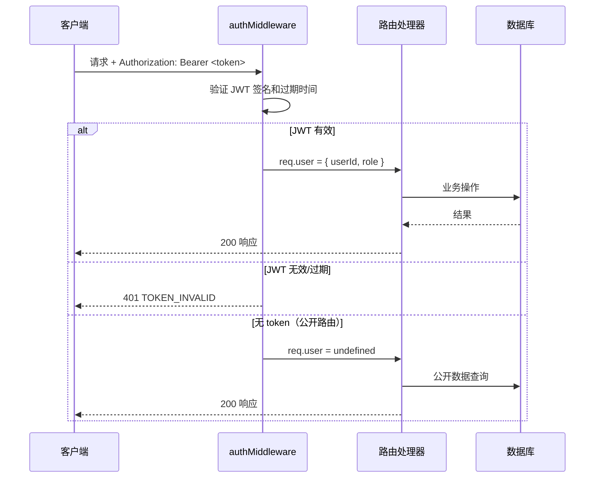
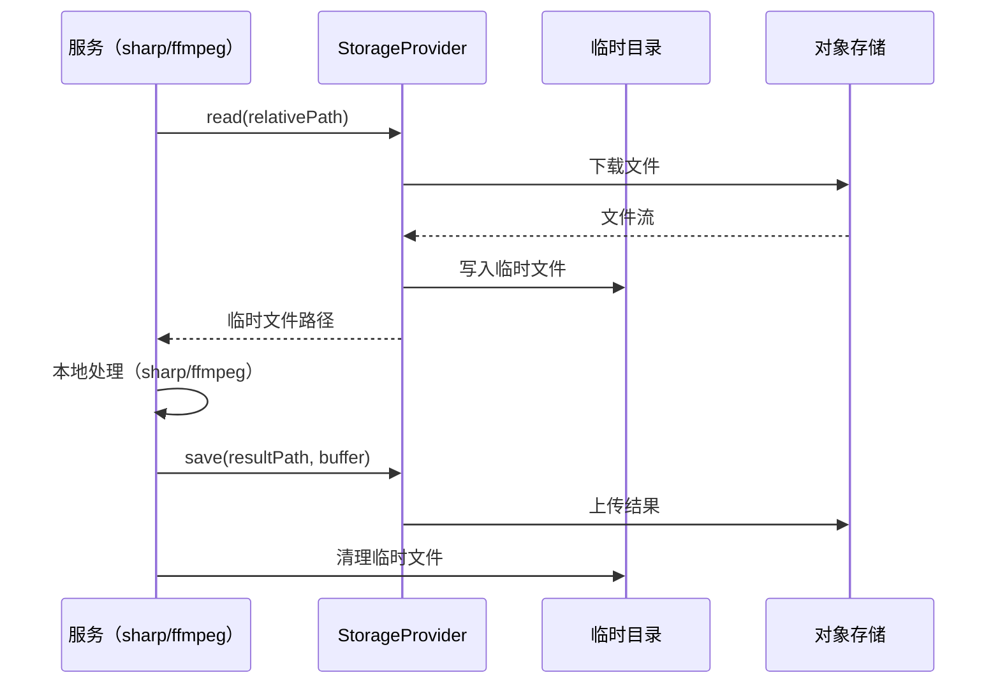
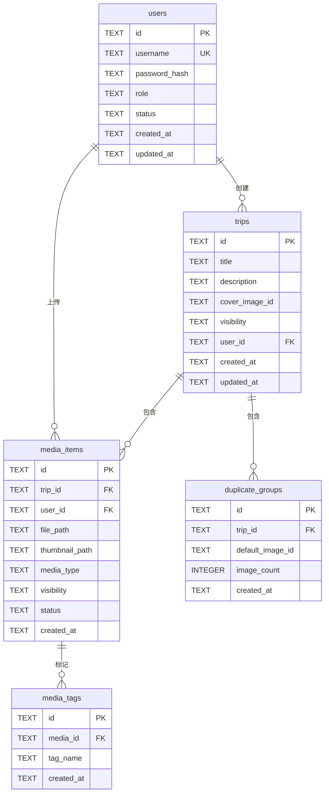

# 技术设计文档：V2 用户功能与素材存储介质

## 概述

本设计在现有旅行相册系统上新增两大模块：

1. **用户系统**：基于 JWT 的无状态认证、bcrypt 密码哈希、角色权限控制（Admin/Regular）、注册审批流程、用户空间与主页空间分离。
2. **存储介质抽象**：将硬编码的 `fs` 调用替换为 `StorageProvider` 接口，支持本地存储、AWS S3、阿里 OSS、腾讯 COS，并提供存储迁移工具。

附带功能：素材自动标签生成、前端认证界面、管理后台。

### 设计原则

- 最小侵入：通过中间件和接口抽象，尽量减少对现有路由和服务的改动
- 渐进迁移：`user_id` 列设为 nullable，现有数据分配给默认管理员
- 存储无关：数据库只存相对路径，运行时由 StorageProvider 解析

## 架构

### 整体架构

```mermaid
graph TB
    subgraph 前端
        LoginPage[登录页]
        RegisterPage[注册页]
        UserSpacePage[用户空间]
        AdminPage[管理后台]
        HomePage[主页]
        GalleryPage[相册页]
        AuthContext[AuthContext]
    end

    subgraph 中间件层
        AuthMiddleware[authMiddleware<br/>JWT 解析]
        RequireAuth[requireAuth<br/>登录校验]
        RequireAdmin[requireAdmin<br/>管理员校验]
        RequireOwner[requireOwnership<br/>资源归属校验]
    end

    subgraph 路由层
        AuthRoutes[/api/auth/*]
        UserRoutes[/api/admin/users/*]
        TripRoutes[/api/trips/*]
        MediaRoutes[/api/media/*]
        MigrationRoutes[/api/admin/storage/*]
        TagRoutes[标签查询]
    end

    subgraph 服务层
        AuthService[AuthService]
        UserService[UserService]
        TagGenerator[TagGenerator]
        MigrationTool[MigrationTool]
        StorageFactory[StorageFactory]
    end

    subgraph 存储层
        LocalProvider[LocalStorageProvider]
        S3Provider[S3StorageProvider]
        OSSProvider[OSSStorageProvider]
        COSProvider[COSStorageProvider]
    end

    subgraph 数据层
        DB[(SQLite)]
    end

    前端 --> 中间件层
    中间件层 --> 路由层
    路由层 --> 服务层
    服务层 --> StorageFactory
    StorageFactory --> LocalProvider
    StorageFactory --> S3Provider
    StorageFactory --> OSSProvider
    StorageFactory --> COSProvider
    服务层 --> DB
```

### 认证流程



### 存储抽象流程（对象存储 + 本地处理）



## 组件与接口

### 1. 认证模块

#### AuthService

```typescript
// server/src/services/authService.ts
import jwt from 'jsonwebtoken';
import bcrypt from 'bcrypt';

const JWT_SECRET = process.env.JWT_SECRET || 'travel-album-secret-key';
const JWT_EXPIRES_IN = '7d';
const BCRYPT_ROUNDS = 12;

interface JwtPayload {
  userId: string;
  role: 'admin' | 'regular';
}

export function hashPassword(plain: string): Promise<string>;
export function verifyPassword(plain: string, hash: string): Promise<boolean>;
export function signToken(payload: JwtPayload): string;
export function verifyToken(token: string): JwtPayload;
```

#### Auth 中间件

```typescript
// server/src/middleware/auth.ts
import { Request, Response, NextFunction } from 'express';

// 扩展 Express Request 类型
declare global {
  namespace Express {
    interface Request {
      user?: { userId: string; role: 'admin' | 'regular' };
    }
  }
}

/** 解析 JWT，不强制要求。公开路由使用此中间件 */
export function authMiddleware(req: Request, res: Response, next: NextFunction): void;

/** 要求已登录 */
export function requireAuth(req: Request, res: Response, next: NextFunction): void;

/** 要求管理员角色 */
export function requireAdmin(req: Request, res: Response, next: NextFunction): void;

/** 要求资源所有者或管理员 */
export function requireOwnership(
  resourceUserId: string
): (req: Request, res: Response, next: NextFunction) => void;
```

### 2. 用户管理模块

#### UserService

```typescript
// server/src/services/userService.ts

export interface User {
  id: string;
  username: string;
  role: 'admin' | 'regular';
  status: 'active' | 'pending' | 'disabled';
  createdAt: string;
  updatedAt: string;
}

export function createDefaultAdmin(): void;
export function register(username: string, password: string): User;
export function approveUser(userId: string): User;
export function rejectUser(userId: string): User;
export function changePassword(userId: string, oldPassword: string, newPassword: string): Promise<void>;
export function resetPassword(userId: string, newPassword: string): Promise<void>;
export function disableUser(userId: string): void;
export function promoteToAdmin(userId: string): void;
export function listUsers(): User[];
export function listPendingUsers(): User[];
export function getUserById(userId: string): User | null;
```

### 3. 存储提供者

#### StorageProvider 接口

```typescript
// server/src/storage/types.ts
import { Readable } from 'stream';

export interface StorageProvider {
  /** 保存文件，relativePath 如 "{tripId}/originals/{filename}" */
  save(relativePath: string, data: Buffer | Readable): Promise<void>;

  /** 读取文件，返回 Buffer */
  read(relativePath: string): Promise<Buffer>;

  /** 删除文件 */
  delete(relativePath: string): Promise<void>;

  /** 检查文件是否存在 */
  exists(relativePath: string): Promise<boolean>;

  /** 获取文件访问 URL（本地返回相对路径，对象存储返回签名 URL） */
  getUrl(relativePath: string): Promise<string>;

  /** 下载到临时文件并返回临时路径（用于 sharp/ffmpeg 本地处理） */
  downloadToTemp(relativePath: string): Promise<string>;
}

export type StorageType = 'local' | 's3' | 'oss' | 'cos';
```

#### 工厂函数

```typescript
// server/src/storage/factory.ts
export function createStorageProvider(): StorageProvider;
// 读取 process.env.STORAGE_TYPE，默认 'local'
// 不支持的类型抛出 Error('Unsupported STORAGE_TYPE: xxx')
```

#### 实现类

| 类名 | SDK | 环境变量 |
|------|-----|---------|
| `LocalStorageProvider` | `fs` | `LOCAL_STORAGE_PATH`（默认 `./uploads`） |
| `S3StorageProvider` | `@aws-sdk/client-s3` | `S3_BUCKET`, `S3_REGION`, `AWS_ACCESS_KEY_ID`, `AWS_SECRET_ACCESS_KEY` |
| `OSSStorageProvider` | `ali-oss` | `OSS_BUCKET`, `OSS_REGION`, `OSS_ACCESS_KEY_ID`, `OSS_ACCESS_KEY_SECRET` |
| `COSStorageProvider` | `cos-nodejs-sdk-v5` | `COS_BUCKET`, `COS_REGION`, `COS_SECRET_ID`, `COS_SECRET_KEY` |

### 4. 标签生成器

```typescript
// server/src/services/tagGenerator.ts

export interface MediaTag {
  id: string;
  mediaId: string;
  tagName: string;
  createdAt: string;
}

/** 根据规则自动生成标签：相册名称、上传月份(YYYY-MM)、媒体类型、文件扩展名 */
export function generateTags(
  mediaId: string,
  tripTitle: string,
  mediaType: string,
  originalFilename: string,
  uploadDate: Date
): MediaTag[];

/** 标签名称标准化：小写 + 去空格 */
export function normalizeTagName(name: string): string;
```

### 5. 迁移工具

```typescript
// server/src/services/migrationTool.ts

export interface MigrationResult {
  successCount: number;
  failedCount: number;
  failedFiles: { path: string; error: string }[];
}

export async function migrateStorage(
  sourceProvider: StorageProvider,
  targetProvider: StorageProvider
): Promise<MigrationResult>;
```

### 6. API 路由设计

#### 认证路由（公开）

| 方法 | 路径 | 说明 |
|------|------|------|
| POST | `/api/auth/login` | 登录，返回 JWT |
| POST | `/api/auth/register` | 注册（pending 状态） |

#### 用户路由（需认证）

| 方法 | 路径 | 权限 | 说明 |
|------|------|------|------|
| PUT | `/api/auth/password` | requireAuth | 修改自己密码 |
| DELETE | `/api/auth/account` | requireAuth | 注销自己账户 |
| GET | `/api/users/me/trips` | requireAuth | 用户空间 - 我的相册 |
| GET | `/api/users/me/trips/:id/gallery` | requireAuth | 用户空间 - 相册详情 |

#### 管理员路由

| 方法 | 路径 | 说明 |
|------|------|------|
| GET | `/api/admin/users` | 所有用户列表 |
| GET | `/api/admin/users/pending` | 待审批用户 |
| PUT | `/api/admin/users/:id/approve` | 审批通过 |
| PUT | `/api/admin/users/:id/reject` | 审批拒绝 |
| PUT | `/api/admin/users/:id/promote` | 提升为管理员 |
| PUT | `/api/admin/users/:id/password` | 重置密码 |
| DELETE | `/api/admin/users/:id` | 删除用户 |
| POST | `/api/admin/storage/migrate` | 触发存储迁移 |

#### 现有路由改造

| 路由 | 改动 |
|------|------|
| `GET /api/trips` | 主页：仅返回 public 相册 |
| `POST /api/trips` | 需 requireAuth，写入 user_id |
| `PUT /api/trips/:id` | 需 requireAuth + 所有者/Admin |
| `POST /api/trips/:id/media` | 需 requireAuth + 所有者/Admin，写入 user_id |
| `GET /api/trips/:id/gallery` | 公开相册返回 public 素材；所有者/Admin 返回全部 |
| `DELETE /api/media/:id` | 需 requireAuth + 所有者/Admin |
| `GET /api/trips/:id/gallery?tag=xxx` | 新增标签筛选参数 |


### 7. 前端组件

#### AuthContext

```typescript
// client/src/contexts/AuthContext.tsx
interface AuthState {
  token: string | null;
  user: { userId: string; username: string; role: 'admin' | 'regular' } | null;
  isLoggedIn: boolean;
}

interface AuthContextValue extends AuthState {
  login(username: string, password: string): Promise<void>;
  logout(): void;
  register(username: string, password: string): Promise<void>;
}
```

#### ProtectedRoute

```typescript
// client/src/components/ProtectedRoute.tsx
// 包装组件：未登录跳转到 /login，非 Admin 访问 admin 路由跳转到 /
interface Props {
  children: React.ReactNode;
  requireAdmin?: boolean;
}
```

#### 新增页面

| 页面 | 路径 | 说明 |
|------|------|------|
| `LoginPage` | `/login` | 登录表单 |
| `RegisterPage` | `/register` | 注册表单 |
| `UserSpacePage` | `/my` | 用户空间，展示所有个人相册 |
| `AdminPage` | `/admin` | 管理后台（用户管理 + 存储管理） |

#### NavHeader 改造

- 未登录：显示「登录」「注册」按钮
- 已登录普通用户：显示用户名、「我的空间」、「退出」
- 已登录管理员：额外显示「管理后台」入口

## 数据模型

### 新增表

#### users 表

```sql
CREATE TABLE IF NOT EXISTS users (
  id TEXT PRIMARY KEY,
  username TEXT NOT NULL UNIQUE,
  password_hash TEXT NOT NULL,
  role TEXT NOT NULL DEFAULT 'regular',  -- 'admin' | 'regular'
  status TEXT NOT NULL DEFAULT 'pending', -- 'active' | 'pending' | 'disabled'
  created_at TEXT NOT NULL,
  updated_at TEXT NOT NULL
);
```

#### media_tags 表

```sql
CREATE TABLE IF NOT EXISTS media_tags (
  id TEXT PRIMARY KEY,
  media_id TEXT NOT NULL,
  tag_name TEXT NOT NULL,
  created_at TEXT NOT NULL,
  FOREIGN KEY (media_id) REFERENCES media_items(id)
);

CREATE INDEX IF NOT EXISTS idx_media_tags_media_id ON media_tags(media_id);
CREATE INDEX IF NOT EXISTS idx_media_tags_tag_name ON media_tags(tag_name);
```

### 现有表迁移

#### trips 表新增列

```sql
ALTER TABLE trips ADD COLUMN user_id TEXT REFERENCES users(id);
```

迁移策略：添加列后，将所有 `user_id IS NULL` 的记录更新为默认管理员的 id。

#### media_items 表新增列

```sql
ALTER TABLE media_items ADD COLUMN user_id TEXT REFERENCES users(id);
ALTER TABLE media_items ADD COLUMN visibility TEXT NOT NULL DEFAULT 'public';
-- visibility: 'public' | 'private'
```

迁移策略：同 trips 表，将 `user_id IS NULL` 的记录分配给默认管理员。

### 数据库初始化顺序

1. 创建 `users` 表
2. 创建 `media_tags` 表
3. 迁移 `trips` 表（添加 `user_id` 列）
4. 迁移 `media_items` 表（添加 `user_id`、`visibility` 列）
5. 创建默认管理员用户（bcrypt 哈希密码，cost factor 12）
6. 将无主数据分配给默认管理员

### ER 图




## 正确性属性

*属性（Property）是指在系统所有合法执行中都应成立的特征或行为——本质上是对系统应做什么的形式化陈述。属性是人类可读规格说明与机器可验证正确性保证之间的桥梁。*

### Property 1: 密码哈希往返一致性

*For any* 明文密码字符串（长度 ≥ 6），使用 `hashPassword` 哈希后，`verifyPassword(明文, 哈希值)` 应返回 `true`。

**Validates: Requirements 1.4**

### Property 2: 默认管理员创建幂等性

*For any* 次数 N ≥ 1 的 `createDefaultAdmin()` 调用，数据库中 username 为 "admin" 的用户记录应恰好为 1 条。

**Validates: Requirements 1.3**

### Property 3: 注册创建 pending 用户

*For any* 合法的用户名（非空、未被占用）和密码（长度 ≥ 6），调用 `register(username, password)` 后，数据库中应存在一条 status 为 "pending" 的用户记录，且 `verifyPassword(password, record.password_hash)` 为 `true`。

**Validates: Requirements 2.1**

### Property 4: 重复用户名拒绝

*For any* 已存在的用户名，再次调用 `register(同一用户名, 任意密码)` 应抛出错误码 "USERNAME_TAKEN"。

**Validates: Requirements 2.2**

### Property 5: 无效注册输入拒绝

*For any* 空字符串用户名或长度 < 6 的密码，`register` 应返回参数校验错误。同理，`changePassword` 和 `resetPassword` 中新密码长度 < 6 也应被拒绝。

**Validates: Requirements 2.3, 4.4**

### Property 6: 审批通过设置 active

*For any* status 为 "pending" 的用户，调用 `approveUser(userId)` 后，该用户 status 应为 "active"。

**Validates: Requirements 2.4**

### Property 7: 审批拒绝设置 disabled

*For any* status 为 "pending" 的用户，调用 `rejectUser(userId)` 后，该用户 status 应为 "disabled"。

**Validates: Requirements 2.5**

### Property 8: 活跃用户登录返回有效 JWT

*For any* status 为 "active" 的用户和正确密码，登录应返回一个 JWT，解码后包含正确的 `userId` 和 `role`。

**Validates: Requirements 3.1**

### Property 9: 无效凭证返回 401

*For any* 不存在的用户名或错误的密码，登录应返回 401 状态码和错误码 "INVALID_CREDENTIALS"。

**Validates: Requirements 3.2**

### Property 10: Pending 用户登录返回 403

*For any* status 为 "pending" 的用户和正确密码，登录应返回 403 状态码和错误码 "ACCOUNT_PENDING"。

**Validates: Requirements 3.3**

### Property 11: Disabled 用户登录返回 403

*For any* status 为 "disabled" 的用户和正确密码，登录应返回 403 状态码和错误码 "ACCOUNT_DISABLED"。

**Validates: Requirements 3.4, 5.3**

### Property 12: 无效 Token 返回 401

*For any* 格式错误、签名无效或已过期的 JWT 字符串，`verifyToken` 应抛出异常，中间件应返回 401 和错误码 "TOKEN_INVALID"。

**Validates: Requirements 3.5**

### Property 13: 密码修改往返一致性

*For any* 用户和合法的新密码，无论是用户自行修改（需验证旧密码）还是管理员重置，修改后使用新密码登录应成功，使用旧密码登录应失败。

**Validates: Requirements 4.1, 4.3**

### Property 14: 旧密码错误拒绝

*For any* 用户和不正确的旧密码，`changePassword` 应返回错误码 "WRONG_PASSWORD"，密码不应被修改。

**Validates: Requirements 4.2**

### Property 15: 用户自注销设置 disabled

*For any* status 为 "active" 的普通用户，调用自注销后，该用户 status 应为 "disabled"。

**Validates: Requirements 5.1**

### Property 16: 注销用户的公开相册仍可见

*For any* 拥有公开相册的用户，注销后，主页查询应仍然返回该用户的公开相册。

**Validates: Requirements 5.2**

### Property 17: 管理员专属接口拒绝非管理员

*For any* 标记为管理员专属的 API 端点和任何 role 为 "regular" 的用户，请求应返回 403 状态码和错误码 "FORBIDDEN"。

**Validates: Requirements 2.6, 6.4, 6.5, 8.3, 9.3, 11.5, 15.1**

### Property 18: 管理员提升角色

*For any* role 为 "regular" 的用户，管理员调用 `promoteToAdmin(userId)` 后，该用户 role 应为 "admin"。

**Validates: Requirements 6.3**

### Property 19: 资源创建记录所有者

*For any* 已登录用户创建的相册或上传的素材，数据库记录的 `user_id` 应等于该用户的 `userId`。

**Validates: Requirements 7.1, 7.2**

### Property 20: 素材默认可见性为 public

*For any* 新上传的素材，其 `visibility` 字段应为 "public"。

**Validates: Requirements 8.1**

### Property 21: 所有者可修改素材可见性

*For any* 素材及其所有者，调用修改 visibility 接口后，数据库中该素材的 visibility 应更新为指定值（"public" 或 "private"）。

**Validates: Requirements 8.2**

### Property 22: 批量修改可见性

*For any* 包含 N 个素材的相册，批量修改 visibility 后，该相册下所有素材的 visibility 应一致更新为指定值。

**Validates: Requirements 8.4**

### Property 23: 用户空间返回所有个人相册

*For any* 拥有 M 个相册（含 public 和 private）的用户，用户空间查询应返回恰好 M 个相册。

**Validates: Requirements 9.1**

### Property 24: 用户空间相册返回所有素材

*For any* 用户查看自己的相册，应返回该相册下所有素材（含 public 和 private），数量等于该相册的总素材数。

**Validates: Requirements 9.2**

### Property 25: 管理员可访问任意用户空间

*For any* 管理员和任意用户，管理员访问该用户空间应返回该用户的所有相册和素材。

**Validates: Requirements 9.4**

### Property 26: 主页仅展示公开相册

*For any* 包含 public 和非 public 相册的数据集，主页查询返回的相册应全部为 visibility="public"，且数量等于公开相册总数。

**Validates: Requirements 10.1**

### Property 27: 公开相册仅展示公开素材

*For any* 包含 public 和 private 素材的公开相册，公开画廊查询返回的素材应全部为 visibility="public"，且数量等于该相册公开素材总数。

**Validates: Requirements 10.2**

### Property 28: 授权删除相册级联 trash

*For any* 相册及其下 N 个素材，授权用户（所有者或管理员）删除该相册后，相册和所有 N 个素材的 status 应为 "trashed"。

**Validates: Requirements 11.1, 11.3**

### Property 29: 授权删除素材设置 trashed

*For any* 素材，授权用户（所有者或管理员）删除后，该素材 status 应为 "trashed"。

**Validates: Requirements 11.2, 11.4**

### Property 30: 标签生成规则完整性

*For any* 素材（给定相册名称、上传日期、媒体类型、原始文件名），`generateTags` 应生成至少 4 个标签，分别包含：标准化后的相册名称、YYYY-MM 格式日期、媒体类型、文件扩展名。

**Validates: Requirements 12.1, 12.2**

### Property 31: 标签名称标准化

*For any* 字符串，`normalizeTagName` 的结果应全部为小写且不包含空格。对同一输入多次调用应返回相同结果（幂等性）。

**Validates: Requirements 12.5**

### Property 32: 标签筛选准确性

*For any* 标签名称 T 和素材集合，按标签 T 筛选返回的素材应恰好是拥有标签 T 的素材集合。

**Validates: Requirements 12.4**

### Property 33: LocalStorageProvider 存取往返一致性

*For any* 文件数据（Buffer）和相对路径，`save(path, data)` 后 `read(path)` 应返回与原始 data 相同的 Buffer。且 `exists(path)` 应返回 `true`。`delete(path)` 后 `exists(path)` 应返回 `false`。

**Validates: Requirements 13.2**

### Property 34: 存储工厂正确性

*For any* 支持的 STORAGE_TYPE 值（"local", "s3", "oss", "cos"），工厂应返回对应类型的 StorageProvider 实例。*For any* 不支持的值，工厂应抛出包含该值的错误信息。

**Validates: Requirements 13.6, 13.7**

### Property 35: 数据库存储提供者无关路径

*For any* 通过系统保存的文件，数据库中存储的路径应为相对路径格式（不以 "/" 或盘符开头，不包含 "uploads/" 前缀以外的绝对路径信息）。

**Validates: Requirements 14.3**

### Property 36: 迁移错误隔离与摘要不变量

*For any* 包含 N 个文件的迁移操作（其中部分可能失败），迁移结果的 `successCount + failedCount` 应等于 N，`failedFiles.length` 应等于 `failedCount`，且所有成功文件应在目标 StorageProvider 中存在。

**Validates: Requirements 15.3, 15.4**

### Property 37: 相同存储类型迁移拒绝

*For any* 存储类型 T，当当前存储类型也为 T 时，触发迁移应返回错误码 "SAME_STORAGE_TYPE"。

**Validates: Requirements 15.6**

### Property 38: 登录/登出 Token 生命周期

*For any* 成功登录，localStorage 应包含有效的 JWT token。调用 logout 后，localStorage 中不应存在该 token。

**Validates: Requirements 16.3, 16.4**

### Property 39: 非管理员无法访问管理后台

*For any* role 为 "regular" 的已登录用户，访问管理后台路由应被重定向到主页。

**Validates: Requirements 17.4**

## 错误处理

### 认证错误

| 场景 | HTTP 状态码 | 错误码 | 说明 |
|------|------------|--------|------|
| 用户名或密码错误 | 401 | INVALID_CREDENTIALS | 不区分具体原因 |
| Token 无效/过期 | 401 | TOKEN_INVALID | |
| 账户待审批 | 403 | ACCOUNT_PENDING | |
| 账户已禁用 | 403 | ACCOUNT_DISABLED | |
| 权限不足 | 403 | FORBIDDEN | 非管理员访问管理接口 |
| 非资源所有者 | 403 | FORBIDDEN | 非所有者修改/删除资源 |

### 注册错误

| 场景 | HTTP 状态码 | 错误码 |
|------|------------|--------|
| 用户名已占用 | 409 | USERNAME_TAKEN |
| 用户名为空 | 400 | VALIDATION_ERROR |
| 密码过短 | 400 | VALIDATION_ERROR |

### 密码管理错误

| 场景 | HTTP 状态码 | 错误码 |
|------|------------|--------|
| 旧密码不正确 | 400 | WRONG_PASSWORD |
| 新密码过短 | 400 | VALIDATION_ERROR |

### 存储错误

| 场景 | HTTP 状态码 | 错误码 |
|------|------------|--------|
| 不支持的 STORAGE_TYPE | 启动时抛出 | 配置错误 |
| 文件不存在 | 404 | FILE_NOT_FOUND |
| 存储服务不可用 | 503 | STORAGE_UNAVAILABLE |
| 迁移目标相同 | 400 | SAME_STORAGE_TYPE |

### 错误处理策略

- 所有错误通过现有的 `globalErrorHandler` 中间件统一处理
- 新增 `AppError` 子类型用于认证和权限错误
- 存储操作失败时，服务层捕获异常并转换为 `AppError`
- 迁移工具采用逐文件错误隔离，单个文件失败不影响整体

## 测试策略

### 测试框架

- 单元测试和属性测试：`vitest` + `fast-check`（项目已有依赖）
- API 集成测试：`supertest`（项目已有依赖）
- 前端组件测试：`@testing-library/react`（项目已有依赖）

### 属性测试（Property-Based Testing）

每个正确性属性对应一个属性测试，使用 `fast-check` 生成随机输入，最少运行 100 次迭代。

每个测试需标注对应的设计属性：

```typescript
// 标注格式
// Feature: v2-users-and-storage, Property 1: 密码哈希往返一致性
```

重点属性测试：

1. **密码哈希往返**（Property 1）：生成随机密码字符串，验证 hash → verify 往返
2. **默认管理员幂等**（Property 2）：多次调用 createDefaultAdmin，验证只有一条记录
3. **注册状态**（Property 3）：生成随机用户名/密码，验证注册后状态为 pending
4. **登录状态分支**（Property 8-11）：生成不同状态的用户，验证登录返回正确的状态码
5. **标签标准化**（Property 31）：生成随机字符串，验证结果全小写无空格
6. **标签生成完整性**（Property 30）：生成随机素材元数据，验证标签包含所有必需类别
7. **存储往返**（Property 33）：生成随机 Buffer，验证 save → read 一致
8. **工厂正确性**（Property 34）：枚举所有 STORAGE_TYPE，验证返回正确实例
9. **可见性过滤**（Property 26, 27）：生成混合可见性数据，验证查询只返回 public
10. **权限守卫**（Property 17）：生成非管理员用户，验证管理接口返回 403
11. **迁移摘要不变量**（Property 36）：模拟部分失败的迁移，验证计数一致性

### 单元测试

针对具体示例和边界情况：

- 默认管理员初始化（用户名 "admin"，角色 admin，bcrypt 哈希有效）
- 空用户名注册被拒绝
- 密码恰好 6 个字符可以通过
- JWT 过期 token 被拒绝
- LocalStorageProvider 对不存在文件的 read 抛出异常
- 迁移目标与源相同时返回 SAME_STORAGE_TYPE
- 标签生成：含空格的相册名称被正确标准化
- 前端页面渲染：LoginPage 包含用户名/密码输入框和登录按钮
- 前端页面渲染：RegisterPage 包含确认密码输入框
- 导航栏根据登录状态显示不同按钮

### 集成测试

- 完整注册 → 审批 → 登录 → 创建相册 → 上传素材流程
- 管理员删除用户后，用户无法登录但公开相册仍可见
- 存储迁移端到端（LocalStorageProvider → 模拟的目标 Provider）
- 标签筛选查询返回正确结果

