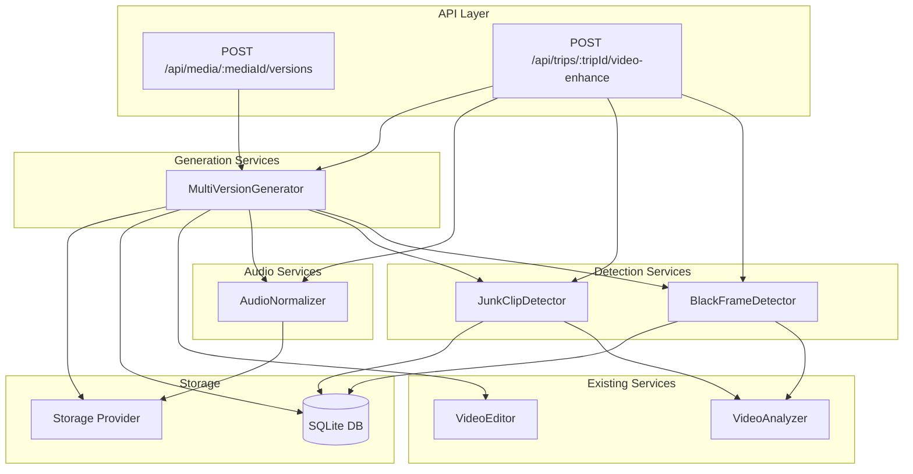
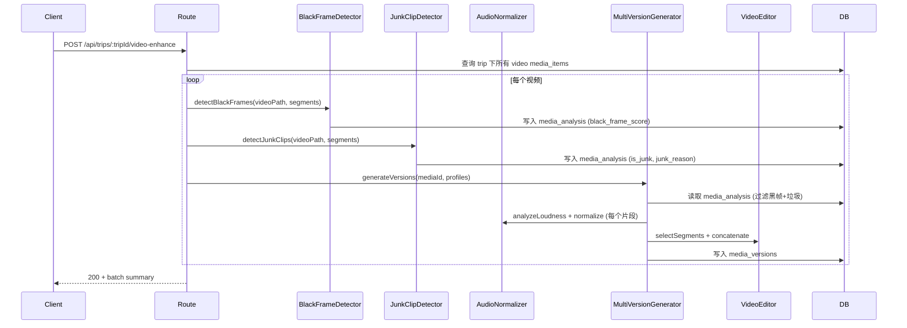

# Design Document: v2-video-processing

## Overview

本设计文档描述 v2 智能媒体处理系统第三阶段的技术实现方案。在 v2-schema-foundation 完成数据库 schema 增强、v2-image-processing 完成色偏检测和 AI Provider 抽象的基础上，本阶段实现四个核心模块：

1. **黑帧检测器（Black Frame Detector）** — 基于 ffmpeg 帧提取 + sharp 灰度分析的纯函数，检测黑帧占比
2. **垃圾片段检测器（Junk Clip Detector）** — 综合时长、运动向量、拍摄方向分析，识别无用片段
3. **音频归一化器（Audio Normalizer）** — 基于 ffmpeg loudnorm 的两阶段处理（分析 + 归一化）
4. **多版本生成器（Multi-Version Generator）** — 从同一源素材按不同时长配置生成多个输出版本

### 设计原则

- **纯函数优先**：黑帧检测和垃圾片段检测的核心算法为纯函数，便于测试
- **渐进集成**：新模块通过组合模式集成到现有 videoEditor，不破坏现有接口
- **容错优先**：单帧/单片段失败不影响整体流程，使用 skip + continue 策略
- **复用现有基础设施**：复用 video_segments 表、media_analysis 表、media_versions 表

## Architecture



### 数据流



## Components and Interfaces

### 1. BlackFrameDetector (`server/src/services/blackFrameDetector.ts`)

```typescript
export interface BlackFrameResult {
  blackFrameRatio: number;      // [0.0, 1.0] — 黑帧占比
  blackFrameScore: number;      // [0.0, 1.0] — 1.0=无黑帧, 0.0=全黑帧
  isBlackFrameSegment: boolean; // blackFrameRatio > 0.8
  sampledFrameCount: number;
  blackFrameCount: number;
  thresholdUsed: number;
}

export interface BlackFrameDetectionOptions {
  brightnessThreshold?: number;  // default 10
  ratioThreshold?: number;       // default 0.8
  minSamples?: number;           // default 5
}

// 纯函数：计算单帧亮度
export function computeFrameBrightness(grayPixels: Buffer): number;

// 纯函数：从亮度数组判定黑帧结果
export function classifyBlackFrames(
  brightnesses: number[],
  options?: BlackFrameDetectionOptions
): BlackFrameResult;

// IO 函数：提取帧并分析
export async function detectBlackFrames(
  videoPath: string,
  startTime: number,
  endTime: number,
  options?: BlackFrameDetectionOptions
): Promise<BlackFrameResult>;

// 持久化
export async function persistBlackFrameResult(
  mediaId: string,
  segmentIndex: number,
  result: BlackFrameResult
): Promise<void>;
```

**算法逻辑：**
1. 根据片段时长计算采样数：`max(minSamples, ceil(duration * 2.5))`，短片段 (<0.5s) 最少 2 帧
2. 使用 ffmpeg 在均匀时间点提取帧
3. 使用 sharp 转灰度 → raw buffer → 计算所有像素平均亮度
4. 亮度 < threshold → 黑帧
5. `blackFrameRatio = blackFrameCount / sampledFrameCount`
6. `blackFrameScore = 1.0 - blackFrameRatio`
7. `isBlackFrameSegment = blackFrameRatio > ratioThreshold`

### 2. JunkClipDetector (`server/src/services/junkClipDetector.ts`)

```typescript
export type JunkReason = 'too_short' | 'extreme_blur' | 'ground_shot' | 'accidental_touch';

export interface JunkClipResult {
  isJunk: boolean;
  reason: JunkReason | null;
  confidence: number;           // [0.0, 1.0]
  details: {
    duration: number;
    motionMagnitude: number | null;
    pitchAngle: number | null;
    hasAccidentalPattern: boolean;
  };
}

export interface JunkDetectionOptions {
  minDuration?: number;           // default 1.0s
  extremeMotionThreshold?: number; // default 80
  groundShotAngle?: number;       // default 60 degrees
  groundShotRatio?: number;       // default 0.7
}

// 纯函数：根据特征判定垃圾片段
export function classifyJunkClip(
  duration: number,
  motionMagnitude: number | null,
  pitchAngle: number | null,
  hasAccidentalPattern: boolean,
  options?: JunkDetectionOptions
): JunkClipResult;

// IO 函数：分析视频片段
export async function detectJunkClip(
  videoPath: string,
  startTime: number,
  endTime: number,
  options?: JunkDetectionOptions
): Promise<JunkClipResult>;

// 持久化
export async function persistJunkClipResult(
  mediaId: string,
  segmentIndex: number,
  result: JunkClipResult
): Promise<void>;
```

**算法逻辑：**
1. 时长检查：`duration < minDuration` → too_short (confidence=1.0)
2. 运动分析：提取多帧计算帧间差异的平均运动向量幅度
3. 方向分析：通过帧间光流估计主运动方向，判断是否持续向下
4. 意外触碰：检测突然高幅运动后立即静止的模式
5. 优先级：too_short > extreme_blur > ground_shot > accidental_touch

### 3. AudioNormalizer (`server/src/services/audioNormalizer.ts`)

```typescript
export interface LoudnessAnalysis {
  integratedLoudness: number;   // LUFS
  loudnessRange: number;        // LRA in LU
  truePeak: number;             // dBTP
  hasAudio: boolean;
}

export interface NormalizationResult {
  normalizedPath: string | null;  // null if skipped
  skipped: boolean;
  reason: string;                 // 'normalized' | 'within_tolerance' | 'no_audio' | 'error'
  originalLoudness: number;
  targetLoudness: number;
}

export interface NormalizationOptions {
  targetLufs?: number;          // default -16, env: AUDIO_TARGET_LUFS
  truePeakLimit?: number;       // default -1.5 dBTP
  tolerance?: number;           // default 1.0 LUFS
}

// 分析响度
export async function analyzeLoudness(segmentPath: string): Promise<LoudnessAnalysis>;

// 归一化单个片段
export async function normalizeSegment(
  segmentPath: string,
  outputPath: string,
  analysis: LoudnessAnalysis,
  options?: NormalizationOptions
): Promise<NormalizationResult>;

// 批量归一化
export async function normalizeSegments(
  segmentPaths: string[],
  outputDir: string,
  options?: NormalizationOptions
): Promise<NormalizationResult[]>;
```

**算法逻辑：**
1. 使用 `ffmpeg -af loudnorm=print_format=json` 分析响度
2. 解析 JSON 输出获取 integrated loudness、LRA、true peak
3. 如果 `|measuredLufs - targetLufs| <= tolerance`，跳过归一化
4. 否则使用 `loudnorm=I=target:TP=truePeakLimit:LRA=measured:linear=true` 归一化
5. 保留原始编码格式，失败时回退到 AAC 48kHz

### 4. MultiVersionGenerator (`server/src/services/multiVersionGenerator.ts`)

```typescript
export interface VersionProfile {
  name: string;                 // 'highlight' | 'summary' | 'full_edit' | custom
  targetDuration: number;       // seconds
  selectionStrategy: 'quality_first' | 'balanced' | 'comprehensive';
}

export interface VersionResult {
  versionId: string;
  profile: VersionProfile;
  filePath: string;
  duration: number;
  segmentCount: number;
  fileSize: number;
  error?: string;
}

export interface MultiVersionResult {
  mediaId: string;
  versions: VersionResult[];
  errors: Array<{ profile: string; error: string }>;
}

export const DEFAULT_PROFILES: Record<string, VersionProfile> = {
  highlight: { name: 'highlight', targetDuration: 30, selectionStrategy: 'quality_first' },
  summary: { name: 'summary', targetDuration: 60, selectionStrategy: 'balanced' },
  full_edit: { name: 'full_edit', targetDuration: 300, selectionStrategy: 'comprehensive' },
};

// 生成多版本
export async function generateVersions(
  videoPath: string,
  mediaId: string,
  tripId: string,
  segments: VideoSegment[],
  profiles: VersionProfile[],
  options?: { videoResolution?: number }
): Promise<MultiVersionResult>;

// 版本特定的片段选择
export function selectSegmentsForProfile(
  segments: VideoSegment[],
  profile: VersionProfile,
  blackFrameResults: Map<number, BlackFrameResult>,
  junkResults: Map<number, JunkClipResult>,
): VideoSegment[];
```

**片段选择策略：**
- `quality_first` (highlight 30s)：按 overallScore 降序选择，严格取最高分
- `balanced` (summary 60s)：将时间线分为 N 等份，每份取最高分片段
- `comprehensive` (full_edit 300s)：包含所有通过最低质量阈值的非黑帧非垃圾片段

### 5. Enhanced Video Editor Integration

修改现有 `videoEditor.ts` 的 `selectSegments` 函数，增加黑帧和垃圾片段过滤：

```typescript
// 新增参数
export interface SegmentFilterOptions {
  blackFrameResults?: Map<number, BlackFrameResult>;
  junkResults?: Map<number, JunkClipResult>;
}

// 修改 selectSegments 签名
export function selectSegments(
  segments: VideoSegment[],
  targetDuration: number | null,
  filterOptions?: SegmentFilterOptions
): VideoSegment[];
```

### 6. Video Enhancement API Routes (`server/src/routes/videoEnhance.ts`)

```typescript
// POST /api/media/:mediaId/versions
// Body: { profiles?: string[], customProfiles?: VersionProfile[] }
// Response: 200 { result: MultiVersionResult } | 400 | 404 | 409

// POST /api/trips/:tripId/video-enhance
// Response: 200 { summary: BatchEnhanceResult }
```

## Data Models

### media_analysis 表（已存在，新增字段通过 reason JSON）

| 字段 | 类型 | 用途 |
|------|------|------|
| quality_score | REAL | 用于存储 black_frame_score |
| reason | TEXT | JSON: `{ type: 'black_frame' \| 'junk_clip', ... }` |

对于黑帧检测结果：
```json
{
  "type": "black_frame",
  "blackFrameRatio": 0.9,
  "blackFrameScore": 0.1,
  "isBlackFrameSegment": true,
  "sampledFrameCount": 5,
  "blackFrameCount": 4,
  "thresholdUsed": 10
}
```

对于垃圾片段检测结果：
```json
{
  "type": "junk_clip",
  "isJunk": true,
  "reason": "too_short",
  "confidence": 1.0,
  "details": { "duration": 0.3, "motionMagnitude": null, "pitchAngle": null }
}
```

### media_versions 表（已存在）

| 字段 | 类型 | 用途 |
|------|------|------|
| version_type | TEXT | 'highlight' / 'summary' / 'full_edit' |
| duration | REAL | 版本时长（秒） |
| params | TEXT | JSON: `{ profile, segmentCount, normalizedCount }` |
| status | TEXT | 'ready' / 'failed' |

### 并发控制（内存锁）

```typescript
const generatingMediaIds = new Set<string>();
```

## Correctness Properties

### Property 1: Black Frame Score Bounded

*For any* array of brightness values (each in [0, 255]), the computed blackFrameScore SHALL always be in the range [0.0, 1.0], and blackFrameScore = 1.0 - blackFrameRatio.

**Validates: Requirements 1.6**

### Property 2: Black Frame Classification Consistency

*For any* array of brightness values and threshold T, if all values < T then blackFrameRatio = 1.0 and isBlackFrameSegment = true. If no values < T then blackFrameRatio = 0.0 and isBlackFrameSegment = false.

**Validates: Requirements 1.2, 1.3**

### Property 3: Junk Classification Priority Order

*For any* segment with multiple junk conditions simultaneously true, the reported reason SHALL be the first matching in priority order: too_short, extreme_blur, ground_shot, accidental_touch.

**Validates: Requirements 3.6**

### Property 4: Junk Confidence Bounded

*For any* junk clip analysis result, the confidence score SHALL be in [0.0, 1.0].

**Validates: Requirements 3.7**

### Property 5: Segment Filtering Completeness

*For any* set of segments with associated black frame and junk results, the filtered output SHALL contain no segments where isBlackFrameSegment = true OR isJunk = true.

**Validates: Requirements 5.1, 5.2**

### Property 6: Audio Normalization Skip Condition

*For any* segment with measured loudness L and target T, if |L - T| <= tolerance then normalization SHALL be skipped (result.skipped = true).

**Validates: Requirements 7.4**

### Property 7: Version Profile Duration Constraint

*For any* version generation request where profile.targetDuration > sourceDuration, that profile SHALL be skipped and not produce an output file.

**Validates: Requirements 9.2**

### Property 8: Multi-Version Count Invariant

*For any* multi-version generation result, versions.length + errors.length SHALL equal the number of requested profiles that were not skipped due to duration constraints.

**Validates: Requirements 10.4, 10.5**

### Property 9: Chronological Order Preservation

*For any* version output, the selected segments SHALL be ordered by startTime in ascending order.

**Validates: Requirements 11.4**

## Error Handling

### 黑帧检测错误处理

| 场景 | 处理方式 |
|------|----------|
| 帧提取失败（ffmpeg error） | 跳过该帧，继续分析剩余帧 |
| 所有帧提取失败 | 返回默认结果（score=0.5, isBlackFrame=false） |
| sharp 处理失败 | 同上 |
| 数据库写入失败 | 抛出异常，由调用方处理 |

### 垃圾片段检测错误处理

| 场景 | 处理方式 |
|------|----------|
| 运动分析失败 | motionMagnitude=null，跳过 extreme_blur 检测 |
| 方向分析失败 | pitchAngle=null，跳过 ground_shot 检测 |
| 仅时长检测可用 | 仍可判定 too_short |

### 音频归一化错误处理

| 场景 | 处理方式 |
|------|----------|
| 无音频流 | 跳过，返回 reason='no_audio' |
| loudnorm 分析失败 | 使用默认 -23 LUFS |
| 归一化编码失败 | 回退使用原始音频 |
| 不支持的编码格式 | 回退到 AAC 48kHz |

### 多版本生成错误处理

| 场景 | 处理方式 |
|------|----------|
| 并发请求同一 mediaId | 返回 409 Conflict |
| 单个版本生成失败 | 记录错误，继续生成其他版本 |
| 所有片段被过滤 | 返回错误 '无有效片段' |
| 目标时长超过源时长 | 跳过该 profile |

### 错误码定义

- `MEDIA_NOT_FOUND` — 媒体项不存在
- `INVALID_MEDIA_TYPE` — 非视频类型
- `GENERATION_IN_PROGRESS` — 该视频正在生成中
- `NO_VALID_SEGMENTS` — 无有效片段可用
- `TRIP_NOT_FOUND` — 旅行不存在

## Testing Strategy

### 属性测试（Property-Based Testing）

使用 **fast-check** 库进行属性测试，每个属性最少运行 100 次迭代。

**测试文件：** `server/src/services/blackFrameDetector.test.ts`、`server/src/services/junkClipDetector.test.ts`、`server/src/services/audioNormalizer.test.ts`、`server/src/services/multiVersionGenerator.test.ts`

每个属性测试必须包含注释标签：
```
// Feature: v2-video-processing, Property N: <property_text>
```

**属性测试覆盖：**
1. computeFrameBrightness + classifyBlackFrames — Properties 1, 2
2. classifyJunkClip — Properties 3, 4
3. selectSegmentsForProfile 过滤逻辑 — Property 5
4. normalizeSegment skip 条件 — Property 6
5. generateVersions duration 约束 — Property 7
6. MultiVersionResult 计数 — Property 8
7. 输出片段时间顺序 — Property 9

### 单元测试（Example-Based）

- 黑帧检测：全黑帧、无黑帧、混合场景、短片段（<0.5s）
- 垃圾片段：各种 reason 的具体场景、多条件同时满足
- 音频归一化：正常归一化、跳过（within tolerance）、无音频
- 多版本：各 profile 的片段选择、duration 超限跳过
- 并发控制：模拟同时请求验证 409

### 集成测试

- API 路由测试：supertest 验证 HTTP 接口
- 数据库持久化：验证 media_analysis、media_versions 写入
- 管线集成：验证 blackFrame → junk → normalize → generate 完整流程

### 测试工具

- **fast-check**: 属性测试框架
- **vitest**: 测试运行器
- **supertest**: HTTP 集成测试
