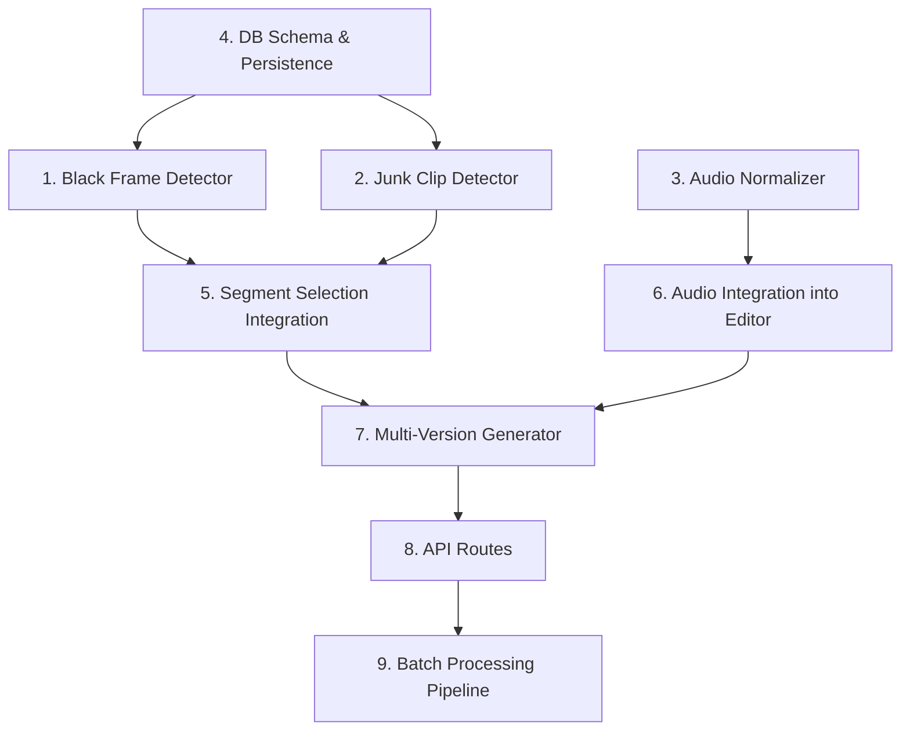

# Tasks

## Task Dependency Graph

## 1. Black Frame Detector

- [x] 1.1 Create `server/src/services/blackFrameDetector.ts` with types (BlackFrameResult, BlackFrameDetectionOptions)
- [x] 1.2 Implement `computeFrameBrightness(grayPixels: Buffer): number` pure function — compute mean pixel value from raw grayscale buffer
- [x] 1.3 Implement `classifyBlackFrames(brightnesses: number[], options?)` pure function — compute blackFrameRatio, blackFrameScore, isBlackFrameSegment from brightness array
- [x] 1.4 Implement `detectBlackFrames(videoPath, startTime, endTime, options?)` — extract frames via ffmpeg at evenly-spaced intervals, convert to grayscale via sharp, compute brightness per frame, handle frame extraction errors by skipping
- [x] 1.5 Implement sampling logic: min 5 frames for normal segments, min 2 frames for segments < 0.5s
- [x] 1.6 Implement `persistBlackFrameResult(mediaId, segmentIndex, result)` — upsert to media_analysis table with structured JSON in reason column
- [x] 1.7 Write property-based tests for classifyBlackFrames (Properties 1, 2) using fast-check — verify score bounded [0,1], verify all-black and no-black edge cases
- [x] 1.8 Write unit tests for detectBlackFrames with mocked ffmpeg/sharp — normal segment, short segment, frame extraction failure

## 2. Junk Clip Detector

- [x] 2.1 Create `server/src/services/junkClipDetector.ts` with types (JunkReason, JunkClipResult, JunkDetectionOptions)
- [x] 2.2 Implement `classifyJunkClip(duration, motionMagnitude, pitchAngle, hasAccidentalPattern, options?)` pure function — apply priority-ordered rules (too_short > extreme_blur > ground_shot > accidental_touch)
- [x] 2.3 Implement motion magnitude estimation — extract multiple frames, compute frame-to-frame pixel differences, derive average motion vector magnitude
- [x] 2.4 Implement ground shot detection — estimate dominant motion direction from frame differences, check if pitch angle > 60° across > 70% of samples
- [x] 2.5 Implement accidental touch detection — detect sudden high-magnitude motion followed by stillness within 0.5s
- [x] 2.6 Implement `detectJunkClip(videoPath, startTime, endTime, options?)` — orchestrate all detection methods, handle individual failures gracefully
- [x] 2.7 Implement `persistJunkClipResult(mediaId, segmentIndex, result)` — upsert to media_analysis table with structured JSON in reason column
- [x] 2.8 Write property-based tests for classifyJunkClip (Properties 3, 4) using fast-check — verify priority order, verify confidence bounded [0,1]
- [x] 2.9 Write unit tests for each detection method with specific scenarios

## 3. Audio Normalizer

- [x] 3.1 Create `server/src/services/audioNormalizer.ts` with types (LoudnessAnalysis, NormalizationResult, NormalizationOptions)
- [x] 3.2 Implement `analyzeLoudness(segmentPath)` — run ffmpeg loudnorm filter in analysis mode, parse JSON output for integrated LUFS, LRA, true peak; handle no-audio and failures
- [x] 3.3 Implement `normalizeSegment(segmentPath, outputPath, analysis, options?)` — apply loudnorm filter in linear mode with target LUFS and true peak limit; skip if within tolerance; preserve codec or fallback to AAC 48kHz
- [x] 3.4 Implement `normalizeSegments(segmentPaths, outputDir, options?)` — batch normalize all segments, collect results
- [x] 3.5 Read AUDIO_TARGET_LUFS from environment variable (default -16)
- [x] 3.6 Write property-based test for skip condition (Property 6) using fast-check — verify skip when |measured - target| <= tolerance
- [x] 3.7 Write unit tests for analyzeLoudness and normalizeSegment with mocked ffmpeg — normal, no-audio, failure scenarios

## 4. DB Schema & Persistence Helpers

- [x] 4.1 Add migration in `database.ts` for video_segments table columns: `black_frame_score REAL`, `is_junk INTEGER DEFAULT 0`, `junk_reason TEXT`
- [x] 4.2 Create shared persistence helper functions for upserting analysis results keyed by (media_id, segment_index) into media_analysis table
- [x] 4.3 Write unit tests verifying upsert behavior (insert new, update existing)

## 5. Segment Selection Integration

- [x] 5.1 Modify `selectSegments` in `videoEditor.ts` to accept optional `SegmentFilterOptions` parameter with blackFrameResults and junkResults maps
- [x] 5.2 Add filtering logic: exclude segments where `isBlackFrameSegment = true` OR `isJunk = true` BEFORE existing quality-based filtering
- [x] 5.3 When all segments are excluded, return empty array (existing error handling in editVideo already handles this case)
- [x] 5.4 Write property-based test for filtering completeness (Property 5) using fast-check — verify no black-frame or junk segments in output
- [x] 5.5 Write unit tests verifying filter-before-quality ordering, all-excluded case, mixed scenarios

## 6. Audio Normalization Integration into Editor

- [x] 6.1 Modify `editVideo` in `videoEditor.ts` to call `normalizeSegments` on extracted segment files before concatenation
- [x] 6.2 Replace original segment paths with normalized paths when normalization succeeds; keep original on failure
- [x] 6.3 Add `normalizedSegments` field to EditResult metadata tracking which segments were normalized
- [x] 6.4 Write unit tests verifying normalization integration — success path, partial failure fallback

## 7. Multi-Version Generator

- [x] 7.1 Create `server/src/services/multiVersionGenerator.ts` with types (VersionProfile, VersionResult, MultiVersionResult, DEFAULT_PROFILES)
- [x] 7.2 Implement `selectSegmentsForProfile(segments, profile, blackFrameResults, junkResults)` — apply black frame + junk filtering, then profile-specific selection strategy
- [x] 7.3 Implement 'quality_first' strategy — sort by overallScore descending, greedily select until targetDuration reached
- [x] 7.4 Implement 'balanced' strategy — divide timeline into equal parts, select best segment from each part
- [x] 7.5 Implement 'comprehensive' strategy — include all segments passing minimum quality threshold
- [x] 7.6 Implement `generateVersions(videoPath, mediaId, tripId, segments, profiles, options?)` — for each profile: skip if targetDuration > sourceDuration, select segments, normalize audio, concatenate, save to storage, create media_versions record
- [x] 7.7 Add concurrency lock using `Set<string>` to prevent duplicate generation for same mediaId
- [x] 7.8 Write property-based tests for duration constraint (Property 7), count invariant (Property 8), chronological order (Property 9) using fast-check
- [x] 7.9 Write unit tests for each selection strategy with specific segment configurations

## 8. API Routes

- [x] 8.1 Create `server/src/routes/videoEnhance.ts` with POST /api/media/:mediaId/versions endpoint — validate media exists and is video, check concurrency lock, parse profiles from body, call generateVersions
- [x] 8.2 Add POST /api/trips/:tripId/video-enhance endpoint — query all video media_items in trip, run full pipeline (blackFrame → junk → normalize → generate) per video, return batch summary
- [x] 8.3 Register videoEnhance routes in Express app (`server/src/index.ts`)
- [x] 8.4 Write integration tests for both endpoints using supertest — success, 404, 409, batch with partial failures

## 9. Batch Processing Pipeline Integration

- [x] 9.1 Add video enhancement stage to `runTripProcessingPipeline` — after existing videoEdit stage, run blackFrame detection, junk detection, and multi-version generation for each video
- [x] 9.2 Report progress via existing `onProgress` callback for each sub-stage (blackFrameDetect, junkDetect, audioNormalize, versionGenerate)
- [x] 9.3 Handle individual video failures without stopping batch — continue processing remaining videos
- [x] 9.4 Write integration test verifying the full pipeline stage ordering and error resilience
