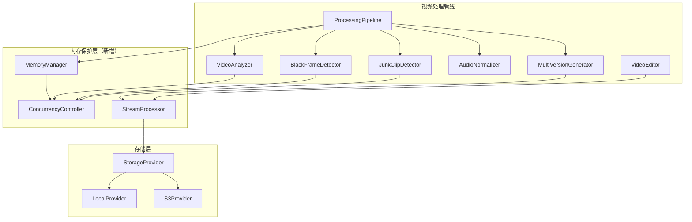
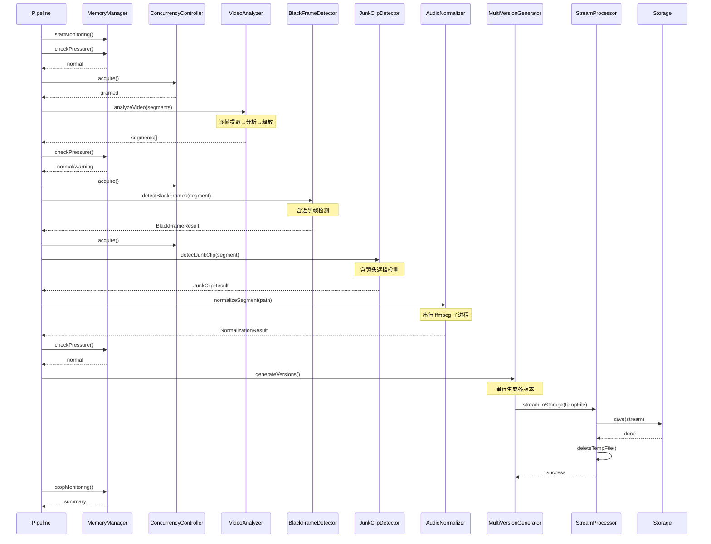
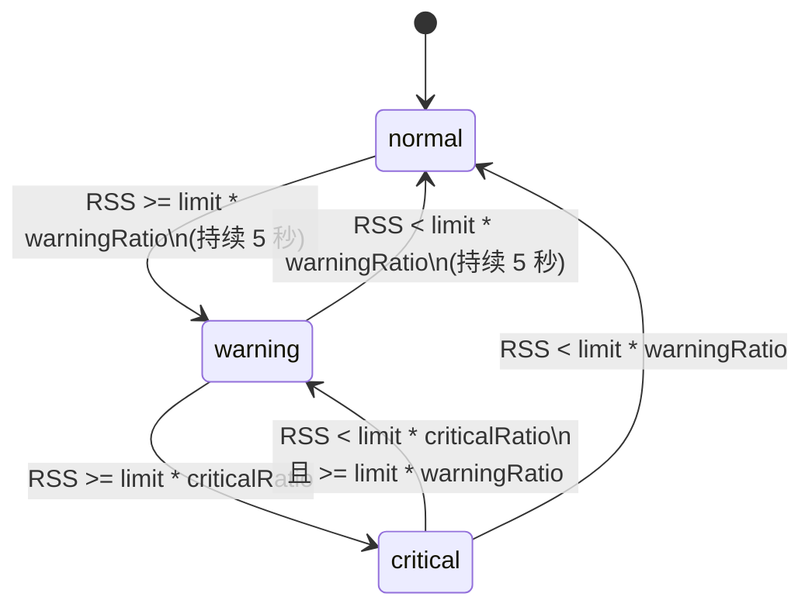

# 技术设计文档：视频处理增强 V3

## 概览

本设计文档描述视频处理系统第三阶段增强的技术实现方案。核心目标是解决大视频文件处理时的内存崩溃问题，同时增强检测能力（近黑帧、镜头遮挡）并调整多版本输出配置。

### 设计目标

1. **内存安全**：通过 MemoryManager + ConcurrencyController + StreamProcessor 三层防护，确保视频处理不会因内存溢出导致进程崩溃
2. **检测增强**：扩展 BlackFrameDetector 支持近黑帧，扩展 JunkClipDetector 支持镜头遮挡
3. **流式存储**：用 Stream 替代 Buffer 整体加载，避免大文件占满内存
4. **配置灵活**：所有阈值和参数通过环境变量可配置，带有效范围校验和默认值回退

### 设计决策

| 决策 | 选择 | 理由 |
|------|------|------|
| 并发控制模式 | Semaphore（信号量） | 轻量、无外部依赖、适合进程内并发限制 |
| 内存监控方式 | process.memoryUsage().rss | 反映真实物理内存占用，比 heapUsed 更准确 |
| 流式传输 | Node.js stream/promises pipeline | 原生支持背压、错误传播、自动清理 |
| 内存压力防抖 | 5 秒持续确认 | 防止 GC 波动导致策略频繁切换 |
| 多版本生成顺序 | 串行（highlight → summary → extended） | 避免多版本同时合成导致内存叠加 |

## 架构

### 系统架构图



### 数据流图



## 组件与接口

### 1. MemoryManager（新增）

**文件路径**: `server/src/services/memoryManager.ts`

负责进程内存监控、压力等级计算、降级策略执行。

```typescript
export type MemoryPressureLevel = 'normal' | 'warning' | 'critical';

export interface MemoryManagerConfig {
  memoryLimitMB: number;       // 默认 1024，范围 128-65536
  warningRatio: number;        // 默认 0.7，范围 0.1-0.9
  criticalRatio: number;       // 默认 0.85，范围 0.2-0.99，必须 > warningRatio
  checkIntervalMs: number;     // 默认 5000
  debounceDurationMs: number;  // 默认 5000（防抖）
}

export interface MemoryStatus {
  rssBytes: number;
  rssMB: number;
  pressureLevel: MemoryPressureLevel;
  limitMB: number;
  usageRatio: number;
}

export interface MemorySummary {
  peakRssMB: number;
  avgRssMBByStage: Record<string, number>;
  gcTriggerCount: number;
  skippedVideos: Array<{ mediaId: string; stage: string; reason: string }>;
}

export interface MemoryManager {
  // 配置读取
  getConfig(): MemoryManagerConfig;

  // 状态查询
  getCurrentStatus(): MemoryStatus;
  getPressureLevel(): MemoryPressureLevel;
  getRssMB(): number;

  // 监控生命周期
  startMonitoring(): void;
  stopMonitoring(): MemorySummary;

  // 阶段间检查
  checkBetweenStages(stage: string): Promise<void>;  // 阻塞等待或抛出超时错误

  // 降级参数
  getFrameSampleCount(defaultCount: number): number;
  getMaxConcurrency(configuredMax: number): number;

  // 任务暂停/恢复
  shouldPauseTasks(): boolean;
  waitForRecovery(timeoutMs: number): Promise<boolean>;
}
```

### 2. ConcurrencyController（新增）

**文件路径**: `server/src/services/concurrencyController.ts`

基于信号量模式的并发控制器，支持动态调整并发上限。

```typescript
export interface ConcurrencyController {
  // 获取/释放信号量
  acquire(): Promise<void>;
  release(): void;

  // 动态调整
  setMaxConcurrency(max: number): void;
  getMaxConcurrency(): number;
  getCurrentCount(): number;
  getQueueLength(): number;
}

export function createConcurrencyController(maxConcurrency: number): ConcurrencyController;
```

### 3. StreamProcessor（新增）

**文件路径**: `server/src/services/streamProcessor.ts`

流式文件传输处理器，负责临时文件到存储层的流式写入和清理。

```typescript
export interface StreamTransferOptions {
  timeoutMs?: number;          // 默认 300000 (300s)
  deleteOnSuccess?: boolean;   // 默认 true
}

export interface StreamTransferResult {
  success: boolean;
  bytesTransferred: number;
  durationMs: number;
}

export interface StreamProcessor {
  /**
   * 将临时文件以流方式传输到存储层，完成后删除临时文件
   */
  transferToStorage(
    tempFilePath: string,
    storagePath: string,
    options?: StreamTransferOptions
  ): Promise<StreamTransferResult>;

  /**
   * 验证临时目录中无残留文件
   */
  verifyCleanup(tempDir: string): Promise<void>;
}
```

### 4. BlackFrameDetector 增强

**文件路径**: `server/src/services/blackFrameDetector.ts`（修改现有）

新增近黑帧检测能力。

```typescript
// 新增接口字段
export interface BlackFrameResult {
  // ... 现有字段保持不变
  blackFrameRatio: number;
  blackFrameScore: number;
  isBlackFrameSegment: boolean;
  sampledFrameCount: number;
  blackFrameCount: number;
  thresholdUsed: number;

  // 新增字段
  nearBlackRatio: number;           // [0.0, 1.0] — 近黑帧占比
  nearBlackFrameCount: number;      // 近黑帧数量
  isNearBlackSegment: boolean;      // nearBlackRatio > 0.9
  nearBlackThresholdUsed: number;   // 使用的近黑阈值
}

export interface BlackFrameDetectionOptions {
  brightnessThreshold?: number;     // 纯黑阈值，默认 10
  ratioThreshold?: number;          // 纯黑占比阈值，默认 0.8
  minSamples?: number;              // 最小采样数，默认 5
  nearBlackThreshold?: number;      // 近黑亮度阈值，默认 20
  nearBlackRatioThreshold?: number; // 近黑占比阈值，默认 0.9
}
```

### 5. JunkClipDetector 增强

**文件路径**: `server/src/services/junkClipDetector.ts`（修改现有）

新增镜头遮挡检测。

```typescript
// 扩展 JunkReason 类型
export type JunkReason = 'too_short' | 'extreme_blur' | 'ground_shot'
                       | 'lens_occlusion' | 'accidental_touch';

// 新增遮挡检测选项
export interface JunkDetectionOptions {
  // ... 现有字段
  minDuration?: number;
  extremeMotionThreshold?: number;
  groundShotAngle?: number;
  groundShotRatio?: number;

  // 新增
  occlusionVarianceThreshold?: number;  // 默认 300
  occlusionEdgeThreshold?: number;      // 默认 0.05
  occlusionFrameRatio?: number;         // 默认 0.7
}

// 新增检测函数
export function detectLensOcclusion(
  videoPath: string,
  startTime: number,
  endTime: number,
  options?: { varianceThreshold?: number; edgeThreshold?: number }
): Promise<{ isOccluded: boolean; occlusionRatio: number }>;
```

### 6. AudioNormalizer 增强

**文件路径**: `server/src/services/audioNormalizer.ts`（修改现有）

优化为流式处理，串行执行，监控子进程内存。

```typescript
// 新增子进程监控接口
export interface FfmpegProcessMonitor {
  pid: number;
  rssMB: number;
  startTime: number;
}

// 修改 normalizeSegments 为严格串行
export async function normalizeSegments(
  segmentPaths: string[],
  outputDir: string,
  options?: NormalizationOptions
): Promise<NormalizationResult[]>;
// 行为变更：确保任意时刻最多 1 个 ffmpeg 子进程运行
// 新增：每 5 秒轮询子进程 RSS，超过 512MB 记录警告
```

### 7. MultiVersionGenerator 增强

**文件路径**: `server/src/services/multiVersionGenerator.ts`（修改现有）

调整版本配置，串行生成，集成内存检查。

```typescript
// 更新默认配置
export const DEFAULT_PROFILES: Record<string, VersionProfile> = {
  highlight: { name: 'highlight', targetDuration: 30, selectionStrategy: 'quality_first' },
  summary:   { name: 'summary',   targetDuration: 60, selectionStrategy: 'balanced' },
  extended:  { name: 'extended',  targetDuration: 300, selectionStrategy: 'comprehensive' },
};

// 修改 selectBalanced：时间线等分为 3 段
// 修改 generateVersions：
//   - 串行生成各版本
//   - 每版本开始前检查 MemoryPressureLevel
//   - critical 时等待最多 60 秒
//   - 使用 StreamProcessor 替代 fs.readFileSync + storage.save
//   - 复用已提取的片段文件
//   - 版本跳过时输出 status: 'skipped' 和原因

export interface VersionResult {
  versionId: string;
  profile: VersionProfile;
  filePath: string;
  duration: number;
  segmentCount: number;
  fileSize: number;
  status: 'ready' | 'skipped' | 'error';  // 新增 status 字段
  skipReason?: string;                      // 新增跳过原因
  error?: string;
}
```

## 数据模型

### 环境变量配置表

| 环境变量 | 默认值 | 有效范围 | 用途 |
|---------|--------|---------|------|
| VIDEO_MEMORY_LIMIT_MB | 1024 | 128-65536 | 内存上限 |
| VIDEO_MEMORY_WARNING_RATIO | 0.7 | 0.1-0.9 | warning 阈值比例 |
| VIDEO_MEMORY_CRITICAL_RATIO | 0.85 | 0.2-0.99, > warning | critical 阈值比例 |
| VIDEO_MAX_CONCURRENT_SEGMENTS | 3 | 1-16 | 最大并发片段数 |
| VIDEO_NEAR_BLACK_THRESHOLD | 20 | 1-255 | 近黑亮度阈值 |
| VIDEO_NEAR_BLACK_RATIO | 0.9 | 0.0-1.0 | 近黑帧占比阈值 |
| VIDEO_OCCLUSION_VARIANCE_THRESHOLD | 300 | >0 | 遮挡颜色方差阈值 |
| VIDEO_OCCLUSION_EDGE_THRESHOLD | 0.05 | 0.0-1.0 | 遮挡边缘密度阈值 |
| VIDEO_HIGHLIGHT_DURATION | 30 | 5-600 | highlight 版本时长 |
| VIDEO_SUMMARY_DURATION | 60 | 5-600 | summary 版本时长 |
| VIDEO_EXTENDED_DURATION | 300 | 5-600 | extended 版本时长 |

### MemoryPressureLevel 状态机



### 内存压力响应策略表

| 压力等级 | 帧采样数 | 最大并发 | 任务状态 | 特殊动作 |
|---------|---------|---------|---------|---------|
| normal | 5（默认） | 配置值（默认 3） | 正常执行 | 无 |
| warning | 3 | 1（串行） | 正常执行 | 无 |
| critical | - | 0 | 暂停排队任务 | 30s 后触发 GC；GC 后 10s 仍 critical 则取消任务 |

### 多版本选择策略

| 版本 | 时长 | 选择策略 | 说明 |
|------|------|---------|------|
| highlight | 30s | quality_first | 按 overallScore 降序选择 |
| summary | 60s | balanced（3 段） | 时间线等分 3 段，每段至少 1 个片段 |
| extended | 300s | comprehensive | 所有 overallScore ≥ 30 的非废片/非黑帧片段 |


## 正确性属性（Correctness Properties）

*属性（Property）是在系统所有有效执行中都应成立的特征或行为——本质上是对系统应做什么的形式化陈述。属性是人类可读规格说明与机器可验证正确性保证之间的桥梁。*

### Property 1: 内存压力等级计算正确性

*For any* RSS 值（正数）和有效的配置参数（memoryLimitMB ∈ [128, 65536]，warningRatio ∈ [0.1, 0.9]，criticalRatio ∈ [0.2, 0.99] 且 criticalRatio > warningRatio），计算得到的 MemoryPressureLevel 应满足：
- 若 RSS < limit × warningRatio，则为 'normal'
- 若 RSS ≥ limit × warningRatio 且 RSS < limit × criticalRatio，则为 'warning'
- 若 RSS ≥ limit × criticalRatio，则为 'critical'

**Validates: Requirements 1.2, 1.3, 1.4, 1.5**

### Property 2: 环境变量配置解析健壮性

*For any* 字符串值作为环境变量输入，配置解析函数应满足：
- 若值在有效范围内，则返回解析后的数值
- 若值超出有效范围、非数字、或违反约束（如 criticalRatio ≤ warningRatio），则返回对应的默认值
- 返回值始终在有效范围内

**Validates: Requirements 1.6, 1.7, 1.8, 1.9, 4.1, 6.4, 6.5, 7.4, 7.5, 9.7, 9.8**

### Property 3: 降级策略映射一致性

*For any* MemoryPressureLevel，降级参数应满足：
- normal → frameSampleCount = defaultCount（5），maxConcurrency = configuredMax
- warning → frameSampleCount = 3，maxConcurrency = 1
- critical → 任务暂停（不分配新任务）

**Validates: Requirements 2.1, 2.2, 2.3, 4.6**

### Property 4: 信号量并发不变量

*For any* 数量的并发 acquire 请求和配置的 maxConcurrency 值，在任意时刻，已获得信号量且未释放的任务数量不超过 maxConcurrency。

**Validates: Requirements 4.2, 4.3, 4.4, 4.5**

### Property 5: 信号量 FIFO 顺序保证

*For any* 一组在信号量满时提交的 acquire 请求，当信号量被释放时，等待中的请求按其提交顺序（FIFO）获得执行机会。

**Validates: Requirements 2.5, 4.5**

### Property 6: 近黑帧分类正确性

*For any* 一组帧亮度值（0-255）、纯黑阈值 blackThreshold、近黑阈值 nearBlackThreshold（nearBlackThreshold > blackThreshold）、纯黑占比阈值 blackRatioThreshold、近黑占比阈值 nearBlackRatioThreshold，分类结果应满足：
- blackFrameRatio = count(brightness < blackThreshold) / total
- nearBlackRatio = count(brightness < nearBlackThreshold) / total
- 若 blackFrameRatio > blackRatioThreshold，则 isBlackFrameSegment = true（优先）
- 若 nearBlackRatio > nearBlackRatioThreshold 且 isBlackFrameSegment = false，则 isNearBlackSegment = true
- 标记为近黑帧或纯黑帧的片段不出现在版本选择结果中

**Validates: Requirements 6.1, 6.2, 6.3, 6.6**

### Property 7: 废片分类优先级正确性

*For any* 片段特征组合（duration、motionMagnitude、pitchAngle、hasAccidentalPattern、occlusionRatio），当多个废片条件同时满足时，classifyJunkClip 返回的 reason 应为优先级最高的匹配条件，优先级顺序为：too_short > extreme_blur > ground_shot > lens_occlusion > accidental_touch。

**Validates: Requirements 7.1, 7.2, 7.6**

### Property 8: Highlight 版本质量优先选择

*For any* 非空的有效片段列表（已排除废片和黑帧）和目标时长 targetDuration，quality_first 策略选择的片段集合应满足：
- 所有被选中片段的 overallScore ≥ 所有未被选中片段的 overallScore（贪心最优）
- 累计时长 ≤ targetDuration × 1.1

**Validates: Requirements 9.3**

### Property 9: Summary 版本均衡选择

*For any* 非空的有效片段列表（覆盖至少 3 个时间区间）和目标时长，balanced 策略将时间线等分为 3 段后，选择结果应满足：
- 每个时间段至少贡献 1 个片段（若该段有可用片段）
- 每段选择的是该段内 overallScore 最高的片段

**Validates: Requirements 9.4**

### Property 10: Extended 版本完整选择

*For any* 片段列表，comprehensive 策略选择的结果应等于所有 overallScore ≥ 30 的非废片、非黑帧片段的集合。

**Validates: Requirements 9.5**

### Property 11: 版本输出时间顺序保持

*For any* 版本选择策略的输出结果，选中片段按 startTime 严格非递减排序。

**Validates: Requirements 9.6**

### Property 12: 版本输出时长约束

*For any* 版本配置和充足的可用片段（可用片段总时长 ≥ targetDuration），输出版本的总时长应满足：targetDuration × 0.8 ≤ 输出时长 ≤ targetDuration。

**Validates: Requirements 9.9**

### Property 13: 版本跳过逻辑

*For any* 源视频时长 sourceDuration 和版本目标时长 targetDuration，若 sourceDuration < targetDuration，则该版本应被跳过（status = 'skipped'）。

**Validates: Requirements 9.2**

### Property 14: 内存压力等级防抖

*For any* RSS 值序列，若 RSS 在 warning 和 normal 边界附近波动且持续时间不足 5 秒，则 MemoryPressureLevel 不应发生切换。

**Validates: Requirements 2.10**

## 错误处理

### 错误分类与处理策略

| 错误类型 | 处理策略 | 恢复方式 |
|---------|---------|---------|
| OOM (ENOMEM) | 捕获、记录、清理临时文件 | 标记当前视频失败，继续下一个 |
| ffmpeg 子进程崩溃 | 捕获 exit code ≠ 0 | 返回默认值或跳过该片段 |
| 帧提取失败 | 跳过该帧 | 基于成功帧继续分析 |
| 临时文件删除失败 | 记录警告 | 不中断流程 |
| Stream 传输超时 | 销毁 stream、清理文件 | 抛出错误给调用方 |
| 存储层写入失败 | 销毁 stream、清理文件 | 抛出错误给调用方 |
| 内存压力超时 | 记录错误 | 跳过当前视频/版本 |
| 配置解析失败 | 使用默认值 | 记录警告日志 |

### 错误传播规则

1. **片段级错误**：不向上传播，记录日志后继续处理其他片段
2. **版本级错误**：不向上传播，清理该版本临时文件后继续下一版本
3. **视频级错误**：不向上传播，清理该视频所有临时文件后继续下一视频
4. **系统级错误**（如磁盘满）：向上传播，终止整个批量处理

### 资源清理保证

- 所有临时文件操作使用 try/finally 确保清理
- Stream 传输使用 pipeline 自动处理错误时的 stream 销毁
- ffmpeg 子进程异常退出时通过 'close' 事件确保资源释放
- 定时器在管线完成/异常时通过 clearInterval 清除

## 测试策略

### Property-Based Testing（属性测试）

**测试框架**: vitest + fast-check

**配置要求**:
- 每个 property test 最少运行 100 次迭代
- 每个 property test 必须通过注释引用设计文档中的 property 编号
- 标签格式: `Feature: video-enhancement-v3, Property {number}: {property_text}`

**测试文件结构**:
```
server/src/services/__tests__/
├── memoryManager.property.test.ts      # Properties 1, 2, 3, 14
├── concurrencyController.property.test.ts  # Properties 4, 5
├── blackFrameDetector.property.test.ts     # Property 6
├── junkClipDetector.property.test.ts       # Property 7
├── multiVersionGenerator.property.test.ts  # Properties 8, 9, 10, 11, 12, 13
```

**Property Test 实现要点**:

| Property | 生成器 | 验证逻辑 |
|----------|--------|---------|
| 1 | fc.float({min:0, max:100000}) × fc.record({limit, warning, critical}) | 计算结果匹配阈值规则 |
| 2 | fc.string() / fc.float() / fc.integer() | 返回值在有效范围内 |
| 3 | fc.constantFrom('normal','warning','critical') | 参数匹配策略表 |
| 4 | fc.integer({min:1,max:16}) × fc.integer({min:1,max:100}) | 并发计数 ≤ max |
| 5 | fc.array(fc.nat()) | 执行顺序 = 入队顺序 |
| 6 | fc.array(fc.integer({min:0,max:255})) × thresholds | 分类结果正确 |
| 7 | fc.record({duration, motion, pitch, accidental, occlusion}) | reason = 最高优先级 |
| 8 | fc.array(fc.record({score, duration, startTime})) | 贪心最优 |
| 9 | fc.array(fc.record({score, duration, startTime})) | 每段 ≥ 1 |
| 10 | fc.array(fc.record({score, isJunk, isBlack})) | 结果 = 过滤集 |
| 11 | 复用 8/9/10 的输出 | startTime 非递减 |
| 12 | fc.array(fc.record({duration})) 充足片段 | 时长在范围内 |
| 13 | fc.float({min:0}) × fc.float({min:0}) | 跳过逻辑正确 |
| 14 | fc.array(fc.float()) 短时间序列 | 级别不切换 |

### Unit Testing（单元测试）

**覆盖范围**:
- 各模块的 edge case（空数组、零时长、边界值）
- 错误处理路径（文件不存在、权限错误、超时）
- 配置默认值回退
- 日志输出验证（mock logger）
- 定时器行为（fake timers）

### Integration Testing（集成测试）

**覆盖范围**:
- StreamProcessor 与 LocalStorageProvider 的端到端流式传输
- MemoryManager 与 ConcurrencyController 的联动
- 完整管线的内存保护流程（使用小视频文件）
- ffmpeg 子进程的实际调用和输出解析

### 测试平衡原则

- **Property tests**: 验证核心算法的通用正确性（分类、选择、并发控制）
- **Unit tests**: 验证具体 edge case 和错误处理路径
- **Integration tests**: 验证组件间交互和外部依赖（ffmpeg、文件系统）
- 避免过多 unit test 重复覆盖 property test 已验证的逻辑
