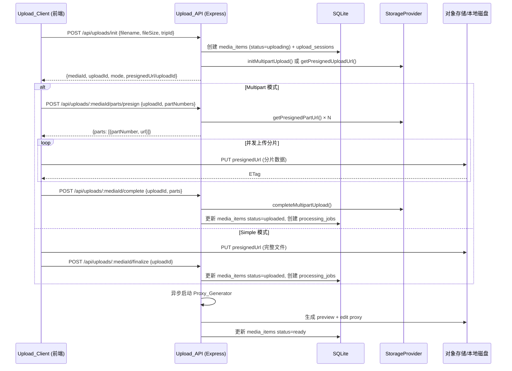
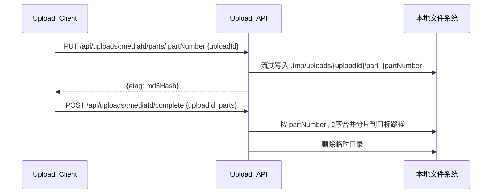

# 设计文档：视频上传链路重构

## 概述

本设计重构视频上传链路，将现有的 multer 单次上传替换为支持大文件（10–20GB）的分片上传方案。核心思路：

1. 前端通过 `/api/uploads/init` 初始化上传，后端根据文件大小决定 simple 或 multipart 模式
2. 对象存储（S3/OSS/COS）场景下，前端通过 Presigned URL 直传分片，绕过服务器中转
3. 本地存储场景下，前端通过服务器中转端点上传分片，后端流式写入临时目录
4. 上传完成后异步生成 Preview Proxy（1080p）和 Edit Proxy（720p CBR）代理文件
5. 图片上传保持现有 multer 流程不变

关键设计决策：
- 所有分片相关接口显式携带 `uploadId`，防止同一 mediaId 下多次上传会话混淆
- `upload_sessions` 表跟踪上传状态，断点续传以服务端状态为准
- 服务启动时自动清理过期上传（默认 72h TTL，可配置）
- S3 的 `save()` 方法改用 `@aws-sdk/lib-storage` 的 `Upload` 类实现流式上传

## 架构

### 整体流程



### 本地存储分片流程




## 组件与接口

### 1. 上传路由 — `server/src/routes/uploads.ts`

新建路由文件，所有端点均需 `authMiddleware` + `requireAuth`。

| 端点 | 方法 | 描述 |
|------|------|------|
| `/api/uploads/init` | POST | 初始化上传，返回 mediaId、mode、uploadId/presignedUrl |
| `/api/uploads/:mediaId/parts/presign` | POST | 批量获取分片 Presigned URL |
| `/api/uploads/:mediaId/parts/:partNumber` | PUT | 本地存储分片中转上传 |
| `/api/uploads/:mediaId/simple` | PUT | 本地存储 simple 模式中转上传（接收完整文件） |
| `/api/uploads/:mediaId/complete` | POST | 完成 multipart 上传 |
| `/api/uploads/:mediaId/finalize` | POST | 完成 simple 上传 |
| `/api/uploads/:mediaId/status` | GET | 查询上传状态和已完成分片 |
| `/api/uploads/:mediaId/abort` | POST | 取消上传并清理分片 |

#### 接口详细定义

**POST /api/uploads/init**
```typescript
// Request
{
  filename: string;      // 原始文件名
  fileSize: number;      // 文件大小（字节）
  tripId: string;        // 所属旅行 ID
}

// Response (multipart)
{
  mediaId: string;
  storageKey: string;    // 存储路径 "{tripId}/originals/{mediaId}{ext}"
  mode: 'multipart';
  uploadId: string;
  partSize: number;      // 建议分片大小
  totalParts: number;    // 总分片数
}

// Response (simple)
{
  mediaId: string;
  storageKey: string;
  mode: 'simple';
  uploadId: string;
  presignedUrl: string;  // 对象存储: presigned PUT URL; 本地: /api/uploads/:mediaId/simple
}
```

**POST /api/uploads/:mediaId/parts/presign**
```typescript
// Request
{
  uploadId: string;
  partNumbers: number[];  // 需要签名的分片编号列表
}

// Response
{
  parts: Array<{
    partNumber: number;
    url: string;          // 对象存储: presigned URL; 本地: /api/uploads/:mediaId/parts/:partNumber?uploadId=xxx
  }>;
}
```

**POST /api/uploads/:mediaId/complete**
```typescript
// Request
{
  uploadId: string;
  parts: Array<{
    partNumber: number;
    etag: string;
  }>;
}

// Response
{
  mediaId: string;
  status: 'uploaded';
  processingJobId: string;
}
```

**POST /api/uploads/:mediaId/finalize**
```typescript
// Request
{
  uploadId: string;
}

// Response
{
  mediaId: string;
  status: 'uploaded';
  processingJobId: string;
}
```

**GET /api/uploads/:mediaId/status**
```typescript
// Response
{
  mediaId: string;
  uploadId: string;
  mode: 'simple' | 'multipart';
  status: 'uploading' | 'uploaded' | 'cancelled' | 'expired';
  uploadedParts: Array<{
    partNumber: number;
    etag: string;
    size: number;
  }>;
}
```

**POST /api/uploads/:mediaId/abort**
```typescript
// Request
{
  uploadId: string;
}

// Response
{
  mediaId: string;
  status: 'cancelled';
}
```

### 2. StorageProvider 接口扩展 — `server/src/storage/types.ts`

在现有 `StorageProvider` 接口上新增 multipart 相关方法：

```typescript
export interface StorageProvider {
  // 现有方法保持不变
  save(relativePath: string, data: Buffer | Readable): Promise<void>;
  read(relativePath: string): Promise<Buffer>;
  delete(relativePath: string): Promise<void>;
  exists(relativePath: string): Promise<boolean>;
  getUrl(relativePath: string): Promise<string>;
  downloadToTemp(relativePath: string): Promise<string>;

  // 新增 multipart 方法
  initMultipartUpload(relativePath: string): Promise<string>;  // 返回 uploadId
  getPresignedPartUrl(relativePath: string, uploadId: string, partNumber: number): Promise<string>;
  completeMultipartUpload(
    relativePath: string,
    uploadId: string,
    parts: Array<{ partNumber: number; etag: string }>
  ): Promise<void>;
  abortMultipartUpload(relativePath: string, uploadId: string): Promise<void>;
  listParts(relativePath: string, uploadId: string): Promise<Array<{ partNumber: number; etag: string; size: number }>>;
  getPresignedUploadUrl(relativePath: string): Promise<string>;
}
```

### 3. LocalStorageProvider multipart 实现

```typescript
// initMultipartUpload: 创建 .tmp/uploads/{uploadId}/ 目录，返回 uuid
// getPresignedPartUrl: 返回 "/api/uploads/{mediaId}/parts/{partNumber}?uploadId={uploadId}"
// completeMultipartUpload: 按 partNumber 顺序读取分片文件，流式合并到目标路径，删除临时目录
// abortMultipartUpload: 删除 .tmp/uploads/{uploadId}/ 目录
// listParts: 扫描临时目录，返回已存在的分片文件列表（含 MD5 etag 和 size）
// getPresignedUploadUrl: 返回 "/api/uploads/{mediaId}/simple"
```

临时目录结构：
```
server/.tmp/uploads/{uploadId}/
  part_1
  part_2
  ...
  part_N
```

### 4. S3StorageProvider multipart 实现

```typescript
// initMultipartUpload: CreateMultipartUploadCommand → 返回 UploadId
// getPresignedPartUrl: UploadPartCommand + getSignedUrl → presigned URL
// completeMultipartUpload: CompleteMultipartUploadCommand
// abortMultipartUpload: AbortMultipartUploadCommand
// listParts: ListPartsCommand → 返回已上传分片列表
// getPresignedUploadUrl: PutObjectCommand + getSignedUrl → presigned URL
// save(): 改用 Upload 类 (@aws-sdk/lib-storage) 流式上传
```

### 5. 前端 VideoUploader 组件 — `client/src/components/VideoUploader.tsx`

新建组件，专门处理视频上传。核心逻辑：

```typescript
interface VideoUploaderProps {
  tripId: string;
  onUploaded?: (mediaId: string) => void;
  onCancelled?: () => void;
}

// 核心流程：
// 1. 选择文件 → 调用 /api/uploads/init
// 2. 根据 mode 决定上传方式
//    - simple: PUT presignedUrl → POST /finalize
//    - multipart: 分片 → 批量 presign → 并发上传 → POST /complete
// 3. 进度追踪：已完成分片数 / 总分片数
// 4. 断点续传：localStorage 记录 + GET /status 校验
// 5. 取消：abort 进行中请求 + POST /abort
```

分片策略：
- 文件 ≤ 100MB：simple 模式
- 100MB < 文件 ≤ 10GB：分片大小 16–64MB（根据文件大小动态计算）
- 文件 > 10GB：分片大小 128MB

并发控制：3–5 个并发上传

### 6. Proxy Generator 服务 — `server/src/services/proxyGenerator.ts`

```typescript
interface ProxyGeneratorOptions {
  mediaId: string;
  tripId: string;
  storageKey: string;  // 原始文件路径
}

// 流程：
// 1. downloadToTemp() 获取原始文件本地路径
// 2. ffprobe 提取元数据（时长、分辨率、编码、码率）→ 写入 media_items
// 3. ffmpeg 抽取封面帧 → 存储到 {tripId}/thumbnails/{mediaId}.jpg
// 4. ffmpeg 生成 Preview Proxy → {tripId}/proxies/{mediaId}_preview.mp4
//    - H.264, AAC, max 1080p, CRF 23 (中等码率)
// 5. ffmpeg 生成 Edit Proxy → {tripId}/proxies/{mediaId}_edit.mp4
//    - H.264, AAC, 720p, CBR ~4Mbps, keyint=1s (快速 seek)
// 6. 更新 media_items: status=ready, 记录 proxy 路径
// 7. 失败时: status=proxy_failed, 记录错误信息
```

ffmpeg 参数：

Preview Proxy:
```bash
ffmpeg -i input.mp4 -vf "scale='min(1920,iw)':'min(1080,ih)':force_original_aspect_ratio=decrease" \
  -c:v libx264 -crf 23 -preset medium -c:a aac -b:a 128k -movflags +faststart output_preview.mp4
```

Edit Proxy:
```bash
ffmpeg -i input.mp4 -vf "scale=1280:720:force_original_aspect_ratio=decrease,pad=1280:720:(ow-iw)/2:(oh-ih)/2" \
  -c:v libx264 -b:v 4M -maxrate 4M -bufsize 8M -g 30 -preset medium \
  -c:a aac -b:a 128k -movflags +faststart output_edit.mp4
```

### 7. 过期上传清理 — `server/src/services/uploadCleanup.ts`

```typescript
// 在服务启动时调用
// 1. 查询 upload_sessions WHERE status = 'active' AND updated_at < NOW - UPLOAD_EXPIRE_HOURS
// 2. 对每条记录调用 storageProvider.abortMultipartUpload(storage_key, id)
// 3. 更新 upload_sessions.status 为 'expired'
// 4. 联动更新对应 media_items.processing_status 为 'expired'
// 5. 本地存储额外删除临时分片目录
```


## 数据模型

### media_items 表变更

在现有 `media_items` 表上新增以下列：

```sql
ALTER TABLE media_items ADD COLUMN upload_id TEXT;           -- multipart uploadId
ALTER TABLE media_items ADD COLUMN upload_mode TEXT;          -- 'simple' | 'multipart'
ALTER TABLE media_items ADD COLUMN storage_key TEXT;          -- 存储路径
ALTER TABLE media_items ADD COLUMN video_duration REAL;       -- 视频时长（秒）
ALTER TABLE media_items ADD COLUMN video_width INTEGER;       -- 视频宽度
ALTER TABLE media_items ADD COLUMN video_height INTEGER;      -- 视频高度
ALTER TABLE media_items ADD COLUMN video_codec TEXT;          -- 视频编码格式
ALTER TABLE media_items ADD COLUMN video_bitrate INTEGER;     -- 视频码率
ALTER TABLE media_items ADD COLUMN preview_proxy_path TEXT;   -- 预览代理文件路径
ALTER TABLE media_items ADD COLUMN edit_proxy_path TEXT;      -- 剪辑代理文件路径
```

`processing_status` 字段新增状态值：
- `uploading` — 上传中（init 后）
- `uploaded` — 上传完成，等待处理
- `processing` — 代理文件生成中
- `ready` — 代理文件就绪
- `proxy_failed` — 代理文件生成失败
- `cancelled` — 用户取消上传
- `expired` — 上传超时被清理

### upload_sessions 表（新建）

用于跟踪上传会话状态，支持断点续传查询：

```sql
CREATE TABLE IF NOT EXISTS upload_sessions (
  id TEXT PRIMARY KEY,              -- uploadId
  media_id TEXT NOT NULL,           -- 关联的 mediaId
  trip_id TEXT NOT NULL,            -- 关联的 tripId
  storage_key TEXT NOT NULL,        -- 存储路径
  mode TEXT NOT NULL,               -- 'simple' | 'multipart'
  status TEXT NOT NULL DEFAULT 'active',  -- 'active' | 'completed' | 'aborted' | 'expired'
  total_parts INTEGER,              -- multipart 总分片数
  part_size INTEGER,                -- 分片大小
  file_size INTEGER NOT NULL,       -- 文件总大小
  created_at TEXT NOT NULL,
  updated_at TEXT NOT NULL,
  FOREIGN KEY (media_id) REFERENCES media_items(id),
  FOREIGN KEY (trip_id) REFERENCES trips(id)
);

CREATE INDEX IF NOT EXISTS idx_upload_sessions_media ON upload_sessions(media_id);
CREATE INDEX IF NOT EXISTS idx_upload_sessions_status ON upload_sessions(status);
```

### 分片大小计算逻辑

```typescript
function calculatePartSize(fileSize: number): number {
  if (fileSize > 10 * 1024 * 1024 * 1024) return 128 * 1024 * 1024;  // >10GB: 128MB
  if (fileSize > 1 * 1024 * 1024 * 1024) return 64 * 1024 * 1024;    // >1GB: 64MB
  if (fileSize > 500 * 1024 * 1024) return 32 * 1024 * 1024;          // >500MB: 32MB
  return 16 * 1024 * 1024;                                             // default: 16MB
}
```

### localStorage 断点续传数据结构

```typescript
interface UploadResumeData {
  mediaId: string;
  uploadId: string;
  tripId: string;
  filename: string;
  fileSize: number;
  mode: 'simple' | 'multipart';
  completedParts: Array<{ partNumber: number; etag: string }>;
  createdAt: number;  // timestamp
}

// 存储 key: `upload_resume_${mediaId}`
```


## 正确性属性

*属性（Property）是指在系统所有合法执行中都应成立的特征或行为——本质上是对系统应做什么的形式化陈述。属性是人类可读规格说明与机器可验证正确性保证之间的桥梁。*

### Property 1: 上传模式由文件大小阈值决定

*For any* 合法的视频文件大小，调用 init 接口后返回的 mode 应满足：文件大小 > 100MB 时 mode 为 'multipart' 且包含 uploadId；文件大小 ≤ 100MB 时 mode 为 'simple' 且包含 presignedUrl。

**Validates: R1-AC1, R1-AC2, R1-AC3**

### Property 2: 不支持的文件格式被拒绝

*For any* 文件名，若其扩展名不在支持列表（.mp4, .mov, .avi, .mkv）中，调用 init 接口应返回 400 错误码。

**Validates: R1-AC4**

### Property 3: Init 创建 uploading 状态记录

*For any* 合法的 init 请求，成功后数据库中应存在一条对应的 media_items 记录，其 processing_status 为 'uploading'，且 upload_sessions 表中存在对应的 active 会话。

**Validates: R1-AC5**

### Property 4: 分片签名返回完整映射

*For any* partNumber 列表，调用 presign 接口后返回的 parts 数组应与请求的 partNumber 列表一一对应，每个 part 包含非空的 url。

**Validates: R2-AC1**

### Property 5: 分片大小计算在合法范围内

*For any* 文件大小，计算出的分片大小应满足：文件 ≤ 10GB 时分片大小在 16MB–64MB 之间；文件 > 10GB 时分片大小为 128MB。

**Validates: R3-AC4**

### Property 6: 本地存储分片 ETag 等于内容 MD5

*For any* 分片数据，通过本地存储中转端点上传后返回的 ETag 应等于该分片数据的 MD5 哈希值。

**Validates: R4-AC2**

### Property 7: 本地存储分片合并保持顺序

*For any* 一组分片数据（以任意顺序写入），调用 completeMultipartUpload 后合并的文件内容应等于按 partNumber 升序拼接所有分片的结果。

**Validates: R5-AC4, R8-AC3**

### Property 8: Complete/Finalize 状态转换

*For any* 处于 uploading 状态的上传任务，调用 complete（multipart）或 finalize（simple）后，media_items 的 processing_status 应更新为 'uploaded'，且 processing_jobs 表中应存在对应的任务记录。

**Validates: R5-AC2, R15-AC2, R15-AC3**

### Property 9: 断点续传仅上传剩余分片

*For any* 已完成部分分片的上传任务，恢复上传时实际上传的分片集合应等于总分片集合减去已完成分片集合。

**Validates: R6-AC2, R6-AC4**

### Property 10: LocalStorageProvider initMultipartUpload 返回唯一 uploadId

*For any* 连续多次调用 initMultipartUpload，返回的所有 uploadId 应互不相同，且每个 uploadId 对应的临时目录应存在。

**Validates: R8-AC1**

### Property 11: Abort 清理所有残留数据

*For any* 活跃的上传会话，调用 abort 后，StorageProvider 的 abortMultipartUpload 应被调用，media_items 状态应更新为 'cancelled'，且（本地存储场景下）临时目录应被删除。

**Validates: R8-AC4, R11-AC3, R17-AC1, R17-AC2**

### Property 12: uploadId 不匹配时拒绝请求

*For any* 分片相关请求（presign、complete、abort），若请求中的 uploadId 与数据库记录的 uploadId 不一致，应返回 409 错误码。

**Validates: R18-AC1, R18-AC2, R18-AC3, R18-AC4, R18-AC5**

### Property 13: 过期上传自动清理

*For any* processing_status 为 'uploading' 且创建时间超过配置的过期时间的 media_items 记录，启动清理后其状态应更新为 'expired'，且对应的存储分片应被清理。

**Validates: R19-AC1, R19-AC2, R19-AC3**

### Property 14: 代理文件生成保留原始文件

*For any* 完成代理文件生成的视频，原始上传文件应仍然存在于 storage_key 路径。

**Validates: R10-AC8**

### Property 15: 状态查询返回完整信息

*For any* 存在的上传任务，GET /status 接口应返回包含 uploadId、mode、status 和 uploadedParts 的完整响应。

**Validates: R16-AC1**


## 错误处理

### 前端错误处理

| 场景 | 处理方式 |
|------|----------|
| 单个分片上传失败 | 3 秒后自动重试，最多 3 次 |
| 分片重试 3 次仍失败 | 标记文件为上传失败，显示错误信息，允许手动重试 |
| 上传超时（60s 无响应） | 自动重试该分片 |
| 网络断开 | 暂停上传，网络恢复后提示用户恢复 |
| 文件 > 10GB | 显示提示"建议使用稳定网络" |
| 文件 > 20GB | 显示提示"建议在桌面端上传" |
| init 返回 400 | 显示格式不支持提示 |
| init 返回 403 | 显示无权限提示 |
| presign 返回 404 | 上传会话已失效，提示重新上传 |
| complete 返回 400 | 分片不一致，提示重新上传 |

### 后端错误处理

| 场景 | HTTP 状态码 | 错误码 | 处理方式 |
|------|------------|--------|----------|
| 文件格式不支持 | 400 | UNSUPPORTED_FORMAT | 返回支持格式列表 |
| mediaId 不存在 | 404 | NOT_FOUND | — |
| uploadId 不匹配 | 409 | UPLOAD_ID_MISMATCH | 返回当前有效 uploadId |
| 上传已完成/取消 | 409 | INVALID_STATUS | 返回当前状态 |
| 分片列表不一致 | 400 | PARTS_MISMATCH | 返回缺失/多余的 partNumber |
| 存储写入失败 | 500 | STORAGE_ERROR | 清理已上传分片，记录错误日志 |
| Trip 不存在 | 404 | NOT_FOUND | — |
| 无权限 | 403 | FORBIDDEN | — |
| finalize 时状态非 uploading | 409 | INVALID_STATUS | — |

### 代理文件生成错误处理

- ffprobe 提取元数据失败：记录错误，继续尝试生成代理文件（使用默认参数）
- ffmpeg 生成 Preview Proxy 失败：标记 processing_status = 'proxy_failed'，记录错误信息到 processing_error 字段
- ffmpeg 生成 Edit Proxy 失败：同上
- 存储空间不足：记录错误，标记失败
- 原始文件不存在：标记失败，记录"原始文件丢失"

## 测试策略

### 属性测试（Property-Based Testing）

使用 `fast-check` 库进行属性测试，每个属性测试至少运行 100 次迭代。

重点属性测试覆盖：

1. **上传模式阈值判定**（Property 1）：生成随机文件大小，验证 mode 判定逻辑
2. **文件格式验证**（Property 2）：生成随机文件扩展名，验证拒绝逻辑
3. **分片大小计算**（Property 5）：生成随机文件大小，验证分片大小范围
4. **本地 ETag = MD5**（Property 6）：生成随机二进制数据，验证 ETag 计算
5. **本地分片合并顺序**（Property 7）：生成随机分片数据和写入顺序，验证合并结果
6. **uploadId 不匹配拒绝**（Property 12）：生成随机 uploadId 对，验证不匹配时返回 409
7. **过期清理**（Property 13）：生成随机过期时间的记录，验证清理逻辑

每个属性测试标注格式：
```
// Feature: video-upload-pipeline, Property {N}: {property_text}
```

### 单元测试

- init 端点：验证 multipart/simple 模式切换、DB 记录创建、权限校验
- presign 端点：验证 partNumber 映射、本地存储 URL 格式
- complete 端点：验证状态转换、processing_jobs 创建
- finalize 端点：验证状态转换、错误状态处理
- abort 端点：验证清理调用、状态更新
- status 端点：验证响应结构
- calculatePartSize：边界值测试
- VideoUploader 组件：渲染、进度显示、取消交互

### 集成测试

- LocalStorageProvider multipart 全流程：init → 写入分片 → complete → 验证合并文件
- S3StorageProvider multipart 全流程（mock AWS SDK）：init → presign → complete
- 代理文件生成全流程（需要 ffmpeg）：上传 → 生成 proxy → 验证文件存在
- 过期清理全流程：创建过期记录 → 启动清理 → 验证状态和文件

### 端到端测试

- 视频上传 simple 模式全流程
- 视频上传 multipart 模式全流程
- 断点续传流程
- 取消上传流程
